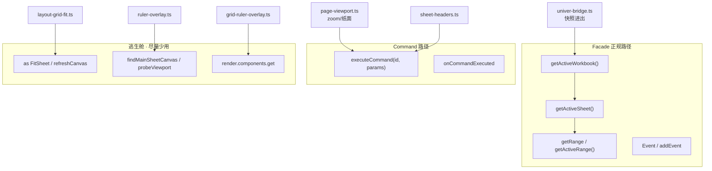
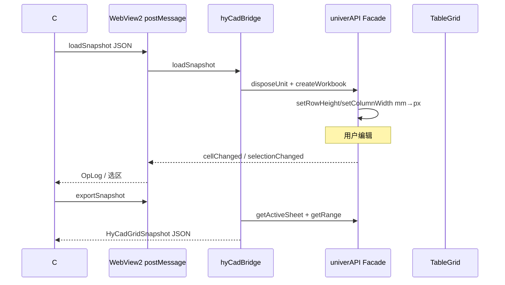
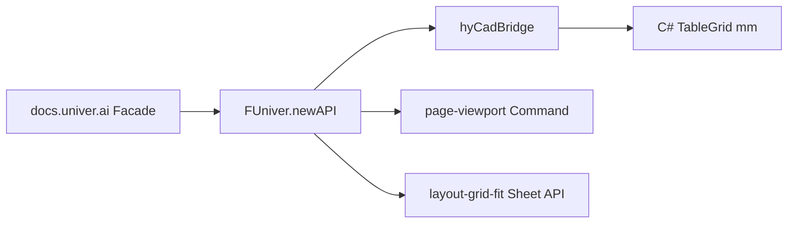

# Facade API 深入学习 — 官网机制与 HyCAD 项目应用

> **元信息**
> - 层级：Application（HyCAD `HyCADTool.UniverEditor`）
> - 上游：[022 Univer OSS 第一性](../022-Univer-OSS-第一性原则学习-2026-06-26-035256.md) · [new/05 Facade 白话](../new/05-Univer内mm标尺与Facade白话-2026-06-28-120000.md) · [官网 Facade](https://docs.univer.ai/guides/sheets/getting-started/facade)
> - 代码锚点：`Web/src/main.ts` · `univer-bridge.ts` · `page-viewport.ts`
> - 编制日期：2026-07-01

---

## §0 三句话先答

| 问题 | 结论 |
|------|------|
| **Facade 是什么？** | 包在 `Univer` 实例外的**稳定薄 API**（`FUniver` → `univerAPI`），把 DI、命令、插件细节藏起来。 |
| **HyCAD 怎么用？** | Plugin 模式：`main.ts` 手动 `import '@univerjs/*/facade'` → `FUniver.newAPI(univer)` → 全项目传 `univerAPI`。 |
| **改 UI/布局时最常碰哪几类？** | ① Workbook/Sheet/Range 读写 ② `executeCommand` 改 zoom/header ③ 事件/`onCommandExecuted` ④ 必要时 DOM/Render 逃生舱。 |

**5174 调试**：DevTools 控制台输入 `univerAPI.getActiveWorkbook()?.getActiveSheet()?.getActiveRange()?.getA1Notation?.()`

---

## 一、问题重述

**对象**：Univer Facade API（外观应用程序接口，Facade Application Programming Interface）。

**痛点**：HyCAD 代码里同时出现 `getRange`、`executeCommand`、`sheet.setColumnWidth`、`render.components.get`——不清楚哪条是「正规 Facade」，哪条是逃生舱。

**一句话答案**：**业务读写走 Facade Workbook/Sheet/Range**；**布局/视图走 Command**；**Univer 未暴露的能力才用类型断言 + 内部 Render/DOM**——且集中在少数文件，不散落。

---

## 二、官网机制（Plugin 模式 · 与 HyCAD 一致）

### 2.1 挂载 Facade 扩展（side-effect import）

HyCAD **不用 Preset**，必须像官方 Plugin 文档一样，**按插件逐个 import facade 子入口**，把方法挂到 `FUniver` 原型上：

```57:69:src/HyCADTool.UniverEditor/Web/src/main.ts
import '@univerjs/engine-formula/facade';
import '@univerjs/ui/facade';
import '@univerjs/docs-ui/facade';
import '@univerjs/sheets/facade';
import '@univerjs/sheets-ui/facade';
import '@univerjs/sheets-formula/facade';
import '@univerjs/sheets-numfmt/facade';
```

缺 import → 运行时 `getActiveWorkbook()` 等方法不存在或行为不完整。

### 2.2 创建 API 实例

```278:286:src/HyCADTool.UniverEditor/Web/src/main.ts
  univer.createUnit(UniverInstanceType.UNIVER_SHEET, DEMO_WORKBOOK_DATA);

  const univerAPI = FUniver.newAPI(univer);
  window.univer = univer;
  window.univerAPI = univerAPI;
```

- `univer`：内核 + DI + 插件生命周期  
- `univerAPI`：**嵌入方唯一推荐入口**（HyCAD 全部 TS 扩展层）

### 2.3 生命周期 caution（官网）

部分 API 需等 `LifecycleStages.Rendered` / `Steady` 后再调。HyCAD 在 `createUnit` 之后立刻 `install*`，多数 OK；若遇「sheet 为 null」，用 `requestAnimationFrame` 或监听 `Event.SheetSkeletonChanged`（见 `grid-ruler-overlay.ts`）。

### 2.4 Facade vs 底层 Command

| 层级 | 谁用 | 例子 |
|------|------|------|
| **Facade 高层** | 改单元格、选区、字高 | `range.setValue` · `range.setFontSize` |
| **Facade.executeCommand** | 改视图/布局参数 | `SetZoomRatioCommand` · `SetRowHeaderWidthCommand` |
| **底层 ICommandService** | 一般不直接用 | HyCAD 未绕过 Facade |

Facade 改数据时内部仍发 MUTATION；`executeCommand` 是显式走命令链，适合与 Univer UI 同步（zoom、header 尺寸）。

---

## 三、HyCAD 中 Facade 的四种用法



### 3.1 Workbook / Sheet / Range（快照与编辑 · 主力）

**文件**：`univer-bridge.ts` · `font-size-mm-model.ts` · `main.ts`（事件）

| API | 项目用途 |
|-----|----------|
| `univerAPI.createWorkbook(data)` | `loadSnapshot` 重建工作簿 |
| `univerAPI.disposeUnit(unitId)` | 换表前销毁旧 unit |
| `sheet.getMaxRows()` / `getMaxColumns()` | 导出区域边界 |
| `sheet.getRange('A1')` / `getActiveRange()` | 读值、合并、落图选区 |
| `range.getValue()` / `getDisplayValue()` | 导出 Domain 单元格 |
| `range.setFontSize(pt)` | 布局 Tab 字高 mm |
| `sheet.setRowHeight` / `setColumnWidth` | 快照尺寸写入（经 mm 换算层） |

**桥接全局**（C# / Dev 面板调用）：

```719:774:src/HyCADTool.UniverEditor/Web/src/univer-bridge.ts
  window.hyCadBridge = {
    loadSnapshot(raw) { ... rebuildWorkbookFromSnapshot(univerAPI, snap); },
    exportSnapshot() {
      const workbook = univerAPI.getActiveWorkbook();
      const sheet = workbook?.getActiveSheet();
      ...
    },
  };
```

**原则**：Domain 真相在 C# `TableGrid`；Facade 只做**视图态**读写，进出经 JSON 快照 + `mm-display.ts` 换算。

### 3.2 executeCommand（布局 / 视图 · 必须用命令）

**文件**：`page-viewport.ts` · `sheet-headers.ts`

```151:156:src/HyCADTool.UniverEditor/Web/src/page-viewport.ts
    void univerAPI.executeCommand(SetZoomRatioCommand.id, {
      unitId: wb.getId(),
      subUnitId: sheet.getSheetId(),
      zoomRatio: quantized,
    });
```

```33:41:src/HyCADTool.UniverEditor/Web/src/sheet-headers.ts
  await univerAPI.executeCommand(SetRowHeaderWidthCommand.id, {
    unitId: ids.unitId,
    subUnitId: ids.subUnitId,
    size: GRID_ROW_HEADER_W,
  });
```

**为何不用 Facade 高层方法？** zoom、行列头宽高属于 **OPERATION/视图配置**，官方通过 sheets-ui 命令暴露；直接改 DOM 会与 Univer 内部 skeleton 脱节。

**HyCAD 编排**：`page-viewport.ts` 是唯一写 zoom 的地方；`onCommandExecuted` 监听 footer 滑条等外部 zoom，再拉回编排（`installLayoutZoomGuard`）。

### 3.3 事件（C# 回灌 · 选区联动）

**文件**：`main.ts`

| 事件 | 作用 |
|------|------|
| `Event.SheetValueChanged` | `postHostMessage({ type: 'cellChanged' })` |
| `Event.SelectionChanged` | 选区 → C# + 布局 Tab + 字高 mm |
| `Event.SheetSkeletonChanged` | 行列头 mm 标签重绘（`grid-ruler-overlay.ts`） |

```308:349:src/HyCADTool.UniverEditor/Web/src/main.ts
  const sheetValueChanged = univerAPI.Event?.SheetValueChanged;
  if (sheetValueChanged) {
    univerAPI.addEvent(sheetValueChanged, (params) => {
      postHostMessage({ type: 'cellChanged', row, col, text });
    });
  }
  const selectionChanged = univerAPI.Event?.SelectionChanged;
  if (selectionChanged) {
    univerAPI.addEvent(selectionChanged, (params) => {
      postHostMessage({ type: 'selectionChanged', ... });
      updateLayoutTabSelection(...);
      updateFontSizeMmFromSelection(univerAPI);
    });
  }
```

### 3.4 逃生舱（Facade 未覆盖 · 集中使用）

| 模式 | 文件 | 原因 |
|------|------|------|
| `sheet as FitSheet` + `setRowHeightsForced` | `layout-grid-fit.ts` | 批量铺格；Facade 有但类型不全 |
| `sheet.refreshCanvas?.()` | `page-viewport.ts` · `sheet-headers.ts` | 容器尺寸变后重绘 |
| `readZoom` 多路 fallback | `univer-viewport.ts` | Facade zoom API 不稳定时读 footer/DOM |
| `probeViewport` + canvas DOM | `ruler-overlay.ts` | R0 标尺要对齐 canvas，无单一 Facade |
| `render.components.get('__SpreadsheetRowHeader__')` | `grid-ruler-overlay.ts` | 自定义行列头 mm 标签 |

**规则**：新增功能先查 [API Reference](https://docs.univer.ai/reference/classes/univer)；只有文档/类型没有时再逃生，并**注释原因**。

---

## 四、按文件索引：谁传 univerAPI、调什么

| 模块 | Facade 用法摘要 |
|------|-----------------|
| `main.ts` | 创建 API；`addEvent`；分发 `install*` |
| `univer-bridge.ts` | Workbook 生命周期；Range 导出；`hyCadBridge` |
| `page-viewport.ts` | `executeCommand(SetZoomRatio)`；`onCommandExecuted` |
| `layout-grid-fit.ts` | Sheet 批量行列尺寸（as FitSheet） |
| `sheet-headers.ts` | `executeCommand` header 宽高 |
| `grid-ruler-overlay.ts` | Sheet 读尺寸 + Render customHeader |
| `font-size-mm-model.ts` | `getActiveRange().getFontSize/setFontSize` |
| `theme-menu-inject.ts` | `toggleDarkMode` |
| `dev-host.ts` | `createWorkbook` / `disposeUnit` 演示 |
| `layout-sheet-scrollbars.ts` | 锁滚动 + `refreshCanvas` |

**不传 Facade 的**：`layout-view-state.ts` · `layout-ribbon-panel.tsx`（纯 UI 状态，通过 subscribe 间接触发带 API 的模块）。

---

## 五、与 C# 宿主的消息边界



Facade **不**直接碰 C#；`postHostMessage` / `handleHostCommand` 是 HyCAD 第二层桥。

---

## 六、官网推荐阅读（Facade 专轨 · 约 45 min）

| 顺序 | URL | 重点 |
|------|-----|------|
| 1 | https://docs.univer.ai/guides/sheets/getting-started/facade | Plugin 模式 import · `FUniver.newAPI` · 生命周期 |
| 2 | https://docs.univer.ai/blog/facade | 为何分包 facade · mixin 扩展 |
| 3 | https://docs.univer.ai/guides/recipes/architecture/univer · Command System | 理解 `executeCommand` 参数 |
| 4 | https://docs.univer.ai/guides/sheets/features/core | Range/选区/zoom 的 Facade 特性文档 |
| 5 | https://docs.univer.ai/reference/classes/univer | 查具体方法签名 |

---

## 七、陷阱与边界（HyCAD 实测）

| 陷阱 | 正确做法 |
|------|----------|
| 漏 import `@univerjs/sheets/facade` | 与 `registerPlugin(UniverSheetsPlugin)` 成对检查 |
| 把 snapshot 当运行时全貌 | 运行时 UI 状态用 Facade save/export，不是裸 snapshot 对象 |
| 多处 `executeCommand(SetZoomRatio)` | 只保留 `page-viewport.ts` 编排 |
| 用 DOM transform 做布局 | 改 Command + 容器尺寸；见 [04-布局UI路线](./04-布局UI深入学习路线-2026-07-01-120000.md) |
| 在 Range 回调里同步 `loadSnapshot` | `univer-bridge` 用 `queueMicrotask` 合并，防重入 |
| `getZoomRatio` 偶发 undefined | `readZoom` 已有 footer 兜底；布局 zoom 以 `page-viewport` 写入为准 |

---

## 八、动手练习（5174 控制台）

1. `univerAPI.getActiveWorkbook().getActiveSheet().getActiveRange().getA1Notation()`  
2. `univerAPI.getActiveWorkbook().getActiveSheet().getRange('A1').setValue('Facade test')`  
3. 在 `page-viewport.ts` 的 `applyZoom` 设断点，滚 Ctrl+滚轮，看 `executeCommand` 参数  
4. `univerAPI.onCommandExecuted?.(c => console.log(c.id))` 点击 footer 缩放，看命令 id  
5. 读 `univer-bridge.ts` 的 `exportRegion`，对照 Facade `getRange` 如何变成 `HyCadGridSnapshot`  

---

## 九、知识图谱位置



---

## 十、文档元数据

- 创建日期：2026-07-01  
- 后续扩展：`learn/notes/06-Facade-Range导出跟读.md` · `07-executeCommand-清单.md`  
- 相关路线：[04-布局UI深入学习路线](./04-布局UI深入学习路线-2026-07-01-120000.md)
