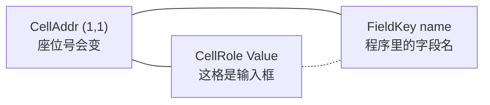

# Domain 底层逻辑大白话（new/00）

> 文档编号：new/00（Univer 路线 **Domain 入门总读本**）  
> 生成日期：2026-06-26  
> 一句话目标：**不用看 C#，也能搞懂 `HyCAD.Tables` 这套表格 Domain 为什么长这样、底层怎么运转**。  
> 性质：概念 / 架构导读；不写 API 签名细节，源码路径仅作索引。  
> 用法：读 [new/a1](./a1-R6-单元格Role与FieldKey详解-2026-06-26-170000.md) / [new/b1](./b1-R6-术语白话详解-2026-06-26-173000.md) 前 **先读本文 §1–§4**；要实现功能时对照 [005 Domain 设计](../005-复杂表格Domain统一设计-2026-06-24-232335.md)。

---

## 0. 本文在文档体系里的位置

```text
new/00（本文）  Domain 为什么 + 怎么转          ← 底层逻辑，大白话
    ↓
new/01          Univer UI ↔ Domain 对齐           ← 做 WebView 桥接时读
    ↓
new/b1          术语词典                           ← 查词
    ↓
new/a1          R6 规格                            ← 单需求深挖
    ↓
new/001         Univer 路线总纲                    ← 路线图
```

| 文档 | 回答什么问题 |
|---|---|
| **00（本文）** | Domain **底层设计哲学**和**数据怎么流动** |
| b1 | 某个 **词** 是什么意思 |
| a1 | **R6** 这一条需求怎么落地 |
| 005 | 类型、不变量、操作的 **正式规格** |

---

## 1. 第一性原理：表格不是「一堆字」，是「对象」

### 1.1 人话版结论

Word / Excel / CAD 里的复杂表，背后都是 **对象模型**（谁合并了谁、哪格是标签、哪格绑定了字段名）。  
HyCAD 不能把 CAD 上的几行 `DBText` 当真相——否则：

- 合并一拆就丢数据（Excel 老毛病）
- 改列宽后程序找不到「姓名」在哪格
- Univer 改完和 CAD 落图对不上

所以项目定了一条 **红线**（new/001 §0.1）：

> **`HyCAD.Tables` 里的 `TableGrid` 是唯一真相源**；CAD 线、Univer 网格、HTML、xlsx 都是 **视图 / 导出**，不是主人。

### 1.2 类比：表格 = 带隔断的仓库

| 层次 | 类比 | Domain 里是谁 |
|---|---|---|
| **钢筋骨架** | 仓库永远有 N×M 个货位，拆墙也不拆货位 | `GridTopology`：行列轨道 |
| **隔断贴纸** | 哪几格打通成大厅、哪格贴「标签/值」、哪格挂了字段名牌 | `GridStructure` 覆盖层 |
| **货架上的货** | 每个货位实际放的文字/数字 | `GridData` |
| **监控录像** | 谁什么时候搬了货 | `TableOpLog` |
| **对外发货单** | 把仓库画到 CAD / 网页上 | Adapter（渲染器） |

**Markdown 表格** 只有「一行行字」，没有货位 ID、没有 merge 对象——所以复杂工程表 **不能** 以 Markdown 为真相源（005 §1 详述）。

---

## 2. 一张表在内存里长什么样

### 2.1 顶层：`TableDocument` → `TableGrid`

```text
TableDocument（一份文档，可含多张表）
└── TableGrid（单张表）  ← 日常 90% 操作对象
     ├── Id, Metadata
     ├── Structure   结构层 = 版式 / 模板
     └── Data        数据层 = 填进去的字
```

- 人员 Word 样表 = **2 张** `TableGrid`（基本情况 + 家庭成员）
- MVP 多数命令只操作 **一张** `TableGrid`

### 2.2 结构层 `GridStructure`：七个「覆盖层」

结构层 **不删格子**，只在均匀网格上 **贴规则**：

```text
GridStructure
├── Topology      行列有几根、每根多宽（mm）
├── Merges[]      哪些矩形打通了（合并）
├── Diagonals{}   哪格画了斜线、分成几个 SubCell
├── Styles{}      对齐、字高、边框、竖排…
├── Roles{}       Label / Value / Header…（R6）
├── FieldIndex{}  "name" → 落在哪格（R6）
└── CellOverflow{}  溢出策略标记（Wrap/Shrink 等）
```

**关键设计**：这些都是 **稀疏字典** —— 只有「特殊格」才 записи；普通格不在字典里，用默认值。

### 2.3 数据层 `GridData`：格子里装的字

```text
GridData.Cells : (行,列) → CellValue
  CellValue = { Text, Kind, Formula?, … }
```

- **Structure 像表单模板**（哪里是输入框）
- **Data 像用户填的内容**（张三、男、1990-01）
- 同一张表可以 **换 Data、留 Structure** → 模板复用（003 核心思路）

### 2.4 为什么要拆 Structure / Data？

| 场景 | 只动谁 |
|---|---|
| 制图员填姓名 | 只改 `Data` |
| 模板维护者改列宽、加 merge | 只改 `Structure` |
| 同一模板印 100 份不同人 | Structure 一份，Data 100 份 |

**双模式编辑**（002）就是 UI 层对这两层的不同权限：填值模式锁 Structure 大改，结构模式放开 merge/插删行列。

---

## 3. 底座逻辑：格子永远删不掉

### 3.1 `CellAddr`：货位编号

- 格式 `(行, 列)`，**从 0 开始**
- 整张表的 **主键** —— 字典键、操作参数都用它
- **缺点**：插删行列后编号会变 → 所以需要 FieldKey（见 §6）

### 3.2 `GridTopology`：均匀网格

- `Rows[]`、`Cols[]`：每行高、每列宽（mm，1:1 模型空间）
- `CreateEmpty(7, 7)` → 7×7 个 **逻辑货位**，默认等尺寸
- `GrowDirection.Down`：行号往下增，Y 向下减（与 CAD 布局一致）

**人话**：先画一张 **方格纸**，所有复杂性都是往方格纸上 **贴透明胶片**（合并、斜线、样式）。

### 3.3 合并 `MergeRegion`：打通几个货位，但不拆货位

```text
合并前（逻辑上仍有 3 格）:  [A][B][C]
合并后（显示上 1 大块）:     [  A  ]   ← A 是 Anchor（门牌号）
                              B、C 还在，只是 IsHidden
```

| 概念 | 含义 |
|---|---|
| **MergeRegion** | 矩形：从 `(r,c)` 跨 `rowSpan×colSpan` |
| **Anchor** | 左上角那一格 = **唯一说了算的格** |
| **Hidden** | 被盖住的其他格：`IsHidden(addr)==true` |
| **不删格** | Unmerge 后 B、C 立刻「露出来」，数据可还在 |

**为什么 Excel merge 讨厌？** Excel 常 **丢掉** 非左上格内容。HyCAD **显式保留** 所有货位，合并只是 **视图分组**（002 §2.3）。

#### 合并时数据怎么办？`MergeValuePolicy`

| 策略 | 人话 | MVP |
|---|---|---|
| **AnchorOnly** | 只有 Anchor 格存字，其余清空 | ✅ 默认 |
| **SameValue** | 合并时把 Anchor 的字 **复印** 到每一格 | ✅ 支持 |
| PreserveEach / Composite | 各格保留不同字 / 显示组合 | 未实现 |

读值规则：**点合并区任意位置，都读 Anchor 的字**（`GetValue` 内部会 `GetAnchorOf`）。

### 3.4 斜线 `DiagonalSplit`：一个货位里再分两个三角

- **不**把 1 格真的切成 2 个 `CellAddr`（仍是 `(r,c)` 一个地址）
- 在该地址挂 `DiagonalSplit`：一条对角线 + 两个 `SubCell`（如「学历」「学位」）
- 每个 SubCell 有自己的 `Value`、可选 `FieldKey`、文字锚点

**限制（MVP）**：Hidden 格不能斜线；每格最多 1 条对角线。

### 3.5 可见性不算存储，是 **算出来的**

005 定稿：**不在格子上存 `Visibility` 字段**。

```text
IsHidden(addr) =
  addr 落在某个 MergeRegion 里，且 addr 不是该区的 Anchor
```

好处：不会出现「字典说 hidden、Merge 说没 merge」两份真相打架。

---

## 4. 改表的唯一正规途径：`GridEditor` + `TableOpLog`

### 4.1 不可变（Immutable）—— 每次改表返回 **新** `TableGrid`

```text
var grid2 = GridEditor.SetValue(grid1, addr, "李四");
// grid1 不变；grid2 是新对象
```

**人话**：像 Git 每次 commit 是新快照，不是原地改内存。  
好处：Undo 简单、并发安全、测试可预测。

所有改表逻辑集中在 [`GridEditor`](../../../src/HyCAD.Tables/Operations/GridEditor.cs)：

| 类别 | 操作举例 |
|---|---|
| 结构 | `Merge` / `Unmerge` / `InsertRow` / `SplitDiagonal` |
| 填值 | `SetValue` / `SetValueByField` |
| 语义 | `SetFieldKey` / `SetCellRole` / `SetCellStyle` |

UI / Univer / CAD **不应绕过** GridEditor 直接改字典。

### 4.2 `TableOperation` + `TableOpLog`：命令 + 历史栈

```text
TableOpLog
├── _initial          打开编辑器时的表
├── _entries[]        每次 Apply 存 (命令, 新快照)
└── _cursor           当前指到哪一步
```

| 能力 | 怎么做 |
|---|---|
| **Undo** | cursor 退一步，Current 指向上一个快照 |
| **Redo** | cursor 进一步 |
| **审计** | History 列出所有 `TableOperation` |

**FieldKey 与 OpLog 分工**（005 §4.4）：

| 机制 | 解决什么 |
|---|---|
| **FieldKey** | 「指 **哪一格**」（语义名） |
| **OpLog** | 「**怎么变的**、能否撤销」（过程） |

推荐：外部灌数据用 `SetValueByField("name", …)` 记入 OpLog —— 插行后 `(1,1)` 变 `(2,1)` 也没关系。

### 4.3 插删行列时发生了什么？

**不是**「删行 = 删掉一行对象」，而是：

1. `Topology` 少一根轨道（或加一根）
2. **所有** 带坐标的字典 **重映射**：Merges、Roles、FieldIndex、Data…
3. `FieldIndex["name"]` 自动指向 **新** 的 `(r,c)`

```text
InsertRow(0)  在第 0 行前插一行
  → 原来 (1,1) 的「张三」变成 (2,1)
  → FieldIndex["name"] 仍指向「张三」那格，只是坐标更新
```

这是 Domain 比「Excel + 坐标硬编码」稳的核心原因之一。

---

## 5. 守门员：`GridInvariants`

每次结构变更后，可以跑 [`GridInvariants.Validate`](../../../src/HyCAD.Tables/Operations/GridInvariants.cs) —— **只报告，不自动修**。

| 规则 | 人话 |
|---|---|
| 尺寸 ≥ 1×1 | 不能 0 行表 |
| Merge 不重叠、不越界 | 两个 merge 不能抢同一格 |
| 斜线不在 Hidden 格 | 从属格不能画斜线 |
| FieldKey 唯一 | 不能两个 `name` |
| FieldKey 在 Anchor | 不能绑在被 merge 吃掉的格 |
| SameValue merge 数据一致 | 若声明镜像，Hidden 格值要和 Anchor 一样 |

AC3 round-trip 验收常要求：`GridInvariants.Validate` **通过**。

---

## 6. 三种「身份」：坐标、角色、字段名

R6（Role + FieldKey）是 **身份体系** 的两条腿；**CellAddr** 是第三条。三者 **正交**：



| | 回答 | 稳定性 | 详读 |
|---|---|---|---|
| **CellAddr** | 在第几行第几列 | 插删行列 **会变** | 本文 §3.1 |
| **CellRole** | 标签还是值还是表头 | 随模板设计 | [b1 §4](./b1-R6-术语白话详解-2026-06-26-173000.md) |
| **FieldKey** | API 怎么找到这格 | **稳定** | [a1 §3](./a1-R6-单元格Role与FieldKey详解-2026-06-26-170000.md) |

---

## 7. 从 Domain 到外面的世界：Adapter 圈

Domain **故意不引用** AutoCAD、不引用网页。外围一圈 **Adapter** 负责翻译：

```text
                    TableGrid（真相）
                         │
        ┌────────────────┼────────────────┐
        ▼                ▼                ▼
 HtmlTableAdapter   AcadTableRenderer   UniverGridSnapshotMapper
   导出 HTML           画 CAD 线+字        JSON 给 WebView
```

[`ITableAdapter<T>`](../../../src/HyCAD.Tables/Adapters/ITableAdapter.cs) 约定：

- `Import`：外部 → Domain
- `Export`：Domain → 外部
- `Capability`：这一端 **能/full/degraded/none** 哪些特性（竖排、斜线…）

**Layout 也算 Adapter 的输入**：[`TableLayout`](../../../src/HyCAD.Tables/Layout/TableLayout.cs) 纯算每个可见格的 mm 矩形，CAD/HTML 共用，避免两套几何算法。

### 7.1 什么走 Adapter，什么不走

| 走 Domain OpLog | 走 Adapter 一次性 Export |
|---|---|
| 用户改单元格文字 | 落图到 CAD |
| Merge / 插行 | 导出 HTML 预览 |
| SetFieldKey | xlsx 文件（C# NPOI） |
| Undo / Redo | Univer loadSnapshot |

**Univer 特殊点**：编辑时 **文本** 经 bridge 回 OpLog；**Role/FieldKey** 不从 Univer 反推，仍走 Domain 命令（a1 §5.3）。

---

## 8. 走一遍完整生命周期（人员表）

用 [`TableSamples.BuildPersonnelTable()`](../../../src/HyCAD.Tables/Samples/TableSamples.cs) 串起来：

```text
① CreateEmpty(7,7)
     → 7×7 空网格 Topology

② Merge / SetValue / WithRoles / SetFieldKey …
     → Structure 贴上 merge、Role、FieldIndex
     → Data 写入「张三」「男」…

③ GridInvariants.Validate
     → 检查 merge 不重叠、FieldKey 合法

④ TableOpLog.Apply(SetValueByField("name", "李四"))
     → 新 TableGrid 快照；可 Undo

⑤ TableLayout.Compute
     → 每个可见 anchor 格的 mm 矩形

⑥ AcadTableRenderer.Render
     → CAD 线 + DBText；Role 叠加字高；PhotoSlot 画框

⑦ AcadTableStore 写 XData JSON
     → DWG 里可 Pick 读回 TableGrid

⑧ UniverGridSnapshotMapper.FromTableGrid
     → JSON 给 WebView 显示（v2 含 role/fieldKey）
```

**Round-trip 检验**：⑧ 改 name → ④ 写 OpLog → ⑥ 再落图 → ⑦ Pick 读回 → FieldIndex["name"] 仍是「李四」且 Invariants OK。

---

## 9. Domain 分层地图（源码目录）

| 目录 | 职责 | 大白话 |
|---|---|---|
| [`Structure/`](../../../src/HyCAD.Tables/Structure/) | 拓扑、merge、斜线、样式、Role | 版式规则 |
| [`Data/`](../../../src/HyCAD.Tables/Data/) | CellValue | 格内文字 |
| [`Operations/`](../../../src/HyCAD.Tables/Operations/) | GridEditor、OpLog、Invariants | 改表 + 校验 |
| [`Layout/`](../../../src/HyCAD.Tables/Layout/) | TableLayout、TableViewport | 算坐标、纸张 |
| [`Formulas/`](../../../src/HyCAD.Tables/Formulas/) | 公式解析求值 | Excel 式计算 |
| [`Adapters/`](../../../src/HyCAD.Tables/Adapters/) | Html 等 | 对外翻译 |
| [`Inference/`](../../../src/HyCAD.Tables/Inference/) | 线框识别 | CAD 线 → TableGrid（AC9） |
| [`Serialization/`](../../../src/HyCAD.Tables/Serialization/) | JSON | 存 DWG / 备份 |
| [`Samples/`](../../../src/HyCAD.Tables/Samples/) | 黄金样表 | 测试与联调 |

**零 `Autodesk.*`**：`HyCAD.Tables` 可在单元测试里纯跑，不启动 CAD。

---

## 10. 和 Excel / Word / AutoCAD TABLE 的底层差异

| 能力 | Excel | Word 表 | AutoCAD TABLE | **HyCAD Domain** |
|---|---|---|---|---|
| 合并底层 | 常丢非左上格 | 类似 | 有 Title 暗坑 | **货位全保留** |
| 标签/值语义 | 无 | 无正式字段 | 无 | **CellRole** |
| 稳定字段名 | 命名区域（弱） | 无 | 无 | **FieldKey** |
| 撤销 | 内置 | 内置 | 弱 | **OpLog**（与 Univer undo 分离） |
| 真相在文件里 | .xlsx | .docx | DWG 实体 | **TableGrid JSON** + CAD 载体 |

---

## 11. 常见误解（读完 00 应能反驳）

| 误解 | 真相 |
|---|---|
| 「合并就是删掉多余格」 | 只是 **盖住**；Hidden 格仍在 |
| 「改 CAD 上的字就等于改 Domain」 | 必须 **Pick 读回** 或编辑模式识别后再写回 |
| 「Univer 里改什么都是真相」 | 只有经 **OpLog 回写** 的才算；Role 不能靠 export 反推 |
| 「FieldKey 和 Role 是一回事」 | 正交；详见 a1 §4.1 |
| 「每个格都有 Role」 | **稀疏**；没写的用默认规则 |
| 「Visibility 存在格子上」 | **派生**自 Merge，不持久化 |

---

## 12. 推荐阅读路径

```text
入门（懂逻辑）
  new/00 本文 §1–§4、§8
  new/b1 查不懂的词

做 R6 / P3
  new/a1 §1–§5
  new/001 §5.6、§6.2

写 Domain 代码
  005 §3–§4
  GridEditor.cs + GridInvariantsTests.cs

做 CAD 渲染
  008b AC2、008e AC5
  TableLayout.cs → AcadTableRenderer.cs
```

---

## 13. 交叉引用

| 文档 | 关系 |
|---|---|
| [new/001 总纲](./001-Univer路线-原需求最优落地总纲-2026-06-26-163000.md) | 真相源红线、Univer 路线 |
| [new/01 Univer↔Domain](./01-Univer-UI与Domain对齐规格-2026-06-26-183000.md) | Facade API 与 Domain 映射 |
| [new/a1 R6](./a1-R6-单元格Role与FieldKey详解-2026-06-26-170000.md) | Role/FieldKey 规格 |
| [new/b1 术语](./b1-R6-术语白话详解-2026-06-26-173000.md) | 术语速查 |
| [005 Domain 设计](../005-复杂表格Domain统一设计-2026-06-24-232335.md) | 正式类型与不变量 |
| [002 双模式](../002-统一表格Domain与双模式编辑-产品调研-2026-06-24-225625.md) | 结构/填值工作流 |
| [007 代码完成情况](../007-HyCAD.Tables-Domain代码完成情况-2026-06-25-120000.md) | 实现了哪些 |

---

## 14. 变更记录

| 日期 | 说明 |
|---|---|
| 2026-06-26 | 00 初版：Domain 第一性原理、Structure/Data 分离、merge 不删格、GridEditor/OpLog/Invariants、Adapter 圈、人员表生命周期 |

---

**版本**：1.0 | **落盘**：2026-06-26-180000
