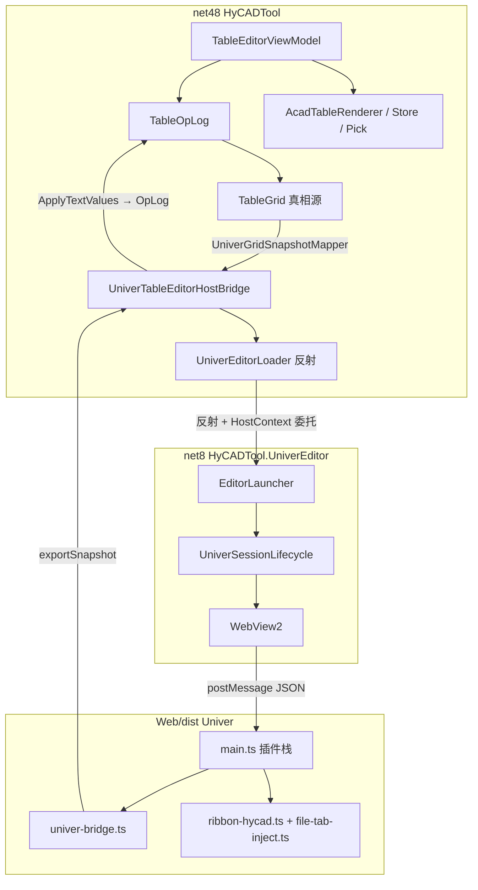
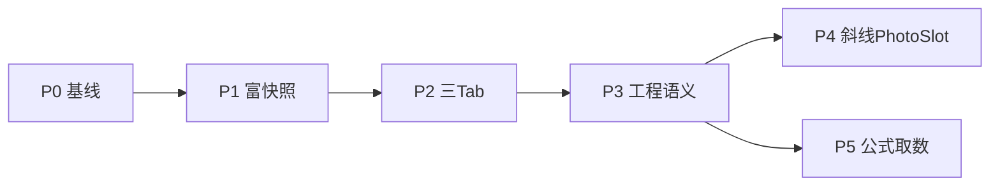

# Univer 路线 — 原需求最优落地总纲（new/001）

> 文档编号：new/001  
> 生成日期：2026-06-26  
> 一句话目标：在 **Univer OSS + WebView2** 路线下，把分散于旧 001–022、`HyCAD.Tables` 域与 `AcadTable*` 落图链的原始需求，梳理为 **能力差距 → 最优映射决策 → 分阶段路线图**，作为 Univer 路线的唯一总纲入口。  
> 上游引用（旧系列）：[001 产品调研](../001-AutoCAD表格工具-产品调研-2026-06-24-192049.md)、[012 结构优先](../012-表级结构优先与内容驱动排版-2026-06-25-185703.md)、[013 竖排](../013-表格竖排文字-产品调研-2026-06-25-192651.md)、[019 功能区](../019-独立表格编辑器功能区设计-产品调研-2026-06-25-223957.md)、[020 框架选型](../020-表格编辑器开源框架选型-产品调研-2026-06-26-021244.md)、[022 Univer 学习](../022-Univer-OSS-第一性原则学习-2026-06-26-035256.md)  
> 性质：**总纲 / 规划**；不写实现代码。

---

## 0. 目标与约束

| 项 | 内容 |
|---|---|
| **核心功能** | AutoCAD 插件内独立表格编辑器：Excel 级网格 + Office 级 Ribbon + CAD 落图；替代难用的原生 TABLE |
| **目标用户** | 工程制图员（熟悉 Excel 开始/布局 Tab）；模板维护者 |
| **平台** | net48 主工程 `HyCADTool` + **net8.0-windows** 侧车 `HyCADTool.UniverEditor`（WebView2 承载 Univer） |
| **成功标准** | 人员模板：真 merge、样式可辨、拾取/落图 round-trip；C2→N38 无 Badge/主题回归 |
| **五维权重** | 易用 **40%** / 功能 30% / 稳定 15% / 可靠 8% / 差异化 7% |

### 0.1 真相源红线（不可妥协）

1. **`HyCAD.Tables` 的 `TableGrid` + `TableOpLog` 为唯一真相源**；Univer workbook 内存态只是视图/编辑壳。
2. 持久化与 CAD round-trip 走 **XData / 扩展字典 JSON**（AC3），不采用 Univer 原生文件格式当真相源。
3. 编辑回写必须经 **OpLog**（`SetValueOp` 等），禁止绕过 Domain 直接改 CAD 实体。
4. 320px PaletteSet Tab（`TableFillGridView`）**不在 Univer 替换范围**；Univer 只服务独立编辑器窗口。

### 0.2 net48 ↔ net8 桥边界

| 通道 | 机制 | 承载内容 |
|---|---|---|
| **反射桥** | [`UniverEditorLoader`](../../../src/HyCADTool/Features/Tables/Services/UniverEditorLoader.cs) 加载 net8 DLL，配置 [`UniverEditorHostContext`](../../../src/HyCADTool.UniverEditor/UniverEditorHostContext.cs) 委托 | 新建/拾取/落图/xlsx/状态摘要等业务动作 |
| **JSON 快照** | WebView2 `postMessage` ↔ [`univer-bridge.ts`](../../../src/HyCADTool.UniverEditor/Web/src/univer-bridge.ts) | `loadSnapshot` / `exportSnapshot` / `cellChanged` |

**禁止**：在 net48 主工程 NuGet 引用 Univer；在 C# 反射调用 JS 内核。所有 Univer API 调用限定在 Web 前端 + Facade。

---

## 1. 路线变更说明

### 1.1 从方案 B 到方案 C

[020](../020-表格编辑器开源框架选型-产品调研-2026-06-26-021244.md) 曾推荐 **方案 B**：ReoGrid V3 + Fluent.Ribbon + `TableGridReoGridAdapter`（加权 4.4）。PoC 已合入 [`TableEditorWindow`](../../../src/HyCADTool/Features/Tables/Views/TableEditorWindow.xaml)，但 **Excel 级观感与 Ribbon polish 上限**仍低于 Canvas 方案。

**决策（2026-06-26）**：主编辑器路线切换为 **方案 C — Univer OSS + WebView2**（020 加权 4.2，易用/功能更高，稳定/可靠略低）。

| 维度 | 方案 B（ReoGrid） | 方案 C（Univer，当前） |
|---|---|---|
| 网格观感 | WPF 原生，中等 | Canvas，接近 Excel |
| Ribbon | Fluent.Ribbon 自研三 Tab | Univer 内置 + HyCAD 注入菜单 |
| 构建链 | 纯 dotnet | dotnet + **npm build → Web/dist** |
| 运行时 | net48 同进程 | **net48 + net8 反射侧车** |
| 现状 | 代码保留，降为备选 | **PoC 已落地**，N38 命令联调 |

### 1.2 文档体系定位

| 系列 | 角色 |
|---|---|
| **old/001–022** | 历史调研、Domain 设计、AC 分步、ReoGrid PoC 记录 — **引用源** |
| **new/001（本文）** | Univer 路线 **唯一总纲入口** — 需求→差距→映射→路线图 |
| 020 方案 B 章节 | **归档备选**；ReoGrid/Fluent 代码不删， smoke 失败时可回退 |

---

## 2. 架构基线（现状）

### 2.1 分层与数据流



### 2.2 部署链

```
浏览器 dev（5174 HMR）→ npm run build → Web/dist
  → dotnet build HyCADTool.UniverEditor → bin/Debug/net8/Web/dist
  → dotnet build HyCADTool → C2 复制到 ReCall temp
  → AutoCAD N38 → UniverSessionLifecycle 解析 dist 路径
```

关键解析逻辑：[`UniverSessionLifecycle.ResolveDistPath`](../../../src/HyCADTool.UniverEditor/Services/UniverSessionLifecycle.cs)（`ReCall deps` / `net8/Web/dist` / 程序集旁路）。

### 2.3 可复用资产（与呈现层无关）

| 层级 | 路径 | 职责 | Univer 路线 |
|---|---|---|---|
| Domain | [`src/HyCAD.Tables/`](../../../src/HyCAD.Tables/) | 拓扑/合并/角色/样式/公式/纸张 | **不变，真相源** |
| Infrastructure | [`Features/Tables/Infrastructure/AutoCad/`](../../../src/HyCADTool/Features/Tables/Infrastructure/AutoCad/) | 渲染/竖排/斜线/PhotoSlot/XData/拾取 | **原样复用** |
| Presentation 快照 | [`ExcelGridSnapshotBuilder`](../../../src/HyCADTool/Features/Tables/Presentation/ExcelGridSnapshot.cs) | 全样式 anchor 格抽取 | **扩展为 Univer v2 映射源** |
| xlsx | [`TableGridXlsxAdapter`](../../../src/HyCADTool/Features/Tables/Presentation/TableGridXlsxAdapter.cs) | 导入导出 | **C# 侧完成，不经 Univer Pro** |
| 320px Tab | [`TableFillGridView`](../../../src/HyCADTool/Features/Tables/Views/TableFillGridView.xaml) | 填值模式窄面板 | **保留，不替换** |

### 2.4 当前 PoC 已完成

| 能力 | 状态 | 落点 |
|---|---|---|
| Univer 插件栈 + 中文 locale | ✅ | `Web/src/main.ts` |
| JSON 快照 load/export（v1：文本+merge+尺寸） | ✅ | `univer-bridge.ts` + `UniverGridSnapshotMapper` |
| 单元格变更 → OpLog | ✅ | `cellChanged` → `OnCellChanged` |
| 文件▾菜单 7 项 | ✅ | `file-tab-inject.ts` → `HandleHyCadFileAction` |
| HyCAD 子菜单（落图/拾取） | ✅ | `ribbon-hycad.ts` |
| 浏览器 dev mock | ✅ | `dev-host.ts` + `README-dev.md` |
| 人员样表 fixture | ✅ | `public/fixtures/personnel-snapshot.json` |
| N38 命令入口 | ✅ | `OpenUniverTableEditorCommand` |

### 2.5 当前核心缺口

[`UniverGridSnapshot`](../../../src/HyCADTool/Features/Tables/Presentation/UniverGridSnapshot.cs) 仅映射 **文本 + 合并 + 行列 mm**；[`ExcelGridSnapshot`](../../../src/HyCADTool/Features/Tables/Presentation/ExcelGridSnapshot.cs) 已有的 **对齐/边框/字高/竖排/PhotoSlot/Role/FieldKey** 未进入 Univer 桥 → **WYSIWYG 不成立**，019 三 Tab 大部分命令无 UI 落点。

---

## 3. 原需求清单 R1–R14

从 [001](../001-AutoCAD表格工具-产品调研-2026-06-24-192049.md) MVP/V1/V2、[012](../012-表级结构优先与内容驱动排版-2026-06-25-185703.md)、[013](../013-表格竖排文字-产品调研-2026-06-25-192651.md)、[019](../019-独立表格编辑器功能区设计-产品调研-2026-06-25-223957.md)、[008](../008-AutoCAD表格制作分阶段实施计划-2026-06-25-143000.md) AC1–AC10 提炼。

| ID | 需求 | 来源 | 优先级 |
|---|---|---|---|
| **R1** | 原地类 Excel 网格编辑（输入/Tab/选区/merge/插删行列） | 001 Must | Must |
| **R2** | 样式统一（对齐/边框/字高/Wrap/Φ 符号） | 001 Must | Must |
| **R3** | 竖排文字（`TextOrientation.VerticalStacked`） | 013 / AC5 | Must |
| **R4** | 斜线单元格（`DiagonalSplit`） | AC5 | Should |
| **R5** | PhotoSlot 占位框 | AC8 | Could |
| **R6** | 单元格 Role + FieldKey（Label/Value/Header 等） | 002 / 015 S5 | Must |
| **R7** | 结构优先 + 纸张视口（`TableViewport` / A3 纸宽） | 012 / 018 | Must |
| **R8** | 三 Tab Ribbon IA（开始/布局/页面 + 文件▾） | 019 / 021 | Must |
| **R9** | Excel/CSV 导入导出 | 001 Should | Should |
| **R10** | 拾取 HyTable → 编辑 → 落图 round-trip | AC3/AC7 | Must |
| **R11** | 图形选实体统计填表 | 001 Should | Could（V2） |
| **R12** | 公式/小计 | 001 Could / Domain 已有 | Could |
| **R13** | 真相源 + OpLog 撤销（非 Univer 内置 undo） | 022 / 005 | Must |
| **R14** | 线框识别 / 编辑模式散开 | AC9/AC10 | Won't（V2+） |

---

## 4. 能力差距矩阵

| ID | Univer OSS 原生 | 当前 PoC | 缺口 |
|---|---|---|---|
| **R1** | 强（merge/选区/插删行列/Tab） | 部分（merge+文本编辑；插删/选区同步未完整） | 结构操作命令未接 Ribbon；export 未回写结构变更 |
| **R2** | 强（对齐/边框/字体 Facade） | **无**（v1 快照丢样式） | v2 富快照 + `loadSnapshot` 写 style |
| **R3** | 中（textRotation / 东亚竖排 API 因版本而异） | 无（ReoGrid 用 `\n` 堆字 hack） | 优先 Univer 原生 rotation；fallback 堆字 |
| **R4** | **弱**（无工程斜线 cell 语义） | CAD 侧 [`AcadTableDiagonalRenderer`](../../../src/HyCADTool/Features/Tables/Infrastructure/AutoCad/AcadTableDiagonalRenderer.cs) 已有 | 编辑器 **CAD-only 预览** 或自定义 overlay |
| **R5** | 弱 | CAD 侧 PhotoSlot 渲染已有 | 编辑器浅底纹 + 只读；图片 Block 仍 CAD |
| **R6** | 弱（无 FieldKey 概念） | Domain 有；Univer 仅 `editable` 布尔 | v2 快照带 role/fieldKey + 保护格 |
| **R7** | 弱（无 TableViewport） | WPF 旧窗有 PaperBar；Univer 窗无 Z0 | 快照带 paper + 列宽适配命令 |
| **R8** | 强（Ribbon 可扩展） | 文件▾ + HyCAD 2 项；Univer 原生开始/公式/数据 Tab | 021 待填 IA → `createMenu` 注入 |
| **R9** | **Pro**（完整 xlsx）；OSS 无 | C# `TableGridXlsxAdapter` 可用 | **不走 Univer 导入**；文件菜单调 C# |
| **R10** | — | 菜单有 pick/publish；桥已接 VM | smoke 验收 round-trip |
| **R11** | — | 主工程选择集能力有 | P5 接 VM 命令 |
| **R12** | 强（公式引擎 OSS 有） | 插件栈已注册 formula | 导出值入 OpLog；公式串存 Domain |
| **R13** | 中（MUTATION 流 vs 单点事件） | `cellChanged` + OpLog | 禁止依赖 Univer undo；结构变更走 OpLog |
| **R14** | — | AC9/AC10 Domain 有 | Won't MVP |

---

## 5. 逐需求最优映射决策

### 5.1 总原则

| 原则 | 决策 |
|---|---|
| **真相源** | 一切持久化语义在 `TableGrid`；Univer 只负责展示与采集用户输入 |
| **快照分层** | v1 文本/merge（现状）→ **v2 富快照**（对齐/边框/字高/竖排/role/fieldKey/paper） |
| **Ribbon 策略** | Univer 原生 Tab 承载 Excel 类命令；HyCAD 独有命令 **注入**（`createMenu` / 文件▾ DOM） |
| **CAD 独有语义** | 斜线/PhotoSlot/落图/XData：**CAD-only 或快照标记 + 编辑器降级显示** |
| **Excel 互通** | **C# NPOI 路径**，不经 Univer Pro xlsx |

### 5.2 R1 原地编辑

| 操作 | 最优路径 |
|---|---|
| 单元格文本 | Univer 编辑 → `cellChanged` 或 export 批量 → `UniverGridSnapshotMapper.ApplyTextValues` → OpLog |
| merge/插删 | Univer UI 触发 → export 全表 → C# 解析 merge/拓扑 diff → `GridEditor` OpLog |
| Tab 跳格 | Univer 内置 |
| 选区同步 | Facade `SelectionChanged` → postMessage → VM `SetSelectedRange`（Inspector 预留） |

**注意**：结构变更（插删 merge）不能仅靠 `cellChanged`；落图/导出前必须 **exportSnapshot 全量回写**（已实现 `PullSnapshotFromUniverThen` 模式）。

### 5.3 R2 样式 WYSIWYG

**最优路径**：以 [`ExcelGridSnapshotBuilder`](../../../src/HyCADTool/Features/Tables/Presentation/ExcelGridSnapshot.cs) 为 **唯一抽取源**，扩展 `UniverGridSnapshot` v2 字段，前端 `loadSnapshot` 写 Univer range style：

| Domain 字段 | Univer Facade 映射 |
|---|---|
| `TextAlign` H/V | `range.setHorizontalAlignment` / `setVerticalAlignment` |
| `CellStyle.TextHeight` | `range.setFontSize`（mm→pt 换算与 ReoGrid 一致） |
| `BorderSet` 四边 | `range.setBorder`（Top/Bottom/Left/Right；粗线 mm≥0.5 映射 Bold） |
| `AllowWrap` | `range.setWrapStrategy` |
| Label 格只读 | `range.setLocked` + 保护 + 浅灰底纹 |

回写：**仅 editable 格**文本走 OpLog；样式变更经 VM 命令（Ribbon/Inspector）→ OpLog `SetCellStyleOp`，**不从 Univer export 反推样式**（避免双栈不一致）。

### 5.4 R3 竖排

| 层级 | 决策 |
|---|---|
| Domain | 保持 `TextOrientation.VerticalStacked`；存储 **整句字符串** |
| Univer 显示 | **优先** Facade textRotation / 东亚竖排（查当前 `@univerjs/sheets` 版本 API）；**fallback** ReoGrid 同款 `\n` 堆字预览 |
| CAD 落图 | 已有 `AcadTableVerticalText` — **不变** |
| 回写 | export 时堆字还原为整句（去 `\n`），与现有 `ApplyTextValues` 竖排分支一致 |

### 5.5 R4 斜线 / R5 PhotoSlot

| 需求 | 编辑器策略 | CAD 策略 |
|---|---|---|
| **斜线** | 快照带 `diagonalSplit` 枚举；格内 **不可在 Univer 画线** → Inspector 下拉 + 文字占位提示 | `AcadTableDiagonalRenderer` 渲染 |
| **PhotoSlot** | 快照 `role=PhotoSlot` → 浅橙底纹 + 只读 + 占位文案 | `AcadTablePhotoSlotRenderer` |

**分级**：MVP 接受「编辑器只见底纹/只读，斜线形貌仅落图后可见」；P4 可选 Canvas overlay 插件。

### 5.6 R6 角色与 FieldKey

| 项 | 决策 |
|---|---|
| 存储 | Domain `GridStructure.Roles` / `FieldIndex` — 不变 |
| 快照 v2 | 每 cell 增 `role`、`fieldKey` |
| Univer | Label/Header 格 `editable:false` + 锁定；Value 格可编辑 |
| UI | 布局 Tab「结构\|填值」Toggle → postMessage `setEditMode` → 前端切换保护策略 |
| Inspector | P3 右栏（或 Univer sidebar 插件）显示 Role/FieldKey 只读 |

### 5.7 R7 纸张优先

| 项 | 决策 |
|---|---|
| Domain | `TableViewport` + `PaperPresetCatalog` — 不变 |
| UI | **Z0 纸张条**：Univer 窗顶 WPF 保留（[`UniverEditorWindow`](../../../src/HyCADTool.UniverEditor/Views/UniverEditorWindow.xaml) 可增 PaperBar）或 019「页面」Tab |
| 联动 | 纸宽变更 → VM `LayoutEngine` 列宽归一化 → `GridChanged` → reloadSnapshot |
| 快照 v2 | 增 `viewport: { preset, widthMm, heightMm, margins... }` 供 dev fixture 与摘要条 |

### 5.8 R8 三 Tab + 文件▾

| 019 区域 | Univer 落点 |
|---|---|
| **文件▾** | 已实现 `file-tab-inject.ts` — 保持 |
| **开始** | Univer 原生开始 Tab + HyCAD 注入组（对齐/边框若原生不足则 `ribbon-hycad.ts` 补） |
| **布局** | 新建 `ribbon-layout-hycad.ts`：结构模式/新建/模板/行列/merge |
| **页面** | 新建 `ribbon-page-hycad.ts`：纸型/表样式/列宽适配 |
| **公式/数据** | Univer 原生 Tab 保留（R12 公式编辑） |

021 待用户填 IA 定稿后，按本节映射实现 `createMenu` 分组；**命令逻辑先进 `TableEditorViewModel`，Ribbon 只做绑定**（021 约定）。

### 5.9 R9 Excel 互通

**最优路径**：文件菜单 `importXlsx` / `exportXlsx` → C# [`UniverTableEditorHostBridge`](../../../src/HyCADTool/Features/Tables/Services/UniverTableEditorHostBridge.cs) → `TableGridXlsxAdapter` → `GridChanged` → reloadSnapshot。**不启用 Univer Pro xlsx**。

### 5.10 R10 拾取 / 落图

| 动作 | 路径 |
|---|---|
| 拾取 | `RequestPick` → VM → `TablePickService` / XData 读回 → OpLog 替换 Grid → reloadSnapshot |
| 落图 | `RequestPublish` → **先 exportSnapshot** → `ApplyUniverSnapshot` → `AcadTableRenderer` |
| 载体 | Group/Block + XData（[009](../009-定稿表对象CAD分组方案对比-Group-vs-Block-2026-06-25-190000.md) 已定方案） |

### 5.11 R12 公式

| 层 | 决策 |
|---|---|
| Univer | 利用已注册 `@univerjs/sheets-formula` 让用户编辑公式 |
| Domain | `CellValue` 存公式串 + 缓存值；`FormulaService` 求值 |
| 桥接 | export 时：公式格 export **显示值** 写 OpLog；公式串经 v2 字段 `formula` 同步 |
| 落图 | 写 **求值后的文字**（工程表惯例） |

### 5.12 R13 撤销

| 禁止 | 采用 |
|---|---|
| 依赖 Univer 内置 Ctrl+Z 作为真相源 | VM `TableOpLog.Undo/Redo` |
| 仅监听 `SheetValueChanged` 写 OpLog | 结构操作必须走 C# OpLog API |
| 双栈 undo 不一致 | Univer 侧可禁用 undo 或忽略；**以 OpLog 为准** |

### 5.13 R11 / R14

- **R11 图形取数**：P5；VM 命令 + 开始 Tab 按钮；与 Univer 无耦合。
- **R14 识别/散开**：Won't MVP；AC9/AC10 独立于编辑器路线。

---

## 6. 数据契约演进 v1 → v2

### 6.1 v1（现状）

```text
HyCadGridSnapshot
  rowCount, colCount
  rowHeightsMm[], colWidthsMm[]
  cells[]: { row, col, rowSpan, colSpan, text, editable }
```

C#：[`UniverGridSnapshot`](../../../src/HyCADTool/Features/Tables/Presentation/UniverGridSnapshot.cs)  
JS：[`HyCadGridSnapshot`](../../../src/HyCADTool.UniverEditor/Web/src/univer-bridge.ts)

### 6.2 v2（目标）

在 v1 基础上 **每 cell 扩展**（optional，向后兼容）：

| 字段 | 类型 | 来源 |
|---|---|---|
| `hAlign` | `start\|center\|end` | `CellStyle.HAlign` |
| `vAlign` | `start\|center\|end` | `CellStyle.VAlign` |
| `textHeightMm` | number | `CellStyle.TextHeight` |
| `borders` | `{ top, bottom, left, right }` mm | `BorderSet` |
| `allowWrap` | bool | `GridEditor.GetCellAllowWrap` |
| `orientation` | `horizontal\|verticalStacked` | `CellStyle.Orientation` |
| `role` | `header\|label\|value\|photoSlot\|...` | `CellRole` |
| `fieldKey` | string? | `FieldIndex` |
| `formula` | string? | `CellValue` 公式串 |
| `diagonalSplit` | `none\|forward\|backward\|both`? | `DiagonalSplit` |

**表级扩展** `viewport`：`{ presetId, targetWidthMm, orientation, margins... }`

### 6.3 消息协议扩展

| type | 方向 | 用途 | 状态 |
|---|---|---|---|
| `loadSnapshot` | C#→JS | 加载 v1/v2 JSON | ✅ |
| `exportSnapshot` | C#→JS | 请求导出 | ✅ |
| `snapshot` | JS→C# | 导出结果 | ✅ |
| `cellChanged` | JS→C# | 单格文本 | ✅ |
| `hyCadFileAction` | JS→C# | 文件菜单 | ✅ |
| `hyCadAction` | JS→C# | Ribbon HyCAD | ✅ |
| `setEditMode` | C#→JS | 结构/填值 Toggle | P3 |
| `applyStyle` | C#→JS | 批量样式（Ribbon） | P2 |
| `selectionChanged` | JS→C# | 选区同步 | P2 |

### 6.4 HostContext 委托 ↔ 动作映射

| `UniverEditorHostContext` 属性 | 触发源 | 说明 |
|---|---|---|
| `GetLoadSnapshotJson` | Ready / GridChanged | v2 mapper 输出 |
| `OnCellChanged` | `cellChanged` | 单格 OpLog |
| `OnSnapshotExported` | `snapshot` | 全量回写 + 落图前置 |
| `NewEmptyTable` / `LoadPersonnelSample` | 文件▾ | ✅ |
| `ImportXlsx` / `ExportXlsx` | 文件▾ | C# adapter |
| `RequestPick` / `RequestPublish` | 文件▾ / Ribbon | ✅ |
| `ExportJsonSnapshot` | 文件▾ | 调试/ fixture |
| `GetSummaryText` / `GetStatusMessage` | WPF 状态条 | ✅ |
| *待增* `SetStructureMode` | 布局 Tab | P3 |
| *待增* `ApplyStyleCommand` | 开始 Tab | P2 |

反射 wiring：[`UniverEditorLoader.ConfigureHostContext`](../../../src/HyCADTool/Features/Tables/Services/UniverEditorLoader.cs)。

---

## 7. 分阶段路线图 P0–P5

### P0 — 基线固化（v1 round-trip smoke）

| 交付物 | 落点 |
|---|---|
| 人员样表 load → 编辑 → export → OpLog | 已有，补单测 |
| N38 C2→C1 smoke 清单 | `README-dev.md` §验收 |
| fixture 与 Domain 同步 | `ExportPersonnelUniverFixture` 测试 |

**验收**：merge 正确；编辑后落图文字一致；无 WebView2/dist 路径错误。

### P1 — 富快照 WYSIWYG（R2 核心）

| 交付物 | 落点 |
|---|---|
| v2 DTO + Mapper 扩展 | `UniverGridSnapshot.cs` |
| `loadSnapshot` 写 style | `univer-bridge.ts` |
| 对齐/边框/字高/Wrap 目视 | 人员样表 |

**验收**：Header 居中加粗边框与 ReoGrid 窗一致；Label 格只读。

### P2 — 三 Tab 功能区（R8）

| 交付物 | 落点 |
|---|---|
| 021 IA 定稿 | `new/021` 或更新旧 021 |
| 布局/页面 Ribbon 注入 | `ribbon-layout-hycad.ts`, `ribbon-page-hycad.ts` |
| 开始 Tab 边框/对齐命令 | `ribbon-hycad.ts` 扩展 |
| 选区/地址栏 | postMessage `selectionChanged` |

**验收**：019 §4.3 高频操作 ≤2 点击；dev 5174 可 HMR 自测。

### P3 — 工程语义（R3/R6/R7）

| 交付物 | 落点 |
|---|---|
| 竖排 v2 + 堆字 fallback | bridge + `ApplyTextValues` |
| role/fieldKey + 结构/填值 Toggle | VM + `setEditMode` |
| Z0 纸张条 | `UniverEditorWindow.xaml` 或页面 Tab |
| 列宽适配纸宽 | VM `LayoutEngine` 命令 |

**验收**：人员表侧栏竖排 3 步完成；填值模式 Label 不可改。

### P4 — CAD-hard 预览（R4/R5）

| 交付物 | 落点 |
|---|---|
| 斜线/PhotoSlot 快照字段 | v2 |
| 编辑器浅底纹/占位 | bridge |
| 可选 Canvas overlay PoC | Univer 自定义 plugin |

**验收**：落图斜线与编辑器标记一致；PhotoSlot 只读。

### P5 — 增强（R9/R11/R12）

| 交付物 | 落点 |
|---|---|
| xlsx 全链路 smoke | 已有 adapter，补 E2E |
| 公式串 v2 同步 | Mapper + FormulaService |
| 图形取数进表 | VM 命令 + Ribbon |

**验收**：xlsx 往返不丢 merge；公式格落图为求值结果。

### 阶段依赖



### ReoGrid 备选回退

若 P0/P1 smoke 出现 **WebView2 焦点/渲染/AutoCAD 内不稳定**：可临时切回 [`TableEditorWindow`](../../../src/HyCADTool/Features/Tables/Views/TableEditorWindow.xaml) ReoGrid 路径；Domain 与 AcadTable 链 **不受影响**。

---

## 8. 风险与对策

| 风险 | 影响 | 对策 |
|---|---|---|
| WebView2 Runtime 缺失 | 窗打不开 | 启动前检测；`UniverSessionLifecycle` 已有版本检查 |
| net48↔net8 反射失败 | N38 不可用 | `UniverEditorLoader` 多路径解析 + 明确 LastError；ReCall temp 复制 net8 |
| dist 未 build | 空白页 | csproj `Content Web/dist`；CI/文档强调 npm run build |
| 快照 v2 膨胀 | load 卡顿 | 仅 anchor 格；大表分批 load（>500 格） |
| Univer undo vs OpLog | 状态分裂 | 禁用或忽略 Univer undo；统一 OpLog |
| @univerjs/* 版本不齐 | 运行时崩 | package.json 锁同版本；升级全体对齐 |
| npm 离线部署 | 现场无 Node | **提交 Web/dist** 到仓库（现状已提交） |
| PaletteSet 主题污染 | Badge 回归 | Univer 窗 **不** 改 `Application.Current.Resources`（022 附录） |
| 竖排/斜线 API 缺口 | WYSIWYG 不完整 | 分级降级 + CAD 落图为准 |
| ReoGrid 代码分叉 | 维护成本 | ReoGrid 作备选；快照 mapper 共用 `ExcelGridSnapshotBuilder` |

详见 [`.cursor/skills/wpf-webview2-pitfalls/SKILL.md`](../../../../.cursor/skills/wpf-webview2-pitfalls/SKILL.md)。

---

## 9. 索引与交叉引用

### 9.1 new 系列（规划）

| 文档 | 状态 |
|---|---|
| [new/00 Domain 大白话](./00-Domain底层逻辑大白话-2026-06-26-180000.md) | ✅ Domain 底层逻辑入门 |
| **new/001（本文）** | ✅ 总纲 |
| [new/01 Univer↔Domain 对齐](./01-Univer-UI与Domain对齐规格-2026-06-26-183000.md) | ✅ UI/Facade 与 Domain 映射 |
| [new/a1-R6 Role与FieldKey](./a1-R6-单元格Role与FieldKey详解-2026-06-26-170000.md) | ✅ R6 概念详解 |
| [new/b1-R6 术语白话](./b1-R6-术语白话详解-2026-06-26-173000.md) | ✅ R6 术语入门 |
| new/021 | 待从旧 021 迁移定稿三 Tab IA |

### 9.2 旧系列（引用源）

| 编号 | 主题 |
|---|---|
| 001 | 产品定位 MVP/V1/V2 |
| 002 | 双模式编辑 |
| 005–007 | Domain 设计/计划/完成情况 |
| 008/008a–j | AC1–AC10 分步 |
| 012 | 结构优先 / TableViewport |
| 013 | 竖排 |
| 015–016 | 面板设置/操作 |
| 017–018 | 工作方式/独立窗 |
| 019 | 功能区 IA |
| 020 | 框架选型（B 归档） |
| 021 | 三 Tab 待填 |
| 022 | Univer 第一性学习 |

### 9.3 源码落点

| 模块 | 路径 |
|---|---|
| Univer 前端 | [`src/HyCADTool.UniverEditor/Web/src/`](../../../src/HyCADTool.UniverEditor/Web/src/) |
| net8 宿主 | [`src/HyCADTool.UniverEditor/`](../../../src/HyCADTool.UniverEditor/) |
| 反射加载 | [`UniverEditorLoader.cs`](../../../src/HyCADTool/Features/Tables/Services/UniverEditorLoader.cs) |
| Host 桥 | [`UniverTableEditorHostBridge.cs`](../../../src/HyCADTool/Features/Tables/Services/UniverTableEditorHostBridge.cs) |
| 快照 Mapper | [`UniverGridSnapshot.cs`](../../../src/HyCADTool/Features/Tables/Presentation/UniverGridSnapshot.cs) |
| 富快照源 | [`ExcelGridSnapshot.cs`](../../../src/HyCADTool/Features/Tables/Presentation/ExcelGridSnapshot.cs) |
| VM | [`TableEditorViewModel.cs`](../../../src/HyCADTool/Features/Tables/ViewModels/TableEditorViewModel.cs) |
| CAD 渲染 | [`Infrastructure/AutoCad/`](../../../src/HyCADTool/Features/Tables/Infrastructure/AutoCad/) |
| Domain | [`src/HyCAD.Tables/`](../../../src/HyCAD.Tables/) |
| 命令 N38 | [`OpenUniverTableEditorCommand.cs`](../../../src/HyCADTool/Features/Tables/Commands/OpenUniverTableEditorCommand.cs) |
| dev 指南 | [`Web/README-dev.md`](../../../src/HyCADTool.UniverEditor/Web/README-dev.md) |

---

## 10. 自检清单 + 下一步

### 10.1 文档自检

```
- [x] 目标/约束/真相源红线
- [x] 路线 B→C 变更说明
- [x] 架构基线 mermaid + 部署链
- [x] 需求 R1–R14 清单
- [x] 能力差距矩阵
- [x] 逐需求最优映射
- [x] 快照 v1→v2 + 消息/HostContext 表
- [x] P0–P5 路线图 + 验收
- [x] 风险对策
- [x] 交叉引用与源码索引
- [x] 不含实现代码
```

### 10.2 立即下一步（实施 P0）

1. `npm run build`（`src/HyCADTool.UniverEditor/Web`）→ `dotnet build src/HyCADTool/HyCADTool.csproj -c Debug`
2. AutoCAD **C2 → N38**（或 `TestCommand` 指向 Univer 命令）
3. 人员样表：load → 改单元格 → 落图 → 拾取回读
4. 通过后启动 **P1 富快照**（v2 DTO + bridge style 映射）

---

**版本**：1.0 | **落盘**：2026-06-26-163000
