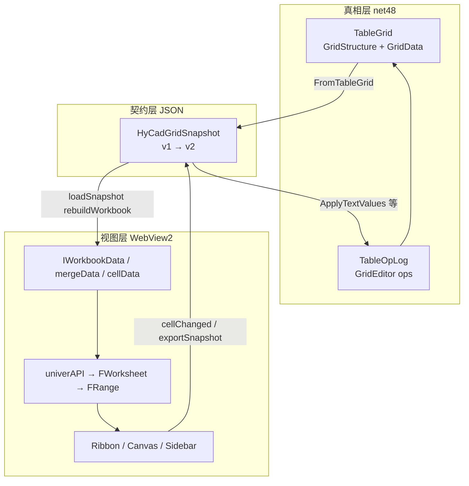

# Univer UI 与 Domain 完全对齐规格（new/01）

> 文档编号：new/01  
> 生成日期：2026-06-26  
> 一句话目标：基于 [Univer Sheets UI 官方文档](https://docs.univer.ai/guides/sheets/ui/overview) 与 Facade API，给出 **Univer 视图层 ↔ HyCAD `TableGrid` Domain** 的逐项对齐表、读写方向与红线，作为 P1–P3 桥接实现的唯一规格入口。  
> 上游：[new/001 总纲](./001-Univer路线-原需求最优落地总纲-2026-06-26-163000.md)、[new/00 Domain 大白话](./00-Domain底层逻辑大白话-2026-06-26-180000.md)、[new/a1 R6](./a1-R6-单元格Role与FieldKey详解-2026-06-26-170000.md)  
> Univer 版本：**`@univerjs/*` 0.25.0**（与 [`package.json`](../../../src/HyCADTool.UniverEditor/Web/package.json) 一致）  
> 性质：**对齐规格 / 映射表**；不写完整实现，但给出 API 选型与 DoD。

---

## 0. 三栈关系（必读）

HyCAD 表格编辑器里同时存在 **三套模型**，对齐工作的目标是：**只有 Domain 是真相，Univer 是视图，Snapshot 是二者之间的 JSON 契约**。



| 栈 | 是什么 | 能否当真相源 |
|---|---|---|
| **`TableGrid`** | [`HyCAD.Tables`](../../../src/HyCAD.Tables/) Domain | **是**（new/001 §0.1） |
| **`HyCadGridSnapshot`** | C# ↔ JS 传输 DTO | **否** — 快照 |
| **Univer workbook 内存** | Canvas + Formula 引擎 | **否** — 编辑壳 |

---

## 1. Univer UI 架构 ↔ HyCAD 功能区

官方 [UI Overview](https://docs.univer.ai/guides/sheets/ui/overview) 将界面分为：

| Univer UI 区 | 官方职责 | HyCAD 019 映射 | Domain 相关落点 |
|---|---|---|---|
| **Custom Header** | 顶栏扩展 | WPF `UniverEditorWindow` 标题栏 / 纸张条 Z0 | `TableViewport`（R7，WPF 或「页面」Tab） |
| **Ribbon** | 开始/插入/公式… + 自定义菜单 | 019 Z1–Z3；HyCAD 注入 `ribbon-hycad.ts` | 样式/结构命令 → OpLog |
| **Left Sidebar** | 可选侧栏 | 暂空或公式面板 | — |
| **Formula Bar** | 公式编辑 | Univer 原生（R12） | `CellValue.Formula` |
| **Canvas Content** | 网格主编辑区 | 019 Z2 网格 | `GridData` + merge 显示 |
| **Right Sidebar** | 属性/插件侧栏 | 019 Z6 Inspector | **Role / FieldKey**（R6，`openSidebar`） |
| **Footer** | 状态/缩放 | WPF 状态条 + Domain 摘要 | `TableSummary` |
| **Global Zone** | 全局浮层 | 文件▾ DOM 注入 | HostContext 委托 |

**HyCAD 原则**（new/001 §5.1）：

- Excel 类能力 → **Univer 原生 Ribbon + Facade**
- HyCAD 独有（落图/拾取/Role/FieldKey/纸张）→ **注入菜单 / WPF / Right Sidebar**
- 不把 Domain 语义硬塞进 Univer 内置数据模型

---

## 2. Facade API 层级 ↔ Domain 操作入口

官方 Facade 调用链（[Range 文档](https://docs.univer.ai/reference/facade/range)、[Range & Selection](https://docs.univer.ai/guides/sheets/features/core/range-selection)）：

```text
univerAPI (FUniver)
  ├── createMenu / openSidebar / registerComponent  ← UI 扩展
  ├── Event.SheetValueChanged                       ← 填值回写
  ├── getActiveWorkbook() → FWorkbook
  │     ├── getActiveSheet() → FWorksheet
  │     │     ├── getRange('A1') / getSelection() → FRange
  │     │     ├── insertRowsAfter / insertColumnsAfter
  │     │     ├── setRowHeight / setColumnWidth
  │     │     └── getMergeData()
  │     └── createWorkbook / disposeUnit
  └── Enum.* (BorderType, WrapStrategy, PermissionPoint…)
```

| Domain 操作 | 应对 Facade API | 经 Snapshot? | 经 OpLog? |
|---|---|---|---|
| 读/写单元格值 | `FRange.setValue` / `getDisplayValue` | export / cellChanged | `SetValueOp` |
| 按 FieldKey 写值 | **不**在 Univer 侧 | — | `SetValueByField`（C#） |
| 合并 | `FRange.merge()` / `breakApart()` | export 解析 mergeData | `MergeOp` / `UnmergeOp` |
| 插删行列 | `FWorksheet.insertRowsAfter` 等 | export + diff | `InsertRowOp`… |
| 对齐/边框/字高 | `setHorizontalAlignment` / `setBorder` / `setFontSize` | v2 load **单向** | `SetCellStyleOp`（C# 命令） |
| Label 锁定 | `FRange.getRangePermission().protect()` | v2 load | **不** export 反推 Role |
| Role/FieldKey 展示 | `openSidebar` + 自定义组件 | v2 只读字段 | `SetRoleOp` / `SetFieldKeyOp` |
| 公式 | `setFormula` / `getFormula` | v2 export 显示值+公式字段 | `FormulaService` |

---

## 3. 主对齐表：Domain ↔ Snapshot v2 ↔ Univer Facade

> v2 字段定义见 [new/001 §6.2](./001-Univer路线-原需求最优落地总纲-2026-06-26-163000.md)。下表为 **推荐 API 选型**（0.25.0）。

### 3.1 拓扑与几何

| Domain | Snapshot v2 | Univer load（`loadSnapshot` 后） | Univer export | 回写 Domain |
|---|---|---|---|---|
| `GridTopology.RowCount/ColCount` | `rowCount/colCount` | `IWorkbookData.sheets[].rowCount/columnCount` + `insertRowsAfter` | 扫描 `getMaxRows/Columns` | `EnsureGridFits` + 结构 diff（P1+） |
| `GridTrack.Size` (mm) | `rowHeightsMm[]/colWidthsMm[]` | `setRowHeight` / `setColumnWidth`（mm→px 见 §4） | `getRowHeight/Width` 反算 mm | 列宽命令 → `GridEditor`（结构模式） |
| `GrowDirection.Down` | （隐含） | 默认即可 | — | — |
| `TableViewport` | `viewport{…}` | **WPF PaperBar** 或页面 Tab；Univer 无一等公民 | 不回写 | VM `LayoutEngine` |

### 3.2 合并（Merge）

| Domain | Snapshot | Univer | 对齐要点 |
|---|---|---|---|
| `MergeRegion(Anchor, rowSpan, colSpan)` | `cells[].row,col,rowSpan,colSpan` | `mergeData[]` + `FRange.merge()` | **Anchor = merge 左上角**；与 `isMerged` / `isPartOfMerge` 同口径 |
| Hidden 成员 | 不出现在 snapshot cells | export 跳过 `isPartOfMerge && !isMerged` | 与 Domain `IsHidden` 一致（已实现） |
| `MergeValuePolicy` | 不导出 | Univer 只有显示值 | 回写只写 **Anchor** 格 |

**Facade 参考**：[merge / breakApart / getMergeData](https://docs.univer.ai/guides/sheets/features/core/range-selection)

**现状**：load/export merge **已有**（[`univer-bridge.ts`](../../../src/HyCADTool.UniverEditor/Web/src/univer-bridge.ts)）；结构变更 **未** 自动 diff 进 OpLog（P1+ 需 `exportSnapshot` 全量拓扑 diff）。

### 3.3 数据层（GridData）

| Domain | Snapshot | Univer | 回写 |
|---|---|---|---|
| `CellValue.Text` | `text` | `cellData[r][c].v` / `setValue` | `ApplyTextValues` → `SetValueOp` |
| `CellValue.Kind=Formula` | `formula` + 显示 `text` | `setFormula` / `getDisplayValue` | 显示值 OpLog；公式串 v2 字段同步（R12） |
| `TextOrientation.VerticalStacked` | `orientation` | `setTextRotation` **或** load 时 `\n` 堆字 fallback | export 去 `\n` 还原（a1 §5.4） |

### 3.4 样式（CellStyle）— R2 / P1

| Domain 字段 | Snapshot v2 | FRange Facade（0.25.0） | 读写 |
|---|---|---|---|
| `HAlign` | `hAlign: start\|center\|end` | `setHorizontalAlignment('left'\|'center'\|'right')` | **load 单向**；改样式走 C# `SetCellStyleOp` + `applyStyle` 消息 |
| `VAlign` | `vAlign` | `setVerticalAlignment('top'\|'middle'\|'bottom')` | 同上 |
| `TextHeight` (mm) | `textHeightMm` | `setFontSize(pt)` — mm→pt 换算与 ReoGrid 一致 | 同上 |
| `BorderSet` 四边 | `borders{top…}` mm | `setBorder(BorderType, BorderStyleTypes, color)` 分四次 | 同上 |
| `AllowWrap` | `allowWrap` | `setWrap(true)` / `setWrapStrategy(WRAP)` | 同上 |
| `BackColor` | （可选） | `setBackgroundColor` | Could |
| 竖排 | `orientation: verticalStacked` | `setTextRotation(90)` 或堆字 | P3 验证 API |

**红线**：**禁止**从 Univer export 反推样式进 Domain（new/001 §5.3）— Univer 与 Domain 双栈样式会 drift。

### 3.5 工程语义（R6）— P3

| Domain | Snapshot v2 | Univer 表现 | 回写 |
|---|---|---|---|
| `CellRole` | `role: label\|value\|…` | **Protection** + 浅灰底纹（`setBackgroundColor`） | **仅** `SetRoleOp` |
| `FieldIndex` | `fieldKey: string?` | Inspector 只读；可选 `setCustomMetaData` 仅供 UI | **仅** `SetFieldKeyOp` |
| 填值模式锁定 | `editable: bool` | `rangePermission.protect` + `RangePermissionPoint.Edit=false` | 由 `setEditMode` 切换，不持久化到 Domain |

**Facade 参考**：[Permission Control](https://docs.univer.ai/guides/sheets/features/core/permission)、[FRangePermission](https://docs.univer.ai/reference/facade/range-permission)

**与 `editable` 布尔关系**：

```text
loadSnapshot:
  editable=false  → protect(Edit=false) + 背景 #F0F0F0
  editable=true   → 不 protect（或填值模式再放开）

exportSnapshot:
  只 export text + merge + 尺寸
  不读 protection 反推 role/fieldKey
```

Domain 权威：`TableFillGridAdapter.IsCellEditable`（[a1 §4.2](./a1-R6-单元格Role与FieldKey详解-2026-06-26-170000.md)）。

### 3.6 Domain 有、Univer 无（CAD-only / 降级）

| Domain | 编辑器策略 | CAD |
|---|---|---|
| `DiagonalSplit` / `SubCell` | v2 标记 + Inspector；**不在 Canvas 画斜线** | `AcadTableDiagonalRenderer` |
| `CellRole.PhotoSlot` | 浅橙底纹 + 只读 + 占位文案 | `AcadTablePhotoSlotRenderer` |
| `FieldKey` 语义 | 无内置概念 | XData JSON |
| 外框加粗差 | v2 borders mm | AC6 渲染 |

---

## 4. 坐标与单位换算（对齐硬规则）

### 4.1 索引

| 系统 | 行列索引 | 地址字符串 |
|---|---|---|
| **Domain `CellAddr`** | `(row, col)` **0-based** | 逻辑坐标 |
| **Univer `FRange`** | 0-based 内部；`A1` **1-based** | `getRange('B2')` = `(1,1)` |
| **Snapshot** | 与 Domain 一致 0-based | — |

[`univer-bridge.ts`](../../../src/HyCADTool.UniverEditor/Web/src/univer-bridge.ts) 中 `colToLetter` + `row+1` 已统一。

### 4.2 mm ↔ px（与 C# Mapper 一致）

| 方向 | 行 | 列 |
|---|---|---|
| mm → px（load） | `max(22, min(140, mm * 2.0))` | `max(52, min(260, mm * 1.6))` |
| px → mm（export） | `px / 2.0` | `px / 1.6` |

C#：[`UniverGridSnapshotMapper.MmToRowPx/MmToColPx`](../../../src/HyCADTool/Features/Tables/Presentation/UniverGridSnapshot.cs)  
JS：`mmToRowPx` / `mmToColPx` — **必须保持同一常量**。

### 4.3 Anchor 与 merge 导出

与 Domain `GetAnchorOf` 对齐的 Univer 规则：

```text
export 时只输出 isMerged()==true 的左上角
跳过 isPartOfMerge() && !isMerged() 的 hidden 格
rowSpan/colSpan 来自 getMergeData()
```

---

## 5. UI 扩展 API ↔ HyCAD 功能映射

官方 [Custom Components](https://docs.univer.ai/guides/sheets/ui/components) + [Menu Facade](https://docs.univer.ai/reference/facade/ui)。

### 5.1 已落地

| HyCAD 功能 | Univer 机制 | 源码 |
|---|---|---|
| 落图 / 拾取 | `univerAPI.createMenu().appendTo('ribbon.start.others')` | [`ribbon-hycad.ts`](../../../src/HyCADTool.UniverEditor/Web/src/ribbon-hycad.ts) |
| 文件▾ 7 项 | DOM 注入 + `hyCadFileAction` | [`file-tab-inject.ts`](../../../src/HyCADTool.UniverEditor/Web/src/file-tab-inject.ts) |
| 范围落图 | 选区 `readSelectionBounds` + `exportSnapshotForPublish` | [`univer-bridge.ts`](../../../src/HyCADTool.UniverEditor/Web/src/univer-bridge.ts) |
| 单元格改值 | `Event.SheetValueChanged` → `cellChanged` | [`main.ts`](../../../src/HyCADTool.UniverEditor/Web/src/main.ts) |

### 5.2 P2–P3 待落地

| HyCAD 需求 | 推荐 Univer API | Domain 动作 |
|---|---|---|
| **Inspector：Role/FieldKey** | `registerComponent` + `openSidebar({ children: { label: 'HyCadInspector' } })` | VM 读选区 → 显示；改 Role → postMessage → `SetRoleOp` |
| **结构｜填值 Toggle** | `setEditMode` 消息 + 批量 `protect/unprotect` | VM 模式状态 |
| **019 布局 Tab** | `createMenu` / `createSubmenu` → `ribbon.layout.*` | `MergeOp` / 插删行列 OpLog |
| **开始 Tab 边框/对齐** | 原生 Ribbon **或** `createMenu` 调 `applyStyle` | C# `SetCellStyleOp` |
| **选区同步** | `SelectionChanged` 事件（若 0.25 暴露）→ postMessage | VM `SetSelectedRange` |
| **PhotoSlot 占位** | `setBackgroundColor` + protect | 只读 |
| **斜线标记** | `attachPopup` 或 Sidebar 下拉 | `SplitDiagonalOp`（结构模式） |

### 5.3 菜单挂载点（Facade `appendTo`）

| 019 区域 | 建议 appendTo 路径 |
|---|---|
| HyCAD 落图/拾取 | `ribbon.start.others`（已用） |
| 布局：merge/插删 | `ribbon.start.layout` 或自定义 `ribbon.layout.hycad` |
| 页面：纸型 | **WPF Z0** 优先；次选 `ribbon.start.page` |
| 右键 merge | `contextMenu.mainArea` + `contextMenu.others` |

复杂菜单可改用 [Custom Plugin + IMenuManagerService](https://docs.univer.ai/guides/recipes/tutorials/custom-plugin)（021 IA 定稿后）。

---

## 6. 消息协议 ↔ UI 事件（完整对齐）

在 [new/001 §6.3](001-Univer路线-原需求最优落地总纲-2026-06-26-163000.md) 基础上补 **Domain 语义**：

| type | 方向 | 触发源（Univer UI） | Domain 效果 |
|---|---|---|---|
| `loadSnapshot` | C#→JS | Ready / GridChanged | 重建 workbook；v2 写样式+protection |
| `exportSnapshot` | C#→JS | 落图前 | `ApplyTextValues` + 拓扑 diff（P1+） |
| `snapshot` | JS→C# | export 完成 | OpLog 回写 |
| `cellChanged` | JS→C# | Canvas 编辑 / Formula Bar | `SetValueOp`（editable 格） |
| `selectionChanged` | JS→C# | 选区变化 | VM 更新 Inspector |
| `setEditMode` | C#→JS | WPF Toggle | protect 策略切换 |
| `applyStyle` | C#→JS | Ribbon 命令 | FRange 批量样式；**不写回 export** |
| `setRole` / `setFieldKey` | C#→JS | Inspector 确认 | 仅刷新 loadSnapshot |
| `hyCadAction` | JS→C# | 自定义 Ribbon | Pick/Publish |
| `hyCadFileAction` | JS→C# | 文件▾ | xlsx/新建/样表 |

---

## 7. 读写方向决策树（实现时必查）

```text
用户改了 Canvas 上的文字
  → SheetValueChanged
  → cellChanged
  → C# 检查 IsCellEditable(addr) 或 snapshot.editable
  → SetValueOp / SetValueByField
  ✓

用户在 Univer 里 merge 了单元格
  → exportSnapshot 全量
  → C# diff merge vs Domain.Merges
  → MergeOp / UnmergeOp
  ✓（P1+）

用户在 Univer 里改了边框/字高
  → 若仅 export 回写样式 → ✗ 禁止
  → 应：Ribbon → VM → SetCellStyleOp → applyStyle → reloadSnapshot
  ✓

用户改了 Role 下拉
  → Inspector → postMessage setRole
  → C# SetRoleOp
  → reloadSnapshot（带新 role/editable）
  ✓

Univer Ctrl+Z
  → 忽略或禁用
  → 用 TableOpLog.Undo（WPF 快捷键）
  ✓
```

---

## 8. 差距清单（对齐未完成项）

| ID | 领域 | 现状 | 目标 | 阶段 |
|---|---|---|---|---|
| G1 | 样式 WYSIWYG | ✅ A 档落地：v2 含 align/字高/wrap/border，`snapshotToWorkbookData` 烘焙进 `IWorkbookData.styles`（非 Facade 后置调用，避免异步时序） | （已达成）样式随 loadSnapshot 一次性渲染 | P1 ✅ |
| G2 | Role/FieldKey | ✅ A 档落地：v2 含 `role`/`fieldKey`/`isPhotoSlot`，按 role/editable 上只读底纹（photoSlot 橙、只读灰、竖排淡蓝）；真正 cell-lock 待装 permission 插件 | protect 真锁 + Inspector | P3（permission 插件） |
| G3 | 结构 diff | merge export 有；插删未回写 | export → Insert/Merge OpLog | P1 |
| G4 | 选区同步 | 范围落图用选区 | Inspector 常驻同步 | P2 |
| G5 | 公式 | 插件已注册 | formula v2 + 求值落图 | P5 |
| G6 | 竖排 | 未映射 | rotation 或堆字 | P3 |
| G7 | Permission 持久化 | Univer 权限不持久 | **不持久** — 每次 loadSnapshot 由 Domain 重放 | 设计 |
| G8 | Undo | 双栈 | 禁用 Univer undo，OpLog 唯一 | P0+ |

---

## 9. P1–P3 对齐 DoD（可勾选）

### P1 富快照（R2）

- [x] v2 DTO C#/TS 字段与 §3.4 一致（`UniverGridCellSnapshot` / `HyCadCellSnapshot` 同名可选字段，PascalCase 回退）
- [x] `loadSnapshot` 渲染样式（实现选型改为烘焙进 `IWorkbookData.styles`，而非 load 后 FRange 逐格调用——更稳、无异步时序问题）
- [x] export 仍 **不含** style 反写（`exportRegion` 仅读 text/merge；新增「不反推」单测）
- [x] fixture 同步 + Role/FieldKey/style 填充单测（`TableGridUniverAdapterTests`，17 通过）
- [ ] mm↔pt/px 常量专项单测（当前由 fixture 同步间接覆盖）
- [ ] R6 真 cell-lock（需注册 permission 插件，A 档先用只读底纹兜底）

### P2 三 Tab（R8）

- [ ] `createMenu` / submenu 覆盖 019 Must 命令
- [ ] `selectionChanged` → VM
- [ ] `applyStyle` 消息实现

### P3 工程语义（R6/R3）

- [ ] v2 `role/fieldKey` load
- [ ] `setEditMode` + `RangePermissionPoint.Edit`
- [ ] `openSidebar` Inspector 组件
- [ ] 填值模式 Label protect 与 `IsCellEditable` 一致

---

## 10. 官方文档索引（实施时查阅）

| 主题 | URL |
|---|---|
| UI 总览 | https://docs.univer.ai/guides/sheets/ui/overview |
| 自定义组件 / Sidebar | https://docs.univer.ai/guides/sheets/ui/components |
| 主题 | https://docs.univer.ai/guides/sheets/ui/themes |
| FRange 全 API | https://docs.univer.ai/reference/facade/range |
| 选区与 merge | https://docs.univer.ai/guides/sheets/features/core/range-selection |
| 权限保护 | https://docs.univer.ai/guides/sheets/features/core/permission |
| 自定义菜单 Facade | https://docs.univer.ai/reference/facade/ui |
| 自定义菜单 Plugin | https://docs.univer.ai/guides/recipes/tutorials/custom-plugin |
| FUniver 入口 | https://docs.univer.ai/reference/facade/univer |

---

## 11. 交叉引用

| 文档 | 关系 |
|---|---|
| [new/00](./00-Domain底层逻辑大白话-2026-06-26-180000.md) | Domain 底座逻辑 |
| [new/02](./02-Univer对齐进度白话-已完成与未完成-2026-06-27-004800.md) | 本规格的白话进度盘点(完成/未完成) |
| [new/a1](./a1-R6-单元格Role与FieldKey详解-2026-06-26-170000.md) | Role/FieldKey 规格 |
| [new/b1](./b1-R6-术语白话详解-2026-06-26-173000.md) | 术语 |
| [new/001](./001-Univer路线-原需求最优落地总纲-2026-06-26-163000.md) | v2 契约与路线图 |
| [019 功能区](../019-独立表格编辑器功能区设计-产品调研-2026-06-25-223957.md) | UI 区 IA |

---

## 12. 变更记录

| 日期 | 说明 |
|---|---|
| 2026-06-26 | 01 初版：Univer UI 架构、Facade 层级、Domain/Snapshot/API 主对齐表、读写红线、差距与 DoD |
| 2026-06-27 | A 档落地：v2 富快照（C# `UniverGridSnapshot` + TS `univer-bridge.ts`）；样式烘焙进 `IWorkbookData.styles`；role/editable 只读底纹；fixture 刷新 + 单测 17 过；G1 完成、G2 部分（待 permission），P1 DoD 勾选 |

---

**版本**：1.0 | **落盘**：2026-06-26-183000
