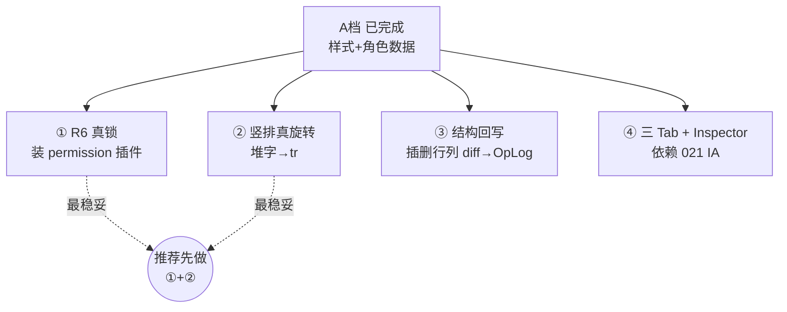

# Univer↔Domain 对齐进度（大白话 · 已完成 vs 未完成）（new/02）

> 文档编号：new/02
> 生成日期：2026-06-27
> 一句话目标：用大白话把"对齐"这件事讲清楚——**对的是什么、为什么要对、现在对到哪了、还差哪些**，让你看完能直接决定下一步做哪块。
> 上游规格（要技术细节看它们）：[new/001 总纲](./001-Univer路线-原需求最优落地总纲-2026-06-26-163000.md)、[new/01 对齐规格](./01-Univer-UI与Domain对齐规格-2026-06-26-183000.md)、[new/00 Domain 大白话](./00-Domain底层逻辑大白话-2026-06-26-180000.md)
> 性质：**进度盘点 + 白话科普**，不写代码，看完用来拍板方向。

---

## 0. 图例（全文统一）

| 记号 | 含义 |
|---|---|
| ✅ | 已完成，能用 |
| 🟡 | 部分完成 / 有兜底但不彻底 |
| ❌ | 还没开始 |

---

## 1. 先说人话：什么是"对齐"？

我们这套表格编辑器，**同一张表同时活在三个地方**，对齐就是让这三个地方"说的是同一张表、长得也一样"。

打个结构工程的比方：

- **Domain（真相）** = 你的**结构计算书**。钢筋多少、梁多大，以它为准，谁都不能私改。
- **Univer（视图）** = 现场挂的**施工图晒蓝图**。给人看、给人填,但它只是"计算书的一张照片"。
- **Snapshot（快照/契约）** = 计算书和晒蓝图之间的**交接单（JSON）**。计算书怎么变成图、图上填的字怎么报回计算书,全靠这张交接单。

**对齐要解决的三个"不一样"：**

1. **长得不一样**：计算书说"这格居中、加粗、画粗边框"，但晒蓝图上是大白格 → 看着对不上（这叫 WYSIWYG 不成立，What You See Is What You Get，所见即所得）。
2. **能不能改不一样**：计算书说"这格是标签'姓名',不许改",但晒蓝图上谁都能涂 → 会改错。
3. **改完报不回去 / 报错**：晒蓝图上插了一行、改了个值,但计算书没收到、或收错了 → 真相被污染。

**一条铁律（红线）**：报回去时**只报"人填的内容"，绝不报"样式"**。否则两边样式会越走越偏（drift）。样式永远以计算书为准、单向往下画。

---

## 2. 对齐分几个维度？（白话目录）

把"一张表"拆开，要对齐的东西其实是这 9 块。后面逐块讲状态。

| # | 维度 | 大白话 |
|---|---|---|
| A | 拓扑/几何 | 几行几列、每行多高每列多宽 |
| B | 合并 | 哪些格子拼成一个大格（merge） |
| C | 数据 | 格子里的文字 |
| D | 样式 | 对齐、字大小、换行、边框 |
| E | 竖排 | 文字竖着写（"家庭主要成员"那种） |
| F | 工程语义 R6 | 这格是"标签"还是"值"、叫什么名字（FieldKey）、能不能改 |
| G | 通信协议 | C# 和网页之间怎么传话 |
| H | 三 Tab 功能区 | 顶部菜单栏（开始/布局/页面） |
| I | 反向回写 | 网页上插删行列、改结构,怎么报回计算书 |

---

## 3. 逐块盘点：现在对到哪了

### A. 拓扑/几何（几行几列 + 行高列宽）✅

- **白话**：表格多大、每格多宽多高,下行能画对,上行也能反算回毫米。
- **状态**：✅ 已完成。`UniverGridSnapshot` 带 `rowCount/colCount/rowHeightsMm/colWidthsMm`,毫米↔像素两边换算口径一致。
- 落点：[UniverGridSnapshot.cs](../../../src/HyCADTool/Features/Tables/Presentation/UniverGridSnapshot.cs)、[univer-bridge.ts](../../../src/HyCADTool.UniverEditor/Web/src/univer-bridge.ts)

### B. 合并 merge ✅

- **白话**：标题"人员基本情况表"横跨 7 列、照片格竖跨 3 行,这种拼格能画对、也能导出认出来。
- **状态**：✅ 已完成（下行画 + 上行导出都认 merge,隐藏成员格按 Domain 口径跳过）。
- 注意：merge **结构本身的"新增/拆开"还没自动报回计算书**（见 I 维度）。

### C. 数据（文字）✅

- **白话**：格子里的字,下行画得出、上行人改完报得回。
- **状态**：✅ 已完成。`ApplyTextValues` 把网页改的字写回 OpLog;**只写能改的格**,标签格篡改会被忽略。

### D. 样式（对齐/字高/换行/边框）✅ 刚完成

- **白话**：以前晒蓝图是大白格,现在能照着计算书画出"居中、字多大、要不要换行、四边粗细边框"了。
- **状态**：✅ **本轮 A 档刚做完**。
- **关键实现选择**：样式不是"画完表再一格格调",而是**一次性烘焙进 Univer 的工作簿数据**(`IWorkbookData.styles`),更稳、没有异步时序坑。
- 落点：`univer-bridge.ts` 的 `buildCellStyle` / `snapshotToWorkbookData`。

### E. 竖排文字 🟡 兜底

- **白话**："家\n庭\n主\n要\n成\n员" 这种竖着写。
- **状态**：🟡 部分完成。现在是**堆字兜底**——把字拆成一行一个字、配淡蓝底,看着像竖排;但**不是真正的文字旋转**。
- **差什么**：升级成 Univer 原生文字旋转(`setTextRotation`/`tr`),保真度更高。

### F. 工程语义 R6（Role + FieldKey + 能不能改）🟡 兜底

- **白话**：这格到底是"标签姓名"还是"值张三"、程序里叫 `name`、填值模式下许不许改。这是 HyCAD 比普通 Excel 多出来的"工程灵魂"。
- **状态**：🟡 部分完成。
  - ✅ `role`/`fieldKey`/`isPhotoSlot` 已进快照,下行能带过去。
  - ✅ 只读视觉:照片格橙底、只读格灰底、竖排淡蓝底。
  - ❌ **真锁还没有**——现在是"灰底提示别改",但手动还是能点进去改(改了也会被 C 维度的"只写能改格"拦回,所以**数据安全,只是视觉上不够硬**)。
- **差什么**：装 Univer 的 permission(权限)插件,把"灰底提示"升级成"真的点不进去"。

### G. 通信协议（C# ↔ 网页传话）✅

- **白话**：C# 喊"加载这张表"、网页喊"这格被改了/导出给你",两边能听懂。
- **状态**：✅ 已完成。`loadSnapshot`/`exportSnapshot`/`cellChanged`/落图等消息都通。

### H. 三 Tab 功能区（顶部菜单：开始/布局/页面）❌

- **白话**：顶上那排菜单按钮。Excel 类操作用 Univer 自带的,HyCAD 独有的(落图/拾取/角色)往里塞。
- **状态**：❌ 基本没做。现在只有"文件▾"菜单 + HyCAD 两个子项;**完整的三 Tab 还没排**。
- **卡点**：依赖 021 文档的"三 Tab 信息架构(IA)"定稿,UI 改动大。

### I. 反向回写：结构变更（插删行列）❌

- **白话**：人在网页上插了一行、删了一列、把两格合起来,这种"结构动作"怎么报回计算书。
- **状态**：❌ 未做。现在只回写"文字",**插删行列/新合并不会自动 diff 报回 OpLog**。
- **差什么**：导出时做"结构对比(diff)",把插/删/合并翻译成 Domain 的 `InsertRowOp`/`DeleteColOp` 等。

---

## 4. 一张总表：完成 / 未完成

### 4.1 按对齐维度

| 维度 | 状态 | 还差什么 |
|---|---|---|
| A 拓扑几何 | ✅ | — |
| B 合并 merge | ✅ | 结构动作回写(见 I) |
| C 数据文字 | ✅ | — |
| D 样式 | ✅ 刚完成 | — |
| E 竖排 | 🟡 堆字兜底 | 真旋转 `tr` |
| F 工程语义 R6 | 🟡 视觉兜底 | permission 真锁 + Inspector 侧栏 |
| G 通信协议 | ✅ | — |
| H 三 Tab 菜单 | ❌ | 021 IA 定稿 + 注入菜单 |
| I 结构回写 | ❌ | 导出 diff → OpLog |

### 4.2 按原始需求 R1–R14（挑 Must）

| 需求 | 是什么 | 状态 |
|---|---|---|
| R1 类 Excel 编辑 | 输入/选区/merge/插删 | 🟡 编辑+merge 有;插删回写无 |
| R2 样式统一 | 对齐/边框/字高/换行 | ✅ 本轮完成 |
| R3 竖排 | 竖着写字 | 🟡 堆字兜底 |
| R6 角色+FieldKey | 标签/值/能不能改 | 🟡 数据通 + 视觉兜底;真锁/侧栏缺 |
| R7 纸张视口 | A3 纸宽/页面 | ❌ |
| R8 三 Tab | 顶部菜单 | ❌ |
| R10 拾取↔落图 | round-trip | 🟡 链路通,缺验收 |
| R13 撤销 | OpLog 唯一真相 | ✅ 文字层面;结构层待 I |

### 4.3 按路线图 P0–P5

| 阶段 | 主题 | 状态 |
|---|---|---|
| P0 基线 round-trip | v1 文字+merge 往返 | ✅ |
| **P1 富快照 WYSIWYG** | 样式下行画对 | ✅ **本轮主体完成**(真锁/竖排旋转留尾) |
| P2 三 Tab 功能区 | 顶部菜单 | ❌ |
| P3 工程语义 | 竖排真渲染 + R6 真锁 + 纸张 | 🟡 部分(role/fieldKey 数据已通) |
| P4 斜线/PhotoSlot | CAD 硬语义预览 | ❌(PhotoSlot 仅底纹) |
| P5 公式/取数 | 公式串 + 图形取数 | ❌ |

---

## 5. 本轮(A 档)到底改了哪些文件

> 这就是"D 样式 + F 部分"落地的全部改动,验收时照这个看。

| 文件 | 改了什么 |
|---|---|
| [UniverGridSnapshot.cs](../../../src/HyCADTool/Features/Tables/Presentation/UniverGridSnapshot.cs) | 快照加 v2 富字段(对齐/字高/换行/边框/角色/FieldKey/照片格);Mapper 从已有渲染信息 + 结构填充;**回写路径没动**(守红线) |
| [univer-bridge.ts](../../../src/HyCADTool.UniverEditor/Web/src/univer-bridge.ts) | 接口加同名字段 + 大小写兼容;样式烘焙进工作簿;角色/只读底纹;**导出仍不带样式** |
| [personnel-snapshot.json](../../../src/HyCADTool.UniverEditor/Web/public/fixtures/personnel-snapshot.json) | 样表刷新成 v2(带角色/样式) |
| [TableGridUniverAdapterTests.cs](../../../src/HyCADTool.Tests/Features/Tables/TableGridUniverAdapterTests.cs) | 同步断言扩到角色/FieldKey/对齐;新增 3 个测试(含"导出不反推样式") |

**验收口径**:17 个单测过 / 网页构建过 / 主工程构建过。AutoCAD 里 **C2 → N38** 加载人员表,目视:标签格灰底、照片格橙底、竖排淡蓝、对齐边框与计算书一致。

---

## 6. 还差的几块 + 下一步怎么选

剩下的活互相独立,可单独推进。按"承接性 + 性价比"给你排序:

| 方向 | 做什么 | 工作量 | 风险 | 价值 |
|---|---|---|---|---|
| ① R6 真锁 | 装 permission 插件,标签/只读格真正点不进 | 中 | 中(新插件,需验证 0.25 API) | 高(工程灵魂) |
| ② 竖排真旋转 | 堆字升级为文字旋转 | 小 | 低 | 中(保真) |
| ③ 结构回写 | 网页插删行列报回计算书 | 大 | 中(diff 算法) | 高(打通反向) |
| ④ 三 Tab + Inspector | 顶部菜单 + 角色侧栏 | 大 | 中(依赖 021 定稿) | 高(可用性) |

**我的建议**:
- 想**补齐渲染保真**(让晒蓝图和计算书彻底一模一样)→ 选 **①+②**,承接 A 档最自然,风险低。
- 想**打通双向**(网页改结构能存回去)→ 选 **③**,但要先接受 diff 算法的复杂度。
- 想**先把界面做好看好用**→ 选 **④**,但要先把 021 三 Tab IA 定稿。

---

## 7. 交叉引用

| 文档 | 关系 |
|---|---|
| [new/001 总纲](./001-Univer路线-原需求最优落地总纲-2026-06-26-163000.md) | 需求 R1–R14 + 路线图 P0–P5 唯一源 |
| [new/01 对齐规格](./01-Univer-UI与Domain对齐规格-2026-06-26-183000.md) | 逐项映射表 + Facade API 选型 + DoD |
| [new/00 Domain 大白话](./00-Domain底层逻辑大白话-2026-06-26-180000.md) | "计算书"内部怎么搭的 |
| [new/a1 R6 详解](./a1-R6-单元格Role与FieldKey详解-2026-06-26-170000.md) | 角色/FieldKey 规格 |
| [new/b1 术语白话](./b1-R6-术语白话详解-2026-06-26-173000.md) | 名词解释 |

---

## 8. 变更记录

| 日期 | 说明 |
|---|---|
| 2026-06-27 | 02 初版:白话盘点三套模型 + 9 维度对齐状态 + 完成/未完成总表(按维度/R/P 三视角) + A 档落点 + 4 个下一步方向与推荐 |
