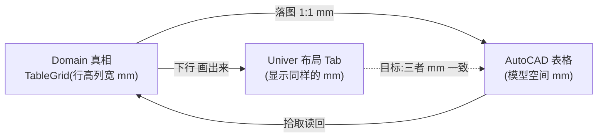
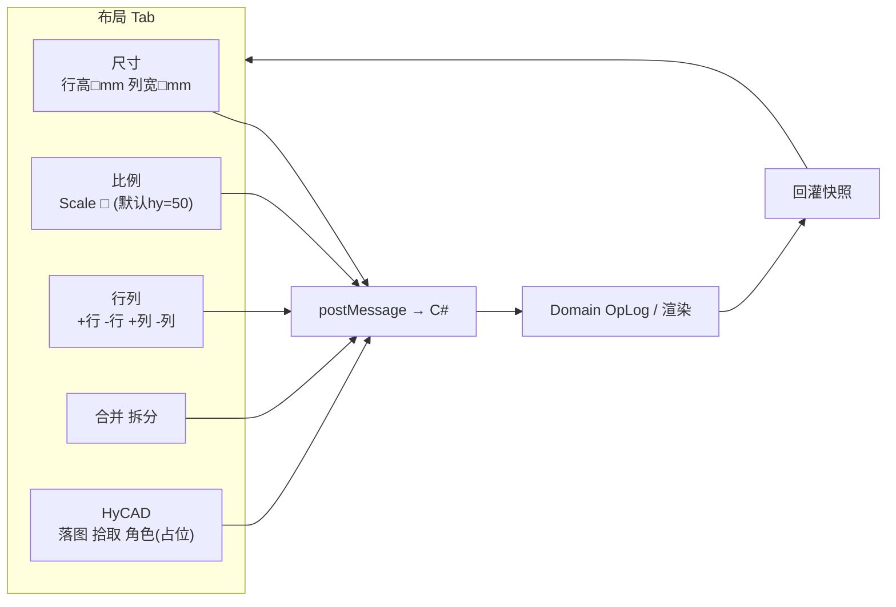
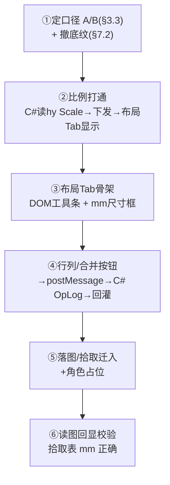

# Univer↔Domain 对齐进度 + 布局 Tab 设计（02 修订版）（new/03）

> 文档编号：new/03（[new/02](./02-Univer对齐进度白话-已完成与未完成-2026-06-27-004800.md) 的修订版,02 仍保留作历史）
> 生成日期：2026-06-27
> 一句话目标：在 02 白话盘点的基础上,**新增最重要的一条对齐诉求——Univer 里看到的尺寸要和 AutoCAD 落图的表格用同一套 mm 对得上**,并给出实现它的载体：**Univer 布局 Tab**。
> 上游规格：[new/001 总纲](./001-Univer路线-原需求最优落地总纲-2026-06-26-163000.md)、[new/01 对齐规格](./01-Univer-UI与Domain对齐规格-2026-06-26-183000.md)、[new/00 Domain 大白话](./00-Domain底层逻辑大白话-2026-06-26-180000.md)
> 性质：进度盘点 + 布局 Tab 设计规格,看完用来拍板"先做布局 Tab"。

---

## 0. 图例

| 记号 | 含义 |
|---|---|
| ✅ | 已完成,能用 |
| 🟡 | 部分完成 / 有兜底但不彻底 |
| ❌ | 还没开始 |
| 🆕 | 本版(03)相对 02 的新增/变更 |

---

## 1. 本版相对 02 改了什么(先看这里)

| 项 | 02 的说法 | 03 的决策 |
|---|---|---|
| 🆕 **尺寸对齐** | 没专门讲 | **新增头号诉求**：Univer 显示的行高列宽 = CAD 表格 mm,要对得上(见 §3) |
| 🆕 **布局 Tab** | 只在"三 Tab"里一笔带过 | **拆出来单独做、最高优先**：mm 尺寸 + 比例 + 行列设置 + 读图回显(见 §6) |
| 🆕 **比例(Scale)** | 没提 | 布局 Tab 加比例框,**默认取 hy 面板比例,可改,重开恢复 hy 值**(见 §6.3) |
| **R6 角色/FieldKey** | 列为"真锁"候选方向 | **暂不做,后期再加**;但"角色"按钮**入口**先占位放进布局 Tab(见 §7.1) |
| **颜色底纹** | A 档加了照片橙/只读灰/竖排淡蓝 | 🆕 **取消自动底纹**,颜色交给用户在 Univer 自行设置(见 §7.2) |
| **落图/拾取/角色** | 散在"开始"Tab | 🆕 **全部归入布局 Tab**(见 §7.1) |

---

## 2. 三套模型(白话,保留自 02)

同一张表活在三个地方,对齐就是让它们"同一张表、长一样、尺寸一样":

- **Domain(真相)** = 结构计算书。行高列宽、文字,以它为准(`HyCAD.Tables`)。
- **Univer(视图)** = 给人看/填的晒蓝图。
- **Snapshot(交接单 JSON)** = 两者之间传话的单子。

**这一版的核心**：右边那条虚线——让 **Univer 看到的 mm = CAD 表格的 mm**,人在 Univer 里量到多大,落图就是多大。

---

## 3. 头号诉求:尺寸对齐(mm 必须对得上)🆕

### 3.1 现在为什么对不上

- Univer 网格内部是按**像素**画的。当前桥接里 `mmToRowPx`/`mmToColPx` 是**为了显示硬塞的假换算**(行高 ×2、列宽 ×1.6 像素,还做了 22~140px 的夹值)。
  - 落点：[univer-bridge.ts](../../../src/HyCADTool.UniverEditor/Web/src/univer-bridge.ts) 的 `mmToRowPx`/`mmToColPx`。
- 结果：用户在 Univer 里**看不到真实 mm**,只看到一堆被夹过的像素宽度,跟 CAD 表格完全对不上。

### 3.2 CAD 那边的 mm 是什么

- 落图走 [AcadTableRenderer](../../../src/HyCADTool/Features/Tables/Infrastructure/AutoCad/AcadTableRenderer.cs),直接用 `TableLayout` 的 **mm 坐标 1:1** 画到模型空间,**当前不乘比例**。
- 也就是说:`TableGrid` 里的 `RowHeightsMm`/`ColWidthsMm`(样表默认行高 10mm、列宽 25mm)**就是 CAD 模型空间的实际 mm**。
- 拾取读回([TablePickService](../../../src/HyCADTool/Features/Tables/Application/TablePickService.cs))是从 XData/Carrier JSON **原样读回** `TableGrid`,所以行高列宽是存储的真值,不是反算几何。

### 3.3 对齐口径(已定:口径 B)

> ✅ **已确定采用口径 B:布局 Tab 的行高列宽 = 纸面 mm;落图时几何 ×Scale 放大到 CAD 模型空间。**

- 布局 Tab 与 Univer 网格显示的都是**纸面 mm**(即 `TableGrid` 现存的 `RowHeightsMm`/`ColWidthsMm`,样表 10mm/25mm 量级原样),不再经像素夹值。
- **只有 CAD 落图 ×Scale**:落图时 `TableLayout` 几何、字高、padding、边框线宽统一 ×Scale,得到模型空间的放大表。
- **拾取无需几何反算**:[AcadTableStore](../../../src/HyCADTool/Features/Tables/Infrastructure/AutoCad/AcadTableStore.cs) 把完整 `TableGrid`(纸面 mm 原值)序列化进 XData,落图只是渲染层放大、不改 grid;拾取直接读回纸面 mm。所以口径 B 的 CAD 改动只集中在**落图渲染 ×Scale**这一层。
- **比例(Scale)**:默认取 hy 面板值(默认 50),布局 Tab 可改,不持久化(重开恢复 hy 值),见 §6.3。

---

## 4. 对齐维度总览(在 02 的 9 块上调整)

| # | 维度 | 大白话 | 变化 |
|---|---|---|---|
| A | 拓扑/几何 | 几行几列、行高列宽 mm | 🆕 升级:布局 Tab 露出**真 mm**(§6.2) |
| B | 合并 | 哪些格拼成大格 | 合并按钮进布局 Tab |
| C | 数据 | 格子文字 | 不变 |
| D | 样式 | 对齐/字高/换行/边框 | 🆕 去掉自动底纹(§7.2) |
| E | 竖排 | 竖着写字 | 不变(堆字兜底) |
| F | 工程语义 R6 | 角色/FieldKey/能不能改 | 🆕 **暂缓**,仅留角色按钮入口(§7.1) |
| G | 通信协议 | C#↔网页传话 | 🆕 加比例/行列/尺寸消息(§6) |
| H | 三 Tab 菜单 | 顶部菜单 | 🆕 **先做"布局"这一个 Tab**(§6) |
| I | 结构回写 | 插删行列报回真相 | 🆕 布局 Tab 的行列按钮直接走 C# OpLog(§6.4) |
| J | 🆕 **比例/尺寸对齐** | mm + Scale 与 CAD 对齐 | 本版新增,头号(§3、§6.3) |

---

## 5. 当前完成 / 未完成(更新版)

### 5.1 按维度

| 维度 | 状态 | 说明 |
|---|---|---|
| A 拓扑几何(像素显示) | ✅ | 但 mm 被像素掩盖,布局 Tab 要露真值 |
| B 合并 | ✅ | 显示/导出 OK |
| C 数据文字 | ✅ | 双向 OK |
| D 样式(对齐/字高/换行/边框) | ✅ | A 档完成 |
| D 样式-自动底纹 | 🟡→❌ | 🆕 **决定撤掉**,见 §7.2 |
| E 竖排 | 🟡 | 堆字兜底 |
| F 角色/FieldKey 数据 | 🟡 | 数据已通;**真锁暂缓** |
| G 通信 | ✅ | 基础消息通;布局 Tab 消息待加 |
| H 布局 Tab | ❌ | 🆕 本轮要做 |
| I 结构回写 | ❌ | 🆕 随布局 Tab 行列按钮一起做 |
| J 比例/mm 对齐 | ❌ | 🆕 本轮要做 |

### 5.2 按路线 P

| 阶段 | 状态 |
|---|---|
| P0 基线 round-trip | ✅ |
| P1 富快照样式 | ✅(底纹撤回,其余保留) |
| **布局 Tab + mm/比例(本版新增,跨 P2/P3)** | ❌ 本轮做 |
| P2 完整三 Tab | 🟡 只先做"布局" |
| P3 工程语义(R6 真锁) | ❌ 暂缓 |

---

## 6. 布局 Tab 设计(本版核心)🆕

### 6.1 定位

- 它是 [new/001 §5.8](./001-Univer路线-原需求最优落地总纲-2026-06-26-163000.md) 规划的"开始/布局/页面"三 Tab 里的 **"布局"Tab,先单独落地**。
- 它收纳两类东西:
  1. **结构与尺寸操作**(行列数、插删行列、合并拆分、行高列宽 mm)。
  2. **HyCAD 独有命令**(落图/拾取/角色入口),从"开始"Tab 搬过来。
- **蓝本现成**:WPF 端 [TableEditorLayoutTab.xaml](../../../src/HyCADTool/Features/Tables/Views/TableEditorLayoutTab.xaml) 已有几乎全部按钮(结构模式 / 行列数 / +-行列 / 合并拆分 / 行高列宽 mm),Univer 版照它搬,**额外加"比例"框**。

### 6.2 mm 单位原则

- 布局 Tab 里**所有尺寸框都用 mm**,显示 `TableGrid` 的真值(口径 A,§3.3),不经像素夹值。
- 选中行/列后,显示该行高 / 列宽(mm),可编辑;回车写回 → C# OpLog → 重新下发快照刷新。
- 对应现成绑定:WPF 的 `SelectedRowHeightMm` / `SelectedColWidthMm`(布局 Tab 同名语义)。

### 6.3 比例(Scale)选项 🆕

| 行为 | 规格 |
|---|---|
| 默认值 | 打开编辑器时**取 hy 面板当前比例**——[SettingsPanelViewModel.Scale](../../../src/HyCADTool/Shell/Preferences/SettingsPanelViewModel.cs)(默认 50.0) |
| 可改 | 用户能在布局 Tab 改这个比例框 |
| 不持久化 | **重新打开编辑器,比例框恢复成 hy 面板值**(不写回 hy 面板,也不存进表) |
| 用途(口径 A) | 比例作为"出图比例"语义显示;落图时配套文字样式比例(DIMSCALE 思路);**不改变行高列宽 mm 的 1:1**。可选:提供"按新旧比例整表缩放"动作(行高列宽 × 新/旧) |

- **数据流**:打开编辑器 → C# 读 `SettingsPanelViewModel.Scale` → 随快照/初始化消息下发 `scale` → 布局 Tab 显示。用户改 → 仅存在网页会话内,关掉即弃。
- ⚠️ 比例到底改不改 mm,取决于 §3.3 的口径 A/B 决策。口径 A 下比例是"标签 + 可选整表缩放";口径 B 下比例直接参与 mm→模型换算。

### 6.4 行列设置(结构操作)

| 按钮 | 走哪条路 | 现状 |
|---|---|---|
| 行数 / 列数 + 新建空表 / 模板 | C# 新建 grid | WPF 已有(`RowCount`/`ColCount`/`NewEmptyTableCommand`) |
| +行 / -行 / +列 / -列 | C# OpLog `InsertRow`/`DeleteRow`/… | WPF 已有命令;Univer 侧**需把按钮点击 → postMessage → C# OpLog**(这步打通了维度 I 结构回写) |
| 合并 / 拆分 | C# `MergeOp`/`UnmergeOp` | WPF 已有 |
| 行高 / 列宽 mm | C# 改 `GridTrack.Size` | WPF 已有 `SelectedRowHeightMm/ColWidthMm` |

> 关键:结构操作**不走 Univer 自己的插删行**,而是**按钮 → C# 改 Domain → 回灌快照**。这样真相永远在 Domain,顺带解决 02 的"维度 I 结构回写"。

### 6.5 读图回显(拾取的表能正确显示尺寸)🆕

- 拾取([TablePickService](../../../src/HyCADTool/Features/Tables/Application/TablePickService.cs))读回的 `TableGrid` 已带真实行高列宽 mm。
- 走 `FromTableGrid` → 快照 `rowHeightsMm/colWidthsMm` → 布局 Tab 直接显示。
- **要做的**:确保布局 Tab 选中行/列时,尺寸框显示的是快照真值(mm),而不是像素反算。口径 A 下这是自然结果。

### 6.6 放在 Univer 哪里(技术选型)

- 现状:[ribbon-hycad.ts](../../../src/HyCADTool.UniverEditor/Web/src/ribbon-hycad.ts) 用 `univerAPI.createMenu({...}).appendTo('ribbon.start.others')` 注入到**"开始"Tab**。
- 目标:一个**"布局"Tab/分组**。两条路:
  1. **自定义 Tab/分组**:`appendTo('ribbon.layout.*')` 或自定义 schema —— ⚠️ Univer 0.25 OSS 能否新建**顶层 Tab** 需先验证(技术风险点)。
  2. **自定义工具条(DOM 注入)**:照 [file-tab-inject.ts](../../../src/HyCADTool.UniverEditor/Web/src/file-tab-inject.ts) 的方式,在 Univer 顶部塞一条 HyCAD 自己的"布局"工具条(可控、不依赖 ribbon schema)。
- **建议**:先用方案 2(DOM 工具条)保底快速出活,同时验证方案 1 能否原生加 Tab;能则迁移。

### 6.7 布局 Tab 草图

---

## 7. 其它决策变更 🆕

### 7.1 落图 / 拾取 / 角色 → 全进布局 Tab

- 现在落图/拾取挂在"开始"Tab 的 `ribbon.start.others`。
- **改为**:把"落图""拾取"移进布局 Tab 的 HyCAD 分组;"角色"作为按钮**入口先占位**(点了可提示"后期开放"),功能等 R6 阶段再接。

### 7.2 取消自动颜色底纹 ✅ 已落地

- A 档在 [univer-bridge.ts](../../../src/HyCADTool.UniverEditor/Web/src/univer-bridge.ts) 加了 `resolveBackground`(照片橙 / 只读灰 / 竖排淡蓝)。
- **决策:撤掉这套自动底纹**——颜色交给用户在 Univer 里自己设。
- ✅ 已移除 `resolveBackground` 及 `buildCellStyle` 里写 `bg` 的部分;**其余样式(对齐/字高/换行/边框)保留**。

### 7.3 R6 暂缓

- 角色/FieldKey 的**数据**继续随快照带着(不删),但**真锁(permission 插件)、Inspector 侧栏暂不做**,留待后期。

---

## 8. 下一步实现顺序(布局 Tab 优先)

| 步 | 交付 | 工作量 | 风险 |
|---|---|---|---|
| ① | 口径确认 + 撤底纹 | 小 | 低(口径需你拍板) |
| ② | 比例默认 hy 值 + 显示 | 小 | 低 |
| ③ | 布局 Tab 骨架 + mm 框 | 中 | 中(Univer 放置方式 §6.6) |
| ④ | 行列/合并 → OpLog 回灌 | 中 | 中(消息往返 + 回灌刷新) |
| ⑤ | 落图/拾取迁入 + 角色占位 | 小 | 低 |
| ⑥ | 读图回显校验 | 小 | 低 |

---

## 9. 给你拍板的两个关键点

1. **尺寸口径(§3.3)**:A(布局 mm = 模型 mm,1:1,推荐) 还是 B(布局填纸面 mm,落图 ×Scale)?
2. **比例作用(§6.3)**:Scale 只当"出图比例标签 + 可选整表缩放"(口径 A 配套),对不对?

定了这两条,我就能按 §8 顺序开工。

---

## 10. 交叉引用

| 文档 | 关系 |
|---|---|
| [new/02](./02-Univer对齐进度白话-已完成与未完成-2026-06-27-004800.md) | 本文前身(白话盘点) |
| [new/001 总纲](./001-Univer路线-原需求最优落地总纲-2026-06-26-163000.md) | 需求 R1–R14 + 三 Tab + 路线图 |
| [new/01 对齐规格](./01-Univer-UI与Domain对齐规格-2026-06-26-183000.md) | 逐项映射 + Facade API |
| [WPF 布局 Tab](../../../src/HyCADTool/Features/Tables/Views/TableEditorLayoutTab.xaml) | 布局 Tab 的 IA 蓝本 |
| [SettingsPanelViewModel](../../../src/HyCADTool/Shell/Preferences/SettingsPanelViewModel.cs) | hy 面板比例 Scale 来源 |

---

## 11. 变更记录

| 日期 | 说明 |
|---|---|
| 2026-06-27 | 03 初版(02 修订):新增头号诉求"mm 尺寸对齐"+ 布局 Tab 设计(mm/比例/行列/读图回显/HyCAD 命令归位);R6 暂缓;撤自动底纹;给出尺寸口径 A/B 决策点与实现顺序 |
