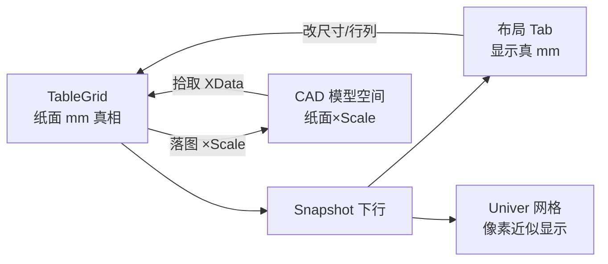
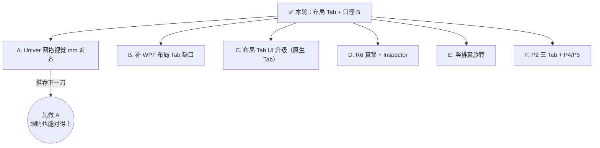

# Univer 布局 Tab + 口径 B 落地进度（new/04）

> 文档编号：new/04（[new/03](./03-Univer布局Tab与mm尺寸对齐-02修订版-2026-06-27-011500.md) 的实施结果盘点）
> 生成日期：2026-06-27
> 一句话：**03 里定的「布局 Tab + 纸面 mm × 比例落图（口径 B）」已按 6 个阶段全部落地**；本文用白话讲清楚「现在能干什么、还差什么、下一步该做哪块」。
> 上游：[new/03 设计](./03-Univer布局Tab与mm尺寸对齐-02修订版-2026-06-27-011500.md)、[new/02 对齐盘点](./02-Univer对齐进度白话-已完成与未完成-2026-06-27-004800.md)、[new/001 总纲](./001-Univer路线-原需求最优落地总纲-2026-06-26-163000.md)
> 性质：**落地进度 + 后续工作清单**，不写代码，看完用来决定下一步。

---

## 0. 图例

| 记号 | 含义 |
|---|---|
| ✅ | 已完成，代码已合入 |
| 🟡 | 部分完成 / 有已知缺口 |
| ❌ | 还没开始 |
| 👤 | 需你在 AutoCAD 里目视确认 |

---

## 1. 先看结论（30 秒版）

**03 要做什么**：在 Univer 编辑器里加一个「布局」工具条，行高列宽显示**纸面 mm**，落图时按**比例 Scale** 放大到 CAD 模型空间（口径 B）；行列/合并/尺寸/落图/拾取都收进这里；撤掉自动底纹；R6 角色先占位。

**04 现在的状态**：

| 项 | 状态 |
|---|---|
| 口径 B（纸面 mm + 落图 ×Scale） | ✅ 已落地 |
| 布局 Tab 工具条（DOM 浮动条） | ✅ 已落地 |
| 比例默认 hy 面板、可改、不持久化 | ✅ 已落地 |
| 行列/合并/改尺寸 → C# OpLog 回灌 | ✅ 已落地 |
| 落图/拾取迁入布局 Tab | ✅ 已落地 |
| 角色按钮占位 | ✅ 已落地 |
| 撤自动底纹 | ✅ 已落地 |
| Univer 网格「看起来」= 纸面 mm | 🟡 **布局 Tab 框是真 mm，网格仍是像素换算** |
| WPF 布局 Tab 全部功能对齐 | 🟡 缺「结构模式 / 新建表 / 模板 / 行列数」 |
| R6 真锁 + Inspector | ❌ 暂缓（按 03 决策） |
| 三 Tab（开始/布局/页面）完整 IA | 🟡 只做了布局这一条 DOM 条 |
| AutoCAD 目视验收 | 👤 请你 C2→N38 跑一遍 |

---

## 2. 口径 B 现在怎么运转（白话）

记住三句话就够了：

1. **Domain / 布局 Tab / 拾取读回** —— 都用**纸面 mm**（样表行高 10、列宽 25 那种），互不反算。
2. **只有落图** —— 渲染层把几何、字高、padding、边框线宽 **×Scale** 画进模型空间。
3. **比例 Scale** —— 打开编辑器时默认取 hy 面板值（通常 50），布局 Tab 可改；**关掉编辑器就丢**，不写进表、不改 hy 面板。

**和 03 设计的一致之处**：结构按钮不走 Univer 自带插删行，而是 **按钮 → C# 改 Domain → 回灌快照**。这样「计算书」永远是真相，也顺带打通了 02 里说的「结构回写（维度 I）」。

---

## 3. 六个阶段：做了什么（对照 03 §8）

| 阶段 | 交付 | 状态 | 主要落点 |
|---|---|---|---|
| ① 定口径 + 撤底纹 | 口径 B 已定；去掉照片橙/只读灰/竖排蓝自动底纹 | ✅ | [univer-bridge.ts](../../../src/HyCADTool.UniverEditor/Web/src/univer-bridge.ts) |
| ② CAD 落图 ×Scale | 几何/字高/padding/边框统一 ×Scale | ✅ | [TableLayout.cs](../../../src/HyCAD.Tables/Layout/TableLayout.cs)、[AcadTableRenderer.cs](../../../src/HyCADTool/Features/Tables/Infrastructure/AutoCad/AcadTableRenderer.cs) |
| ③ 比例打通 | VM.Scale、打开时下发网页 | ✅ | [TablePanelViewModel.cs](../../../src/HyCADTool/Features/Tables/ViewModels/TablePanelViewModel.cs)、[UniverSessionLifecycle.cs](../../../src/HyCADTool.UniverEditor/Services/UniverSessionLifecycle.cs) |
| ④ 布局 Tab 骨架 | DOM 工具条 + 行高/列宽/比例框 + 选区联动 | ✅ | [layout-tab-inject.ts](../../../src/HyCADTool.UniverEditor/Web/src/layout-tab-inject.ts)、[main.ts](../../../src/HyCADTool.UniverEditor/Web/src/main.ts) |
| ⑤ 结构按钮回灌 | +/-/合并/改尺寸 → postMessage → OpLog → GridChanged | ✅ | [UniverTableEditorHostBridge.cs](../../../src/HyCADTool/Features/Tables/Services/UniverTableEditorHostBridge.cs) |
| ⑥ HyCAD 命令归位 | 落图/拾取进布局 Tab；删 ribbon-hycad；角色占位 | ✅ | layout-tab-inject.ts（`ribbon-hycad.ts` 已删） |

**构建/单测（AI 已跑过）**：

- `npm run build`（Web）✅
- `dotnet build src\HyCADTool\HyCADTool.csproj` ✅
- `HyCAD.Tables.Tests` 175/175 ✅（含 TableLayout ×Scale 护栏）
- `HyCADTool.Tests` 中 Tables/Univer 相关 49/49 ✅

---

## 4. 布局 Tab 里现在有什么

工具条在网页**右下角浮动**（DOM 注入，不是 Univer 原生顶层 Tab）：

| 分组 | 控件 | 行为 |
|---|---|---|
| 尺寸 | 行高 mm、列宽 mm | 选中格后显示快照真值；改数字 → C# 改 `GridTrack.Size` → 回灌 |
| 行列 | +行 -行 +列 -列 | → C# `InsertRow`/`DeleteRow`/… → 回灌 |
| 合并 | 合并、拆分 | → C# `MergeOp`/`UnmergeOp` → 回灌 |
| 比例 | Scale 数字框 | 只改 VM.Scale，**不回灌 grid** |
| HyCAD | 落图、拾取、角色 | 落图/拾取走原有 `hyCadFileAction`；角色点出「后期开放」 |

**还没搬进布局 Tab 的**：

- **范围落图**（整个选区 / 仅有内容）仍在 Ribbon 上的「落图范围」下拉 → [ribbon-range-inject.ts](../../../src/HyCADTool.UniverEditor/Web/src/ribbon-range-inject.ts)

**WPF 版有、Univer 版还没有的**（对照 [TableEditorLayoutTab.xaml](../../../src/HyCADTool/Features/Tables/Views/TableEditorLayoutTab.xaml)）：

- 结构模式开关（关后禁止插删行列/合并）
- 行数 / 列数输入 + 新建空表
- 模板下拉 + 从模板加载

---

## 5. 对齐维度：03 → 04 变化

| # | 维度 | 03 状态 | 04 状态 |
|---|---|---|---|
| A | 拓扑/几何 | 🟡 mm 被像素掩盖 | 🟡 布局 Tab 已是真 mm；**Univer 网格仍用像素换算** |
| B | 合并 | ✅ 显示/导出 | ✅；**结构按钮已走 C# 回灌** |
| C | 数据文字 | ✅ | ✅ 不变 |
| D | 样式 | 🟡 底纹要撤 | ✅ 底纹已撤；对齐/字高/换行/边框保留 |
| E | 竖排 | 🟡 堆字兜底 | 🟡 不变 |
| F | R6 角色/FieldKey | 🟡 数据通、真锁暂缓 | 🟡 按钮占位；真锁仍 ❌ |
| G | 通信 | 🟡 待加布局消息 | ✅ selectionChanged / hyCadLayout / setScale 已通 |
| H | 布局 Tab | ❌ 要做 | ✅ DOM 工具条已落地 |
| I | 结构回写 | ❌ 要做 | ✅ 布局按钮 → OpLog 已通 |
| J | 比例/mm 对齐 | ❌ 要做 | ✅ 口径 B 已通（落图 ×Scale） |

**路线 P 视角**：

| 阶段 | 04 状态 |
|---|---|
| P0 基线 round-trip | ✅ |
| P1 富快照样式 | ✅（无自动底纹） |
| **布局 Tab + mm/比例（03 新增）** | ✅ **本轮完成** |
| P2 完整三 Tab | 🟡 只有布局 DOM 条 + 文件伪 Tab + 范围落图下拉 |
| P3 工程语义 R6 真锁 | ❌ 暂缓 |
| P4 斜线/PhotoSlot 预览 | ❌ |
| P5 公式/图形取数 | ❌ |

---

## 6. 已知缺口（诚实讲）

这些不是 bug 报告，是**还没做的增强**，别和「口径 B 没落地」混为一谈。

### 6.1 Univer 网格视觉 ≠ 纸面 mm 🟡

- 布局 Tab 的数字框读的是 `rowHeightsMm` / `colWidthsMm` **真值**。
- 但 Univer 画格子仍走 `mmToRowPx` / `mmToColPx`（×2、×1.6 再加 22~140px 夹值）。
- **结果**：你在 Univer 里用眼睛量格子，和布局 Tab 数字、和 CAD 落图，**三者还不完全「看起来一样大」**；落图尺寸是对的（×Scale），布局 Tab 数字也是对的，差在中间那层像素换算。

### 6.2 布局 Tab 是 DOM 浮动条，不是原生 Tab 🟡

- 03 已预判：Univer 0.25 OSS 能否注册原生「布局」顶层 Tab **未验证**。
- 当前方案：右下角固定工具条，能用、不挡主编辑区，但**不像 Excel 那种顶栏 Tab**。

### 6.3 和 WPF 布局 Tab 还没对齐 🟡

- 缺结构模式、行列数、新建/模板——若你完全弃 WPF 编辑器，这些迟早要补进 Univer 布局 Tab 或「文件▾」菜单。

### 6.4 范围落图还在 Ribbon 🟡

- 「落图范围」下拉没并进布局 Tab；03 只要求落图/拾取主按钮归位。

### 6.5 R6 / 竖排 / 三 Tab 完整 IA ❌

- 和 02、03 决策一致：**本轮不做**。角色按钮仅提示「后期开放」。

---

## 7. 未来还要做什么（建议优先级）

按「承接本轮成果 + 性价比」排序，供你拍板：

| 优先级 | 方向 | 做什么 | 工作量 | 价值 |
|---|---|---|---|---|
| **A 推荐** | Univer 网格视觉 mm | 改 `mmToRowPx/mmToColPx` 或 Univer 列宽 API，让格子视觉比例贴近纸面 mm（布局 Tab 已有真值可对照） | 中 | 高（WYSIWYG 闭环） |
| B | WPF 功能补齐 | 结构模式、行列数、新建空表、模板加载搬进 Univer | 中 | 中（弃 WPF 前必需） |
| C | UI 升级 | 验证 Univer 原生 Tab；或把 DOM 条挪到顶栏更像 021 IA | 中 | 中（好看好用） |
| D | R6 真锁 | permission 插件 + Inspector 侧栏；角色按钮接真功能 | 大 | 高（工程语义灵魂） |
| E | 竖排保真 | 堆字 → 文字旋转 `tr` | 小 | 中 |
| F | 总纲 P2/P4/P5 | 开始/页面 Tab、斜线预览、公式取数等 | 大 | 按产品排期 |

**不建议现在做的**：

- 给 Scale 做持久化（03 已定：不持久化）
- 拾取时做 mm 反算（口径 B 下不需要）
- 恢复自动底纹（03 已定：撤掉）

---

## 8. 你怎么验收（👤 AutoCAD）

代码构建已过；**尺寸对不对要以图为准**：

1. **C2 → C1**（或命令 **N38**）打开 Univer 表格编辑器。
2. 看右下角「布局」工具条：比例应 ≈ hy 面板 Scale（默认 50）。
3. 选中一行/列：行高/列宽框应显示纸面 mm（如 10、25）。
4. 改行高/列宽 → 表格应刷新；再落图，CAD 里量模型尺寸 ≈ **纸面 mm × Scale**。
5. **拾取**已落图的表 → 编辑器应回显相同纸面 mm（不是模型 mm 反算）。
6. 点「角色」→ 应提示后期开放。

浏览器 dev（5174）也可先看布局 Tab 与选区联动，但最终以 AutoCAD 内 WebView2 为准。

---

## 9. 关键文件速查

| 用途 | 文件 |
|---|---|
| 布局 Tab UI | [layout-tab-inject.ts](../../../src/HyCADTool.UniverEditor/Web/src/layout-tab-inject.ts) |
| 选区/比例/宿主消息 | [main.ts](../../../src/HyCADTool.UniverEditor/Web/src/main.ts) |
| 快照/像素换算/撤底纹 | [univer-bridge.ts](../../../src/HyCADTool.UniverEditor/Web/src/univer-bridge.ts) |
| 宿主消息分发 | [UniverSessionLifecycle.cs](../../../src/HyCADTool.UniverEditor/Services/UniverSessionLifecycle.cs) |
| VM 命令桥 | [UniverTableEditorHostBridge.cs](../../../src/HyCADTool/Features/Tables/Services/UniverTableEditorHostBridge.cs) |
| Scale + 落图 | [TablePanelViewModel.cs](../../../src/HyCADTool/Features/Tables/ViewModels/TablePanelViewModel.cs) |
| CAD ×Scale 渲染 | [AcadTableRenderer.cs](../../../src/HyCADTool/Features/Tables/Infrastructure/AutoCad/AcadTableRenderer.cs) |
| WPF 布局 Tab 蓝本 | [TableEditorLayoutTab.xaml](../../../src/HyCADTool/Features/Tables/Views/TableEditorLayoutTab.xaml) |

---

## 10. 交叉引用

| 文档 | 关系 |
|---|---|
| [new/03](./03-Univer布局Tab与mm尺寸对齐-02修订版-2026-06-27-011500.md) | 本轮设计与 6 步计划（本文是其落地结果） |
| [new/02](./02-Univer对齐进度白话-已完成与未完成-2026-06-27-004800.md) | 更早的全局对齐盘点（布局 Tab 实施前） |
| [new/01](./01-Univer-UI与Domain对齐规格-2026-06-26-183000.md) | 技术映射与 Facade API |
| [new/001](./001-Univer路线-原需求最优落地总纲-2026-06-26-163000.md) | P0–P5 总路线图 |

---

## 11. 变更记录

| 日期 | 说明 |
|---|---|
| 2026-06-27 | 04 初版：03 六阶段落地盘点；口径 B 数据流；布局 Tab 现状与缺口；对齐维度/P 路线更新；未来 A–F 优先级；AutoCAD 验收步骤 |
