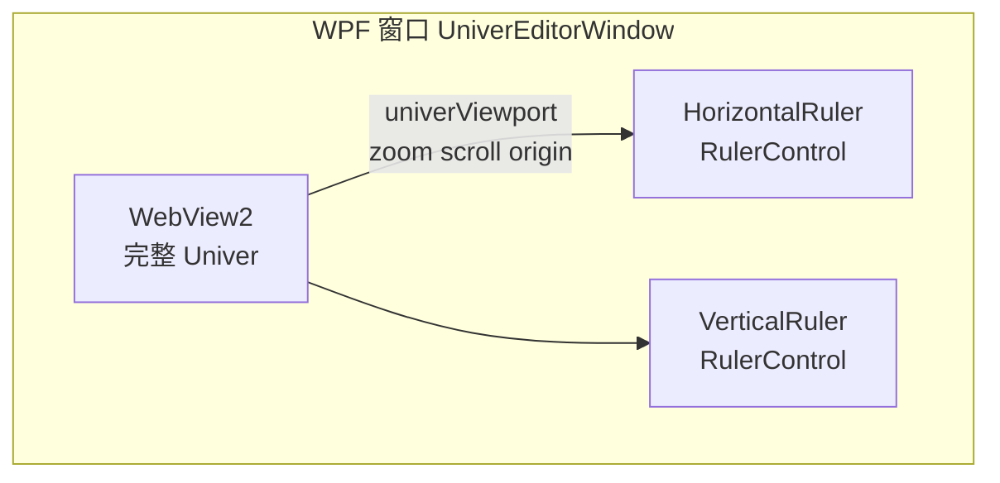

# Univer 内 mm 标尺 vs WPF 外挂（+ Facade 白话）（new/05）

> 文档编号：new/05  
> 生成日期：2026-06-28  
> 一句话：**mm 标尺可以放进 Univer 里，且对齐网格时通常比 WPF 外挂更简单、更准**；前面计划里说的「复杂」，主要指 **WPF↔WebView2 跨边界同步**，不是 Univer 不能做标尺。  
> 上游：[new/01 Facade 规格](./01-Univer-UI与Domain对齐规格-2026-06-26-183000.md)、[new/04 布局 Tab 进度](./04-Univer布局Tab落地进度与后续工作-2026-06-27-020000.md)  
> 现状代码：[`viewport-report.ts`](../../../src/HyCADTool.UniverEditor/Web/src/viewport-report.ts)、[`RulerControl.cs`](../../../src/HyCADTool.UniverEditor/Views/Controls/RulerControl.cs)、[`UniverEditorWindow.xaml`](../../../src/HyCADTool.UniverEditor/Views/UniverEditorWindow.xaml)  
> 性质：**决策说明 / 白话科普**；不写代码、不否定已落地的 WPF 外挂 PoC。

---

## 0. 先答三句话

| 问题 | 结论 |
|---|---|
| 标尺能直接放在 Univer 里吗？ | **能**。对齐网格时，通常**比 WPF 外挂更简单、更准**。 |
| 怎么做？ | 三条路（§3）；工程表格 mm 标尺**推荐 SheetExtension 画在行列头**。 |
| 前面为什么说复杂？ | 复杂的是 **WPF↔WebView2 两套坐标系 + 跨进程消息同步**；不是「Univer 里不能画标尺」。 |

---

## 1. 背景：hymd 标尺 vs 现在的 Univer 编辑器

**hymd**（Markdown 预览面板）的标尺和 WebView 预览区在**同一个 WPF 控件树**里：纸宽、缩放、滚动都由自家代码控制，标尺 `PixelsPerMm` 改一下就能对齐。

**Univer 编辑器**不同：中央是 **WebView2 里完整的第三方电子表格**（Ribbon、公式栏、行列头、Canvas、Footer 缩放条全都有）。我们当时决策是：

- **ribbon-only**：纸张/行列设置留在网页「布局」Tab，不在 WPF 再加一条设置栏；
- **keep chrome**：保留 Univer 完整界面，不隐藏 Ribbon/行列头；
- **live 标尺**：标尺尽量随缩放/滚动对齐（best-effort）。

在这三条约束下，**最快能看到的 mm 刻度**是：WPF 在 WebView **外面**挂 `RulerControl`，用 JS 探针把 zoom/scroll/原点报给 C#。这是 PoC 合理选择，但不是对齐质量的终局方案。

---

## 2. 当前已实现方案（WPF 外挂）



| 环节 | 文件 | 做什么 |
|---|---|---|
| WPF 标尺壳 | `UniverEditorWindow.xaml` | Row2 改成角块 + 横/竖标尺 + WebView |
| WPF 绘制 | `RulerControl.cs` | `PixelsPerMm`、`OriginOffsetPx`，4mm 小格 / 20mm 大格 |
| JS 探针 | `viewport-report.ts` | 节流读 zoom/scroll/canvas 位置，`postHostMessage` |
| C# 桥 | `UniverSessionLifecycle.cs` | `univerViewport` → `ViewportMetricsReported` |
| 窗口更新 | `UniverEditorWindow.xaml.cs` | `PixelsPerMm = 96/25.4 × zoom`，`OriginOffsetPx = origin − scroll` |

**已知限制（计划里已写）：**

- scroll/zoom 没有稳定公开 API，探针是 **best-effort**（scroll 取不到则标尺固定原点）；
- Univer 自带 Ribbon + 行列头，网格原点不在 WebView 左上角，横/竖标尺与网格之间会有**视觉空隙**；
- 每 ~80ms 跨 WebView2 边界传一次数，维护成本高。

---

## 3. Univer 内做 mm 标尺的三条路

| 方案 | 做法 | 对齐质量 | 工程量 | 适用 |
|---|---|---|---|---|
| **A. SheetExtension（Canvas 扩展）** | `registerSheetRowHeaderExtension` / `registerSheetColumnHeaderExtension`；继承 `SheetExtension`，在 `draw()` 里按 `spreadsheetSkeleton` 画 mm 刻度 | **最好** — 与 Univer 同一 scroll/zoom 坐标系 | 中偏高（要学渲染扩展、zIndex>10） | **推荐** 工程表格 mm 标尺 |
| **B. DOM 注入（网页 overlay）** | 类似 `layout-tab-inject.ts`，在 `#app` 内 canvas 容器旁插 `position:absolute` 的 div 标尺 | 较好 — 同一 WebView，仍要读 scroll/zoom | 中（比 WPF 简单，比 Extension 脆） | 快速 PoC / 不想碰 Canvas |
| **C. WPF 外挂（现状）** | WebView 外 WPF `RulerControl` + `univerViewport` 桥 | 一般 — 两套坐标系 | 已实现；维护成本高 | ribbon-only + keep 完整 chrome |

**不推荐**：`FWorksheet.addFloatDomToPosition` — 那是工作表上的**浮动块**（如图钉、文本框），不是贴边的全局 mm 标尺。

**官方依据：**

- [Custom Canvas Rendering](https://docs.univer.ai/guides/recipes/tutorials/custom-canvas) — 行列头 / 主区 Canvas 扩展（`registerSheetRowHeaderExtension` 等）
- [Custom Components](https://docs.univer.ai/guides/sheets/ui/components) — `registerComponent` 用于 Ribbon / 侧栏 / 对话框，**不是**标尺主路径

---

## 4. 推荐路径 A 的实现草图（说明用，非代码）

Univer 0.25 的 Canvas 扩展思路：

```text
univerAPI.registerSheetColumnHeaderExtension(unitId, new MmColumnRulerExtension())
univerAPI.registerSheetRowHeaderExtension(unitId, new MmRowRulerExtension())

class MmColumnRulerExtension extends SheetExtension {
  draw(ctx, parentScale, spreadsheetSkeleton) {
    ppm = DISPLAY_PX_PER_MM * parentScale.scaleX   // 与 mm-display.ts 同源
    沿 skeleton 可见列边界画 4mm 小格、20mm 大格与数字
  }
}
```

**好处：**

- 标尺与网格**同一套** scroll / zoom / 重绘生命周期 — 不需要 `univerViewport` 桥；
- 不需要 WPF `RulerControl`，WebView 可占满中央区；
- 仍只读 Domain 的 mm 真相，[`mm-display.ts`](../../../src/HyCADTool.UniverEditor/Web/src/mm-display.ts) 继续负责 mm↔px 换算。

**代价：**

- 要读 Univer 渲染扩展文档（`SheetExtension`、`SpreadsheetSkeleton`、`UniverRenderingContext` ≈ Canvas 2D）；
- 行列头 zIndex 须 >10，主区扩展须 >50，避免被默认层盖住。

---

## 5. 为何 WPF 外挂「听起来复杂」（根因清单）

1. **两套渲染栈**  
   WPF `OnRender`（GDI+）画刻度 vs Univer Canvas 画网格 — 必须用数值强行对齐。

2. **坐标系分裂**  
   标尺在 WebView **外**；网格在 WebView **内** — 中间隔 WebView2 宿主边框与 DPI 缩放。

3. **Univer 自带 chrome**  
   「keep 完整界面」→ Ribbon、公式栏、行列头占空间；网格 mm=0 不在 WebView 左上角，WPF 标尺无法「自然」贴齐。

4. **无稳定公开 scroll/zoom API**  
   [`viewport-report.ts`](../../../src/HyCADTool.UniverEditor/Web/src/viewport-report.ts) 只能：  
   - 试 Facade `getZoomRatio`（0.25 未稳定暴露）；  
   - 解析 Footer 里 `100%` 文字；  
   - DOM 向上找 `overflow: scroll` 的父节点。  
   任一环节升级 Univer 都可能失效。

5. **跨边界消息**  
   `postHostMessage({ type: 'univerViewport', ... })` → C# 事件 → 更新 `PixelsPerMm` / `OriginOffsetPx` — 有延迟，且探针脆弱。

6. **与 hymd 对比**  
   hymd 标尺和预览 WebView 是**同一作者、同一布局模型**；Univer 是完整电子表格产品，内部坐标更复杂，外挂更难「像素级」对齐。

**小结：** 复杂的是 **跨 WPF/WebView2 边界做 live sync**；把标尺画进 Univer 自己的 Canvas/DOM，反而绕开了这层。

---

## 6. Facade API 白话

### 6.1 它是什么

**Facade API（外观应用程序接口 / Facade Application Programming Interface）** = Univer 给集成方用的「简化遥控器」。

- 你 mostly 只碰 **`univerAPI`（FUniver）** 这一层；
- 背后真实的插件、命令总线、依赖注入（Dependency Injection）被藏起来；
- 类比：Domain 的 `GridEditor` 是表格真相的操作入口，Facade 是 Univer 视图的操作入口。

创建方式（本项目 [`main.ts`](../../../src/HyCADTool.UniverEditor/Web/src/main.ts)）：

```typescript
const univer = new Univer({ ... });
const univerAPI = FUniver.newAPI(univer);
window.univerAPI = univerAPI;
```

### 6.2 调用链（与 new/01 一致）

```text
univerAPI (FUniver)                    ← 入口
  ├── getActiveWorkbook() → FWorkbook
  │     └── getActiveSheet() → FWorksheet
  │           ├── getRange('A1') / getSelection() → FRange
  │           ├── setRowHeight / setColumnWidth / merge
  │           └── autoResizeRows / autoResizeColumns（布局 Tab 已用）
  ├── Event.SelectionChanged / SheetValueChanged
  ├── registerComponent              ← Ribbon / 侧栏 / 对话框 UI
  └── registerSheet*Extension         ← Canvas 行列头 / 主区扩展（标尺应走这里）
```

### 6.3 HyCAD 里 Facade 干什么、不干什么

| 用途 | 走 Facade？ | 真相在哪 |
|---|---|---|
| 填单元格、选区变化 | 是（Event + FRange） | C# OpLog / `SetValueOp` |
| 行高列宽 mm 显示 | 是（`setRowHeightsForced` 等） | Domain `GridTrack.Size` |
| 合并、插删行列 | 是（布局 Tab → C# 命令） | Domain 结构 Op |
| 纸型、行列数、铺满纸面 | **否**（布局 Tab → C# VM） | `TableEditorViewModel.RegenerateToPaper` |
| mm 标尺刻度 | **否**（纯视图；Extension 或 DOM） | 只读 mm，**不写回** Domain |
| Role / FieldKey | 侧栏 / Inspector（后期） | Domain `GridStructure` |

**红线（延续 new/01）：** 禁止从 Univer export 反推样式进 Domain；标尺同理 — 只是帮助眼睛读 mm，不是新字段。

### 6.4 和 `viewport-report.ts` 的关系

`viewport-report.ts` **试图**用 Facade 读 zoom，但 0.25 没有稳定的 `getZoomRatio` 公开契约，所以退化为 DOM 探针。  
若改走 **SheetExtension**，标尺在 `draw(ctx, parentScale, skeleton)` 里直接拿 `parentScale`，**不再依赖**这层猜测。

---

## 7. 决策记录：为何当时选 WPF live，而非 Univer 内标尺

| 当时你的选择 | 对标尺方案的影响 |
|---|---|
| ribbon-only | 不在 WPF 加设置条；标尺若放 WPF，只能做「壳」不能管纸型 |
| keep Univer 完整 chrome | 网格原点偏移大，WPF 外挂对齐更难 — 但仍可快速出刻度 |
| live 标尺 | 需要持续 sync；WPF 桥是可行但脆的方案 |
| regen-only 铺满 | 与标尺无关；Domain 仍管 mm 真相 |

计划里「web 自绘标尺工期最长」指的是 **SheetExtension 要学 Univer 渲染管线**，不是「网页里做任何标尺都比 WPF 难」。  
实际上：**DOM 注入（B）通常比 WPF 桥（C）简单**；**SheetExtension（A）对齐最好、学习成本最高**。

---

## 8. 与 new/04 及当前进度的关系

- **new/04** 盘点的是布局 Tab + 口径 B；当时标尺还是 ❌ / 后续工作。
- **hymd 式标尺**曾落地为 WPF 外挂（C）；**2026-06-28 已改为 WebView 内 B（标尺）+ A（纸框）**，WPF 桥已删。
- **本文（new/05）不否定现有实现** — 说明它是约束下的合理 PoC，并给出 **Univer 内标尺（A/B）** 供下一版决策。

若将来要「像 hymd 一样准」：

1. 优先评估 **A：SheetExtension** 替换 WPF `RulerControl`；  
2. 删掉或保留 `viewport-report.ts` / `univerViewport` 桥（仅 WPF 标尺需要）；  
3. Domain / 布局 Tab / `mm-display.ts` **不变** — 标尺只换视图层。

---

## 9. 速查：三种方案怎么选

| 你的目标 | 建议 |
|---|---|
| 最快验证「有 mm 刻度」、少动 Univer 内部 | 维持现状 **C**，或试 **B** DOM overlay |
| 刻度与网格 scroll/zoom **像素级对齐** | **A** SheetExtension |
| 不想维护 WPF↔JS 桥 | 弃 **C**，改 **A** 或 **B** |
| 标尺要显示纸宽边界（A3 420mm 框） | **A** 可在主区 Extension 画纸框；**C** 很难 |

---

## 10. 参考链接

| 主题 | URL |
|---|---|
| Univer Custom Canvas / SheetExtension | https://docs.univer.ai/guides/recipes/tutorials/custom-canvas |
| Univer Custom Components（Ribbon/侧栏） | https://docs.univer.ai/guides/sheets/ui/components |
| Univer UI Overview | https://docs.univer.ai/guides/sheets/ui/overview |
| HyCAD new/01 Facade 与 Domain 对齐表 | [./01-Univer-UI与Domain对齐规格-2026-06-26-183000.md](./01-Univer-UI与Domain对齐规格-2026-06-26-183000.md) |

---

## 11. 已实施（2026-06-28 Word 化布局）

| 能力 | 方案 | 源码 |
|---|---|---|
| mm 标尺（可关） | **05/B** DOM canvas 叠加，hymd 4mm/20mm | `ruler-overlay.ts`、`univer-viewport.ts` |
| 纸张白底灰边（可关） | **05/A** `registerSheetMainExtension` | `paper-extension.ts` |
| 行列头 U5/U6（可关） | `SetRowHeaderWidthCommand` / `SetColumnHeaderHeightCommand` | `sheet-headers.ts` |
| 三开关 | U3 → **视图** 组 | `layout-tab-inject.ts` + `layout-view-state.ts` |
| WPF 外挂标尺 | **已退役** | 删 `UniverEditorWindow` 内 `RulerControl`、`univerViewport` 桥 |

Domain / `mm-display.ts` / `RegenerateToPaper` **未改** — 标尺与纸框只读 mm 真相。

---

**版本**：1.1 | **更新**：2026-06-28 | **范围**：标尺方案说明 + Facade 白话 + §11 实施记录
