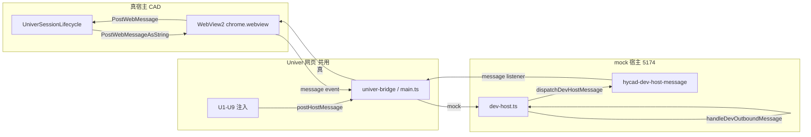

# Univer "mock 宿主" 白话 + 机制详解（new/07）

> 文档编号：new/07  
> 生成日期：2026-06-28  
> **一句话**：5174 浏览器 dev 页左下角 **「5174 · mock 宿主」** 表示当前没有 AutoCAD WebView2，[`dev-host.ts`](../../../src/HyCADTool.UniverEditor/Web/src/dev-host.ts) 在页面内**假扮** C# 宿主，让同一套 Univer UI 能在不开 CAD 的情况下自测。  
> 上游：[new/06 UI 沟通地图](./06-Univer编辑器UI区域沟通地图-2026-06-28-143000.md)（D1 面板）· [new/04 布局 Tab 进度](./04-Univer布局Tab落地进度与后续工作-2026-06-27-020000.md) · [README-dev](../../../src/HyCADTool.UniverEditor/Web/README-dev.md)  
> 性质：**白话科普 + 机制说明**；不写实现 PR。

---

## 0. 三句话先答

| 问题 | 结论 |
|---|---|
| **「宿主」是什么？** | 包裹 Univer 网页、与 JS 双向发 JSON 消息的那一层。生产环境是 **AutoCAD 里的 C# WebView2**；5174 开发页则是 **浏览器里的 mock 脚本**。 |
| **「mock 宿主」是什么？** | 没有真 `window.chrome.webview` 时，[`dev-host.ts`](../../../src/HyCADTool.UniverEditor/Web/src/dev-host.ts) 自己造一个假的 `webview` 对象，把本该发给 C# 的消息**留在本页处理**，并模拟 C# 回填布局初值。 |
| **为什么需要它？** | 改 Ribbon / Tab / CSS 时用 **Vite HMR（热模块替换）** 秒级刷新，不必每次 `C2 → N38` 开 AutoCAD；UI 定稿后再 `npm run build` 进 CAD 验收桥接。 |

**白话类比**：Univer 网页是「厨房」；C# 宿主是「总店经理」——管进货（Domain）、落图（CAD）、窗口。5174 mock 宿主是「厨房自测用的假经理」——能试菜单、摆盘、换主题，但**不能真的把菜送到图纸上**。

---

## 1. 「宿主」在本架构指什么

HyCAD 表格编辑器把 **Univer 完整电子表格**嵌在 **WebView2** 里。网页只负责视图与交互；**纸张尺寸、行列结构、落图、拾取、导入导出**等需要 AutoCAD / Domain 的事，由**宿主**通过消息桥完成。

```text
┌─────────────────────────────────────────────────────────┐
│  宿主（Host）                                            │
│  · 生产：C# UniverSessionLifecycle + TableEditorViewModel │
│  · 开发：dev-host.ts（mock）                             │
│         │ postMessage / addEventListener('message')      │
│         ▼                                                │
│  ┌───────────────────────────────────────────────────┐  │
│  │  Univer 网页（同一套 dist / 5174 源码）            │  │
│  │  main.ts → Ribbon 注入 → univer-bridge → 网格 U7   │  │
│  └───────────────────────────────────────────────────┘  │
└─────────────────────────────────────────────────────────┘
```

**关键点**：U1–U9 注入代码**不区分** mock 还是真宿主——一律调用 `postHostMessage({ type, ... })`。区别只在 `installDevHostIfNeeded()` 把这条消息**发给谁**。

---

## 2. 两种宿主对照（同一网页、换壳）

| | **mock 宿主（5174）** | **真宿主（CAD N38 WebView2）** |
|---|---|---|
| 运行环境 | 浏览器 `http://127.0.0.1:5174` | AutoCAD 内 WPF `UniverEditorWindow` |
| 检测条件 | 无 `window.chrome.webview.postMessage` | WebView2 注入原生 `chrome.webview` |
| 实现文件 | [`dev-host.ts`](../../../src/HyCADTool.UniverEditor/Web/src/dev-host.ts) | [`UniverSessionLifecycle.cs`](../../../src/HyCADTool.UniverEditor/Services/UniverSessionLifecycle.cs) |
| 出站（web→host） | `handleDevOutboundMessage` 本页消化 | `CoreWebView2.WebMessageReceived` → C# 回调 |
| 入站（host→web） | `dispatchDevHostMessage` → 自定义事件 | `PostWebMessageAsString` → `addEventListener('message')` |
| 左下角 D1 面板 | **有**（`dev-panel.ts`） | **无** |
| Domain / DWG | **无** | **有**（`TableEditorViewModel`、落图命令） |
| 状态栏文案 | D1：`浏览器 dev — WebView2 未连接` | WPF W5 状态 |

**同一协议**：消息体都是 JSON，`type` 字段区分语义（`ready`、`loadSnapshot`、`hyCadLayout` 等）。mock 与真宿主**共用**网页侧 `handleHostCommand` / 布局 Tab 回填逻辑；只是 mock 里很多 `type` 被截断为「提示 + Console」，不触发 C#。

---

## 3. mock 宿主怎么「假扮」出来

入口在 [`main.ts`](../../../src/HyCADTool.UniverEditor/Web/src/main.ts) 启动时：

```text
postHostMessage = installDevHostIfNeeded({ univerAPI, handleHostCommand })
```

[`installDevHostIfNeeded`](../../../src/HyCADTool.UniverEditor/Web/src/dev-host.ts) 分支逻辑：

```text
if (存在真 window.chrome.webview && 未设置 __hycadDevForceMock)
  → 返回真 postMessage（JSON.stringify 后发给 C#）
else
  → devMode = true
  → 安装 D1 面板（installDevPanel）
  → 构造 mockWebView 挂到 window.chrome.webview
  → 返回 devPostMessage
```

### 3.1 mockWebView 两个方法

| 方法 | 作用 |
|---|---|
| `postMessage(raw: string)` | 网页**出站**。解析 JSON → `handleDevOutboundMessage`（不再出浏览器）。 |
| `addEventListener('message', listener)` | 网页**入站**。监听自定义事件 `hycad-dev-host-message`，把 `detail` 当 `MessageEvent.data` 交给 `main.ts` 里已有的 `handleLayoutHostCommand` / `handleHostCommand`。 |

### 3.2 两条内部通路

**通路 A — web 认为自己在通知宿主（出站）**

```text
用户点 UI / 改选区
  → postHostMessage({ type: 'hyCadLayout', op, value })
  → devPostMessage
  → handleDevOutboundMessage
      · ready / selectionChanged → 更新 D1 选区/状态
      · hyCadFileAction / hyCadLayout → 能本地做的走 handleHostCommand / Univer API
      · CAD-only → showDevAction('…仅 CAD 宿主可用')
      · exportSnapshot → Console 打印 JSON
```

**通路 B — 模拟 C# 回填网页（入站）**

```text
dispatchDevHostMessage(JSON.stringify({ type: 'setViewport', payload: {...} }))
  → window.dispatchEvent('hycad-dev-host-message')
  → mockWebView 的 listener
  → main.ts: handleLayoutHostCommand
  → updateLayoutTabViewport / updateLayoutTabScale / updateLayoutTabStructureMode
```

`loadSnapshot` 等命令走 `handleHostCommand` → `window.hyCadBridge.loadSnapshot`，与真宿主路径一致。

### 3.3 启动时序

```text
bootstrap()
  → installDevHostIfNeeded → mock 装好 → D1 显示「dev 宿主已启用」
  → postHostMessage({ type: 'ready' })
  → handleDevOutboundMessage(ready)
      · D1 状态：「浏览器 dev — WebView2 未连接」（故意，不是报错）
      · pushMockViewportOnReady：400ms 后发 setViewport + setScale(40)
  → 用户点「布局」Tab → U3 纸型/Scale 框已有初值
```

---

## 4. 双向消息流（真宿主 vs mock）



**设计原则**：协议相同，只换 **transport（传输）** 和 **executor（执行者）**。这样 5174 上验过的 UI 行为，build 进 `dist` 后进 CAD，**不必改注入代码**。

---

## 5. mock 能做 / 不能做

根因一句话：**mock 没有 AutoCAD、没有 `TableEditorViewModel`、没有 DWG**，因此凡是要写回 Domain 或调 CAD API 的操作都只能提示。

### 5.1 能力对照表

| 能力 | mock 5174 | 真宿主 CAD | 说明 |
|---|---|---|---|
| 新建空表 | ✅ demo workbook | ✅ Domain 新建 | mock 走 `resetToDemoWorkbook` |
| 加载人员样表 | ✅ fixture JSON | ✅ `LoadPersonnelSample` | mock `fetch /fixtures/personnel-snapshot.json` |
| 编辑单元格 / 框选 | ✅ | ✅ | mock 发 `cellChanged`/`selectionChanged`，CAD 才写 OpLog |
| 主题▾ 换肤 | ✅ 纯前端 | ✅ 同左 | 不经过宿主 |
| Scale 数字框回填 | ✅ 仅 UI | ✅ 写 VM.Scale | mock 发 `setScale` 事件回填 U3 |
| 布局视口回填 | ✅ mock 初值 | ✅ `PushViewportAsync` | 纸型/行列/边距**显示**；改值 mock 不生效 |
| 自动调整行高/列宽 | ✅ Univer API | ✅ + `hyCadTrackSizes` 写 Domain | mock 只本地 autoFit，D1 提示不写回 |
| 导出快照 | ✅ Console | ✅ 文件/落图管线 | mock 无保存对话框 |
| 插删行列 / 合并 / 改 mm 尺寸 | ❌ | ✅ | `CAD_ONLY_LAYOUT_OPS` |
| 列宽适配纸宽 / 改纸型 | ❌ | ✅ | 同上 |
| 导入/导出 xlsx、JSON 文件 | ❌ | ✅ | `CAD_ONLY_FILE_ACTIONS` |
| 拾取 HyTable / 落图 | ❌ | ✅ | 需要图面 |
| — □ ✕ 窗口控制 | ❌ 仅提示 | ✅ WPF 窗口 | `hyCadWindowControl` |

### 5.2 CAD-only 清单（源码常量）

[`dev-host.ts`](../../../src/HyCADTool.UniverEditor/Web/src/dev-host.ts) 中硬编码「仅 CAD 宿主可用」的操作：

**文件动作 `CAD_ONLY_FILE_ACTIONS`**

- `importXlsx`、`exportXlsx`、`exportJson`
- `pick`、`publish`、`publishRangeFull`、`publishRangeContent`

**布局操作 `CAD_ONLY_LAYOUT_OPS`**

- `setRowHeight`、`setColWidth`
- `insertRow`、`deleteRow`、`insertCol`、`deleteCol`
- `merge`、`unmerge`
- `setPaperPreset`、`setOrientation`、`setTargetWidth`、`setMargin`
- `setRowCount`、`setColCount`、`fitColumnsToPaper`

**mock 里本地可做的布局相关**

- `newTable` / `loadTemplate(0|1)` → demo 或人员 fixture
- `setScale` → 仅回填 U3 框（D1：`Scale = N（仅回填布局框，落图需 CAD）`）
- `setStructureMode` → 切换 U3 结构模式开关

### 5.3 D1 状态栏典型文案

| 文案 | 含义 |
|---|---|
| `dev 宿主已启用` | mock 安装完成 |
| `浏览器 dev — WebView2 未连接` | **5174 正常态**，不是故障 |
| `快照已加载` | fixture / loadSnapshot 成功 |
| `快照导出 N cells → Console` | 导出成功，F12 查看 |
| `setPaperPreset 仅 CAD 宿主可用` | 点了 CAD-only 布局 op |
| `publish 仅 CAD 宿主可用` | 点了落图/拾取 |
| `Scale = 40（仅回填布局框，落图需 CAD）` | mock 下改 Scale |

D1 面板 UI 细节见 [new/06 §3.6–§3.7](./06-Univer编辑器UI区域沟通地图-2026-06-28-143000.md)。

---

## 6. 自动回填与 D1 四按钮

### 6.1 `pushMockViewportOnReady`

页面 `ready` 后约 **400ms**，mock 宿主自动发送（与 D1「回填布局初值」按钮**同 payload**）：

| 消息 | 典型 payload | 影响 UI |
|---|---|---|
| `setViewport` | 纸型索引 1（A3）、横向、总宽 400mm、边距 10mm、5 行 4 列、结构模式开 | **U3** 各输入框 |
| `setScale` | `scale: 40` | **U3** Scale 框 |

**目的**：开发者第一次点「布局」Tab 时，不必手动填纸型/比例，即可目视验收 U3 九组控件是否回填正确。

### 6.2 D1 四按钮（快捷，不必去顶栏）

| 按钮 | 等价操作 | mock 效果 |
|---|---|---|
| 人员样表 | 文件▾ → 加载人员样表 | `loadSnapshot` → U7 灌表 |
| 新建空表 | 文件▾ → 新建空表 | 重置 `demo-workbook.ts` |
| 导出快照 | exportSnapshot | JSON → **Console** |
| 回填布局初值 | 模拟 C# `PushViewportAsync` | 手动再发一轮 setViewport |

---

## 7. 调试逃生口：`__hycadDevForceMock`

在**真 WebView2** 里也可强制走 mock（例如要在 CAD 窗口里看 D1 面板、或隔离 C# 侧 bug）：

```text
在页面加载前或 Console 执行：
  window.__hycadDevForceMock = true
  然后刷新
```

[`installDevHostIfNeeded`](../../../src/HyCADTool.UniverEditor/Web/src/dev-host.ts) 检测到该 flag 后，即使存在真 `chrome.webview`，也会安装 mock 宿主与 D1 面板。

---

## 8. 开发价值与日常循环

来自 [`README-dev.md`](../../../src/HyCADTool.UniverEditor/Web/README-dev.md) 的推荐流程：

```text
浏览器改 UI（5174 HMR）
  → D1 / 文件菜单 / 布局 Tab 自测（mock 宿主）
  → npm run build
  → dotnet build
  → C2 → N38 在 CAD 里验收真宿主桥接
```

| 阶段 | 用谁 | 验什么 |
|---|---|---|
| UI / CSS / Ribbon 布局 | **mock 宿主** | 目视、主题、U3 回填、选区、Console 快照 |
| Domain 写回 / 落图 / 拾取 | **真宿主** | N38、`TableEditorViewModel`、图面 |

**不必**在 5174 上复现 CAD 行为——mock 的设计目标就是**故意截断** CAD-only 路径，避免开发者误以为浏览器里落图成功。

---

## 9. 改 mock 行为找哪个文件

| 改什么 | 文件 |
|---|---|
| mock 分支、CAD-only 列表、出站消息处理 | [`dev-host.ts`](../../../src/HyCADTool.UniverEditor/Web/src/dev-host.ts) |
| D1 面板 DOM、四按钮、验收清单文案 | [`dev-panel.ts`](../../../src/HyCADTool.UniverEditor/Web/src/dev-panel.ts) |
| `loadSnapshot` / `exportSnapshot` 语义 | [`univer-bridge.ts`](../../../src/HyCADTool.UniverEditor/Web/src/univer-bridge.ts) |
| 布局 Tab 收到 setViewport 后如何回填 | [`layout-tab-inject.ts`](../../../src/HyCADTool.UniverEditor/Web/src/layout-tab-inject.ts) + [`main.ts`](../../../src/HyCADTool.UniverEditor/Web/src/main.ts) `handleLayoutHostCommand` |
| 真宿主 C# 侧对称逻辑 | [`UniverSessionLifecycle.cs`](../../../src/HyCADTool.UniverEditor/Services/UniverSessionLifecycle.cs) |
| Dev 面板 / mock 样式 | [`global.css`](../../../src/HyCADTool.UniverEditor/Web/src/global.css) `.hycad-dev-panel` |

---

## 10. 与姊妹文档的关系

| 文档 | 分工 |
|---|---|
| **[new/06](./06-Univer编辑器UI区域沟通地图-2026-06-28-143000.md)** | 5174 **屏幕分区** U1–U9、D1 展开截图读法；本文不重复区域地图 |
| **[new/05](./05-Univer内mm标尺与Facade白话-2026-06-28-120000.md)** | mm 标尺在 **CAD WPF 外挂**；5174 mock 无 W 层标尺 |
| **[new/04](./04-Univer布局Tab落地进度与后续工作-2026-06-27-020000.md)** | 布局 Tab 功能清单与 CAD 落地进度 |
| **[README-dev](../../../src/HyCADTool.UniverEditor/Web/README-dev.md)** | 启动命令、预检步骤、build 回 CAD |

---

## 11. 速查：沟通时怎么说

| 你想表达 | 推荐说法 |
|---|---|
| 左下角「5174 · mock 宿主」 | 「**mock 宿主** / **dev-host**」 |
| 为什么显示未连接 | 「**5174 正常态**，没有真 WebView2」 |
| 落图点了没反应 | 「**CAD-only**，要 N38 真宿主」 |
| 布局框没初值 | 「等 **pushMockViewportOnReady** 或 D1 **回填布局初值**」 |
| 和 CAD 里差在哪 | 「mock **不写 Domain**、**不落图**；UI 协议一样」 |

---

**版本**：1.0 | **更新**：2026-06-28 | **范围**：mock 宿主概念、机制、能力边界；不含 UI 区域地图（见 new/06）
