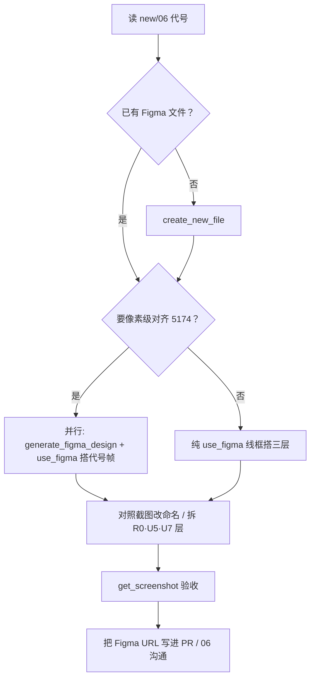

# 用 Figma MCP 构建 Word 式页面结构（new/08）

> 文档编号：new/08  
> 生成日期：2026-06-28  
> **一句话**：在 Figma 里按 [new/06](./06-Univer编辑器UI区域沟通地图-2026-06-28-143000.md) 的 **U1–U8 / R0 / D1** 代号搭出「像 Word 一样」的分层页面稿，供 UI 沟通与实现对齐；全程通过 **Cursor 内置 Figma MCP** 完成，不必手点 Figma。  
> 上游：[new/06 UI 沟通地图](./06-Univer编辑器UI区域沟通地图-2026-06-28-143000.md) · [new/05 标尺决策](./05-Univer内mm标尺与Facade白话-2026-06-28-120000.md) · [new/03 mm 口径](./03-Univer布局Tab与mm尺寸对齐-02修订版-2026-06-27-011500.md)  
> 性质：**设计协作流程 + MCP 操作手册**；不写实现 PR。

---

## 0. 三句话先答

| 问题 | 结论 |
|---|---|
| **「Word 式页面结构」指什么？** | 不是 Word 文档编辑器，而是 **Word 打印预览那种分层**：最外 mm **标尺 R0** → 中间 **行列头 U5/U6** → 最内 **白纸网格 U7**；外面再套 Univer **Ribbon U1–U4** 与 **Footer U8**。见 [new/06 §3.8](./06-Univer编辑器UI区域沟通地图-2026-06-28-143000.md)。 |
| **为什么要进 Figma？** | 5174 实机截图难标注层级；Figma 帧可 **命名对齐代号**、标 mm 尺寸、开/关三层视图，和 AI / 同事沟通时 `@Figma` 或贴 node 链接即可。 |
| **MCP 能做什么？** | 建文件、按脚本搭 Frame、从 **5174 dev 页** 像素级抓屏进 Figma、读回结构截图 —— 全在 Cursor 对话里完成。 |

---

## 1. 目标结构（与代码一一对应）

### 1.1 整页鸟瞰（Figma 顶帧名建议）

顶帧固定命名：**`HyCAD-Univer-5174 · Word式`**（或 `· A4纵` 等纸型后缀）。

```text
┌─ U1 Ribbon Tab ─────────────────────────────────────────────┐
├─ U2/U3 第二行（开始工具条 或 布局 Tab 面板）─────────────────┤
├─ U4 公式栏 ─────────────────────────────────────────────────┤
├─ R0h 横标尺 ────────────────────────────────────────────────┤
│ R0v │ U5 │ U6 列标 A B C …                                  │
│ 竖  │ 行 │ U7 白纸 + 纸外灰底 + 页边框                        │
│ 标尺│ 标 │                                                   │
├─────┴────┴───────────────────────────────────────────────────┤
├─ U8 Footer / SheetBar / 缩放 ────────────────────────────────┤
└─ D1 Dev 面板（仅 5174，左下浮层）────────────────────────────┘
```

### 1.2 Word 式三层（设计稿核心区）

| 层 | 代号 | Figma 子帧名 | 源码 | 默认 |
|---|---|---|---|---|
| 最外 | **R0** | `R0 · 横标尺` / `R0 · 竖标尺` / `R0 · 角块` | `ruler-overlay.ts` | 开 |
| 中间 | **U5/U6** | `U5 · 行表头` / `U6 · 列表头` | `sheet-headers.ts` | 开 |
| 最内 | **U7** | `U7 · 网格白纸` + `U7 · 纸外灰` | `paper-extension.ts` | 开 |

三层开关在 **U3 → 视图** 组；Figma 里用 **Component Variant** 或独立 Page「视图-关标尺」表达即可。

### 1.3 mm 尺寸锚点（A4 纵、边距 10mm）

与 Domain / `paper-metrics.ts` 一致，设计稿用 **mm 标注**，Figma 内按 **96 DPI** 换算 px：

| 量 | mm | px（≈ mm × 96/25.4） |
|---|---|---|
| A4 纸宽 | 210 | 794 |
| A4 纸高 | 297 | 1123 |
| 默认边距（每边） | 10 | 38 |
| 可编辑区宽 | 190 | 717 |
| 默认行高 | 10 | 38 |
| 默认列宽 | 25 | 94 |
| 标尺小格 | 4 | 15 |
| 标尺大格 | 20 | 76 |

**Figma 技巧**：在标尺帧旁放 **Annotation** 文本「210mm」，或建 **Local Variable** `spacing/mm` = 3.7795，网格用 4/20 的倍数排。

---

## 2. 前置条件

| 项 | 要求 |
|---|---|
| Cursor | 已安装 **Figma 插件**（对话里能 `@Figma` 或自动匹配 Figma MCP） |
| Figma 账号 | 已登录；目标文件有 **编辑权限** |
| 可选：5174 | `cd src/HyCADTool.UniverEditor/Web && npm run dev` → `http://127.0.0.1:5174` |
| 必读姊妹稿 | [new/06](./06-Univer编辑器UI区域沟通地图-2026-06-28-143000.md) 代号表 |

**MCP 工具一览**（Cursor Agent 可调）：

| 工具 | 用途 |
|---|---|
| `create_new_file` | 新建空白 Design 文件 |
| `use_figma` | 在文件内执行 Plugin API（建 Frame、Auto Layout、命名） |
| `generate_figma_design` | 把 **5174 网页** 像素级抓进 Figma（Web 专用） |
| `get_design_context` | 从 Figma 读节点结构 / 参考代码 |
| `get_screenshot` | 导出某帧截图，回对话核对 |
| `get_metadata` | 读文件页 / 节点树 |
| `search_design_system` / `get_libraries` | 搜团队组件库（本稿以 **线框 + 代号** 为主，可跳过） |
| `generate_diagram` | FigJam 里画流程图（可选，§6） |

---

## 3. 推荐工作流（两条路径）



### 路径 A — 从 5174 实机抓屏（推荐，最快对齐）

适合：**已有标尺 / 纸张边界 / 布局 Tab** 的 5174 页面，要「长什么样」一次到位。

1. 启动 5174，浏览器全屏，**U3 → 视图** 三开关全开。  
2. 在 Cursor 对话粘贴 **§4.1 提示词 A**。  
3. Agent 会 **并行**：  
   - `generate_figma_design` → 整页截图进 Figma；  
   - `use_figma` → 在同文件旁建 **`HyCAD-Univer-5174 · Word式`** 线框，按 §1 命名子帧。  
4. 对照截图，用 `use_figma` **拆层 / 改命名**（R0、U7 白纸与灰底分开）。  
5. `get_screenshot` 发回对话，确认与 [new/06 §3.8](./06-Univer编辑器UI区域沟通地图-2026-06-28-143000.md) 一致。

### 路径 B — 纯线框从零搭（无 5174 也能做）

适合：讨论 **IA / 层级 / mm 比例**，尚未跑 dev 服务器。

1. `create_new_file` → 记下返回的 `fileKey`。  
2. 分步 `use_figma`（**禁止一次巨型脚本**，见 §5 注意）。  
3. 按 §5 示例脚本顺序：顶帧 → R0 区 → U5/U6 → U7 白纸 → U1/U8 占位条。  
4. `get_screenshot` 验收。

---

## 4. Cursor 对话提示词（复制即用）

### 4.1 提示词 A — 5174 抓屏 + Word 式分层

```text
请用 Figma MCP 为 HyCAD Univer 编辑器做 Word 式页面结构稿。

参考文档：docs/product-discovery/table/new/06-Univer编辑器UI区域沟通地图-2026-06-28-143000.md
重点：§3.8 Word 式三层 R0 / U5·U6 / U7，以及整页 U1–U8、D1。

步骤：
1. 若没有 Figma 文件，先 create_new_file（Design 模式），文件名 HyCAD-Univer-Word式
2. 我本地 5174 已开：http://127.0.0.1:5174 — 请 generate_figma_design 抓整页到该 fileKey
3. 并行 use_figma：在抓屏旁新建 Frame「HyCAD-Univer-5174 · Word式」，Auto Layout 纵向，
   子帧按代号命名：U1-Ribbon、U4-公式栏、R0-标尺区、U5-行表头、U6-列表头、U7-网格白纸、U8-Footer、D1-Dev面板
4. R0/U7 区按 A4 纵 210×297mm（px 按 96/25.4）标出纸边界与 4mm/20mm 标尺刻度示意
5. get_screenshot 顶帧，返回 Figma 链接与 node-id

加载 skill：figma-use、figma-generate-design
```

### 4.2 提示词 B — 仅线框 + mm 标注

```text
请用 Figma MCP 从零搭建 HyCAD Word 式页面线框（不要抓屏）。

结构见 new/08 §1 与 new/06 §3.8：
- 顶帧 HyCAD-Univer-5174 · Word式 · A4纵
- 三层：R0 标尺（4mm/20mm）、U5/U6 行列头、U7 白纸 190×277mm 可编辑区（边距10）
- 外层占位：U1 Ribbon 高 40px、U4 公式栏 28px、U8 Footer 32px
- 每个子帧 name 必须带代号前缀（如「R0 · 横标尺」）

分多次 use_figma，每步 return node id。最后 get_screenshot。
fileKey: <粘贴你的 Figma URL 或 fileKey>
```

### 4.3 提示词 C — 视图开关三态（Variant）

```text
在 Figma 文件 <fileKey> 中，为「U3 · 视图」做 Component Set：
Variant: 标尺=开|关, 行列头=开|关, 纸张边界=开|关（默认全开）。
全开态对齐 new/06 §3.8；关标尺时 R0 帧 hidden。
用 use_figma 增量修改，不要重建整页。
```

---

## 5. `use_figma` 分步脚本要点

> **硬规则**（来自 Figma MCP skill）：每次调用只改一小步；必须 `return { createdNodeIds }`；颜色 0–1；改 Text 前先 `loadFontAsync`；多 Page 用并行多次 `use_figma`，单次最多 `setCurrentPageAsync` 一次。

### Step 1 — 顶帧 + Auto Layout

```javascript
const PAGE_NAME = "HyCAD · Word式";
let page = figma.root.children.find(p => p.name === PAGE_NAME);
if (!page) {
  page = figma.createPage();
  page.name = PAGE_NAME;
}
await figma.setCurrentPageAsync(page);

const root = figma.createFrame();
root.name = "HyCAD-Univer-5174 · Word式 · A4纵";
root.layoutMode = "VERTICAL";
root.primaryAxisSizingMode = "AUTO";
root.counterAxisSizingMode = "FIXED";
root.resize(900, 100);
root.itemSpacing = 0;
root.fills = [{ type: "SOLID", color: { r: 0.95, g: 0.95, b: 0.96 } }];
page.appendChild(root);

return { createdNodeIds: [root.id], pageId: page.id };
```

### Step 2 — R0 + U5/U6 + U7 网格区（横向 Auto Layout）

```javascript
// 假设上一步 root.id 已传入
const root = await figma.getNodeByIdAsync("ROOT_ID");
const MM = 96 / 25.4;
const rulerThick = Math.round(24);
const headerThick = Math.round(24);
const paperW = Math.round(210 * MM);
const paperH = Math.round(297 * MM);

const bodyRow = figma.createFrame();
bodyRow.name = "Body · R0+Headers+U7";
bodyRow.layoutMode = "HORIZONTAL";
bodyRow.primaryAxisSizingMode = "AUTO";
bodyRow.counterAxisSizingMode = "AUTO";
bodyRow.itemSpacing = 0;
bodyRow.fills = [];

function solid(name, w, h, rgb) {
  const f = figma.createFrame();
  f.name = name;
  f.resize(w, h);
  f.fills = [{ type: "SOLID", color: rgb }];
  return f;
}

const r0v = solid("R0 · 竖标尺", rulerThick, paperH + headerThick, { r: 0.88, g: 0.89, b: 0.91 });
const midCol = figma.createFrame();
midCol.name = "Mid · U5/U6/U7";
midCol.layoutMode = "VERTICAL";
midCol.itemSpacing = 0;
midCol.fills = [];

const r0h = solid("R0 · 横标尺", paperW, rulerThick, { r: 0.88, g: 0.89, b: 0.91 });
const u6 = solid("U6 · 列表头", paperW, headerThick, { r: 0.92, g: 0.93, b: 0.94 });
const u7wrap = figma.createFrame();
u7wrap.name = "U7 · 网格区";
u7wrap.layoutMode = "HORIZONTAL";
u7wrap.itemSpacing = 0;
const u5 = solid("U5 · 行表头", headerThick, paperH, { r: 0.92, g: 0.93, b: 0.94 });
const u7paper = solid("U7 · 网格白纸", paperW - headerThick, paperH, { r: 1, g: 1, b: 1 });
u7paper.strokes = [{ type: "SOLID", color: { r: 0.7, g: 0.72, b: 0.75 } }];
u7paper.strokeWeight = 1;
u7wrap.appendChild(u5);
u7wrap.appendChild(u7paper);
midCol.appendChild(r0h);
midCol.appendChild(u6);
midCol.appendChild(u7wrap);

bodyRow.appendChild(r0v);
bodyRow.appendChild(midCol);
root.appendChild(bodyRow);

return { createdNodeIds: [bodyRow.id, r0v.id, r0h.id, u5.id, u6.id, u7paper.id] };
```

### Step 3 — U1 / U4 / U8 占位条

各建高度固定的 `U1 · Ribbon`、`U4 · 公式栏`、`U8 · Footer`，`insertChild(0, …)` 插到 root 顶部/底部；D1 用 `position:absolute` 等价物 — 在 Figma 里 **单独 Frame** `D1 · Dev面板` 叠在左下角（不放进 Vertical Auto Layout）。

---

## 6. 可选：FigJam 沟通地图

若需给非开发同事讲 **mock 宿主 / 5174 vs CAD**，可对 Agent 说：

```text
用 generate_diagram 在 FigJam 画一张 flowchart：
5174 mock 宿主 → Univer 网页 → Word式三层 R0/U5/U6/U7；
旁路 CAD WebView2 真宿主。
参考 new/07 §1–§2。
```

---

## 7. 设计稿 ↔ 实现 对照表

| Figma 帧名 | 改 UI 时跟 AI 说 | 源码 |
|---|---|---|
| U1 · Ribbon | 「改 U1 文件 Tab」 | `file-tab-inject.ts` 等 |
| U3 · 布局 Ribbon | 「U3 视图三开关」 | `layout-tab-inject.ts` |
| R0 · 横/竖标尺 | 「R0 4mm 刻度」 | `ruler-overlay.ts` |
| U5/U6 · 行列头 | 「关 U5/U6」 | `sheet-headers.ts` |
| U7 · 网格白纸 | 「纸外灰 / A4 边界」 | `paper-extension.ts` |
| U8 · Footer | 「SheetBar 高度」 | `sheet-bar-guard.ts` + `global.css` |
| D1 · Dev 面板 | 「D1 mock 状态」 | `dev-panel.ts` |

**沟通约定**：Issue / 对话里贴 `figma.com/design/<fileKey>?node-id=xxx`，并写「请按 **R0 · 横标尺** 帧改 `ruler-overlay.ts`」。

---

## 8. 验收清单

| # | 检查项 | 通过标准 |
|---|---|---|
| 1 | 顶帧命名 | 含 `HyCAD-Univer` + `Word式` |
| 2 | 三层齐全 | R0、U5、U6、U7 各为独立可隐藏帧 |
| 3 | mm 比例 | U7 白纸宽高比 = 210:297（或当前纸型） |
| 4 | 代号一致 | 与 [new/06 §2](./06-Univer编辑器UI区域沟通地图-2026-06-28-143000.md) 表一致 |
| 5 | 5174 对照 | 路径 A 时抓屏与线框层对齐误差 < 视觉可接受 |
| 6 | 链接归档 | Figma URL 记入 PR 或回复 new/06 讨论串 |

---

## 9. 常见失败与处理

| 现象 | 原因 | 处理 |
|---|---|---|
| `use_figma` 报 font 未加载 | 改 Text 前未 `loadFontAsync` | 先 `listAvailableFontsAsync`，或只用 Frame 色块 |
| 节点全堆在 (0,0) | 未用 Auto Layout | 父帧 `layoutMode = VERTICAL/HORIZONTAL` 再 appendChild |
| 抓屏空白 | 5174 未启动 / CORS | 先浏览器能打开 5174 再 `generate_figma_design` |
| 标尺比例不对 | Figma 用 px 手填 | 统一 `MM = 96/25.4`，4mm→15px、20mm→76px |
| MCP 无响应 | Figma 插件未连 | Cursor Settings → MCP → Figma 已启用并登录 |

---

## 10. 与后续文档的关系

| 文档 | 关系 |
|---|---|
| [new/06](./06-Univer编辑器UI区域沟通地图-2026-06-28-143000.md) | **代号真相源**；08 的 Figma 命名必须跟 06 |
| [new/05](./05-Univer内mm标尺与Facade白话-2026-06-28-120000.md) | R0 实现方案 A/B；Figma 只表达视觉 |
| [new/07](./07-Univer-mock宿主白话详解-2026-06-28-153000.md) | D1 仅 5174；CAD 稿可隐藏 D1 帧 |
| README-dev | 5174 启动命令 |

---

**版本**：1.0 | **更新**：2026-06-28 | **主视角**：Figma MCP · Word 式 R0/U5/U6/U7 设计协作
