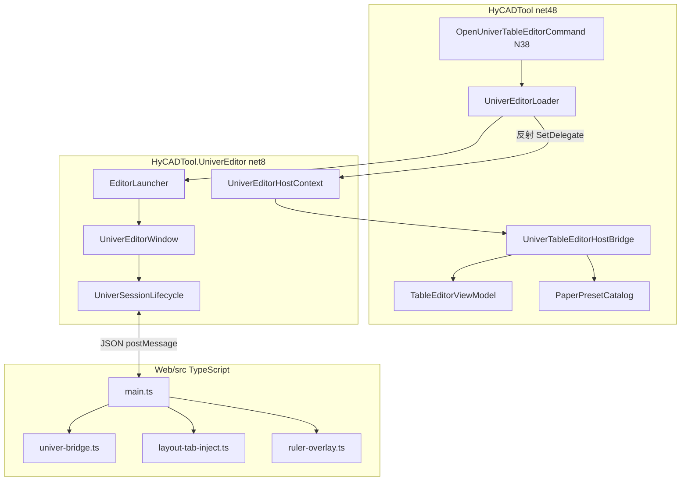
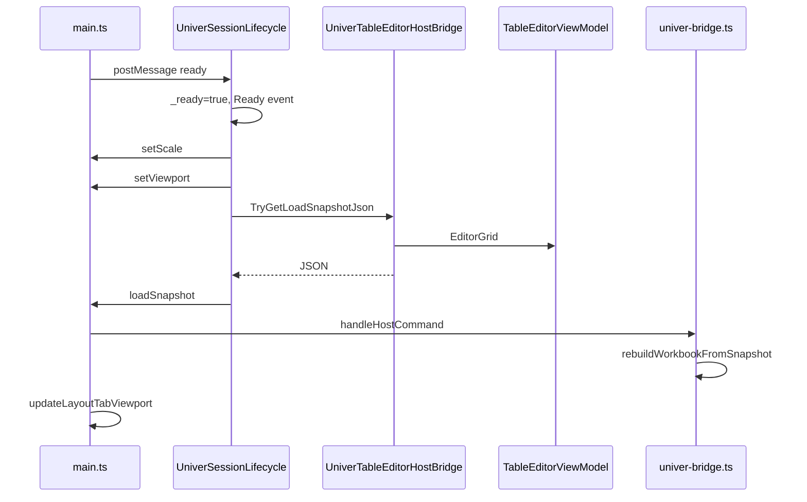
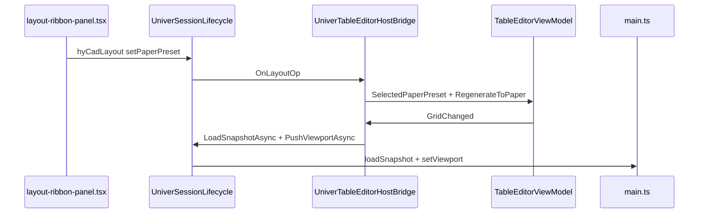
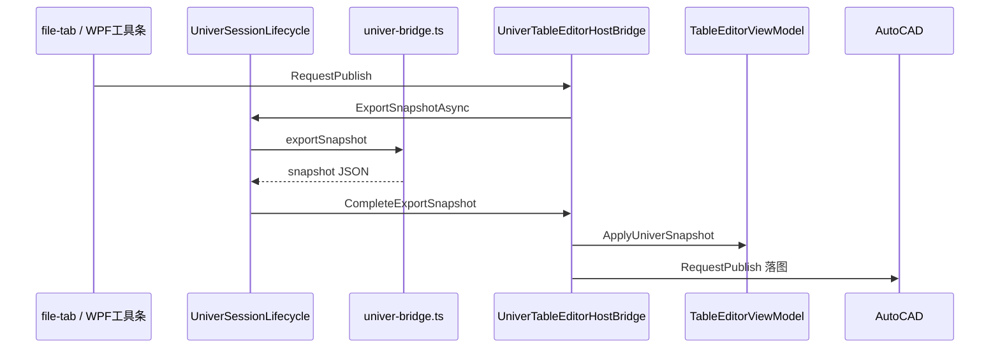
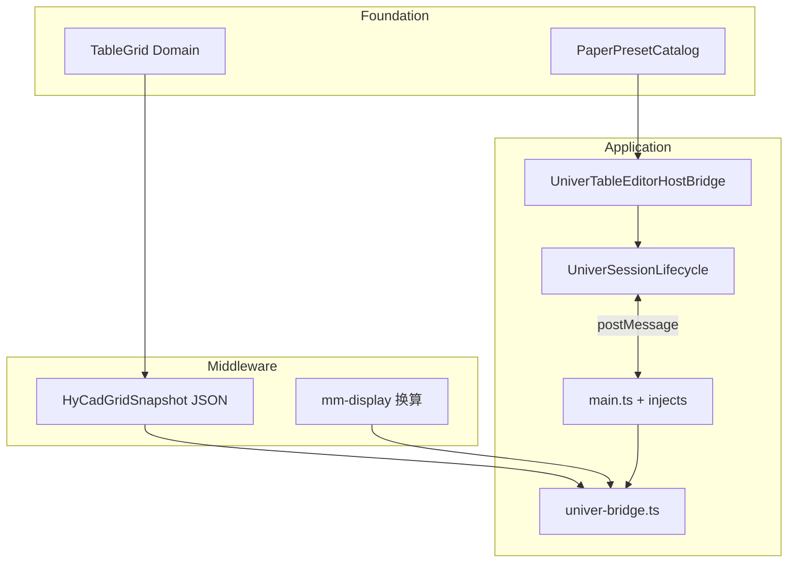

# Univer TS 与 C# WPF 代码第一性白话地图（new/09）

> **元信息**
> - 层级：Application（HyCAD Univer 混合编辑器：Domain + C# 宿主 + TypeScript 扩展）
> - 上游：[new/00 Domain 大白话](./00-Domain底层逻辑大白话-2026-06-26-180000.md) · [new/01 对齐规格](./01-Univer-UI与Domain对齐规格-2026-06-26-183000.md) · [new/03 mm 口径](./03-Univer布局Tab与mm尺寸对齐-02修订版-2026-06-27-011500.md)
> - 下游：[new/06 UI 沟通地图](./06-Univer编辑器UI区域沟通地图-2026-06-28-143000.md) · [new/07 mock 宿主](./07-Univer-mock宿主白话详解-2026-06-28-153000.md)
> - 同构：hymd WebView 宿主 · 传统 ReoGrid `TableEditorWindow` · Excel 式 WYSIWYG 编辑器三层（真相 / 视图 / 契约）
> - 编制日期：2026-06-28
> - **范围**：`src/HyCADTool.UniverEditor/Web/src` 全部 TS/TSX + net8 WPF 宿主 + net48 桥 + Domain 纸型；**屏幕上 UI 代号见 new/06，本文只讲代码文件**
> - **与 new/05 差异**：new/05 描述 WPF 外挂标尺 PoC；**当前代码**标尺已在 Web `ruler-overlay.ts` canvas 层绘制，`RulerControl.cs` 存在但未挂入 XAML

---

## 决策速览表

> 排版借用地基处理选型 Skill 的「决策速览」：改什么 → 打开哪 → 走哪条消息。

### 高频改动 → 文件 → 消息

| 你想改… | 主战场文件 | 常经消息 / 链路 | 5174 mock |
|---|---|---|---|
| Ribbon / Tab / CSS | `*-inject.ts`, `layout-ribbon-panel.tsx`, `global.css`, `ribbon-tab-style.ts` | 多数 `postHostMessage({ type })` | ✅ 本地可测 |
| 快照 load / export | `univer-bridge.ts` + `UniverTableEditorHostBridge.BuildLoadSnapshotJson` | `loadSnapshot` / `snapshot` | ✅ load/export；落图 ❌ |
| 纸型 / 边距 / 行列数 | `PaperPresetCatalog.cs` + `TableEditorViewModel` + `layout-view-state.ts` | `setViewport` ↓ · `hyCadLayout` ↑ | ⚠️ 改纸型提示 CAD |
| 行高列宽 mm | `mm-display.ts` + `univer-bridge.ts` + VM | `hyCadLayout` · `hyCadTrackSizes` | ⚠️ track 仅提示 |
| mm 标尺 | `ruler-overlay.ts` + `univer-viewport.ts` | 无 C# 消息（纯 Web 探针） | ✅ |
| Word 式页面白底 | `page-viewport.ts` + `layout-view-state.ts` | `isLayoutTabActive()` 门控 | ✅ |
| 落图 / 拾取 | `UniverTableEditorHostBridge` + `file-tab-inject.ts` | `exportSnapshotForPublish` → `snapshot` | ❌ |
| 5174 自测 | `dev-host.ts` + `dev-panel.ts` | mock 拦截出站 | 全文见 [new/07](./07-Univer-mock宿主白话详解-2026-06-28-153000.md) |
| WPF 窗口壳 | `UniverEditorWindow.xaml` | `hyCadWindowControl` | 浏览器仅提示 |

### 不推荐方案

| 方案 | 不推荐原因 |
|---|---|
| 在 WPF 挂 `RulerControl` 对齐网格 | 已退役；跨 WebView2 坐标同步复杂，见 [new/05](./05-Univer内mm标尺与Facade白话-2026-06-28-120000.md) §现状 |
| 在 WPF 重写 Ribbon | ribbon-only 决策；应改 TS + `npm run dev` HMR |
| 5174 测落图 / 改纸型写 Domain | mock 无 `TableEditorViewModel`；须 C2→N38 |
| 把 `Scale` 写进 grid 快照 | 口径 B：`Scale` 仅 UI/落图比例，不改行列 mm |

---

## 目录

1. [§0 三句话先答](#0-三句话先答)
2. [一、问题重述](#一问题重述)
3. [二、脉络](#二脉络)
4. [三、15 问第一性拆解](#三15-问第一性拆解)
5. [四、例子（三条读码走读）](#四例子三条读码走读)
6. [五、TypeScript 分层清单](#五typescript-分层清单)
7. [六、C# WPF 分层清单](#六c-wpf-分层清单)
8. [七、消息协议全集](#七消息协议全集)
9. [八、mm / 纸型 / 标尺数据流](#八mm--纸型--标尺数据流)
10. [九、改代码决策树](#九改代码决策树)
11. [十、知识图谱位置](#十知识图谱位置)
12. [十一、文档元数据](#十一文档元数据)

---

## §0 三句话先答

| 问题 | 结论 |
|---|---|
| **TS 和 C# 谁管什么？** | **C#（net48 桥 + Domain）= 结构计算书**：纸张算法、表格真相、CAD 落图。**TS（Web 扩展）= 晒蓝图 + 菜单**：Univer 完整 UI + HyCAD 注入 Tab/标尺。**JSON 消息 = 交接单**。 |
| **为什么 UI 在 TS 不在 WPF？** | **ribbon-only** 决策：Univer 自带 Ribbon/公式栏/网格；改 UI 用 Vite **HMR（热模块替换，Hot Module Replacement）** 秒级刷新，不必转写 WPF。WPF 只保留窗口壳 + 工具条快捷钮。见 [README-dev](../../../src/HyCADTool.UniverEditor/Web/README-dev.md)。 |
| **读码从哪进？** | **下行**（Domain→屏）：`UniverSessionLifecycle.PushInitialSnapshotAsync` → `main.ts` 收 `message` → `handleHostCommand` → `univer-bridge.loadSnapshot`。**上行**（屏→Domain）：布局 `sendLayoutOp` → `{ type:'hyCadLayout' }` → `OnLayoutOp` → `TableEditorViewModel`。 |

---

## 一、问题重述

**核心对象**：HyCAD **Univer 混合编辑器**——net48 主工程业务 + net8 **WPF（Windows Presentation Foundation，Windows 桌面 UI 框架）** 窗口壳 + **WebView2（Microsoft Edge 嵌入式浏览器控件）** + Vite 打包的 **TypeScript** 扩展层。

**痛点**：`Web/src` 下 **25 个** TS/TSX 文件 + **10+** C# 文件分散在三套程序集；[new/06](./06-Univer编辑器UI区域沟通地图-2026-06-28-143000.md) 的 U1–U8 代号与源码文件名对不上；Univer 官方文档不涵盖 HyCAD 注入与 Domain 契约。

**一句话答案**：按 **四层栈（Domain → 桥 → 宿主 → Web）+ 三类消息（快照 / 布局 / 动作）** 读码；不必从 Univer SDK 文档重头学。

---

## 二、脉络

### 2.1 架构演化（四个里程碑）

| 阶段 | 文档 | 代码后果 |
|---|---|---|
| 1 Domain 先行 | [new/00](./00-Domain底层逻辑大白话-2026-06-26-180000.md) | `TableGrid`、`PaperPresetCatalog` 为 mm 权威 |
| 2 Univer 嵌入 WebView2 | [new/001](./001-Univer路线-原需求最优落地总纲-2026-06-26-163000.md) | `HyCADTool.UniverEditor` net8 独立 DLL |
| 3 TS 注入 Ribbon / 布局 Tab | [new/04](./04-Univer布局Tab落地进度与后续工作-2026-06-27-020000.md) | `layout-tab-inject.ts`、`layout-ribbon-panel.tsx` |
| 4 mm 口径 B + 标尺迁入 Web | [new/03](./03-Univer布局Tab与mm尺寸对齐-02修订版-2026-06-27-011500.md) · [new/05](./05-Univer内mm标尺与Facade白话-2026-06-28-120000.md) | `mm-display.ts`、`ruler-overlay.ts`；WPF 标尺 PoC 退役 |

### 2.2 为何 net48 / net8 分裂

AutoCAD 插件主工程 **HyCADTool** 目标框架 **net48**，不能直接引用 **net8** 的 `HyCADTool.UniverEditor`。因此：

1. net8 DLL 单独编译，内含 WPF + WebView2。
2. net48 用 **`UniverEditorLoader` 反射**加载 DLL，通过 **`UniverEditorHostContext` 委托**注入 bridge 方法。
3. 消息 JSON 是两套 **TFM（Target Framework Moniker，目标框架标识）** 之间唯一稳定的「协议层」。



### 2.3 5174 dev 页 vs CAD WebView2（代码层分界）

| | 5174 浏览器 | CAD N38 WebView2 |
|---|---|---|
| 宿主实现 | `dev-host.ts` mock `chrome.webview` | `UniverSessionLifecycle.cs` |
| `postHostMessage` 去向 | `handleDevOutboundMessage` 本页消化 | `WebMessageReceived` → C# |
| Domain | **无** | `TableEditorViewModel` |
| 同一网页源码 | ✅ `main.ts` 等完全相同 | ✅ 加载 `Web/dist` |

详情：[new/07](./07-Univer-mock宿主白话详解-2026-06-28-153000.md)。

---

## 三、15 问第一性拆解

> 将第一性原理 15 问适配到本代码库。Q4 / Q8 / Q9 / Q11 及第四节例子后附「内核解释 + 结构工程类比」。

### 3.1 Q1 研究什么

**对象**：表格编辑器的 **视图 + 宿主边界**——人在 Univer 网格里看到什么、改什么；哪些变更必须回写 Domain；哪些只在 Web 层本地生效（主题、标尺开关）。

**不是对象**：Univer 内核公式引擎、AutoCAD 实体绘制细节（它们在各自模块）。

### 3.2 Q2 为何诞生

1. **AutoCAD 插件约束**：必须在 CAD 进程内编辑工程表并落图。
2. **Univer 开源表格**：完整 Excel 式 UI，避免自研网格。
3. **热重载约束**：C2 可重载 net48，但 Univer UI 改动的迭代成本必须在 **浏览器 HMR** 完成。
4. **net48/net8 分裂**：WebView2 现代栈 vs 插件主工程 TFM 不可兼。

入口命令：`OpenUniverTableEditorCommand` → `UniverEditorLoader.TryShow`。

### 3.3 Q3 基本变量

| 变量 | 存哪 | 含义 |
|---|---|---|
| `rowHeightsMm[]` / `colWidthsMm[]` | Domain → 快照 | 每行高 / 每列宽（mm） |
| `PaperPreset` / `TargetWidthMm` / `MarginMm` | `TableEditorViewModel` | 纸型与可编辑区 |
| `Scale` | VM（口径 B） | 落图/UI 比例，**不改 grid** |
| `GridRevision` | VM | 结构变更计数，触发回灌 |
| `showRulers` / `showHeaders` / `showPaperBoundary` | `layout-view-state.ts` | Word 式三层开关 |
| `lastSnapshotDims` | `univer-bridge.ts` | 布局 Tab 显示 mm 真值 |
| zoom / scroll / origin | `univer-viewport.ts` 探针 | 标尺与页面视图对齐 |

### 3.4 Q4 公理 / 假设

1. **Domain 为唯一真相**（计算书）；Univer 是视图（晒蓝图）。
2. **样式单向下行**：上行快照只报内容与结构，不报样式（防 drift）。见 [new/01](./01-Univer-UI与Domain对齐规格-2026-06-26-183000.md)。
3. **mm 口径 B**：行列 display px 与 mm 线性换算，常数 `DISPLAY_PX_PER_MM = 96/25.4`。

符号说明（口径 B 换算）：

$$
px_{\mathrm{display}} = mm \times \frac{96}{25.4}
$$

其中：
- $px_{\mathrm{display}}$ — Univer 行列显示像素（Display Pixel），无量纲
- $mm$ — 纸面毫米（Millimeter），单位：mm
- $96/25.4$ — CSS 参考 DPI（Dots Per Inch，每英寸点数）下每毫米像素数，约 3.7795 px/mm

**内核解释**（非专业语言）：表格的「真实尺寸」用毫米写在计算书里；屏幕上的格子高度是按固定比例把毫米换成像素画出来的，就像把 1:100 的图用 1:50 打印——数字变了，但比例尺规则不变。

**结构工程类比**：Domain 是 **结构计算书里的荷载与截面尺寸（mm）**；`mm-display.ts` 是 **制图比例尺**，把计算书数值换成蓝图上的毫米线长；Univer 网格是 **晒出来的蓝图**。贴切之处：改比例尺不会改计算书里的真实截面，只改图面上的表达——对应 `Scale` 不改 grid。

### 3.5 Q5 怎样抽象

核心契约：**`HyCadGridSnapshot`（JSON）**——行数、列数、mm 尺寸数组、单元格数组（含 merge、editable、R6 语义字段）。

- C# 侧：`UniverGridSnapshotMapper.ToJson(grid)` / `Parse(json)`
- TS 侧：`univer-bridge.ts` 的 `HyCadGridSnapshot` 接口 + `rebuildWorkbookFromSnapshot` / `exportRegion`

消息 `{ type: 'loadSnapshot', payload: {...} }` 与 `{ type: 'snapshot', payload: {...} }` 携带同一抽象。

### 3.6 Q6 哪些尺度

三层尺度并存：

| 尺度 | 单位 | 用途 |
|---|---|---|
| Domain / 纸面 | mm | 工程真值、标尺刻度、落图 |
| Univer display | px（由 mm 换算） | 行列高宽、单元格布局 |
| 屏幕 | px × zoom | 用户看到的缩放；`univer-viewport` 探针 |

`paper-metrics.ts` 在 **纸框 DOM** 层再算 `displayPxPerMm × zoom`。

### 3.7 Q7 数学本质

1. **线性换算**：mm ↔ display px（Q4 公式）。
2. **Viewport 仿射探针**：从 Univer canvas 读 `zoom`、`scrollX/Y`、网格原点屏幕坐标，供标尺 tick 与页面居中。

标尺小格 4 mm、大格 20 mm（`ruler-overlay.ts` 中 `MINOR_MM = 4`，每 5 小格一大格）。

### 3.8 Q8 核心简化

| 简化 | 实现 | 代价 |
|---|---|---|
| 反射桥接 net48↔net8 | `UniverEditorLoader.ConfigureHostContext` | 调试栈略绕；无编译期类型检查 |
| 委托槽 `UniverEditorHostContext` | 每个 C# 回调一个 `SetDelegate` | 新增回调要记得两端注册 |
| mock 宿主 | `dev-host.ts` 假 `chrome.webview` | 5174 上 Domain 相关 op 假成功 |
| coalesce loadSnapshot | `univer-bridge` 微任务合并 | 快速连续回灌只绘最后一次 |

**内核解释**：不让两个不同版本的 .NET 工程硬绑在一起，而是像插排一样：net8 插件插进 net48 插座，中间用「委托线」（JSON 消息）传电。

**结构工程类比**：`UniverEditorHostContext` 是 **预埋套管**：net48 侧把线（Delegate）穿进 net8 墙里，不用拆整面墙（改 TFM）。贴切：预埋套管是跨构件界面的标准做法，对应跨 TFM 的协议边界。

### 3.9 Q9 最大陷阱

| 陷阱 | 后果 | 规避 |
|---|---|---|
| 改 WPF `RulerControl` 期望对齐 | 双坐标系漂移 | 改 `ruler-overlay.ts` |
| 5174 改纸型以为写进 Domain | 仅 Console 提示 | C2→N38 验收 |
| 把 `Scale` 写入快照或 grid | 破坏口径 B | `setScale` 单独分支，不回灌 |
| mock 里 `hyCadLayout` 结构 op | 本地提示「仅 CAD」 | 读 `dev-host.ts` 拦截列表 |
| 未 `npm run build` 就 C2 | WebView 加载旧 dist | README-dev 验收节 |

**内核解释**：在浏览器里试 UI 时，后台没有真正的「计算书」；就像只在图纸上用橡皮擦改了尺寸，但没改计算书——打开真 CAD 才会发现没保存。

**结构工程类比**：mock 宿主是 **结构模型试验用的假支座**：能试荷载路径和变形趋势，但不能代替真支座做验收。贴切：假支座不传递真实反力到地基（Domain）。

### 3.10 Q10 如何验证

1. **5174 预检**：README-dev §浏览器 dev 预检 8 步。
2. **单元测试**：`TableGridUniverAdapterTests`（快照 round-trip）。
3. **CAD 集成**：`npm run build` → `dotnet build` → **C2 → N38**。
4. **布局 Tab**：改 mm、merge、Scale 框回填。

### 3.11 Q11 边界在哪

| 在边界内 | 在边界外 |
|---|---|
| TS 注入 Ribbon、标尺、页面视图 | Fork Univer 内核 |
| C# 桥接 Domain ↔ JSON | 在 WPF 复刻 Excel 网格 |
| WPF 窗口壳 + 快捷工具条 | WPF 内实现布局 Tab 逻辑 |
| 5174 mock UI / 主题 | 5174 落图 / 真写 Domain |

**内核解释**：Univer 是买来的「成品厨房设备」；我们只改菜单和装修（TS 注入），不重砌烟道（内核）。

**结构工程类比**：**分包边界**——HyCAD 做结构专业（Domain + CAD），Univer 做「装修分包」（UI 网格）；越界施工会导致验收扯皮（升级 Univer 困难）。

### 3.12 Q12 如何工程化

```text
改 TS/CSS → npm run dev (5174 HMR) → 定稿 npm run build
改 C# 桥/VM → dotnet build HyCADTool → C2 → N38
改 net8 宿主 → dotnet build HyCADTool.UniverEditor + 主工程
改 ReCall → 冷启动（关 CAD）
```

见项目规则 01-AI热启动模式。

### 3.13 Q13 上游依赖（In-edges）

| 上游 | 提供什么 |
|---|---|
| [new/00 Domain](./00-Domain底层逻辑大白话-2026-06-26-180000.md) | `TableGrid`、R6 语义 |
| `HyCAD.Tables` | `PaperPresetCatalog`、结构命令 |
| `@univerjs/*` | 电子表格引擎 + Facade API |
| WebView2 Runtime | 渲染 dist |
| [new/01 对齐规格](./01-Univer-UI与Domain对齐规格-2026-06-26-183000.md) | 快照字段、Facade 规则 |

### 3.14 Q14 下游应用（Out-edges）

| 下游 | 入口 |
|---|---|
| CAD 落图 | `RequestPublish` → `exportSnapshot` → `ApplyUniverSnapshot` |
| 范围落图 | `exportSnapshotForPublish` + `clipRect` |
| 拾取 | `RequestPick` |
| xlsx 导入导出 | `ImportXlsx` / `ExportXlsx` |
| JSON 快照文件 | `ExportJsonSnapshot` |

### 3.15 Q15 同构关系（Isomorphism）

| 同构家族 | 共享结构 | 本仓库实例 |
|---|---|---|
| **WebView 宿主** | 壳进程 + JSON 桥 + 网页编辑器 | Univer（表格）· hymd（Markdown） |
| **WYSIWYG 三层** | 真相 / 视图 / 契约 | Domain / Univer / Snapshot |
| **传统表格 UI** | VM + 原生网格 | `TableEditorWindow`（ReoGrid）与 Univer 路径 **共享** `TableEditorViewModel` |

Univer 路径与传统 ReoGrid 路径 **同构**：同一 VM，不同视图适配器。

---

## 四、例子（三条读码走读）

### 4.1 例一：冷启动 `ready` 闭环

**场景**：WebView 加载完成，C# 推首屏数据与布局初值。



**读码顺序**：

1. TS 启动末尾发 `ready`：

```383:384:src/HyCADTool.UniverEditor/Web/src/main.ts
  postHostMessage({ type: 'ready' });
}
```

2. C# 收到后推三件套：

```257:262:src/HyCADTool.UniverEditor/Services/UniverSessionLifecycle.cs
                if (string.Equals(type, "ready", StringComparison.OrdinalIgnoreCase))
                {
                    _ready = true;
                    _setStatus?.Invoke("Univer 已就绪");
                    Ready?.Invoke();
                    await PushInitialSnapshotAsync();
```

```441:450:src/HyCADTool.UniverEditor/Services/UniverSessionLifecycle.cs
        private async Task PushInitialSnapshotAsync()
        {
            await PushScaleAsync();
            await PushViewportAsync();

            string json = Host?.TryGetLoadSnapshotJson();
            if (string.IsNullOrWhiteSpace(json))
                return;

            await LoadSnapshotAsync(json);
```

3. 网页侧：`main.ts` 的 `addEventListener('message')` 分流——布局类走 `handleLayoutHostCommand`，快照走 `handleHostCommand`：

```353:358:src/HyCADTool.UniverEditor/Web/src/main.ts
  window.chrome?.webview?.addEventListener?.('message', (event: MessageEvent<string>) => {

    handleLayoutHostCommand(event.data);

    handleHostCommand(univerAPI, postHostMessage, event.data);

  });
```

4. `loadSnapshot` 最终绘制网格：

```714:738:src/HyCADTool.UniverEditor/Web/src/univer-bridge.ts
    loadSnapshot(raw: HyCadGridSnapshot | string): boolean {
      const snapshot = normalizeSnapshot(raw);
      if (!snapshot)
        return false;

      lastSnapshotDims = {
        rowCount: snapshot.rowCount,
        colCount: snapshot.colCount,
        rowHeightsMm: snapshot.rowHeightsMm ?? [],
        colWidthsMm: snapshot.colWidthsMm ?? [],
      };

      pendingSnapshot = snapshot;
      const token = ++coalesceToken;
      queueMicrotask(() => {
        if (token !== coalesceToken)
          return;

        const snap = pendingSnapshot;
        pendingSnapshot = null;
        if (!snap)
          return;

        try {
          rebuildWorkbookFromSnapshot(univerAPI, snap);
```

**内核解释**：网页加载完先喊一声「我准备好了」，C# 才把计算书、纸型设置和比例尺一起送进去——顺序错了会出现空网格或框里没数。

**结构工程类比**：像 **竣工验收后再进荷载**：`ready` 是「构件安装完毕」信号，之后才能施加使用荷载（snapshot）。

---

### 4.2 例二：用户改纸型 `setPaperPreset`

**场景**：布局 Tab 选 A3 → Domain 重算行列 → 回灌 Univer。



**读码顺序**：

1. UI 发 op（React 面板）：

```177:177:src/HyCADTool.UniverEditor/Web/src/layout-ribbon-panel.tsx
            actions.sendLayoutOp('setPaperPreset', idx);
```

2. TS 出站：

```64:66:src/HyCADTool.UniverEditor/Web/src/layout-tab-inject.ts
function sendLayoutOp(op: string, value = 0): void {
  post?.({ type: 'hyCadLayout', op, value });
}
```

3. C# 路由（`setScale` 除外走 VM）：

```309:315:src/HyCADTool.UniverEditor/Services/UniverSessionLifecycle.cs
                if (string.Equals(type, "hyCadLayout", StringComparison.OrdinalIgnoreCase))
                {
                    string op = message.Value<string>("op");
                    double value = message.Value<double?>("value") ?? 0.0;
                    if (!string.IsNullOrEmpty(op))
                        InvokeOnUiThread(() => HandleHyCadLayout(op, value));
                    return;
```

```359:362:src/HyCADTool/Features/Tables/Services/UniverTableEditorHostBridge.cs
                case "setPaperPreset":
                    ApplyPaperPresetByIndex((int)value);
                    _viewModel.RegenerateToPaper(reseedCounts: true);
                    break;
```

4. `RegenerateToPaper` 改变 grid → `GridChanged` → Session 再 `loadSnapshot`（桥接订阅，见 `UniverEditorWindow.xaml.cs`）。

5. 同时 `setViewport` 更新 `layout-view-state.ts`：

```103:119:src/HyCADTool.UniverEditor/Web/src/layout-view-state.ts
export function updateLayoutViewFromViewport(payload: HyCadViewportPayload): void {
  state = {
    ...state,
    paperPresetIndex: typeof payload.paperPresetIndex === 'number'
      ? payload.paperPresetIndex
      : state.paperPresetIndex,
    orientation: typeof payload.orientation === 'number'
      ? payload.orientation
      : state.orientation,
    targetWidthMm: typeof payload.targetWidthMm === 'number'
      ? payload.targetWidthMm
      : state.targetWidthMm,
    marginMm: typeof payload.marginMm === 'number'
      ? payload.marginMm
      : state.marginMm,
  };
  emit();
}
```

**内核解释**：换纸型不是只改下拉框显示，而是计算书重新排版——行数列宽可能变，所以必须整张表重画。

**结构工程类比**：换纸型像 **换柱网重新划分板区**：不是只改图框标题栏，而是结构模型要 `RegenerateToPaper`。

---

### 4.3 例三：落图导出 `exportSnapshotForPublish`

**场景**：用户点「落图」→ 先从 Univer 拉快照 → 写回 VM → CAD 交互。



**读码顺序**：

1. C# 请求导出：`UniverSessionLifecycle.ExportSnapshotAsync` → `{ type: 'exportSnapshot' }`。

2. TS `handleHostCommand`：

```826:829:src/HyCADTool.UniverEditor/Web/src/univer-bridge.ts
      case 'exportSnapshot': {
        const snapshot = window.hyCadBridge?.exportSnapshot();
        postHostMessage({ type: 'snapshot', payload: snapshot, publishMode: 'default' });
        break;
```

3. 范围落图用 `exportSnapshotForPublish`（带 `clipRect`）：

```764:801:src/HyCADTool.UniverEditor/Web/src/univer-bridge.ts
    exportSnapshotForPublish(mode: HyCadPublishExportMode) {
      const workbook = univerAPI.getActiveWorkbook();
      const sheet = workbook?.getActiveSheet();
      if (!workbook || !sheet)
        return { snapshot: null, error: '无活动工作表' };

      try {
        const sheetMaxRows = sheet.getMaxRows?.() ?? 1;
        const sheetMaxCols = sheet.getMaxColumns?.() ?? 1;

        if (mode === 'default') {
          const exportRect = resolveDefaultExportRect(sheet, sheetMaxRows, sheetMaxCols);
          return {
            snapshot: exportRegion(sheet, exportRect, { rebase: false }),
          };
        }

        const selection = readSelectionBounds(sheet);
        if (!selection)
          return { snapshot: null, error: '请先在表格中框选落图区域（拖选单元格后再点范围落图）' };
        // ... content 模式裁剪 ...
        return {
          snapshot,
          clipRect: exportRect,
        };
```

4. C# 完成导出：

```428:459:src/HyCADTool/Features/Tables/Services/UniverTableEditorHostBridge.cs
        public void CompleteExportSnapshot(string json, string metaJson = null)
        {
            ClearExportTimeout();

            try
            {
                var exportMode = ResolveExportMode(metaJson);
                var snapshot = string.IsNullOrWhiteSpace(json) ? null : UniverGridSnapshotMapper.Parse(json);
                var clipRect = ParseClipRect(metaJson);
                // ... range 模式 ...
                if (string.IsNullOrWhiteSpace(json))
                    _viewModel.SetStatusMessage("exportSnapshot 返回空数据，将使用内存表格落图");
                else
                    _viewModel.ApplyUniverSnapshot(snapshot);
```

**内核解释**：落图前先把蓝图上最新改动抄回计算书，再在 CAD 里按计算书画图——否则图面与编辑器不一致。

**结构工程类比**：`exportSnapshot` 是 **施工前会审**：把现场签证（单元格编辑）同步回竣工图数据库，再出图。

---

## 五、TypeScript 分层清单

源码根：[src/HyCADTool.UniverEditor/Web/src](../../../src/HyCADTool.UniverEditor/Web/src)  
共 **25** 个 `.ts` / `.tsx` 文件（含 `ribbon-tab-style.ts`）。UI 代号详见 [new/06](./06-Univer编辑器UI区域沟通地图-2026-06-28-143000.md)。

### 5.1 入口层

| 文件 | 职责 | 关键 export | new/06 |
|---|---|---|---|
| `main.ts` | Vite 入口：注册 Univer 插件栈、安装全部 HyCAD 注入、监听 WebView 消息 | `bootstrap()` | 全局 |
| `demo-workbook.ts` | dev 默认空 workbook | `DEMO_WORKBOOK_DATA` | — |

### 5.2 宿主通信层

| 文件 | 职责 | 关键 export | new/06 |
|---|---|---|---|
| `univer-bridge.ts` | C#↔JS 核心：`HyCadGridSnapshot` load/export、mm↔px、autoFit | `installHyCadBridge`, `handleHostCommand`, `getLastSnapshotDims` | U7 |
| `dev-host.ts` | 无 WebView2 时 mock `chrome.webview` | `installDevHostIfNeeded`, `postHyCadAction` | D1 配套 |
| `dev-panel.ts` | 5174 左下角测试面板 | `installDevPanel`, `showDevAction` | D1 |

### 5.3 Ribbon 注入层

| 文件 | 职责 | 关键 export | new/06 |
|---|---|---|---|
| `file-tab-inject.ts` | 最左「文件▾」→ `hyCadFileAction` | `installHyCadFileTab` | U1a |
| `layout-tab-inject.ts` | 「布局」Tab + React 第二行 Ribbon | `installHyCadLayoutTab`, `updateLayoutTabViewport` | U1b+ / U3 |
| `layout-ribbon-panel.tsx` | 布局 Tab React UI（纸张/行列/Scale） | `LayoutRibbonPanel` | U3 |
| `layout-ribbon-model.ts` | Ribbon 双向绑定状态 | `patchLayoutRibbonModel`, `PAPER_PRESETS` | U3 |
| `theme-menu-inject.ts` | 「主题▾」 | `installHyCadThemeTab` | U1b+ |
| `window-controls-inject.ts` | — □ ✕ → WPF | `installHyCadWindowControls` | U1c |
| `ribbon-range-inject.ts` | 开始 Tab「落图范围▾」 | `installHyCadRibbonRangeMenu` | U9 |
| `hycad-dropdown.ts` | 共用 portal 下拉 | `createHyCadDropdownRoot` | U1a/U9 |
| `ribbon-tab-style.ts` | Tab 视觉样式 helper | `applyRibbonTabVisual` | U1 |

### 5.4 布局 / 视口 / 标尺层

| 文件 | 职责 | 关键 export | new/06 |
|---|---|---|---|
| `layout-view-state.ts` | 标尺/纸框/纸型 mm 共享状态 | `updateLayoutViewFromViewport`, `resolvePaperWidthMm` | R0/U7 |
| `page-viewport.ts` | 布局 Tab 激活时 Word 式居中白底 + fit zoom | `installPageViewport` | U7 |
| `univer-viewport.ts` | zoom/scroll/canvas 探针 | `probeViewport`, `installViewportProbe` | R0 |
| `ruler-overlay.ts` | Canvas mm 横/竖标尺 | `installRulerOverlay` | R0 |
| `paper-metrics.ts` | 纸面 mm → 显示 px（含 zoom） | `computePaperDisplaySize` | U7 |
| `mm-display.ts` | mm↔Univer display px 常数 | `DISPLAY_PX_PER_MM`, `mmToRowDisplayPx` | U7 |

### 5.5 UI 壳修正层

| 文件 | 职责 | 关键 export | new/06 |
|---|---|---|---|
| `formula-bar-layout.ts` | 公式栏拆到 Ribbon 下 | `getFormulaBarBottomPx` | U4 |
| `sheet-headers.ts` | 行列头开关 | `setHeadersVisible` | U5/U6 |
| `sheet-bar-guard.ts` | 防止 SheetBar 被挤出视口 | `installSheetBarGuard` | U8 |

### 5.6 遗留 / 空壳

| 文件 | 职责 | 说明 |
|---|---|---|
| `viewport-report.ts` | 已废弃 | re-export → `univer-viewport` |
| `paper-extension.ts` | no-op | 纸框改由 `page-viewport` DOM 负责 |

### 5.7 模块依赖（记忆用）

```text
main.ts
 ├─ installDevHostIfNeeded → postHostMessage
 ├─ installHyCadBridge / handleHostCommand
 ├─ *-inject.ts（Ribbon）
 ├─ layout-view-state ← layout-tab-inject ← layout-ribbon-panel
 ├─ ruler-overlay / page-viewport ← univer-viewport 探针
 └─ formula-bar-layout → ruler 横尺 Y 定位
```

---

## 六、C# WPF 分层清单

### 6.1 net8 宿主（HyCADTool.UniverEditor）

| 文件 | 职责 |
|---|---|
| `EditorLauncher.cs` | 静态 `Show(ownerHandle)`；`HostContext` 全局槽；CAD 交互前后 Prepare/Restore |
| `Views/UniverEditorWindow.xaml` | 无边框 WPF 四行 Grid 壳（见 §6.4） |
| `Views/UniverEditorWindow.xaml.cs` | 创建 `UniverSessionLifecycle`；订阅 `Ready`/`SnapshotExported`/`GridChanged` |
| `Services/UniverSessionLifecycle.cs` | WebView2 初始化、**全部 JSON 消息**、`PushViewportAsync` |
| `UniverEditorHostContext.cs` | 委托契约：`GetLoadSnapshotJson`、`OnLayoutOp`、`SetScale`… |
| `Views/Controls/RulerControl.cs` | WPF 自绘 mm 标尺；**XAML 未引用（遗留）** |
| `UniverWebSnapshotMessage.cs` | 导出回传 DTO |
| `Services/WebView2EnvironmentProvider.cs` | 共享 WebView2 环境预热 |

### 6.2 net48 桥（HyCADTool/Features/Tables）

| 文件 | 职责 |
|---|---|
| `Services/UniverEditorLoader.cs` | 反射加载 net8 DLL；`ConfigureHostContext` 绑定委托 |
| `Services/UniverTableEditorHostBridge.cs` | VM ↔ HostContext；快照/布局/落图/xlsx |
| `ViewModels/TableEditorViewModel.cs` | Domain 状态：`TableViewport`、`Scale`、行列 mm |
| `Commands/OpenUniverTableEditorCommand.cs` | N38 命令入口 |
| `ViewModels/PaperPresetOption.cs` | 纸型 UI 包装 |

委托注册核心（读码锚点）：

```84:107:src/HyCADTool/Features/Tables/Services/UniverEditorLoader.cs
                SetDelegate(context, "GetLoadSnapshotJson", (Func<string>)bridge.BuildLoadSnapshotJson);
                SetDelegate(context, "OnCellChanged", (Action<int, int, string>)bridge.OnCellChanged);
                // ...
                SetDelegate(context, "OnLayoutOp", (Action<string, double>)bridge.OnLayoutOp);
                SetDelegate(context, "GetViewportJson", (Func<string>)bridge.GetViewportJson);
                SetDelegate(context, "SetTrackSizesMm", (Action<bool, int, double[]>)bridge.SetTrackSizesMm);
                SetDelegate(context, "OnSnapshotExported", (Action<string, string>)bridge.CompleteExportSnapshot);
```

### 6.3 Domain（HyCAD.Tables）

| 文件 | 职责 |
|---|---|
| `Layout/PaperPresetCatalog.cs` | A4/A3/A2/Custom 可用宽/高 mm 权威算法 |
| `Structure/*` | 单元格地址、merge、R6（经 VM 暴露） |

A4 横向可用宽示例（扣除边距）：

```27:34:src/HyCAD.Tables/Layout/PaperPresetCatalog.cs
        return preset switch
        {
            PaperPreset.A4 => (orientation == PaperOrientation.Landscape ? 297.0 : 210.0) - horizontalMarginTotal,
            PaperPreset.A3 => (orientation == PaperOrientation.Landscape ? 420.0 : 297.0) - horizontalMarginTotal,
            PaperPreset.A2 => (orientation == PaperOrientation.Landscape ? 594.0 : 420.0) - horizontalMarginTotal,
            PaperPreset.Custom => CustomFallbackWidthMm,
            _ => throw new ArgumentOutOfRangeException(nameof(preset), preset, null),
        };
```

TS 侧 `layout-view-state.ts` 的 `PAPER_WIDTHS_LANDSCAPE` 数组 **必须与该 catalog 口径一致**。

### 6.4 WPF 窗口四行 Grid（与 Web 内 UI 分工）

```28:33:src/HyCADTool.UniverEditor/Views/UniverEditorWindow.xaml
        <Grid.RowDefinitions>
            <RowDefinition Height="32" />
            <RowDefinition Height="36" />
            <RowDefinition Height="*" />
            <RowDefinition Height="28" />
        </Grid.RowDefinitions>
```

| Row | 高度 | 内容 | 对应 new/06 |
|---|---|---|---|
| 0 | 32px | WPF 标题栏（真窗口控制） | 与 U1c 网页按钮重复，CAD 内两者并存 |
| 1 | 36px | WPF 工具条：新建/样表/落图/拾取 | 快捷入口；完整菜单在 U1a 文件▾ |
| 2 | * | **WebView2** → 整页 Univer + HyCAD 注入 | U1–U8、R0 |
| 3 | 28px | Footer 状态 | W5 |

**Web 页内**（`index.html`）另有 `#hycad-hruler` / `#hycad-vruler` canvas（R0），不在 WPF XAML 中。

### 6.5 N38 完整调用链

```text
OpenUniverTableEditorCommand.Execute()
  → UniverEditorLoader.TryShow(handle, UniverTableEditorHostBridge)
    → ConfigureHostContext (反射 SetDelegate)
    → EditorLauncher.Show
      → UniverEditorWindow
        → UniverSessionLifecycle.InitializeAsync()
          → Navigate(univer.local/index.html)
          ← ready → PushInitialSnapshotAsync()
```

---

## 七、消息协议全集

**传输**：C# `PostWebMessageAsString(json)` ↔ JS `window.chrome.webview.postMessage(JSON.stringify(...))`  
**格式**：`{ "type": "...", "payload": {...} }` 或扁平字段（如 `hyCadLayout` 的 `op`/`value`）。

### 7.1 C# → JS（宿主命令）

| type | 触发 | payload 要点 | TS 处理 |
|---|---|---|---|
| `loadSnapshot` | Grid 回灌 / Ready | `HyCadGridSnapshot` | `handleHostCommand` → `loadSnapshot` |
| `exportSnapshot` | 落图/xlsx 前 | — | `exportSnapshot` → 回 `snapshot` |
| `exportSnapshotForPublish` | 范围落图 | `{ mode: default\|full\|content }` | `exportSnapshotForPublish` |
| `setViewport` | Ready / grid reload | 纸型/行列/模板/结构模式 | `handleLayoutHostCommand` → `updateLayoutTabViewport` |
| `setScale` | Ready | `{ scale }` | `updateLayoutTabScale` |
| `setStructureMode` | 可选 | `{ on }` | `updateLayoutTabStructureMode` |

### 7.2 JS → C#（网页事件）

| type | C# 处理 | 说明 |
|---|---|---|
| `ready` | `PushInitialSnapshotAsync` | 唯一启动握手 |
| `cellChanged` | `OnCellChanged` | `{ row, col, text }` |
| `selectionChanged` | `OnSelectionChanged` | 布局尺寸操作依赖选区 |
| `hyCadLayout` | `HandleHyCadLayout` → `OnLayoutOp` / `SetScale` | 见 §7.3 |
| `hyCadTrackSizes` | `SetTrackSizesMm` | autoFit 后 mm 数组 |
| `snapshot` | `CompleteExportSnapshot` | 含 `publishMode`、`clipRect` |
| `hyCadAction` | pick / publish / publishRange* | 布局 Tab 落图钮 |
| `hyCadFileAction` | 文件菜单 9 项 | new/import/xlsx… |
| `hyCadWindowControl` | minimize / maximize / close | 网页标题栏 |
| `snapshotLoaded` | 忽略 | load 成功 ACK |
| `error` | `OnExportError` | 错误文本 |

### 7.3 `hyCadLayout` 的 op 枚举

| op | value | C# `OnLayoutOp` | 回灌 grid |
|---|---|---|---|
| `setPaperPreset` | 纸型 index | `RegenerateToPaper(reseed:true)` | ✅ |
| `setOrientation` | 0/1 | 同上 | ✅ |
| `setTargetWidth` | mm | `RegenerateToPaper(reseed:false)` | ✅ |
| `setMargin` | mm | `RegenerateToPaper(reseed:true)` | ✅ |
| `setRowCount` / `setColCount` | 整数 | 改行列数 + regenerate | ✅ |
| `insertRow` / `deleteRow` / `insertCol` / `deleteCol` | — | VM 命令 | ✅ |
| `merge` / `unmerge` | — | VM 命令 | ✅ |
| `setRowHeight` / `setColWidth` | mm | 改选中 track | ✅ |
| `fitColumnsToPaper` | — | VM 命令 | ✅ |
| `setStructureMode` | 0/1 | 结构模式 toggle | 视实现 |
| `setScale` | 比例 | **`SetScale` 仅 VM** | ❌ |
| `newTable` / `loadTemplate` / `setTemplate` | — | 模板相关 | ✅ |

`setScale` 在 C# 单独分支：

```385:392:src/HyCADTool.UniverEditor/Services/UniverSessionLifecycle.cs
        private void HandleHyCadLayout(string op, double value)
        {
            // setScale 仅改 VM.Scale（不改 grid、不回灌）；其余结构/尺寸 op 经 OnLayoutOp → VM 命令 → GridChanged 回灌。
            if (string.Equals(op, "setScale", StringComparison.OrdinalIgnoreCase))
            {
                if (Host?.SetScale != null)
                    Host.InvokeSafe(() => Host.SetScale(value), _setStatus);
                return;
```

### 7.4 mock 宿主差异（5174）

| type | mock 行为 |
|---|---|
| `ready` | 模拟 `setViewport` + `setScale` |
| `hyCadLayout` 结构/op | 多数 Console 提示「仅 CAD 宿主可用」 |
| `hyCadFileAction` pick/publish | 提示 |
| 主题 / 选区 / autoFit 本地 | 真执行 |

列表见 `dev-host.ts` 与 [new/07 §4](./07-Univer-mock宿主白话详解-2026-06-28-153000.md)。

---

## 八、mm / 纸型 / 标尺数据流

```mermaid
sequenceDiagram
  participant Catalog as PaperPresetCatalog
  participant VM as TableEditorViewModel
  participant Bridge as UniverTableEditorHostBridge
  participant Session as UniverSessionLifecycle
  participant LVS as layout-view-state.ts
  participant MM as mm-display.ts
  participant Page as page-viewport.ts
  participant Ruler as ruler-overlay.ts
  participant VP as univer-viewport.ts

  Catalog --> VM
  VM --> Bridge
  Bridge --> Session
  Session -->|setViewport| LVS
  VM --> Bridge
  Bridge -->|loadSnapshot mm arrays| MM
  MM -->|px row/col| UniverGrid
  LVS --> Page
  LVS --> Ruler
  VP --> Ruler
  VP --> Page
  Note over Ruler: ppm = DISPLAY_PX_PER_MM x zoom
```

### 8.1 三层 mm 角色

| 层 | 文件 | 做什么 |
|---|---|---|
| 权威算法 | `PaperPresetCatalog.cs` | 纸型→可用宽/高 mm |
| 快照 track | `univer-bridge.ts` + mapper | `rowHeightsMm` / `colWidthsMm` 往返 |
| 显示换算 | `mm-display.ts` | load 时 mm→px；export 时 px→mm |
| 视图状态 | `layout-view-state.ts` | 纸框开关 + 与 C# catalog 同表的 `resolvePaperWidthMm` |
| 页面框 | `page-viewport.ts` | 布局 Tab + `showPaperBoundary` → 居中白纸 |
| 标尺 | `ruler-overlay.ts` | 布局 Tab + `showRulers` + 探针 origin/zoom |

### 8.2 标尺门控条件

同时满足才绘制 R0：

1. `isLayoutTabActive()` — 用户点在「布局」Tab
2. `getLayoutViewState().showRulers`
3. `showPaperBoundary`（Word 式三层联动，见 new/06 §3.8）

刻度：4 mm 小格、20 mm 大格（`MINOR_MM = 4`，`i % 5 === 0` 为大格）。

### 8.3 与 new/05 的现状说明

| new/05 描述 | 当前代码（2026-06-28） |
|---|---|
| WPF `RulerControl` 挂窗外 | **未挂入** `UniverEditorWindow.xaml` |
| JS `viewport-report` 报 C# | **已废弃**；探针仅在 Web 内消费 |
| 推荐 SheetExtension 画标尺 | 已实现为 **`ruler-overlay.ts` canvas overlay** |

---

## 九、改代码决策树

### 9.1 ASCII 总览

```text
                    ┌─ 只改 UI 外观/Tab 顺序？
                    │     └─ YES → Web/src *-inject.ts, global.css, ribbon-tab-style.ts
                    │
                    ├─ 改单元格数据/merge/样式映射？
                    │     └─ YES → univer-bridge.ts + UniverGridSnapshotMapper (C#)
                    │
                    ├─ 改纸型/行列/Domain 命令？
                    │     └─ YES → TableEditorViewModel + OnLayoutOp + PaperPresetCatalog
                    │              ⚠️ TS layout-view-state 同步表常数
                    │
                    ├─ 改标尺/Word 式页面？
                    │     └─ YES → ruler-overlay / page-viewport / univer-viewport
                    │              ❌ 不要改 RulerControl.cs
                    │
                    ├─ 改落图/拾取/CAD 交互？
                    │     └─ YES → UniverTableEditorHostBridge + CAD 命令层
                    │
                    └─ 改窗口壳/ WebView 加载？
                          └─ YES → UniverEditorWindow + UniverSessionLifecycle
```

### 9.2 初筛矩阵（✅ 主战场 / ⚠️ 需同步 / ❌ 别碰）

| 改动类型 | 主战场 | 需同步 | 别碰 |
|---|---|---|---|
| 新 Ribbon 按钮 | TS inject | `postHostMessage` type + C# handler | WPF Row1 除非快捷 duplicate |
| 新布局 op | `layout-ribbon-panel` + `OnLayoutOp` switch | mock 拦截列表 | 直接改 Univer 插件源码 |
| 新快照字段 | C# mapper + TS interface | 单测 round-trip | 手改 dist |
| 标尺刻度密度 | `ruler-overlay.ts` MINOR_MM | 与 new/03 文档 | WPF RulerControl |
| 新纸型 | `PaperPresetCatalog` + VM options + TS `PAPER_*` 数组 | 测试 regenerate | 仅改 TS 常数 |

---

## 十、知识图谱位置

**层级**：Foundation（Domain `TableGrid`）→ Middleware（Snapshot JSON + mm 换算）→ Application（TS 注入 + C# 宿主）

**上游依赖（In）**：
- [new/00 Domain](./00-Domain底层逻辑大白话-2026-06-26-180000.md)
- [new/01 对齐规格](./01-Univer-UI与Domain对齐规格-2026-06-26-183000.md)
- [new/03 mm 口径](./03-Univer布局Tab与mm尺寸对齐-02修订版-2026-06-27-011500.md)
- `@univerjs/*` SDK

**下游应用（Out）**：
- CAD 落图 / 拾取（Features/Tables）
- [new/02 对齐进度](./02-Univer对齐进度白话-已完成与未完成-2026-06-27-004800.md)

**同构（≅）**：
- hymd：WebView + mock 宿主 + mm 标尺（WPF 同树）
- ReoGrid `TableEditorWindow`：同 VM 不同视图



**横向姊妹文档**：

| 编号 | 主题 |
|---|---|
| [new/06](./06-Univer编辑器UI区域沟通地图-2026-06-28-143000.md) | UI 区域代号 U1–U8/R0/D1 |
| [new/07](./07-Univer-mock宿主白话详解-2026-06-28-153000.md) | mock 机制 |
| [new/08](./08-Figma-MCP构建Word式页面结构-2026-06-28-170000.md) | Figma 设计协作 |
| [new/10](./10-JS-TS-WPF-WebView2关系-第一性原理学习-2026-06-28-190000.md) | JS/TS/WPF/WebView2 关系第一性 |
| [a1](./a1-R6-单元格Role与FieldKey详解-2026-06-26-170000.md) | R6 语义 |
| [b1](./b1-R6-术语白话详解-2026-06-26-173000.md) | 术语 |

---

## 十一、文档元数据

| 项 | 值 |
|---|---|
| 创建日期 | 2026-06-28 |
| 文档编号 | new/09 |
| 维护者 | HyCAD 产品调研 / Cursor Agent |
| 代码快照日期 | 2026-06-28（git 工作区未提交改动） |
| 与 new/05 差异 | 标尺已迁入 `ruler-overlay.ts`；WPF `RulerControl.cs` 遗留未挂窗 |
| TS 文件数 | 25（`Web/src` 下 `.ts`/`.tsx`） |

**后续扩展建议**：

| 子文档 | 内容 |
|---|---|
| `09a-消息协议字段详解-MM` | 每个 type 的 payload JSON Schema 级说明 |
| `09b-univer-bridge读码-MM` | `rebuildWorkbookFromSnapshot` / `exportRegion` 逐步读码 |
| `09c-OnLayoutOp-op枚举与VM命令对照` | 与 new/04 布局 Tab 控件一一映射 |

**阅读顺序建议**：

1. 本文 §0 + 决策速览表 → 建立全局
2. [new/06](./06-Univer编辑器UI区域沟通地图-2026-06-28-143000.md) → 对照屏幕
3. §四 三条走读 → 跟代码跳一次
4. [new/07](./07-Univer-mock宿主白话详解-2026-06-28-153000.md) → 5174 自测
5. §五–§七 → 当字典查

---

**版本**：1.0 | **性质**：第一性白话 + 代码地图 | **不写实现 PR**
