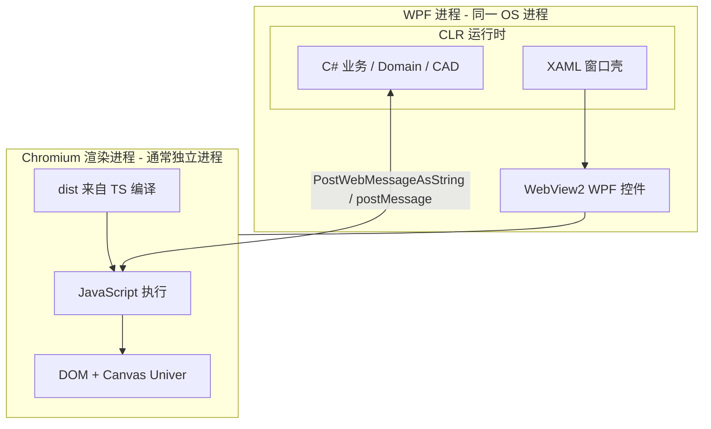
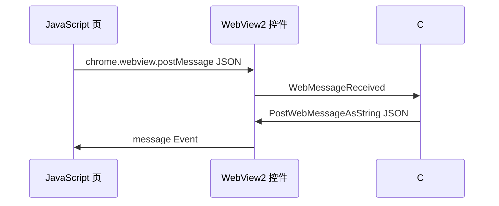
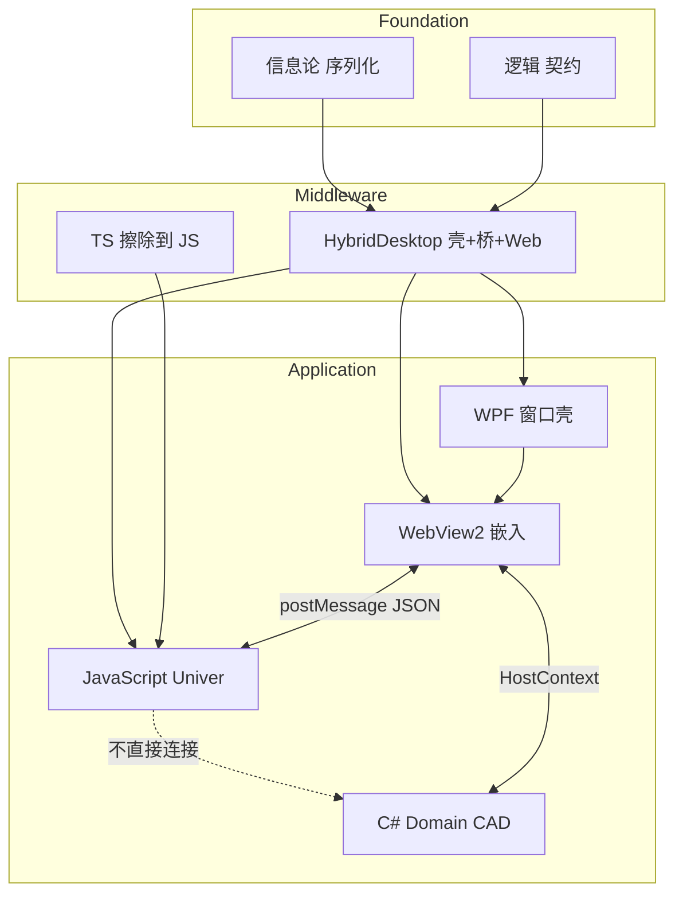

# JS / TS / WPF / WebView2 关系的第一性原理学习（new/10）

> **元信息**
> - 层级：Middleware（跨栈协议）+ Application（HyCAD Univer 实例）
> - 上游：[new/09 TS 与 C# 代码地图](./09-Univer-TS与C-WPF代码第一性白话地图-2026-06-28-180000.md) · [new/07 mock 宿主](./07-Univer-mock宿主白话详解-2026-06-28-153000.md) · first-principles `modules/domain/cs.md`
> - 下游：HyCAD Univer / MarkdownEditor / 任意 WPF+WebView2 混合桌面应用
> - 同构：Electron（Chromium + Node 壳）· 微信小程序（Native 壳 + JS 视图）· 浏览器扩展（Native 宿主 + Content Script）
> - 编制日期：2026-06-28
> - **性质**：第一性原理学习文档（15 问 + 结构工程类比）；**不是**操作手册
> - **姊妹**：[new/09](./09-Univer-TS与C-WPF代码第一性白话地图-2026-06-28-180000.md) 讲「哪个文件」；**本文讲「四种技术为何这样组合」**

---

## 目录

1. [§0 三句话先答](#0-三句话先答)
2. [一、问题重述](#一问题重述)
3. [二、脉络](#二脉络)
4. [三、15 问第一性拆解](#三15-问第一性拆解)
5. [四、例子（跨栈同构案例）](#四例子跨栈同构案例)
6. [五、四层栈对照表（HyCAD 实例）](#五四层栈对照表hycad-实例)
7. [六、学习路径（由底向上）](#六学习路径由底向上)
8. [七、用途小结](#七用途小结)
9. [八、延伸阅读](#八延伸阅读)
10. [九、知识图谱位置](#九知识图谱位置)
11. [十、文档元数据](#十文档元数据)

---

## §0 三句话先答

| 问题 | 结论 |
|---|---|
| **JS、TS、WPF、WebView2 分别是什么？** | **JS** = 浏览器里跑的脚本语言（运行时）；**TS** = 给 JS 加类型的「施工图标注」（编译期，Compile Time）；**WPF** = Windows 原生桌面 UI 框架（C# + XAML）；**WebView2** = 在 WPF 窗口里嵌入的 **Chromium（开源浏览器引擎）** 控件。 |
| **它们怎么连在一起？** | WPF 提供 **窗口壳 + 业务逻辑（C#）**；WebView2 在壳里开一块 **网页视口**；网页里跑 **TS 编译成的 JS**；两边用 **JSON 消息**（`postMessage`）对话——**不共享内存、不共享 UI 树**。 |
| **HyCAD 为何选这套？** | Univer 已是完整 Web 表格；用 WebView2 **嵌入**比 WPF 重写网格便宜；TS + Vite **HMR** 迭代快；C# 管 Domain 与 CAD——各干擅长的事。见 [new/09 §2.1](./09-Univer-TS与C-WPF代码第一性白话地图-2026-06-28-180000.md)。 |

---

## 一、问题重述

**核心对象**：桌面应用里 **原生 UI（WPF）** 与 **Web UI（JS/TS）** 的 **共生关系**，WebView2 是二者之间的 **标准桥梁**。

**痛点**：
- 四个名词混在一窗里，容易搞不清「改 CSS 要不要编译 C#」「消息谁发给谁」；
- 5174 浏览器 dev 与 CAD WebView2 **看起来像同一页**，但进程/宿主不同；
- TS 编译、WPF XAML、WebView 导航是 **三条独立构建链**。

**一句话答案**：把系统看成 **两个运行时（CLR + JS 引擎）+ 一个嵌入视口（WebView2）+ 一条 JSON 总线**；TS 只是 JS 的编译期助手，不增加运行时层。

---

## 二、脉络

### 2.1 历史脉络（为何会有这四件套）

| 年代 | 事件 | 后果 |
|---|---|---|
| 2006 | WPF 随 .NET 3.0 发布 | Windows 桌面 UI 用 XAML 声明式布局 + DirectX 绘制 |
| 2009 | TypeScript 立项 | 大型 Web 项目需要静态类型，**编译成 JS** |
| 2015+ | Electron 普及 | 「Chromium + Node 壳」证明 Web UI 可做桌面 |
| 2020 | WebView2 GA | Microsoft 官方：**Edge Chromium 嵌入任意 Win32/WPF/WinForms** |
| 2023+ | Univer 等 Web 表格成熟 | 工程软件可直接 **embed**，不必自研网格 |

**逻辑演化**：先有 **原生壳**（WPF）管 OS 集成；Web 生态产出 **复杂 UI 组件**（Univer）；WebView2 提供 **官方、可更新的浏览器内核**；TS 降低 Web 侧维护成本。

### 2.2 抽象层级（从物理到 HyCAD 应用）

```text
物理层     CPU / GPU / 显示器
    ↓
OS 层      Windows 窗口、消息循环、文件、进程
    ↓
运行时 A   CLR（Common Language Runtime，.NET 公共语言运行时）→ C# / WPF
运行时 B   V8（Chromium 内 JS 引擎）→ JavaScript（TS 编译产物）
    ↓
嵌入层     WebView2 控件（HWND 子窗口 + IPC 到 renderer 进程）
    ↓
应用层     HyCAD：C# Domain + JSON 桥 + Univer TS 扩展
```

### 2.3 关系总图（HyCAD Univer）



**关键**：WPF 与网页 **不在同一 UI 树**；WebView2 是一块 **「屏幕上挖出的浏览器窗口」**。

---

## 三、15 问第一性拆解

### 3.1 Q1 研究什么

**研究对象**：混合桌面应用中 **两套 UI 运行时如何分工、如何通信、如何保持单一业务真相**。

**不是研究**：Chromium 源码级渲染、WPF 模板全语法、ECMAScript 规范每一版 diff（那些是深钻子文档）。

### 3.2 Q2 为何诞生

| 力量 | 说明 |
|---|---|
| **Web 生态效率** | Ribbon、公式栏、合并单元格、主题——Univer 已做好 |
| **原生集成需求** | 文件对话框、AutoCAD API、Domain 算法必须在 C# |
| **Microsoft 官方路径** | WebView2 替代已废弃的 IE WebBrowser 控件 |
| **TypeScript 工程化** | 25+ 注入模块需要类型与 IDE 提示 |

**HyCAD 不选纯 Electron**：插件已在 AutoCAD（.NET）进程内，再加 Node 壳过重；WebView2 更轻、与 Win 集成更好。

### 3.3 Q3 基本变量

| 变量 | 所属 | 含义 |
|---|---|---|
| `HWND` / 视觉树 | WPF | 窗口与子控件布局 |
| `CoreWebView2` | WebView2 | 浏览器实例句柄 |
| `DOM` / `window` | JS | 网页文档对象模型 |
| `type` / `payload` | JSON 桥 | 消息语义 |
| `dist/` | 构建产物 | TS→JS 打包结果，C# 加载 |
| `_ready` | 生命周期 | Web 就绪后才可 PostMessage |
| `chrome.webview` | WebView2 注入 | JS 侧识别「在宿主里」 |

### 3.4 Q4 公理 / 假设

1. **双运行时公理**：CLR 与 JS 引擎 **不共享堆内存**；数据交换只能 **序列化**（JSON 字符串为主）。
2. **单向 UI 所有权**：Univer 网格 **归 Web**；WPF 只拥有 WebView2 矩形区域外的 chrome。
3. **TS 擦除公理**：TypeScript 类型在 **编译后不存在**；运行时只有 JS。
4. **WebView2 就绪公理**：`CoreWebView2` 初始化完成前，`PostWebMessageAsString` 无效或丢失。

**内核解释**：C# 和 JS 像两个国家的海关——货物（数据）必须报关（JSON），不能直接把本国仓库钥匙给对方。

**结构工程类比**：**双体系结构**——WPF 是 **钢筋混凝土框架（主承重）**；Web 是 **幕墙（围护+内装）**。二者通过 **预埋件（WebView2 控件边界 + postMessage）** 连接，不能焊成一体。贴切：幕墙不承受主体荷载，对应 Web 不直接调 AutoCAD API。

### 3.5 Q5 怎样抽象

三层抽象叠加：

| 层 | 抽象 | HyCAD 实例 |
|---|---|---|
| 业务契约 | 领域快照 | `HyCadGridSnapshot` JSON |
| 传输契约 | 消息 `{ type, payload }` | `loadSnapshot` / `hyCadLayout` |
| UI 契约 | 网页路由 + 虚拟域名 | `https://univer.local/index.html` |

**WPF 不抽象 Univer 单元格**——避免泄漏；只抽象 **字符串 JSON**。

### 3.6 Q6 哪些尺度

| 尺度 | WPF | Web |
|---|---|---|
| 布局 | DIP（Device Independent Pixel，设备无关像素，96 dpi 逻辑） | CSS px（同为 96 dpi 参考） |
| 文本 | WPF 设备无关单位 | rem / px |
| 跨边界 | WebView 控件 **整矩形** 一个尺度 | 内部 zoom 不影响 WPF 标尺（若外挂） |

HyCAD mm 口径在 **Web 内** 用 `96/25.4` 换算，见 [new/03](./03-Univer布局Tab与mm尺寸对齐-02修订版-2026-06-27-011500.md)。

### 3.7 Q7 数学本质

1. **序列化**：对象 → UTF-8 字符串 → 对象（有损：函数、循环引用不可传）。
2. **异步消息**：postMessage **无返回值**；请求-响应需 **相关 ID 或 type 配对**（HyCAD 用 `exportSnapshot` → `snapshot`）。
3. **坐标映射**（若跨边界画 UI）：屏幕坐标 = WPF 原点 + WebView 偏移 + 网页内 scroll/zoom 变换——**仿射链**，误差累积是标尺外挂失败的主因（[new/05](./05-Univer内mm标尺与Facade白话-2026-06-28-120000.md)）。

符号说明（简化 1D 横坐标）：

$$
x_{\mathrm{screen}} = x_{\mathrm{wpf}} + x_{\mathrm{webview}} + x_{\mathrm{dom}} \cdot s_{\mathrm{zoom}}
$$

其中：
- $x_{\mathrm{screen}}$ — 屏幕像素坐标（Screen Coordinate），单位：px
- $x_{\mathrm{wpf}}$ — WPF 窗口客户区偏移，单位：px
- $x_{\mathrm{webview}}$ — WebView 控件左缘在 WPF 内偏移，单位：px
- $x_{\mathrm{dom}}$ — DOM / Canvas 内逻辑坐标，单位：px
- $s_{\mathrm{zoom}}$ — 网页缩放因子（Zoom Factor），无量纲

### 3.8 Q8 核心简化

| 简化 | 手段 | 代价 |
|---|---|---|
| 不 Host Node | 纯 WebView2 + 静态 dist | 无 Node API；build 在前 |
| TS 而非纯 JS | 编译期类型 | 多一步 `npm run build` |
| JSON 而非 COM/JSInterop 对象 | postMessage | 大快照有拷贝成本 |
| 5174 mock 宿主 | `dev-host.ts` 假 `chrome.webview` | 无 Domain 真写 |
| 虚拟域名 `univer.local` | 避免 file:// CORS 限制 | 须映射 dist 目录 |

**内核解释**：故意不用「最强大」的互操作，而用 **最笨的传字符串**——因为字符串最容易调试、最不容易版本崩溃。

**结构工程类比**：JSON 桥是 **标准化螺栓连接**——比焊接（共享内存 COM）拆装方便，换 Univer 版本时不必拆整个 WPF 主体。

### 3.9 Q9 最大陷阱

| 陷阱 | 表现 | 规避 |
|---|---|---|
| **以为 TS 在运行时存在** | 在浏览器里找 `HyCadGridSnapshot` 类型 | 类型仅编译期；看编译后 JS |
| **WebView2 未 ready 就 Post** | 消息丢失、空网格 | 等 JS 发 `ready` |
| **在 WPF 画要对齐 Web 的 UI** | 标尺/选区漂移 | UI 放进 Web（`ruler-overlay.ts`） |
| **5174 当 CAD 验 Domain** | 假成功 | N38 真宿主 |
| **忘 build dist** | C2 后 UI 旧 | `npm run build` |
| **ExecuteScript 与 PostMessage 混用** | 时序竞态 | HyCAD 统一 PostMessage |
| **WebView2 Runtime 缺失** | 宿主崩溃 | 启动前检测版本字符串 |

**内核解释**：最常见错误是「在幕墙外面贴刻度尺去对齐里面的家具」——刻度应该画在房间里面。

**结构工程类比**：跨进程坐标对齐像 **用外部望远镜调内部精密仪器**——视差（parallax）不可避免，应把刻度尺装在仪器本体上。

### 3.10 Q10 如何验证

| 层 | 验证手段 |
|---|---|
| TS/JS | `npm run dev` 5174 + 浏览器 DevTools |
| 构建 | `npm run build` → 检查 `dist/assets/*.js` |
| 桥接 | `TableGridUniverAdapterTests` |
| 全栈 | C2 → N38；断点：`OnWebMessageReceived` / `handleHostCommand` |
| WebView2 | `GetAvailableBrowserVersionString()` 非空 |

### 3.11 Q11 边界在哪

| 在边界内 | 在边界外 |
|---|---|
| WPF 窗口、工具条、CAD 命令 | 在 WPF 复刻 Univer 网格 |
| TS 改 Ribbon/CSS/标尺 | TS 直接 `P/Invoke` AutoCAD |
| C# 解析 JSON、写 Domain | C# 操作 DOM（除非 ExecuteScript，HyCAD 不用） |
| WebView2 加载本地 dist | 依赖远程 CDN 生产加载（HyCAD 离线 dist） |

**内核解释**：幕墙工人（Web）不应进承重墙（CAD）里改钢筋；钢筋工（C#）也不应爬吊篮改玻璃（DOM）。

**结构工程类比**：**施工界面划分**——接口在预埋件（JSON schema），不在构件内部。

### 3.12 Q12 如何工程化

```text
┌─ Web 线 ─────────────────────────────────────────┐
│  edit .ts/.tsx → npm run dev (5174 HMR)          │
│  定稿 → npm run build → Web/dist                 │
└──────────────────────────────────────────────────┘
                        ↓ dist 复制/映射
┌─ C# 线 ─────────────────────────────────────────┐
│  dotnet build HyCADTool.UniverEditor (net8)      │
│  dotnet build HyCADTool (net48)                  │
│  C2 → N38                                        │
└──────────────────────────────────────────────────┘
```

**三条构建链独立**：TS（Vite）、WPF（MSBuild net8）、插件（MSBuild net48）。

### 3.13 Q13 上游依赖（In-edges）

| 上游 | 提供什么 |
|---|---|
| **ECMAScript** | JS 语法与语义 |
| **.NET / WPF** | CLR、XAML、Dispatcher |
| **Chromium** | 布局引擎、Canvas、WebView2 内核 |
| **信息论** | 序列化、信道容量（消息大小） |
| **HyCAD Domain** | 业务真相（见 [new/00](./00-Domain底层逻辑大白话-2026-06-26-180000.md)） |

### 3.14 Q14 下游应用（Out-edges）

| 下游 | 关系 |
|---|---|
| HyCAD Univer 表格 | 本文主实例 |
| HyCAD MarkdownEditor | 同 WPF+WebView2 模式（hymd） |
| 任意 Win 桌面 + Web UI | Teams、Notion 桌面版同类架构 |
| [new/09 代码地图](./09-Univer-TS与C-WPF代码第一性白话地图-2026-06-28-180000.md) | 文件级落地 |

### 3.15 Q15 同构关系（Isomorphism）

| 家族 | 结构 | 成员 |
|---|---|---|
| **壳 + 嵌入 Web** | Native 窗口 + Chromium + 消息桥 | WebView2 · Electron · CEF |
| **类型层 + 运行时** | 编译期检查 → 擦除 → 同一 VM | TypeScript→JS · C#→IL→CLR |
| **Mock 宿主** | 假 API 使 Web 可独立跑 | `dev-host.ts` · 前端 MSW · 后端 WireMock |
| **双层 UI** | 外框 native + 内容 web | Univer 编辑器 · 微信小程序 · 支付宝 hybrid |

**核心同构公式**：

$$
\text{HybridDesktop} \cong \text{NativeShell} + \text{EmbedBrowser} + \text{SerializeBridge}
$$

符号说明：
- $\text{HybridDesktop}$ — 混合桌面应用架构（Hybrid Desktop Architecture）
- $\text{NativeShell}$ — 原生壳（WPF / Win32 / AppKit）
- $\text{EmbedBrowser}$ — 嵌入浏览器控件（WebView2 / WKWebView）
- $\text{SerializeBridge}$ — 序列化消息桥（JSON / protobuf 字符串）
- $\cong$ — 架构同构（Architecture Isomorphism，组件角色等价，非实现相同）

---

## 四、例子（跨栈同构案例）

### 4.1 例一：JavaScript vs TypeScript——编译期 vs 运行时

**源码（TS）**：

```typescript
export interface HyCadGridSnapshot {
  rowCount: number;
  rowHeightsMm: number[];
}
function loadSnapshot(raw: HyCadGridSnapshot | string): boolean { /* ... */ }
```

**编译后（JS，概念上）**：

```javascript
export function loadSnapshot(raw) { /* ... */ }
// interface 完全消失
```

**读码位置**：[`univer-bridge.ts`](../../../src/HyCADTool.UniverEditor/Web/src/univer-bridge.ts) 的 `HyCadGridSnapshot` 仅在 TS 层存在；C# 侧用 Newtonsoft 反序列化同名 JSON 字段——**契约靠字段名对齐，不靠共享类型**。

**内核解释**：TS 像施工图上的 **尺寸标注**；工人（JS 引擎）按标注好的木构件（JS 代码）施工，标注本身不钉进木头里。

**结构工程类比**：TS 是 **设计说明书记载在图框里**；现场只有 **按图加工后的构件（JS）**。验收看构件尺寸，不找「类型」这块牌子。

---

### 4.2 例二：WPF 窗口里嵌入 WebView2——谁画什么

**WPF XAML（外壳）**——四行 Grid，仅 Row2 是 WebView：

```107:109:src/HyCADTool.UniverEditor/Views/UniverEditorWindow.xaml
        <Grid Grid.Row="2" Background="#eceff4">
            <Grid Background="#ffffff">
                <wv2:WebView2 x:Name="UniverWebView" />
```

**Web 页（内容）**——Univer 挂载 `#app`，HyCAD 标尺挂 `#hycad-hruler`：

```text
#hycad-editor-root
  #hycad-hruler / #hycad-vruler   ← TS canvas 绘制
  #app                              ← Univer 完整工作台
```

**分工**：

| 画什么 | 谁画 | 技术 |
|---|---|---|
| 窗口标题栏、工具条「落图」钮 | WPF | XAML + C# Click |
| Ribbon、网格、公式栏 | Web | Univer + TS inject |
| mm 标尺 R0 | Web | `ruler-overlay.ts` + Canvas |

**内核解释**：WPF 只负责 **窗框和门**；房间里所有家具（表格 UI）都是 Web 装修的。

**结构工程类比**：WPF = **建筑外墙与入口大厅**；WebView 内 = **精装办公区**；客户（用户）主要时间在办公区，但消防疏散（窗口关闭）走外墙系统。

---

### 4.3 例三：postMessage——JSON 总线的一来一回

**JS → C#（上行）**：

```typescript
// main.ts 启动完成
postHostMessage({ type: 'ready' });

// 布局 Tab 改纸型
post?.({ type: 'hyCadLayout', op: 'setPaperPreset', value: 1 });
```

**C# 接收**：

```257:262:src/HyCADTool.UniverEditor/Services/UniverSessionLifecycle.cs
                if (string.Equals(type, "ready", StringComparison.OrdinalIgnoreCase))
                {
                    _ready = true;
                    _setStatus?.Invoke("Univer 已就绪");
                    Ready?.Invoke();
                    await PushInitialSnapshotAsync();
```

**C# → JS（下行）**：

```104:117:src/HyCADTool.UniverEditor/Services/UniverSessionLifecycle.cs
        private Task PostCommandAsync(string type, JToken payload)
        {
            var message = new JObject { ["type"] = type };
            if (payload != null)
                message["payload"] = payload;
            // ...
            _webView.CoreWebView2.PostWebMessageAsString(json);
```

**JS 接收**：

```353:358:src/HyCADTool.UniverEditor/Web/src/main.ts
  window.chrome?.webview?.addEventListener?.('message', (event: MessageEvent<string>) => {
    handleLayoutHostCommand(event.data);
    handleHostCommand(univerAPI, postHostMessage, event.data);
  });
```

**时序**：



**内核解释**：两边像 **对讲机**，不能当面递文件，只能喊字符串；喊完要自己解析。

**结构工程类比**：postMessage 是 **监理日志本**——每行一条 JSON 记录，上下行签字（type 字段），不用共享同一张物理表格。

---

### 4.4 例四：5174 浏览器 vs WebView2——同一 JS，不同宿主

| | `npm run dev` 5174 | CAD WebView2 |
|---|---|---|
| JS 引擎 | 浏览器自带 Chromium | Edge WebView2 Runtime |
| `chrome.webview` | **mock**（`dev-host.ts`） | **真**（微软注入） |
| 出站消息 | 本页 `handleDevOutboundMessage` | `WebMessageReceived` |
| Domain | 无 | `TableEditorViewModel` |

检测逻辑：

```46:54:src/HyCADTool.UniverEditor/Web/src/dev-host.ts
function isWebViewHost(): boolean {
  if (devMode)
    return false;

  try {
    return Boolean(window.chrome?.webview?.postMessage);
  } catch {
    return false;
  }
}
```

**内核解释**：同一套网页脚本，换「经理」（宿主）就换后台能不能真落图——像同一演员在排练（5174）和正式演出（CAD）。

**结构工程类比**：5174 = **实验室结构台座**；CAD = **现场真支座**——模型相同，边界条件不同。

---

## 五、四层栈对照表（HyCAD 实例）

| 层 | 技术 | 职责 | 典型文件 |
|---|---|---|---|
| **L4 业务** | C# Domain | 表格真相、纸型 mm、CAD | `TableEditorViewModel`, `PaperPresetCatalog` |
| **L3 桥** | C# JSON | 序列化、消息路由 | `UniverTableEditorHostBridge`, `UniverSessionLifecycle` |
| **L2 嵌入** | WebView2 + WPF | 窗口、导航、PostMessage | `UniverEditorWindow.xaml`, `CoreWebView2` |
| **L1 视图** | TS → JS | Univer UI、注入、标尺 | `main.ts`, `univer-bridge.ts`, `dist/` |

**JavaScript 不碰 L4**；**WPF 不碰 L1 网格内部**——这是关系铁律。

---

## 六、学习路径（由底向上）

### 6.1 阶段 0：先建立双运行时心智模型（1–2 天）

1. 读本文 §2.3 关系总图 + §3.4 公理。
2. 读 [new/07](./07-Univer-mock宿主白话详解-2026-06-28-153000.md) 理解 mock。
3. 打开 5174，F12 → Sources → 看 `dist` 或 dev 源码。

### 6.2 阶段 1：JavaScript 最小必要集（3–5 天）

| 主题 | 为何学 | HyCAD 触点 |
|---|---|---|
| `module` import/export | Vite 打包 | 每个 `*-inject.ts` |
| `addEventListener` | WebView 消息 | `main.ts` message 监听 |
| `JSON.parse` / `stringify` | 桥接 | 全部 postMessage |
| `Promise` / `async` | 加载 fixture | `dev-host.ts` fetch |
| DOM 查询 | Ribbon 注入 | `querySelector('[data-u-comp=...]')` |

**不必先学**：Node.js 服务端、React 全家桶原理（会用到 TSX，可按组件读）。

### 6.3 阶段 2：TypeScript 增量（2–3 天）

| 主题 | 为何学 |
|---|---|
| `interface` / `type` | 对齐 C# JSON 字段 |
| 泛型最小用法 | `FUniver` API 类型 |
| `strict` 下常见报错 | 改 inject 时编译器当顾问 |

**实践**：改 `layout-ribbon-panel.tsx` 一个按钮 label，看 Vite HMR。

### 6.4 阶段 3：WPF 壳（2–3 天）

| 主题 | 为何学 | 文件 |
|---|---|---|
| XAML Grid / Row | 窗口分区 | `UniverEditorWindow.xaml` |
| Code-behind 事件 | 工具条按钮 | `.xaml.cs` |
| `Dispatcher` | UI 线程 | `InvokeOnUiThread` |

**不必先学**：ControlTemplate 全技能（HyCAD 壳极简）。

### 6.5 阶段 4：WebView2 桥（3–5 天）

| 主题 | 为何学 | 文件 |
|---|---|---|
| `EnsureCoreWebView2Async` | 生命周期 | `UniverSessionLifecycle` |
| `SetVirtualHostNameToFolderMapping` | 本地 dist | 同上 |
| `WebMessageReceived` | C# 收 JS | 同上 |
| `PostWebMessageAsString` | C# 发 JS | 同上 |
| `ready` 握手 | 时序 | `main.ts` + `PushInitialSnapshotAsync` |

**深读**：[new/09 §四](./09-Univer-TS与C-WPF代码第一性白话地图-2026-06-28-180000.md) 三条走读。

### 6.6 阶段 5：贯通调试（持续）

```text
断点 C#: OnWebMessageReceived → type == "hyCadLayout"
断点 TS: sendLayoutOp → Network/Console 看 outbound
验证: GridChanged → loadSnapshot 是否二次触发
```

---

## 七、用途小结

掌握 JS / TS / WPF / WebView2 关系后，你能：

1. **决定 UI 改哪边**：网格/Ribbon → Web；窗口/CAD → C#。
2. **设计消息**：新功能先定 `type` 与 JSON 字段，再分头实现。
3. **选调试环境**：纯 UI → 5174；Domain/落图 → N38。
4. **识别同构项目**：MarkdownEditor、hymd、Electron 工具——同一套 **壳+桥+Web** 思路。
5. **避免架构回退**：不在 WPF 重造 Web 已做好的交互。

---

## 八、延伸阅读

### 8.1 仓库内

| 文档 / Skill | 内容 |
|---|---|
| [new/09 代码地图](./09-Univer-TS与C-WPF代码第一性白话地图-2026-06-28-180000.md) | 文件清单 + 消息表 |
| [new/06 UI 代号](./06-Univer编辑器UI区域沟通地图-2026-06-28-143000.md) | U1–U8 / R0 |
| [README-dev](../../../src/HyCADTool.UniverEditor/Web/README-dev.md) | 5174 开发循环 |
| `.cursor/skills/wpf-webview2-pitfalls/SKILL.md` | 15 类实战陷阱 |

### 8.2 官方 / 经典

| 资源 | 用途 |
|---|---|
| [Microsoft WebView2 文档](https://learn.microsoft.com/microsoft-edge/webview2/) | API、进程模型 |
| [TypeScript Handbook](https://www.typescriptlang.org/docs/handbook/) | 类型系统 |
| [MDN JavaScript Guide](https://developer.mozilla.org/zh-CN/docs/Web/JavaScript/Guide) | JS 语言 |
| [WPF 概述](https://learn.microsoft.com/dotnet/desktop/wpf/overview/) | XAML 与视觉树 |

---

## 九、知识图谱位置

**层级**：Foundation（信息论序列化、双运行时）→ Middleware（Hybrid 壳+桥模式）→ Application（HyCAD Univer）

**上游（In）**：
- 计算机科学 · 运行时与抽象层（`modules/domain/cs.md`）
- ECMAScript / .NET 文档

**下游（Out）**：
- [new/09](./09-Univer-TS与C-WPF代码第一性白话地图-2026-06-28-180000.md)
- HyCAD MarkdownEditor / hymd

**同构（≅）**：
- Electron ≅ WebView2 + 不同壳 API
- TS→JS ≅ C#→IL（编译期辅助，运行时另一物）



**与 new/09 的分工**：

| 文档 | 回答 |
|---|---|
| **new/10（本文）** | 四种技术 **是什么、为何并存、边界在哪** |
| **new/09** | HyCAD 里 **哪个文件、哪条消息** |
| [new/11](./11-Node与CLR与V8对比-第一性原理学习-2026-06-28-200000.md) | **Node / CLR / V8** 三种 runtime 对比 |

---

## 十、文档元数据

| 项 | 值 |
|---|---|
| 创建日期 | 2026-06-28 |
| 文档编号 | new/10 |
| 触发 | 用户「深入学习 JS TS WPF WebView 关系」+ `@first-principles-learning` |
| 维护者 | HyCAD 产品调研 / Cursor Agent |

**后续扩展建议**：

| 子文档 | 内容 |
|---|---|
| `10a-ECMAScript-MM-事件循环与模块` | JS 深钻 |
| `10b-WebView2-MM-进程模型与导航` | Chromium 多进程 |
| `10c-WPF-MM-Dispatcher与视觉树` | WPF 最小深钻 |

**建议阅读顺序**：本文 §0 → §2.3 总图 → §四 四例 → §六 学习路径 → [new/09](./09-Univer-TS与C-WPF代码第一性白话地图-2026-06-28-180000.md) 查文件。

---

**版本**：1.0 | **性质**：第一性原理 · 跨栈关系 | **不写实现 PR**
