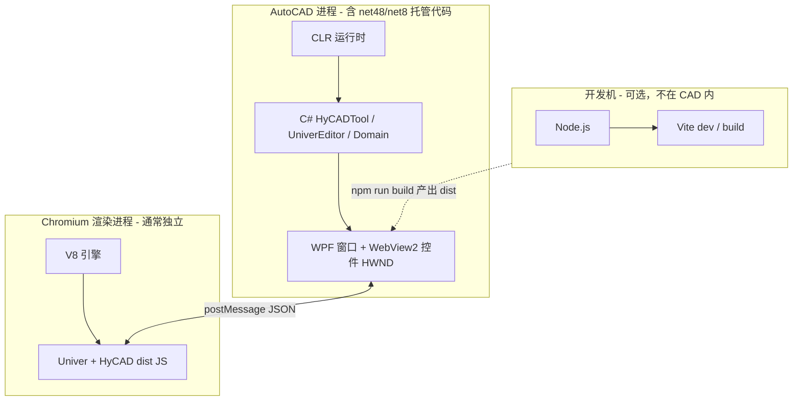
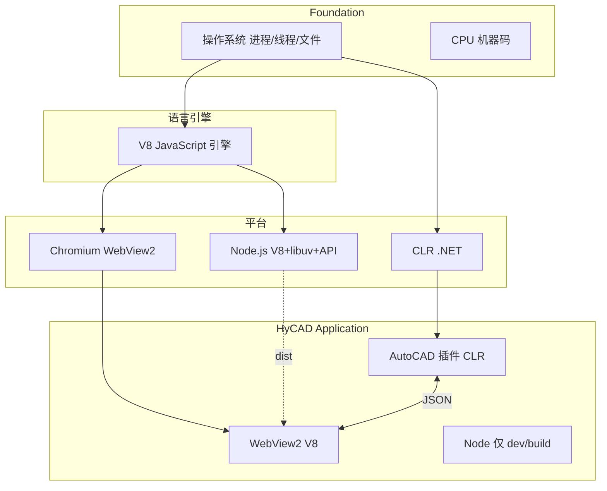

# Node / CLR / V8 对比的第一性原理学习（new/11）

> **元信息**
> - 层级：Foundation（运行时）+ Middleware（与 HyCAD 栈对照）
> - 上游：[new/10 JS/TS/WPF/WebView2 关系](./10-JS-TS-WPF-WebView2关系-第一性原理学习-2026-06-28-190000.md) · [new/09 代码地图](./09-Univer-TS与C-WPF代码第一性白话地图-2026-06-28-180000.md)
> - 下游：HyCAD Univer 调试（5174 / N38 / npm build）· Electron 选型对比
> - 同构：JVM（Java）· Python 解释器 · Lua 嵌入引擎
> - 编制日期：2026-06-28
> - **性质**：三种 **运行时（Runtime）** 的第一性对比；**不是** Node 教程或 .NET 教程
> - **姊妹**：[new/10](./10-JS-TS-WPF-WebView2关系-第一性原理学习-2026-06-28-190000.md) 讲 WPF+WebView2 如何组合；**本文讲三种引擎各自是什么、在 HyCAD 里各出现在哪**

---

## 决策速览表

### 三 runtime 一句话

| 运行时 | 一句话 | 执行什么 |
|---|---|---|
| **V8** | 只负责 **把 JavaScript 跑起来** 的引擎 | ECMAScript +（在浏览器里）Web API |
| **Node.js** | **V8 + 操作系统能力** 的桌面/服务端 JS 平台 | JS + `fs` / `http` / `process` / npm 工具链 |
| **CLR** | **.NET 公共语言运行时**，管 C# 等托管语言 | CIL（中间语言）→ 机器码；WPF / AutoCAD 插件 |

### HyCAD Univer 里「谁在哪」

| 场景 | 进程里有什么 | **没有**什么 |
|---|---|---|
| AutoCAD + N38 编辑器 | **CLR**（C# Domain、WPF 壳）+ **V8**（WebView2 渲染进程里的 Univer JS） | **Node**（不在 CAD 进程内） |
| `npm run dev` 5174 | **Node**（Vite 开发服务器）+ **V8**（浏览器标签页里的页面） | CLR（除非另开 dotnet） |
| `npm run build` | **Node**（Vite 打包，写完即退出） | V8 / CLR（不参与 build 本身） |
| `dotnet build` | **CLR**（Roslyn 编译器 + MSBuild 托管部分） | V8 / Node |

### 常见误解 → 正解

| 误解 | 正解 |
|---|---|
| 「Univer 用 Node 跑」 | Univer 在 **WebView2 的 V8** 里跑；Node 只在 **开发机构建** 时用 |
| 「5174 和 CAD 都是 Node」 | 都是 **V8 + 同一套 dist/源码**；5174 多一个 **Node 开的 Vite 服务** |
| 「C# 和 JS 共用一个运行时」 | **CLR 与 V8 是两个进程、两套 GC、两套堆** |
| 「Electron = WebView2」 | Electron **主进程带 Node**；WebView2 **不带 Node**，只有 Chromium |

---

## 目录

1. [§0 三句话先答](#0-三句话先答)
2. [一、问题重述](#一问题重述)
3. [二、脉络](#二脉络)
4. [三、15 问第一性拆解](#三15-问第一性拆解)
5. [四、多维对比表](#四多维对比表)
6. [五、HyCAD 全链路：三种 runtime 各出现一次](#五hycad-全链路三种-runtime-各出现一次)
7. [六、例子](#六例子)
8. [七、与 Electron 对照（为何 HyCAD 不选 Node 壳）](#七与-electron-对照为何-hycad-不选-node-壳)
9. [八、学习路径](#八学习路径)
10. [九、知识图谱位置](#九知识图谱位置)
11. [十、文档元数据](#十文档元数据)

---

## §0 三句话先答

| 问题 | 结论 |
|---|---|
| **V8 是什么？** | Google 写的 **JavaScript 引擎**；Chrome / Edge / WebView2 **渲染进程**里执行你的 `main.ts` 编译产物。**不管** C#，**默认也不给** Node 的 `fs.readFile`。 |
| **Node 是什么？** | 把 **V8 嵌进一个独立程序**，再挂上 **libuv（异步 I/O 库）** 和 **Node API**，让 JS 能读写磁盘、开 HTTP 端口——典型用途是 **Vite dev server**、**npm run build**，在 **HyCAD 仓库的开发机**上跑，**不在 AutoCAD 进程里**。 |
| **CLR 是什么？** | **.NET 运行时**；HyCAD 的 **C#、WPF、Domain、AutoCAD API 封装** 全在 CLR 上。与 V8 **并列**，通过 WebView2 的 **JSON 消息** 对话，**不嵌套、不合并**。 |

---

## 一、问题重述

**核心对象**：三个名字都带「运行代码」，但 **层次不同**——V8 是 **语言引擎**，Node 是 **带 OS 能力的 JS 平台**，CLR 是 **另一门语言栈的虚拟机**。

**痛点**：
- 说「跑 JS」时搞不清是 **浏览器 V8** 还是 **Node**；
- 说「.NET」时搞不清是 **编译器** 还是 **CLR**；
- 在 CAD 里改 Univer 时，不知道要不要装 Node（**构建机要，CAD 机只要 WebView2 Runtime**）。

**一句话答案**：**V8 ⊂ Node**（Node 内含 V8，但加了整层 OS 封装）；**CLR ⊥ V8**（正交，HyCAD 里各管一半活）。

---

## 二、脉络

### 2.1 历史时间线

| 年份 | 事件 | 产物 |
|---|---|---|
| 2000 | Microsoft 发布 .NET Framework | **CLR** + C# |
| 2008 | Google 开源 **V8** | 高性能 JS 引擎，随 Chrome 分发 |
| 2009 | **Node.js** 发布 | V8 + libuv，JS 走出浏览器 |
| 2013+ | Electron | Chromium(**V8**) + Node **同进程不同角色** |
| 2020 | **WebView2** GA | 只嵌入 Chromium，**不嵌入 Node** |
| HyCAD | Univer 路线 | **CLR 壳 + WebView2(V8) 视图**；Node 仅工具链 |

### 2.2 包含关系（不是并列三角）

```text
                    ┌─────────────────────────────────┐
                    │         Node.js 平台               │
                    │  ┌─────────┐  libuv / Node API   │
                    │  │   V8    │  fs, http, process  │
                    │  └─────────┘                     │
                    └─────────────────────────────────┘
                              │
              浏览器 / WebView2 渲染进程只取这一层
                              ▼
                    ┌─────────────────┐
                    │       V8        │  ← 只执行 JS + Web API
                    └─────────────────┘

        ┌─────────────────────────────────┐
        │            CLR                  │  ← 与上完全独立
        │  C# / WPF / AutoCAD 插件        │
        └─────────────────────────────────┘
```

### 2.3 HyCAD 进程图（N38 打开时）



---

## 三、15 问第一性拆解

### 3.1 Q1 研究什么

**对象**：三种 **程序执行环境** 的职责边界——谁执行哪种语言、能否触 OS、在 HyCAD 哪条链路出现。

**不是对象**：V8 内联缓存实现、CLR GC 代数细节、Node 事件循环源码（可另写 11a/11b/11c）。

### 3.2 Q2 为何诞生

| 运行时 | 诞生动力 |
|---|---|
| **CLR** | 微软要托管语言 + 统一中间语言（CIL）+ Windows 桌面 / 企业服务器 |
| **V8** | 浏览器里 JS 太慢；需要 JIT 把 JS 编译成机器码 |
| **Node** | Ryan Dahl：用 JS 写高并发 I/O 服务器，**不想绑在浏览器沙箱里** |

### 3.3 Q3 基本变量

| 变量 | V8 | Node | CLR |
|---|---|---|---|
| 输入 | JS 源码/字节码 | JS + `package.json` 生态 | CIL / 程序集 DLL |
| 堆 | JS 对象 GC | 同 V8 + native 绑定对象 | 托管对象 GC |
| 线程 | 主线程 + Worker（若用） | 主线程 + libuv 线程池 | 线程池 + `Dispatcher`（WPF） |
| 标识进程 | 随 Chromium 进程 | `node.exe` PID | `acad.exe` 内 CLR |

### 3.4 Q4 公理 / 假设

1. **引擎 vs 平台**：V8 是 **引擎**；Node 和「浏览器 Chromium」是 **平台**（在 V8 上加了不同 API）。
2. **沙箱公理**：WebView2 里的 V8 **默认**只有 Web API + `chrome.webview`；**没有** Node `require('fs')`。
3. **CLR 强类型公理**：C# 类型在 **运行时仍存在**（与 TS 擦除相反）；反射可查元数据。
4. **HyCAD 双运行时公理**：业务真相在 **CLR**；Univer 视图在 **V8**；**Node 不参与生产运行时**。

**内核解释**：V8 像 **发动机**；Node 是 **带变速箱和轮子的整车**（JS 能「上路」进 OS）；CLR 是 **另一品牌的发动机+整车**，烧的是 C# 燃料，跟 JS 油库不互通。

**结构工程类比**：**V8 = 单台卷扬机**（只拉升 JS）；**Node = 卷扬机 + 配电箱 + 出工许可**（还能接电网/文件）；**CLR = 工地塔吊系统**（吊 C# 构件）。HyCAD 工地 **塔吊和卷扬机同时作业**，通过 **对讲机（JSON）** 配合，不需要再雇 Node 当第三方监理。

### 3.5 Q5 怎样抽象

| 抽象 | V8 | Node | CLR |
|---|---|---|---|
| 执行模型 | 解释 + JIT | 同 V8 | CIL + JIT（RyuJIT）/ AOT |
| 模块 | ES module / 打包 bundle | CommonJS + ESM + npm | 程序集 / NuGet |
| 与 OS | 经浏览器/WebView 间接 | 直接（libuv） | P/Invoke + Win32 |

### 3.6 Q6 哪些尺度

| 尺度 | 典型量级 | 说明 |
|---|---|---|
| JS 堆（V8） | Univer 页 tens~hundreds MB | 随表格大小变 |
| CLR 堆 | Domain + AutoCAD 已有占用 | 与 JS 堆 **不合并** |
| Node build | 秒~分钟 | `vite build` 峰值 CPU |
| 冷启动 | WebView2 首载 Univer | 与 Node 无关 |

### 3.7 Q7 数学本质

1. **JIT 编译**：热点 JS/CIL → 机器码；冷代码解释执行。
2. **事件驱动**：Node libuv 用 **事件循环** 多路复用 I/O；WPF 用 **Dispatcher 队列**；浏览器 V8 用 **任务队列 + 渲染帧**。
3. **隔离**：进程边界 → 内存访问需 **IPC**；HyCAD 用 JSON 字符串信道。

### 3.8 Q8 核心简化

| 选型 | HyCAD 简化 | 若用 Node 壳（Electron） |
|---|---|---|
| 嵌入 UI | WebView2 + **仅 V8** | Chromium + **V8 + Node** |
| 业务 | 已有 **CLR + CAD API** | 还要 Node↔CAD 或重复实现 |
| 构建 | Node **只在 dev/build** | Node 也进安装包 |

**内核解释**：HyCAD 已经在 CLR 里有了「整车」，只需再嵌一块「浏览器屏幕」；不必再整一套 Node 整车叠上去。

**结构工程类比**：已有 **钢筋混凝土主结构（CLR）** 时，加 **幕墙（WebView2）** 即可；Electron 相当于 **再套一层钢结构外框（Node 主进程）**——对 AutoCAD 插件来说属于重复承重体系。

### 3.9 Q9 最大陷阱

| 陷阱 | 后果 |
|---|---|
| 在 Univer 网页里 `require('fs')` | **运行时错误**——V8 环境无 Node |
| 以为 `npm install` 装进了 CAD | 只影响 **开发机 node_modules** |
| 生产机没 WebView2 Runtime | **CLR 窗口崩溃**——与 Node 无关 |
| 生产机没装 Node | **不影响 CAD**——只要 dist 已 build |
| 混淆 **Roslyn** 与 **CLR** | Roslyn 编译 C# → DLL；**CLR 执行** DLL |
| 5174 能落图 → CAD 也能 | 5174 **无 CLR Domain**——见 [new/07](./07-Univer-mock宿主白话详解-2026-06-28-153000.md) |

**内核解释**：在浏览器里找 Node 的 `fs`，像在客房里找厨房水龙头——水厂（Node）在别栋楼，这层楼只有洗手池（Web API）。

**结构工程类比**：**错把施工临电（Node 构建）当成永久供电（生产 runtime）**——竣工后应拆临电，只留正式配电（CLR + WebView2）。

### 3.10 Q10 如何验证

| 验证 | 命令 / 手段 | 期望 |
|---|---|---|
| Node 版本 | `node -v` | dev/build 机有即可 |
| V8 在跑 | CAD 内 F12 DevTools → Console | 能 `console.log` |
| CLR 在跑 | 断点 C# `OnWebMessageReceived` | 命中 |
| CAD 无 Node | 任务管理器看 `acad.exe` 子进程 | 无 `node.exe` 作为 Univer 子依赖 |
| build 产物 | `Web/dist/assets/*.js` | 纯静态 JS，不含 Node 内置模块 |

### 3.11 Q11 边界在哪

| 能力 | V8（WebView2） | Node | CLR |
|---|---|---|---|
| 操作 DOM / Canvas | ✅ | ❌（无 DOM，除非 jsdom） | ❌ |
| 读写本地任意路径 | ❌（沙箱） | ✅ | ✅ |
| AutoCAD API | ❌ | ❌ | ✅ |
| 开 HTTP 5174 | ❌ | ✅（Vite） | ✅（也可 Kestrel，HyCAD 不用） |
| npm 包含 native `.node` | ❌ | ✅ | ❌（用 P/Invoke） |

### 3.12 Q12 如何工程化

```text
开发机（三种都可能出现）
  Node  → npm run dev / npm run build
  V8    → 浏览器 5174 或 WebView2 调试
  CLR   → dotnet build → C2 → N38

生产 CAD 机
  CLR   → 插件 + Domain + WPF
  V8    → WebView2 加载 dist
  Node  → 不需要
```

### 3.13 Q13 上游依赖（In-edges）

| 上游 | 关系 |
|---|---|
| 操作系统（Windows） | 三者的进程、文件、网络都归 OS 管 |
| CPU 指令集 | JIT 最终都落到 x64 机器码 |
| ECMAScript 规范 | V8 与 Node **共享** JS 语义 |
| .NET 规范 | CLR 独有 |

### 3.14 Q14 下游应用（Out-edges）

| 下游 | 用谁 |
|---|---|
| HyCAD Univer 表格 UI | **V8**（WebView2） |
| HyCAD Domain / 落图 | **CLR** |
| Vite / eslint / typescript | **Node**（工具链） |
| Electron 桌面 App | **Node + V8** |
| ASP.NET Core 服务端 | **CLR**（Kestrel，非 HyCAD 插件路径） |

### 3.15 Q15 同构关系（Isomorphism）

| 家族 | 成员 |
|---|---|
| **托管运行时** | CLR ≈ JVM ≈ Python VM |
| **语言引擎** | V8 ≈ SpiderMonkey(Firefox) ≈ JavaScriptCore(Safari) |
| **JS+OS 平台** | Node ≈ Deno ≈ Bun（都基于现代 JS 引擎 + 系统 API） |
| **嵌入引擎** | WebView2 内 V8 ≈ Android WebView ≈ iOS WKWebView 内 JSC |

**不同构**：**Node ≠ V8**（Node **包含** V8，但 V8 **不包含** Node）。

---

## 四、多维对比表

### 4.1 核心维度

| 维度 | **V8** | **Node.js** | **CLR** |
|---|---|---|---|
| **是什么** | JS 引擎 | JS 运行时平台 | .NET 运行时 |
| **主要语言** | JavaScript | JavaScript | C#、F#、VB 等 |
| **谁发布** | Google（Chromium 项目） | OpenJS 基金会 | Microsoft |
| **典型宿主** | Chrome、Edge、WebView2 | `node` CLI、Electron 主进程 | `dotnet`、AutoCAD+插件 |
| **OS 访问** | 经宿主绑定（Web API / webview） | 直接（libuv） | 直接（BCL + P/Invoke） |
| **包管理** | 打包进 bundle（Vite） | npm / pnpm | NuGet |
| **类型系统** | 动态（TS 编译期） | 动态 | 静态 + 运行时反射 |
| **UI** | DOM / Canvas | 终端 / 需另接 UI 库 | WPF / WinForms |
| **HyCAD 生产** | ✅ WebView2 内 | ❌ | ✅ 主工程 |

### 4.2 内存与 GC

| | V8 | Node | CLR |
|---|---|---|---|
| GC 对象 | JS 对象、闭包、DOM 绑定 | 同 V8 + Buffer 等 | 托管对象 |
| 与另一运行时 | 与 CLR **不共享** | 与 CLR **不共享** | 与 V8 **不共享** |
| 泄漏典型 |  detached DOM、全局监听 | 未关闭 handle | 静态事件订阅、WPF 泄漏 |

### 4.3 线程与异步

| | V8（浏览器） | Node | CLR（WPF） |
|---|---|---|---|
| UI 线程 | 浏览器主线程 | 单线程事件循环为主 | **Dispatcher** UI 线程 |
| 异步模型 | `Promise`、微任务 | 同左 + libuv 线程池 | `async/await` Task |
| HyCAD 注意 | 长 JS 阻塞卡顿 UI | 不跑在 CAD UI | C# `InvokeOnUiThread` 收 Web 消息 |

### 4.4 启动与部署依赖

| 依赖 | 安装在哪 | HyCAD |
|---|---|---|
| **WebView2 Runtime** | CAD 机 | **必须**（否则 WebView2 初始化失败） |
| **Node.js** | 开发机 | **build/dev 必须**；CAD 生产 **不必** |
| **.NET Framework 4.8** | CAD 机 | AutoCAD 插件 net48 |
| **.NET 8** | 随 UniverEditor 复制 | net8 宿主 DLL |

---

## 五、HyCAD 全链路：三种 runtime 各出现一次

### 5.1 从改一行 TS 到 CAD 看到

```text
① 编辑 layout-ribbon-panel.tsx          [你 + IDE]
② npm run dev                           [Node 启动 Vite]
③ 浏览器 5174                           [V8 执行 HMR 后的 JS]  ← 无 CLR
④ npm run build                         [Node 调用 Vite 打包 → dist/*.js]
⑤ dotnet build                          [CLR: Roslyn 编译 C#]
⑥ C2 → N38                              [CLR: 加载插件 + 打开 WPF]
⑦ WebView2 Navigate(univer.local)       [V8: 执行 dist JS]
⑧ postMessage ↔ OnWebMessageReceived    [V8 ↔ CLR，JSON]
```

**Node 只出现在 ②④**；**V8 出现在 ③⑦**；**CLR 出现在 ⑤⑥⑧**。

### 5.2 同一命令的不同 runtime

| 你打的命令 | 主 runtime | 次要 |
|---|---|---|
| `npm run dev` | **Node**（Vite） | 浏览器 **V8** |
| `npm run build` | **Node** | 无 |
| `dotnet build` | **CLR**（编译器托管） | MSBuild |
| C2 / N38 | **CLR** | 打开后 **V8** 在 renderer |
| F12 Console | **V8** | — |

---

## 六、例子

### 6.1 例一：同一段 JS，V8 能跑、Node 也能跑——API 不同

**浏览器 / WebView2（V8）**：

```javascript
window.chrome.webview.postMessage(JSON.stringify({ type: 'ready' }));
document.querySelector('#app');
```

**Node REPL（V8 + Node API）**：

```javascript
const fs = require('fs');           // ✅ Node 有
fs.readFileSync('package.json');    // ✅
window.chrome.webview;              // ❌ undefined（无浏览器）
```

**HyCAD**：`main.ts` 编译产物只在 **WebView2 V8** 环境执行；**不要**在 Univer 代码里 import Node 内置模块。

**结构工程类比**：同一套 **螺栓标准（JS 语法）**；浏览器工地只配 **外幕墙卡具（Web API）**；Node 工地配 **塔吊挂钩（fs/http）**——不能混用卡具去吊钢筋。

---

### 6.2 例二：CLR 做 CAD 落图，V8 只交 JSON

C#（CLR）：

```csharp
// UniverTableEditorHostBridge.CompleteExportSnapshot
var snapshot = UniverGridSnapshotMapper.Parse(json);
_viewModel.ApplyUniverSnapshot(snapshot);
_viewModel.RequestPublish();
```

JS（V8）只负责产出 `json` 字符串，**不调用** AutoCAD。

**分工**：V8 **导出视图**；CLR **写 Domain + 调 CAD API**——见 [new/09 §4.3](./09-Univer-TS与C-WPF代码第一性白话地图-2026-06-28-180000.md)。

---

### 6.3 例三：Node 在 `package.json` scripts 里

```json
{
  "scripts": {
    "dev": "vite",
    "build": "vite build"
  }
}
```

运行 `npm run build` 时：

1. **Node** 进程启动；
2. Node 加载 **Vite**（JS 写的工具）；
3. Vite 读 TS，输出 **纯 JS** 到 `dist/`；
4. 进程结束——**没有 Node 进 dist**。

**dist 里只有 V8 能执行的 JS**，不含 Node runtime。

---

## 七、与 Electron 对照（为何 HyCAD 不选 Node 壳）

| | **HyCAD（WebView2 + CLR）** | **Electron** |
|---|---|---|
| 主进程 | **CLR**（AutoCAD 插件） | **Node** |
| 渲染进程 JS | **V8** | **V8** |
| 读文件写 CAD | CLR | 需 Node native 或 IPC |
| 安装包 | 插件 DLL + dist + WebView2 Runtime | 捆绑 Chromium + Node |
| 与 AutoCAD 关系 | 同进程插件 | 通常独立 exe |

HyCAD 已活在 **CLR 进程**里，再加 Electron 等于 **双主进程**；WebView2 是 Microsoft 推荐的 **「只嵌浏览器、业务留 native」** 路径。

---

## 八、学习路径

| 顺序 | 主题 | 目标 |
|---|---|---|
| 1 | 读本文 §2.2 包含关系 | 永远先问「这是 V8 还是 Node 还是 CLR」 |
| 2 | [new/10](./10-JS-TS-WPF-WebView2关系-第一性原理学习-2026-06-28-190000.md) | CLR 与 V8 如何通过 WebView2 连接 |
| 3 | 任务管理器观察 | 开 N38 看 `acad.exe` 与 Edge 子进程 |
| 4 | Node 最小实验 | 本机 `node -e "console.log(process.version)"` |
| 5 | 对比 DevTools | 5174 Console 无 `process`；Node REPL 有 |

**深钻子文档（待写）**：`11a-V8-MM-GC与JIT` · `11b-Node-MM-事件循环` · `11c-CLR-MM-程序集与GC`.

---

## 九、知识图谱位置



**姊妹文档链**：

| 编号 | 主题 |
|---|---|
| [new/09](./09-Univer-TS与C-WPF代码第一性白话地图-2026-06-28-180000.md) | 文件与消息 |
| [new/10](./10-JS-TS-WPF-WebView2关系-第一性原理学习-2026-06-28-190000.md) | WPF/WebView2/TS 关系 |
| **new/11（本文）** | Node / CLR / V8 三角 |

---

## 十、文档元数据

| 项 | 值 |
|---|---|
| 创建日期 | 2026-06-28 |
| 文档编号 | new/11 |
| 触发 | 用户「对比 Node 和 CLR 和 V8」 |
| 维护者 | HyCAD 产品调研 / Cursor Agent |

**验收**：读者能答——
1. V8、Node、CLR 各是什么层次；
2. HyCAD CAD 进程里有哪两个、没有什么；
3. `npm run build` 与 N38 打开编辑器分别激活谁；
4. 为何 Univer 代码里不能用 `require('fs')`。

---

**版本**：1.0 | **性质**：第一性对比 · 运行时 | **不写实现 PR**
