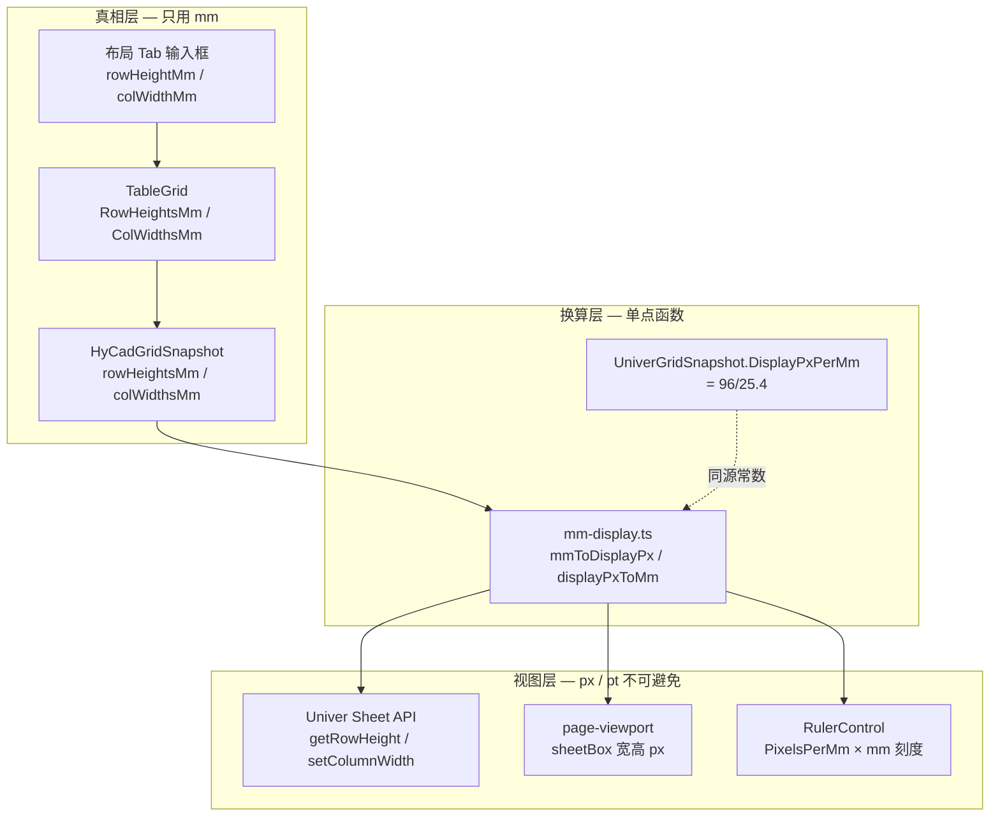
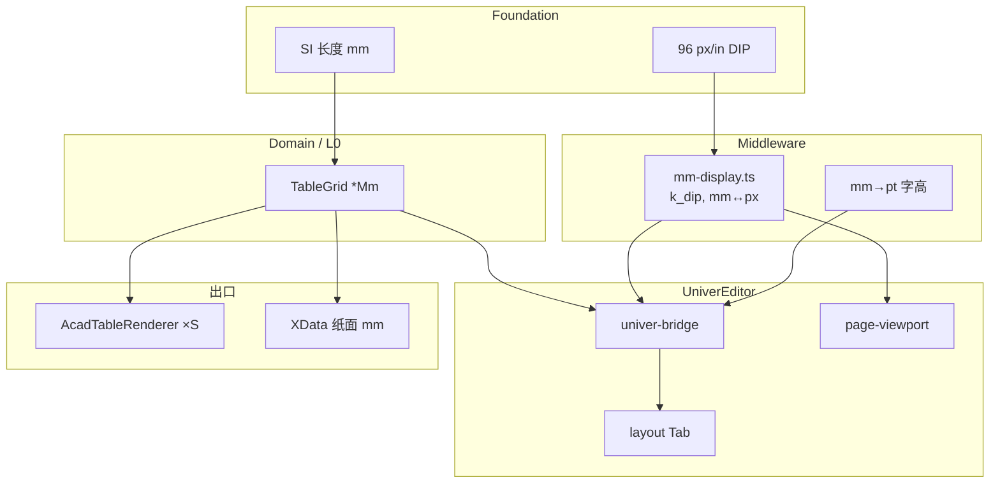

# UniverEditor 内部 mm 统一计算原则的第一性原理学习（new/12）

> **元信息**
> - 层级：Application（HyCAD 表格编辑器）+ Middleware（单位换算层）
> - 上游：[new/00 Domain 大白话](./00-Domain底层逻辑大白话-2026-06-26-180000.md) · [new/03 口径 B / 布局 Tab](./03-Univer布局Tab与mm尺寸对齐-02修订版-2026-06-27-011500.md) · [new/05 mm 标尺](./05-Univer内mm标尺与Facade白话-2026-06-28-120000.md) · [new/09 代码地图](./09-Univer-TS与C-WPF代码第一性白话地图-2026-06-28-180000.md)
> - 下游：布局 Tab 实现 · 落图 ×Scale · 标尺 Extension · 行列头 mm 标注
> - 同构：CAD 模型空间 1:1 mm · hymd 预览 `PreviewScale` · 印刷排版 pt/mm
> - 编制日期：2026-06-29
> - **性质**：`HyCADTool.UniverEditor` **内部计算口径总纲**——从「像素思维」全面转向 **mm 为唯一业务长度**；像素仅作 **显示边界适配**
> - **代码锚点**：[`mm-display.ts`](../../../src/HyCADTool.UniverEditor/Web/src/mm-display.ts) · [`univer-bridge.ts`](../../../src/HyCADTool.UniverEditor/Web/src/univer-bridge.ts) · [`TableEditorViewModel.cs`](../../../src/HyCADTool/Features/Tables/ViewModels/TableEditorViewModel.cs)

---

## 决策速览表

| 问题 | 结论 |
|---|---|
| **内部算什么单位？** | **纸面 mm**（与 `TableGrid.RowHeightsMm` / `ColWidthsMm` 同口径，见 new/03 口径 B） |
| **像素还在哪？** | 仅 **Univer/DOM/WPF 绘制边界**：把 mm 乘 `DISPLAY_PX_PER_MM` 后交给引擎 |
| **CAD 落图 Scale 算不算内部？** | **不算**。Scale 是 **渲染出口** 参数；Domain / Snapshot / 布局 Tab 一律 **纸面 mm 原值** |
| **预览缩放（fit/zoom）算不算真相？** | **不算**。`pixelsPerMm` / `pagePreviewScale` 是 **视口放大镜**，可随时改，不回写 Domain |
| **Univer 行高列宽 API 用 px 怎么办？** | **桥接层** `mmToRowDisplayPx` / `rowDisplayPxToMm` 集中换算；业务逻辑 **禁止** 直接读 px 当 mm |
| **旧 ×2 / ×1.6 / 22~140px 夹值？** | **已废弃**；新代码不得再引入「魔法像素系数」 |

---

## 目录

1. [§0 三句话先答](#0-三句话先答)
2. [一、问题重述](#一问题重述)
3. [二、脉络](#二脉络)
4. [三、15 问第一性拆解](#三15-问第一性拆解)
5. [四、统一计算架构（工程主文）](#四统一计算架构工程主文)
6. [五、例子](#五例子)
7. [六、用途小结](#六用途小结)
8. [七、延伸阅读](#七延伸阅读)
9. [八、知识图谱位置](#八知识图谱位置)
10. [九、文档元数据](#九文档元数据)

---

## §0 三句话先答

| 问题 | 结论 |
|---|---|
| **为什么要从像素转向 mm？** | CAD 模型空间、Domain 真相、用户工程习惯全是 **mm**；像素只是屏幕上的 **放大镜刻度**，不能当业务长度。 |
| **转向后谁存 mm、谁用 px？** | **C# Domain、Snapshot JSON、布局 Tab 输入框、OpLog、XData** 存 mm；**Univer Sheet API、Canvas、WPF RulerControl** 用 px，且 **只许通过换算层进出**。 |
| **一句话公式？** | 纸面长度 $L_{\mathrm{mm}}$ 为真相；屏幕 CSS 像素 $L_{\mathrm{px}} = L_{\mathrm{mm}} \cdot k_{\mathrm{dip}} \cdot z$，其中 $k_{\mathrm{dip}} = 96/25.4$，$z$ 为预览缩放（与 CAD Scale 无关）。 |

---

## 一、问题重述

**核心对象**：`HyCADTool.UniverEditor` 里所有与 **行高、列宽、页边距、字高、边框线宽、标尺刻度、纸张尺寸** 相关的量。

**痛点**：
- Univer 原生按 **像素** 管网格；早期桥接用 **假换算 + 夹值**，Univer 里看到的宽度与 CAD 表格 **对不上**（new/03 §3.1）。
- WPF 外挂标尺、网页 page-viewport、Univer zoom 各自维护 **pixelsPerMm**，容易 **分裂成多套「真相」**。
- 新人改代码时习惯「调 px 看起来舒服」， silently 污染 Domain。

**一句话答案**：**内部一律 mm；px/pt 只在 Adapter 边界出现；换算常量单点定义、双向可逆、禁止魔法系数。**

---

## 二、脉络

### 2.1 历史：像素思维从哪来

| 阶段 | 做法 | 问题 |
|---|---|---|
| P0 基线 | Univer 默认行高列宽（px）+ 硬编码 `×2` / `×1.6` | 与 `TableGrid` mm **无物理对应** |
| P1 富快照 | 样式字段已用 `textHeightMm`、`borders.*Mm` | 网格尺寸仍被 px 掩盖 |
| P2 口径 B（new/03） | 布局 Tab 露 **纸面 mm**；桥接改 `mm-display.ts` | 像素思维 **退出业务层** |
| 当前 | page-viewport / 标尺 / grid overlay 共用 `DISPLAY_PX_PER_MM` | 仍需 **本文收口**，防回潮 |

### 2.2 逻辑演化：三层长度模型



**内核解释**（非专业语言）：真正要记住的是「这张表每一行有多高、每一列有多宽」，就像用尺子量出来的毫米数；屏幕上的点阵只是把这个数 **放大或缩小** 给人看，不能反过来用点数当真实尺寸。

**结构工程类比**：**mm 真相 = 结构施工图标注尺寸**；**px = 打印店把图缩放到 A3 纸上的比例**。改打印比例不会让梁的真实跨度变长——同理，改 Univer 预览 zoom 不能改 `TableGrid`。

---

## 三、15 问第一性拆解

### 3.1 Q1 研究什么

**UniverEditor 内部「长度」应如何计量、存储、传递、显示**，使 Domain、Univer 视图、CAD 落图在 **纸面 mm** 上可验证一致。

### 3.2 Q2 为何诞生

工程表格软件的用户心智是 **「10mm 行高就是 10mm」**；AutoCAD 模型空间按 **1:1 mm** 存储（落图时再 ×Scale）。若编辑器内部用 px，则 **无法与规范、样表、落图验收** 对齐。

### 3.3 Q3 基本变量

| 符号 | 名称 | 单位 | 存储位置 | 是否真相 |
|---|---|---|---|---|
| $L_{\mathrm{mm}}$ | 纸面长度 | mm | `TableGrid`、Snapshot、布局 Tab | **是** |
| $k_{\mathrm{dip}}$ | DIP 像素密度 | px/mm | `DISPLAY_PX_PER_MM = 96/25.4` | 常数 |
| $z$ | 页面预览缩放 | 无量纲 | `pagePreviewScalePxPerMm / k_{\mathrm{dip}}` | 否 |
| $S$ | CAD 落图比例 | 无量纲 | `TableEditorViewModel.Scale` | 否（出口） |
| $L_{\mathrm{px}}$ | CSS 像素长度 | px | Univer/DOM/WPF | 否 |
| $L_{\mathrm{pt}}$ | 排版点 | pt | Univer 字号 `fs` | 视图派生 |

**符号说明**：
- $L_{\mathrm{mm}}$ — 纸面长度（Paper Length），单位：mm
- $k_{\mathrm{dip}}$ — 设备无关像素密度（Device-Independent Pixels per Millimeter），单位：px/mm，Windows/WPF/WebView2 约定 $96\,\mathrm{px} = 1\,\mathrm{in} = 25.4\,\mathrm{mm}$
- $z$ — 预览缩放因子（Preview Zoom），无量纲，仅影响屏幕 fit
- $S$ — CAD 落图比例（Plot Scale），无量纲，仅 `AcadTableRenderer` 出口
- $L_{\mathrm{px}}$ — CSS 像素长度，单位：px
- $L_{\mathrm{pt}}$ — 排版点（Point），$1\,\mathrm{in} = 72\,\mathrm{pt}$

### 3.4 Q4 公理 / 假设

1. **A1 真相公理**：`HyCAD.Tables` 的 `RowHeightsMm` / `ColWidthsMm` 是行列尺寸的 **唯一真相**（new/00 §1）。
2. **A2 口径 B 公理**（new/03 §3.3）：Univer 与布局 Tab 显示 **纸面 mm**；**仅 CAD 落图** 对几何 ×$S$；XData 存 **未放大** 的纸面 mm。
3. **A3 换算单点公理**：$k_{\mathrm{dip}}$ 在 TS 为 `DISPLAY_PX_PER_MM`，在 C# 为 `UniverGridSnapshot.DisplayPxPerMm`，**禁止第三套常数**。
4. **A4 边界公理**：凡调用 Univer `setRowHeight` / `getColumnWidth` 等 **px API** 的代码，必须在 **同一文件或 `mm-display.ts`** 成对出现正/逆换算，不得在外部散落 `* 1.6`。

**内核解释**：四条规矩就像施工图上的四条「必检项」——尺寸以标注为准、打印放大不算改结构、换算公式全项目共用一本、跟 Excel 内核说话时必须过翻译官。

**结构工程类比**：**A1 = 设计变更单以结构计算书为准**；**A2 = 施工图标注用名义尺寸、现场放样才乘施工比例**；**A3 = 全项目共用同一本《单位换算表》**；**A4 = 与厂家设备接口必须走标准法兰，不许现场焊死临时垫片**。

### 3.5 Q5 怎样抽象

把长度从「屏幕像素」抽象为 **带语义的长度类型**：

| 类型 | 后缀约定 | 允许出现的位置 |
|---|---|---|
| `PaperMm` | `*Mm` | Domain、Snapshot、消息 JSON、布局 Tab |
| `DisplayPx` | `*Px`（或 Univer API 裸 number） | `univer-bridge`、viewport、overlay、WPF 标尺 |
| `FontPt` | Univer `fs` | `mmToPoint(textHeightMm)` 出口 |

**禁止**：在 ViewModel / OpLog / Snapshot 字段名中出现 `Px` 作为业务长度。

### 3.6 Q6 哪些尺度

| 尺度 | 量级示例 | 内部单位 |
|---|---|---|
| 行高 | 5~10 mm（样表） | mm |
| 列宽 | 25 mm 起 | mm |
| 字高 | 3.5 mm 默认 | mm → pt 仅 Univer 渲染 |
| 边框 | 0.25 / 0.5 mm | mm |
| 页边距 | 10~25 mm | mm |
| A4 幅面 | 297×210 mm | mm |
| 预览 fit | 整纸缩进视口 | 导出 `pixelsPerMm`，**不持久化** |

### 3.7 Q7 数学本质

核心换算仅两条（独立行间公式）：

$$
L_{\mathrm{px}} = L_{\mathrm{mm}} \cdot k_{\mathrm{dip}} \cdot z
$$

**符号说明**：
- $L_{\mathrm{px}}$ — CSS 像素长度，单位：px
- $L_{\mathrm{mm}}$ — 纸面长度，单位：mm
- $k_{\mathrm{dip}}$ — 96/25.4 px/mm
- $z$ — 预览缩放，默认 1；page-viewport fit 时 $z = L_{\mathrm{px}}^{\mathrm{fit}} / (L_{\mathrm{mm}} \cdot k_{\mathrm{dip}})$

$$
L_{\mathrm{pt}} = L_{\mathrm{mm}} \cdot \frac{72}{25.4}
$$

**符号说明**：
- $L_{\mathrm{pt}}$ — Univer 字号（point），单位：pt
- $L_{\mathrm{mm}}$ — 字高纸面尺寸，单位：mm
- $72/25.4$ — pt/mm（印刷标准）

逆换算：

$$
L_{\mathrm{mm}} = \mathrm{round}\!\left(\frac{L_{\mathrm{px}}}{k_{\mathrm{dip}} \cdot z},\ 2\ \text{位小数}\right)
$$

**符号说明**：
- 分母中的 $z$ 在 **Univer 行列 px** 场景取 **1**（`mmToRowDisplayPx` 不含页面 fit；fit 由 sheetBox 外层承担，见 §4.3）

### 3.8 Q8 核心简化

1. **Univer 内部继续用 px**——不重写 Univer 内核，只在 **桥** 做 mm↔px。
2. **预览缩放与 CAD Scale 解耦**：$z$ 只管「看得清」；$S$ 只管「落图多大」。
3. **DPR 不进业务公式**：`devicePixelRatio` 由浏览器/WebView2 处理 backing store；业务层只用 **CSS px（DIP）**（`mm-display.ts` 文件头注释）。

### 3.9 Q9 最大陷阱

| 陷阱 | 症状 | 正确做法 |
|---|---|---|
| **把 Univer px 当 mm** | 布局 Tab 显示 47「mm」，实际 Domain 是 25 mm | 导出/回写必须 `displayPxToMm` |
| **在桥接里夹 px 上下限** | 宽列被压到 140px，落图变窄 | 删除 clamp；fit 在 `page-viewport` 做整体缩放 |
| **混淆 $z$ 与 $S$** | 改 Scale 时期望 Univer 网格变密 | Scale 只下发 `setScale` 显示；不改 `rowHeightsMm` |
| **WPF 标尺 ppm 与 JS 不同步** | 刻度与网格错缝 | 共用 $k_{\mathrm{dip}} \cdot z_{\mathrm{univer}}$，或改 SheetExtension（new/05 方案 A） |
| **C#/TS 种子常量分裂** | 行列数推导不一致 | `SeedRowHeightMm=5`、`SeedColWidthMm=25` 两边同名同值 |
| **HTML 导出另搞比例** | `HtmlTableExportOptions.MmToPxRatio` 与编辑器不一致 | 默认 96/25.4，与 `DisplayPxPerMm` 对齐 |

**内核解释**：这些坑本质是「把放大镜上的刻度当成了真实长度」，或「工程比例和看图比例搅在一起」。

**结构工程类比**：**夹 px 上限 ≈ 为了打印清楚擅自改梁截面**——视图省事，真相被篡改。

### 3.10 Q10 如何验证

| 验收项 | 操作 | 期望 |
|---|---|---|
| V1 布局 Tab 真值 | 选中列 → 读列宽 mm 框 | 与 `TableGrid.ColWidthsMm[i]` 一致 |
| V2 往返 | 改列宽 30 mm → 导出 Snapshot | JSON 中 `colWidthsMm[i]===30` |
| V3 标尺 | 横标尺 0~100 mm 与网格累计宽度 | 20 mm 大格对齐列边界（Extension 或 overlay） |
| V4 落图 | Scale=50 落 CAD | 模型空间列宽 = 30×50 mm；拾取 XData 仍为 30 mm |
| V5 常数 | 全局搜 `1.6`、`22`、`140` 于 UniverEditor | 无业务夹值残留 |

### 3.11 Q11 边界在哪

- **Univer 最小行高/列宽**：引擎内部可能有 px 下限；若触发，应在 **换算层** 记录 warning，**不得** silent 改 Domain mm。
- **自动 fit 列宽**（Excel 式 double-click）：读 Univer 结果 px → **立即** `colDisplayPxToMm` 回写；用户看到的是 mm。
- **竖排 / 合并 / 照片格**：拓扑用 Index，尺寸仍走 mm track。
- **非表格元素**（Ribbon 高度、公式栏）：不参与 mm 真相，属于 chrome。

### 3.12 Q12 如何工程化

见 **§四**（分层职责、文件清单、消息协议、Do/Don't）。

### 3.13 Q13 上游依赖（In-edges）

| 上游 | 提供什么 |
|---|---|
| [new/00 Domain](./00-Domain底层逻辑大白话-2026-06-26-180000.md) | `TableGrid` 轨道 mm、OpLog 语义 |
| [new/03 口径 B](./03-Univer布局Tab与mm尺寸对齐-02修订版-2026-06-27-011500.md) | 纸面 mm vs CAD ×Scale 分工 |
| `HyCAD.Tables` | `RowHeightsMm` / `ColWidthsMm` 字段定义 |
| Windows DIP 约定 | 96 px/in → $k_{\mathrm{dip}}$ |
| Univer Sheet API | px 行高列宽、pt 字号（**不可改**） |

### 3.14 Q14 下游应用（Out-edges）

| 下游 | 消费什么 |
|---|---|
| `AcadTableRenderer` | Snapshot mm × $S$ → 模型空间 |
| `TablePickService` / XData | 纸面 mm 原样读回 |
| [new/05 标尺方案 A](./05-Univer内mm标尺与Facade白话-2026-06-28-120000.md) | `DISPLAY_PX_PER_MM × parentScale` 画刻度 |
| 布局 Tab [`layout-tab-inject.ts`](../../../src/HyCADTool.UniverEditor/Web/src/layout-tab-inject.ts) | 选区 mm 框、Scale 框 |
| `HtmlTableAdapter` | `MmToPxRatio` 导出 HTML |

### 3.15 Q15 同构关系（Isomorphism）

| 同构族 | 共享结构 | HyCAD 实例 |
|---|---|---|
| **物理长度 → 视图缩放** | $L_{\mathrm{view}} = L_{\mathrm{true}} \cdot k$ | mm → CSS px；mm → CAD×Scale |
| **排版 pt/mm** | 72 pt/in | `mmToPoint` 字高 |
| **hymd PreviewScale** | `PixelsPerMm` 随 zoom | `page-preview-scale.ts` |
| **CAD 标注比例** | 模型尺寸 vs 图纸尺寸 | 口径 B：编辑用名义 mm，出图用 Scale |

---

## 四、统一计算架构（工程主文）

### 4.1 分层职责（必须遵守）

```text
┌─────────────────────────────────────────────────────────┐
│ L0  Domain / C# ViewModel          只读写 mm            │
│     TableGrid, TableEditorViewModel, OpLog              │
├─────────────────────────────────────────────────────────┤
│ L1  快照 / 消息 JSON               字段名 *Mm           │
│     HyCadGridSnapshot, hyCadTrackSizes.sizesMm          │
├─────────────────────────────────────────────────────────┤
│ L2  换算层（单点）                   mm ↔ px / mm ↔ pt   │
│     mm-display.ts, UniverGridSnapshot.DisplayPxPerMm    │
├─────────────────────────────────────────────────────────┤
│ L3  Univer 桥接                      load/export/fit     │
│     univer-bridge.ts                                    │
├─────────────────────────────────────────────────────────┤
│ L4  视口 / 标尺 / 页面框             只用 L2 输出 px     │
│     page-viewport, page-box-layout, ruler-overlay, WPF  │
└─────────────────────────────────────────────────────────┘
```

### 4.2 常数表（全项目同源）

| 常数 | TS | C# | 值 | 用途 |
|---|---|---|---|---|
| DIP px/mm | `DISPLAY_PX_PER_MM` | `UniverGridSnapshot.DisplayPxPerMm` | 96/25.4 ≈ 3.7795 | 长度 px↔mm |
| pt/mm | `MM_TO_POINT`（`univer-bridge.ts`） | （落图侧自有换算） | 72/25.4 | Univer 字号 |
| 种子行高 | `SEED_ROW_HEIGHT_MM` | `TableEditorViewModel.SeedRowHeightMm` | 5 | 纸面推导行数 |
| 种子列宽 | `SEED_COL_WIDTH_MM` | `TableEditorViewModel.SeedColWidthMm` | 25 | 纸面推导列数 |
| 默认行高 fallback | `DEFAULT_ROW_HEIGHT_MM` | `DefaultRowHeightMm` | 10 | 空 track 回填 |
| 默认列宽 fallback | `DEFAULT_COL_WIDTH_MM` | `DefaultColWidthMm` | 25 | 空 track 回填 |

### 4.3 两种「缩放」不可混

| 名称 | 变量 | 谁改 | 影响什么 |  persisted? |
|---|---|---|---|---|
| **页面预览缩放** | $z$ → `pixelsPerMm` | 用户拖 Univer 缩放条 / page fit | 屏幕上看多大 | 否 |
| **CAD 落图比例** | $S$ → `Scale` | 布局 Tab 比例框 / hy 面板默认 | 仅 `AcadTableRenderer` | 会话内可改，重开恢复 hy |

**关键实现**：
- `loadSnapshot`：`mmToRowDisplayPx(rowHeightsMm[i])` — **不含** $S$
- `PushScaleAsync`：只 `setScale` 到布局 Tab — **不改** grid
- `page-viewport`：`computeFitPxPerMm` 算 $z$ 使 sheetBox 进 canvas — **不回写** track

### 4.4 文件职责清单

| 文件 | 层级 | mm 相关职责 |
|---|---|---|
| [`mm-display.ts`](../../../src/HyCADTool.UniverEditor/Web/src/mm-display.ts) | L2 | **换算真理函数**；纸面推导行列数 |
| [`univer-bridge.ts`](../../../src/HyCADTool.UniverEditor/Web/src/univer-bridge.ts) | L3 | Snapshot↔Workbook；`rowHeightsMm` 数组；autoFit 回写 mm |
| [`layout-view-state.ts`](../../../src/HyCADTool.UniverEditor/Web/src/layout-view-state.ts) | L1 | 页边距 mm、纸型 mm、`canvasSheetGapMm` |
| [`paper-metrics.ts`](../../../src/HyCADTool.UniverEditor/Web/src/paper-metrics.ts) | L1 | 纸面可用区 mm；display 仅用于 UI 尺寸标签 |
| [`page-viewport.ts`](../../../src/HyCADTool.UniverEditor/Web/src/page-viewport.ts) | L4 | sheetBox px = mm × ppm；**禁止**改 Domain |
| [`page-box-layout.ts`](../../../src/HyCADTool.UniverEditor/Web/src/page-box-layout.ts) | L4 | 导出 `pixelsPerMm` 给标尺 |
| [`layout-tab-inject.ts`](../../../src/HyCADTool.UniverEditor/Web/src/layout-tab-inject.ts) | L1 UI | 行高/列宽/Scale **mm 框** |
| [`RulerControl.cs`](../../../src/HyCADTool.UniverEditor/Views/Controls/RulerControl.cs) | L4 | 刻度 = `MinorMm * PixelsPerMm`（输入 ppm，内部乘 mm） |
| [`TableEditorViewModel.cs`](../../../src/HyCADTool/Features/Tables/ViewModels/TableEditorViewModel.cs) | L0 | 纸面 mm 命令、Seed 常数、Scale 属性 |
| [`UniverGridSnapshot.cs`](../../../src/HyCADTool/Features/Tables/Presentation/UniverGridSnapshot.cs) | L1 | C# 侧 `DisplayPxPerMm` |

### 4.5 消息协议（JSON 一律 mm）

| 消息 | 方向 | mm 字段 |
|---|---|---|
| `loadSnapshot` | C#→JS | `rowHeightsMm[]`, `colWidthsMm[]`, `cells[].textHeightMm`, `borders.*Mm` |
| `exportSnapshot` | JS→C# | 同上（px 已逆换算） |
| `hyCadTrackSizes` | JS→C# | `sizesMm[]` |
| `setViewport` | C#→JS | `margin*Mm`, `targetWidthMm` |
| `setScale` | C#→JS | `scale`（无量纲，**非 mm**） |

### 4.6 Do / Don't（代码审查清单）

**Do**
- 新字段：`fooMm: number`
- 进 Univer 前：`mmToRowDisplayPx(x)`
- 出 Univer 后：`rowDisplayPxToMm(px)`
- 纸面面积/累计：`sum(rowHeightsMm)`
- 改 $k_{\mathrm{dip}}$：**只改** `mm-display.ts` + `UniverGridSnapshot.cs` 两处

**Don't**
- `widthPx` 进 Snapshot / OpLog
- `* 2`、`* 1.6`、`Math.min(px, 140)` 当业务逻辑
- 在 layout Tab 用 Univer 裸 px 填 mm 框
- 把 `Scale` 乘进行高列宽再存 Domain
- 新建第三套 `96/25.4` 字面量（应用命名常数）

### 4.7 与 Univer 限制的共处策略

Univer 的 `getRowHeight()` 返回 **sheet 坐标 px**，且可能有 **整数化/最小值**。策略：

1. **写入**：`setRowHeight(mmToRowDisplayPx(mm))`
2. **读取**：`displayPxToMm(getRowHeight())` — 接受 ±0.01 mm 级舍入误差
3. **争议时**：以 **Domain / 布局 Tab 用户输入 mm** 为准，强制 re-apply snapshot

---

## 五、例子

### 5.1 微型例：25 mm 列宽的一生

1. Domain：`ColWidthsMm[2] = 25`
2. Snapshot 下行：`colWidthsMm: [..., 25, ...]`
3. 桥接：`setColumnWidth(2, mmToColDisplayPx(25))` → ≈ 94.49 px
4. 用户拖预览 zoom：sheetBox 变宽，**JSON 仍为 25**
5. Scale=50 落 CAD：模型空间 1250 mm 宽；拾取 XData → 25 mm

**结构工程类比**：**25 mm = 梁截面名义宽度**；**94 px = BIM 视图里显示的像素宽**；**1250 mm = 施工放样放大 50 倍**——三张「图」数字不同，**标注册**上仍是 25。

### 5.2 反例：在 TS 里写 `colWidth = px / 1.6`

**后果**：同一 px 除数随 DPI/zoom 漂移，Domain 与 CAD 永久对不齐。**禁止再引入。**

### 5.3 用途例：autoFit 列宽

用户双击列边界 → Univer 扩列 → `exportAutoFitColWidths` 读 px → `colDisplayPxToMm` → `hyCadTrackSizes.sizesMm` → C# `SetTrackSizesMm` → OpLog 记 **mm**。

---

## 六、用途小结

本文把 UniverEditor 从「像素凑合显示」收口为 **mm 真相 + 单点 px 适配**，使布局 Tab、Snapshot、CAD 落图、拾取 XData 可在 **纸面 mm** 上闭环验收；开发人员改尺寸时 **只改 mm**，px 只交给 `mm-display.ts` 一条管道。

---

## 七、延伸阅读

| 文档 | 内容 |
|---|---|
| [new/03](./03-Univer布局Tab与mm尺寸对齐-02修订版-2026-06-27-011500.md) | 口径 B 产品决策 |
| [new/05](./05-Univer内mm标尺与Facade白话-2026-06-28-120000.md) | 标尺 ppm 与 Extension |
| [new/09](./09-Univer-TS与C-WPF代码第一性白话地图-2026-06-28-180000.md) | 全项目文件地图 |
| [new/10](./10-JS-TS-WPF-WebView2关系-第一性原理学习-2026-06-28-190000.md) | WebView2 边界 |
| `docs/product-discovery/table/008-*` | AC 阶段 CAD 表格落图 |

---

## 八、知识图谱位置

- **层级**：Application（HyCAD UniverEditor）← Middleware（单位换算）← Foundation（SI 长度 mm）
- **上游（In）**：Domain `TableGrid` · Windows DIP · Univer px API
- **下游（Out）**：CAD Renderer · XData · 标尺/布局 Tab
- **同构（≅）**：hymd PreviewScale · 印刷 pt/mm · CAD 标注比例



---

## 九、文档元数据

- **创建日期**：2026-06-29
- **维护者**：HyCAD 表格 / Univer 路线
- **后续扩展建议**：
  - `12a-UniverEditor-mm-MM-舍入与Univer最小px.md` — 深钻引擎下限与验收容差
  - `12b-UniverEditor-mm-MM-SheetExtension标尺实现.md` — new/05 方案 A 与 ppm 同源
  - 代码：抽 `HyCAD.Tables` 共享 `PaperDisplayConstants`（C# 单点常数），TS 继续 `mm-display.ts`
- **关联 Issue/任务**：布局 Tab 行列 mm 输入 · 撤 WPF 外挂标尺 · 落图 ×Scale 联调
