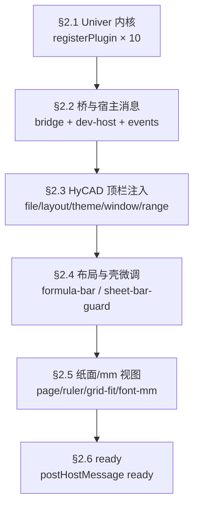
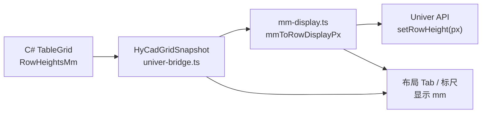
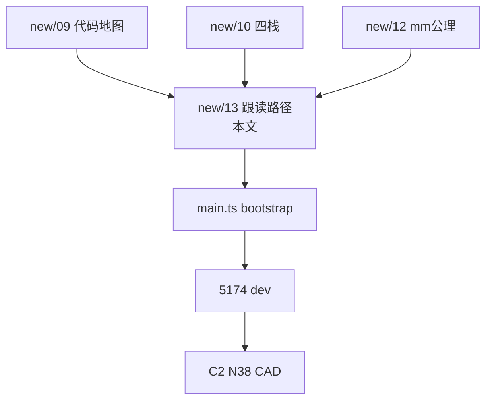

# UniverEditor 源码跟读学习路径（new/13）

> **元信息**
> - 层级：Application（HyCAD `HyCADTool.UniverEditor` 实战读码）
> - 上游：[new/09 代码地图](./09-Univer-TS与C-WPF代码第一性白话地图-2026-06-28-180000.md) · [new/10 四栈关系](./10-JS-TS-WPF-WebView2关系-第一性原理学习-2026-06-28-190000.md) · [new/12 mm 统一计算](./12-UniverEditor内部mm统一计算原则-第一性原理学习-2026-06-29-120000.md) · [Web README-dev](../../../src/HyCADTool.UniverEditor/Web/README-dev.md)
> - 下游：改布局 Tab / 字号 mm / 标尺 / 落图桥接；5174 浏览器 dev → C2→N38 CAD 验收
> - 同构：new/09 = **字典**；new/10 = **为什么四件套**；new/12 = **mm 公理**；**本文 = 按 boot 顺序跟读 + 动手练习**
> - 编制日期：2026-06-29
> - **代码快照**：`Web/src` **39 个** TS/TSX 源文件（不含 `dist`）；`main.ts` `bootstrap()` **约 30 个** `install*` / 注册调用

---

## 决策速览表

| 你想… | 先读本文章节 | 再打开文件 |
|---|---|---|
| 从零跟读 TS 入口 | [§2 bootstrap 六段](#二bootstrap-跟读顺序六段) | `main.ts` |
| 懂 HyCAD 注入模式 | [§3 六桶分类](#三websrc-六桶分类39-文件) | `*-inject.ts` |
| 懂 mm 在哪进出 | [§4 mm 数据流](#四mm-数据流跟读锚点) + [new/12](./12-UniverEditor内部mm统一计算原则-第一性原理学习-2026-06-29-120000.md) | `mm-display.ts` → `univer-bridge.ts` |
| 5174 自测 | [§5 练习清单](#五动手练习5174-五关) | `dev-host.ts` · `dev-panel.ts` |
| 改完回 CAD | [§6 C# 对读](#六c-侧对读-net8-壳--net48-桥) | `UniverSessionLifecycle.cs` |
| new/09 之后新增模块 | [§7 增量清单](#七相对-new09-的增量模块2026-06-29) | 见表 |

---

## 目录

1. [§0 三句话先答](#0-三句话先答)
2. [一、问题重述](#一问题重述)
3. [二、bootstrap 跟读顺序（六段）](#二bootstrap-跟读顺序六段)
4. [三、Web/src 六桶分类（39 文件）](#三websrc-六桶分类39-文件)
5. [四、mm 数据流跟读锚点](#四mm-数据流跟读锚点)
6. [五、动手练习（5174 五关）](#五动手练习5174-五关)
7. [六、C# 侧对读（net8 壳 + net48 桥）](#六c-侧对读-net8-壳--net48-桥)
8. [七、相对 new/09 的增量模块（2026-06-29）](#七相对-new09-的增量模块2026-06-29)
9. [八、五种代码模式（读码语法糖）](#八五种代码模式读码语法糖)
10. [九、知识图谱位置](#九知识图谱位置)
11. [十、文档元数据](#十文档元数据)

---

## §0 三句话先答

| 问题 | 结论 |
|---|---|
| **跟读从哪一行开始？** | `Web/src/main.ts` 的 `bootstrap()`：先 **Univer 插件栈** → **桥 + 事件** → **HyCAD 注入 Tab/Ribbon** → **页面/mm 视图层**。顺序即依赖顺序。 |
| **HyCAD 代码和 Univer 官方代码怎么分？** | **Univer**：`@univerjs/*` 包 + `registerPlugin`。 **HyCAD**：文件名带 `inject` / `layout` / `hycad` / `paper` / `ruler` / `mm` / `bridge` / `dev-*`，以及 `global.css`。 |
| **怎么学 TS 又不迷路？** | **5174 浏览器 dev**（`npm run dev`）改 inject/CSS → 看 HMR；**不要**一上来读 `ruler-overlay.ts` 900 行——按本文 **五关练习** 递进。 |

---

## 一、问题重述

**核心对象**：`src/HyCADTool.UniverEditor` —— net8 WPF + WebView2 宿主 + Vite 打包的 TS 扩展层。

**痛点**：
- [new/09](./09-Univer-TS与C-WPF代码第一性白话地图-2026-06-28-180000.md) 是**全量字典**（25→39 文件已膨胀），缺**阅读顺序**；
- [new/10](./10-JS-TS-WPF-WebView2关系-第一性原理学习-2026-06-28-190000.md) 讲四栈原理，缺**本仓库 boot 链**；
- 新人打开 `main.ts` 看见一长串 `install*`，不知先懂谁。

**一句话答案**：把 `bootstrap()` 切成 **六段**跟读；每段只认 **1～3 个文件**；mm 口径统一见 [new/12](./12-UniverEditor内部mm统一计算原则-第一性原理学习-2026-06-29-120000.md)。

---

## 二、bootstrap 跟读顺序（六段）

> 对照源码：`src/HyCADTool.UniverEditor/Web/src/main.ts` 第 198～391 行。



### §2.1 Univer 内核（第 200～278 行）

**读什么**：`new Univer` → 一串 `registerPlugin` → `createUnit(UNIVER_SHEET, DEMO_WORKBOOK_DATA)`。

| 顺序 | 插件 | 作用（白话） |
|---|---|---|
| 1 | `UniverRenderEnginePlugin` | 画布渲染引擎 |
| 2 | `UniverFormulaEnginePlugin` | 公式计算 |
| 3 | `UniverUIPlugin` | 顶栏/工具栏容器 `#app` |
| 4 | `UniverDocsPlugin` + UI | 文档（表格附属） |
| 5 | `UniverSheetsPlugin` + UI | **网格本体** + 底栏 sheetBar |
| 6 | Formula / Numfmt 插件 | 公式栏、数字格式 |

**学习要点**：
- `FUniver.newAPI(univer)` 得到 **Facade API**（`univerAPI`），HyCAD 后续**几乎只通过它**操作表格。
- `window.univer` / `window.univerAPI` 挂全局，方便 DevTools 调试。

**结构工程类比**：插件注册 = **先装专业分包再封顶**——Render/UI 是机电装修，Sheet 是主体结构。

### §2.2 桥与宿主消息（第 290～363 行）

**读什么顺序**：

1. `dev-host.ts` → `installDevHostIfNeeded` —— 无 WebView2 时 mock `postHostMessage`
2. `univer-bridge.ts` → `installHyCadBridge` + `handleHostCommand` —— **快照 load/export**、C# 下行命令
3. `configureHyCadAutoFitPost` —— 布局 Tab「自动行高列宽」回传 C#
4. 事件订阅：
   - `SheetValueChanged` → `{ type: 'cellChanged' }`
   - `SelectionChanged` → `{ type: 'selectionChanged' }` + 更新布局 Tab / 字号 mm
5. `window.chrome.webview.addEventListener('message')` —— **WebView2 唯一入口**（CAD 宿主）

**下行消息示例**（C# → TS）：`loadSnapshot` · `setViewport` · `setScale` · `setStructureMode`  
**上行消息示例**（TS → C#）：`ready` · `hyCadLayout` · `hyCadFileAction` · `snapshot`

> 消息全集仍查 [new/09 §七](./09-Univer-TS与C-WPF代码第一性白话地图-2026-06-28-180000.md)。

### §2.3 HyCAD 顶栏注入（第 367～373 行）

| 调用 | 文件 | 产出 UI |
|---|---|---|
| `installHyCadFileTab` | `file-tab-inject.ts` | 最左「文件▾」 |
| `installHyCadLayoutTab` | `layout-tab-inject.ts` | 「布局」Tab + 第二行 Ribbon |
| `installHyCadThemeTab` | `theme-menu-inject.ts` | 「主题▾」 |
| `installHyCadWindowControls` | `window-controls-inject.ts` | — □ ✕ |
| `installHyCadRibbonRangeMenu` | `ribbon-range-inject.ts` | 开始 Tab「落图范围▾」 |

**模式**：DOM 查询 Univer 顶栏 → 插入 HyCAD 节点 → 点击时 `postHostMessage({ type, ... })`。

### §2.4 布局与壳微调（第 375～378 行）

| 调用 | 文件 | 作用 |
|---|---|---|
| `installViewportResizeFix` | `main.ts` 内联 | WebView 尺寸变化时补发 `resize` |
| `installFormulaBarLayout` | `formula-bar-layout.ts` | 公式栏与 HyCAD 第二行 Ribbon 对齐 |
| `installSheetBarGuard` | `sheet-bar-guard.ts` | 限制底栏 sheet 行为 |

### §2.5 纸面 / mm 视图层（第 380～387 行）

| 调用 | 文件 | 作用 |
|---|---|---|
| `installRulerOverlay` | `ruler-overlay.ts` | 页面外 mm 标尺（canvas） |
| `installGridRulerOverlay` | `grid-ruler-overlay.ts` | 行列头 mm 标注 |
| `registerPaperBoundaryExtension` | `paper-extension.ts` | Univer 扩展：纸边界绘制 |
| `installPageViewport` | `page-viewport.ts` | Word 式白底页面框 |
| `installLayoutGridFit` | `layout-grid-fit.ts` | 布局 Tab：网格铺满纸面、禁滚动 |
| `installHeadersToggle` | `sheet-headers.ts` | 行列头显示开关 |
| `installFontSizeMmControl` | `font-size-mm-inject.ts` | Ribbon **mm 字号**替换原生 pt |
| `installNativeRowColMmGuard` | `native-units-guard.ts` | 隐藏原生 px/pt 行高列宽菜单 |

**跟读建议**：先 `mm-display.ts`（常数）→ `layout-view-state.ts`（状态）→ `page-viewport.ts`（页面框）→ 最后才 `ruler-overlay.ts`（大文件）。

### §2.6 ready（第 389 行）

```typescript
postHostMessage({ type: 'ready' });
```

C# `UniverSessionLifecycle` 收到 `ready` 后才 `LoadSnapshotAsync` —— **下行快照必须在 Web 就绪后**。

---

## 三、Web/src 六桶分类（39 文件）

| 桶 | 职责 | 文件 |
|---|---|---|
| **A 入口/桥** | boot、快照、宿主命令 | `main.ts` · `univer-bridge.ts` · `dev-host.ts` · `dev-panel.ts` · `demo-workbook.ts` |
| **B 顶栏 inject** | 伪 Tab、菜单、窗口键 | `file-tab-inject.ts` · `layout-tab-inject.ts` · `theme-menu-inject.ts` · `window-controls-inject.ts` · `ribbon-range-inject.ts` · `font-size-mm-inject.ts` · `ribbon-toolbar-locate.ts` · `ribbon-tab-style.ts` · `hycad-dropdown.ts` |
| **C 布局 Ribbon** | 第二行 UI + 状态 | `layout-ribbon-panel.tsx` · `layout-ribbon-model.ts` · `layout-margin-popover.tsx` · `layout-canvas-gap-popover.tsx` · `layout-grid-fit.ts` · `layout-sheet-scrollbars.ts` |
| **D mm/纸面** | 真相换算 + 页面几何 | `mm-display.ts` · `layout-view-state.ts` · `page-margins.ts` · `page-canvas-gap.ts` · `paper-sheet.ts` · `paper-metrics.ts` · `page-box-layout.ts` · `font-size-mm-model.ts` · `font-size-mm-panel.tsx` · `native-units-guard.ts` |
| **E 视图/标尺** | 探针、canvas、扩展 | `univer-viewport.ts` · `viewport-report.ts` · `page-viewport.ts` · `page-preview-scale.ts` · `ruler-overlay.ts` · `grid-ruler-overlay.ts` · `paper-extension.ts` · `paper-sheet.ts` · `sheet-headers.ts` |
| **F 壳微调** | 公式栏、底栏 guard | `formula-bar-layout.ts` · `sheet-bar-guard.ts` · `global.css` |

```text
         ┌─ B inject（用户点的按钮）
         │
A main ──┼─ C layout Ribbon（布局 Tab 专属）
         │
         ├─ D mm（业务长度真相）
         │
         └─ E 视图（把 mm 画到屏上）
              ↑ 读 D 再读 E
```

---

## 四、mm 数据流跟读锚点

> 公理详述：[new/12](./12-UniverEditor内部mm统一计算原则-第一性原理学习-2026-06-29-120000.md)



**跟读三问**（每个 mm 相关 PR 必答）：

1. 这个变量是 **纸面 mm** 还是 **显示 px**？
2. 有没有经过 `mm-display.ts` 或 `rowDisplayPxToMm`？
3. 会不会 **回写 Domain**（须走 `hyCadLayout` / C# `OnLayoutOp`）？

**字号 mm 新链（2026-06）**：

```text
选区变化 → updateFontSizeMmFromSelection (font-size-mm-model.ts)
         → FontSizeMmPanel (font-size-mm-panel.tsx)
         → applyFontSizeMmToSelection → Univer 样式 API
font-size-mm-inject.ts：hide 原生 pt 控件 + React mount 到 Ribbon
native-units-guard.ts：hide 右键菜单 px 行高列宽
```

---

## 五、动手练习（5174 五关）

环境：`cd src/HyCADTool.UniverEditor/Web && npm run dev` → http://127.0.0.1:5174

| 关 | 目标 | 改哪里 | 验收 |
|---|---|---|---|
| **1 认门** | 找到 Tab 行 DOM | 只读 `file-tab-inject.ts` 末尾 `querySelector` | DevTools 看到 `.hycad-file-tab` |
| **2 改皮** | 布局 Tab 激活色 | `ribbon-tab-style.ts` 或 `global.css` | HMR 秒变，无需 build |
| **3 跟消息** | 看清 loadSnapshot | `dev-panel` 点「人员样表」→ 断点 `handleHostCommand` | Console 无 error，merge 正确 |
| **4 mm 框** | 改行高 mm | 布局 Tab 输入框 → 读 `layout-tab-inject` 的 `sendLayoutOp` | mock 提示「仅 CAD」但 **Univer 网格应变** |
| **5 导出** | 快照 JSON | `exportSnapshot` | `cells[]` 含 `textHeightMm` 等 v2 字段 |

**过关后**：`npm run build` → `dotnet build` → **C2 → N38** 验桥（见 [README-dev §验收](../../../src/HyCADTool.UniverEditor/Web/README-dev.md)）。

---

## 六、C# 侧对读（net8 壳 + net48 桥）

| 顺序 | 文件 | 与 TS 的接点 |
|---|---|---|
| 1 | `EditorLauncher.cs` | 反射入口 `Show()`；`HostContext` 注入 |
| 2 | `Views/UniverEditorWindow.xaml.cs` | 创建 `WebView2` · 挂 `UniverSessionLifecycle` |
| 3 | `Services/UniverSessionLifecycle.cs` | `VirtualHostName` 映射 `dist/` · `WebMessageReceived` · `LoadSnapshotAsync` |
| 4 | net48 `UniverTableEditorHostBridge` | 解析 `hyCadLayout` / `snapshot` / `hyCadFileAction` |
| 5 | `TableEditorViewModel.cs` | Domain 真相 · `OnLayoutOp` |

**跟读 TS 时的 C# 镜像**：

```text
TS postHostMessage({ type:'hyCadLayout', op:'setRowHeight', ... })
    → UniverSessionLifecycle.OnWebMessageReceived
    → HostContext.HandleLayoutOp (net48)
    → TableEditorViewModel.OnLayoutOp
    → 下次 PushInitialSnapshot / export 回 TS
```

---

## 七、相对 new/09 的增量模块（2026-06-29）

| 模块 | 作用 | 为何新 |
|---|---|---|
| `layout-grid-fit.ts` | 布局 Tab 下网格铺满纸面、锁滚动 | Word 式固定版面 |
| `layout-sheet-scrollbars.ts` | 布局模式滚动条显隐 | 配合 grid-fit |
| `font-size-mm-inject.ts` | Ribbon mm 字号宿主 | 口径 B 延伸 |
| `font-size-mm-model.ts` | 字号 mm 状态 + 选区同步 | 与 `mm-display` CAD 字高表 |
| `font-size-mm-panel.tsx` | mm 字号 React 控件 | |
| `ribbon-toolbar-locate.ts` | 查找 Univer Ribbon DOM | inject 共用 |
| `native-units-guard.ts` | 屏蔽原生 px/pt 入口 | 防 mm 口径被污染 |
| `viewport-report.ts` | 视口指标上报/调试 | 标尺对齐辅助 |

> [new/09](./09-Univer-TS与C-WPF代码第一性白话地图-2026-06-28-180000.md) 的「25 个 TS 文件」计数已过时；以本文 **39 源文件** 为准。

---

## 八、五种代码模式（读码语法糖）

### 8.1 `installXxx(univerAPI?)`

**含义**：模块初始化，挂 DOM / 订阅 / 注册扩展；在 `bootstrap()` **末尾集中调用**。

### 8.2 `subscribeYyy(listener)`

**含义**：轻量 pub/sub（`Set<() => void>`），用于 **layout-view-state**、**layout-ribbon-model**、**snapshotDims** 跨模块同步。

### 8.3 `postHostMessage({ type, ... })`

**含义**：TS → C# JSON 总线；5174 下由 `dev-host` 拦截并 `console.log` 或 mock。

### 8.4 `univerAPI.getActiveWorkbook()?.getActiveSheet()`

**含义**：Univer Facade 链式取当前表；改网格尺寸、样式、选区都从这里进。

### 8.5 React 注入（`createRoot` + `createElement`）

**示例**：`font-size-mm-inject.ts` 把 `FontSizeMmPanel` 挂到 Ribbon 工具栏空位——**不是**整页 React SPA，而是 **局部 island**。

---

## 九、知识图谱位置

**层级**：Application · HyCAD UniverEditor 读码路径

**上游**：new/09（字典）· new/10（四栈）· new/12（mm 公理）· first-principles [TS 网页文档13](file:///e:/cursor/research/Domain/计算机科学/Web前端与TypeScript/13-TypeScript网页开发-第一性原理学习.md)（通用 TS 原理）

**下游**：布局 Tab 迭代 · 字号 mm · 落图 · 人员样表 fixture 同步



---

## 十、文档元数据

- **创建日期**：2026-06-29
- **维护者**：Cursor Agent（first-principles-deep-dive + product-discovery 系列）
- **建议后续**：
  - new/14：`font-size-mm-*` 单链深钻（inject → model → panel → Univer 样式 API）
  - new/15：`layout-grid-fit` + `layout-sheet-scrollbars` 布局 Tab 固定网格机制
  - 回写 new/09 元信息：TS 文件数 25→39，并链到本文

**读完导航**：
1. 打开 `main.ts`，按 §2 六段加书签注释  
2. 跑通 §5 五关  
3. 再读 [new/09 §七 消息协议](./09-Univer-TS与C-WPF代码第一性白话地图-2026-06-28-180000.md) 查具体 `type` 字段
