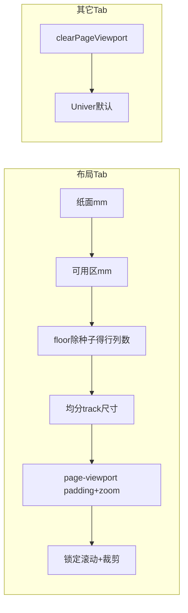

@ ```browser_element The user selected this node in the browser preview (blue outline in the screenshot). tag: canvas dom_path: div#hycad-editor-root > div#app > div.univer-flex.univer-h-full.univer-min-h-0.univer-flex-col.univer-bg-white.dark:!univer-bg-gray-800 > section.univer-relative.univer-flex.univer-min-h-0.univer-flex-1.univer-flex-col > div.univer-grid.univer-h-full.univer-grid-cols-[auto_1fr_auto].univer-grid-rows-[100%].univer-overflow-hidden.hycad-page-grid-host > section.univer-relative.univer-grid.univer-flex-1.univer-grid-rows-[auto_1fr].univer-overflow-hidden.univer-bg-white.dark:!univer-bg-gray-800.univer-border-gray-200.dark:!univer-border-gray-600.univer-border-solid.univer-border-l-0.univer-border-b.univer-border-t-0.univer-border-r-0.hycad-u7-section.hycad-page-sheet-box > section.univer-relative.univer-overflow-hidden.dark:!univer-bg-gray-900 > canvas#univer-sheet-main-canvas_hycad-univer-demo id: univer-sheet-main-canvas_hycad-univer-demo bounds_css_px: top=183 left=79 width=749 height=505 attributes:  data-u-comp=render-canvas  tabindex=1  width=1123  height=758  id=univer-sheet-main-canvas_hycad-univer-demo  style=padding: 0px; margin: 0px; border: 0px; background: transparent; position: absolute; top: 0px; left: 0px; z-index: 8;... ``` 网格的数量，是根据网格区域的大小，和网格的默认尺寸决定的，默认网格尺寸是6.5X25。

去掉区域内的滚动条，缩放的时候，图纸和网格整体缩放

行的数量，由  网格宽度/25，取整的到，同理列

确定了行列数量，再绘制网格

用户也可自由输入网格行列数量，空间内网格随之调整


# 布局 Tab 网格铺满纸面 + 新默认行列数

## 目标行为

| 场景                    | 行为                                                         |
| ----------------------- | ------------------------------------------------------------ |
| **布局 Tab + 图纸边界** | 网格内容区宽/高 = 纸面可用区（`resolvePaperAvailableMm`）；无内部滚动条 |
| **其它 Tab**            | 不套用页面视口（现有 `clearPageViewport`）；恢复 zoom=1、正常滚动 |
| **默认行列数**          | `colCount = floor(availW / 23.3)`，`rowCount = floor(availH / 6.4)` |
| **均分 track**          | 行列数确定后：`colW = availW/colCount`，`rowH = availH/rowCount`（与现有 `RegenerateToPaper` 一致） |

**示例（A3 横向，边距 30mm）**：可用区 360×237mm → 列 15、行 37。



## 根因

- 纸面视口已在 `[page-viewport.ts](src/HyCADTool.UniverEditor/Web/src/page-viewport.ts)` 用 `sheetBox` padding 表达边距，但 **Univer 工作表仍保留大量行**（demo 200 行 / 26 列），网格总像素远大于内容区 → 内部 scroller 出现滚动条。
- 种子常量仍为 5×25mm，与用户需求 6.4×23.3mm 不一致；C# 用 `Math.Round`，用户要求 **取整（向下）**。

## 改动 1：统一种子与默认行列公式

### C# — `[TableEditorViewModel.cs](src/HyCADTool/Features/Tables/ViewModels/TableEditorViewModel.cs)`

```csharp
public const double SeedRowHeightMm = 6.4;
public const double SeedColWidthMm = 23.3;

// RegenerateToPaper reseedCounts 分支：
RowCount = ClampPaperDimension((int)Math.Floor(availH / SeedRowHeightMm));
ColCount = ClampPaperDimension((int)Math.Floor(availW / SeedColWidthMm));
```

更新 XML 注释（5×25 → 6.4×23.3）。

### TS — `[mm-display.ts](src/HyCADTool.UniverEditor/Web/src/mm-display.ts)`

- `SEED_ROW_HEIGHT_MM = 6.4`，`SEED_COL_WIDTH_MM = 23.3`
- `deriveGridCountsFromPaper`：`clampPaperGridCount(Math.floor(avail / seed))`（注释改为「向下取整」）

### Ribbon 默认值 — `[layout-ribbon-model.ts](src/HyCADTool.UniverEditor/Web/src/layout-ribbon-model.ts)`

用默认纸面（A3 横向 + 默认边距）调用 `deriveGridCountsFromPaper` 初始化 `rowCount` / `colCount`，替换硬编码 `5×4`。

## 改动 2：布局 Tab 专用网格同步（消除滚动）

新增 `[paper-grid-sync.ts](src/HyCADTool.UniverEditor/Web/src/paper-grid-sync.ts)`：

```typescript
export function syncLayoutGridToPaper(
  univerAPI,
  options?: { reseedCounts?: boolean },
): void
```

**触发条件**：`isLayoutTabActive() && getLayoutViewState().showPaperBoundary`；否则立即 return。

**逻辑**：

1. `avail = resolvePaperAvailableMm(state)`
2. **行列数**：
   - `reseedCounts: true` → `deriveGridCountsFromPaper`，并 `patchLayoutRibbonModel({ rowCount, colCount })`
   - `false` → 优先 `getLastSnapshotDims()`，其次 ribbon model
3. **track 尺寸**：`rowH = avail.heightMm / rowCount`，`colW = avail.widthMm / colCount`
4. **调整 Univer 工作表**（复用 `[univer-bridge.ts](src/HyCADTool.UniverEditor/Web/src/univer-bridge.ts)` 已有 `SheetLike` 能力）：
   - 将 sheet 行/列数缩放到 target（insert/delete 或 facade 等价 API）
   - 对 0..rowCount-1 / 0..colCount-1 调用 `setRowHeight` / `setColumnWidth`（`mmToRowDisplayPx` / `mmToColDisplayPx`）
   - 更新 `lastSnapshotDims` 并 `emitSnapshotDims()`，供 `[paper-metrics.ts](src/HyCADTool.UniverEditor/Web/src/paper-metrics.ts)` 与 page-viewport 重算
5. 调用 `resetSheetScroll()`（从 page-viewport 导出或复用 `findScrollElement`）

**触发时机**（仅布局 Tab）：

| 事件                      | reseedCounts                                                 |
| ------------------------- | ------------------------------------------------------------ |
| 布局 Tab 激活             | `true`（首次进入布局视图按新公式定行列）                     |
| 纸型/方向/边距变更        | `true`（C# 侧已有 `RegenerateToPaper(true)`；Web 侧同步 + dev 模式补全） |
| 用户改 ribbon 行列数      | `false`（现有 `setRowCount`/`setColCount` → C# `RegenerateToPaper(false)`） |
| zoom/resize/viewport 重算 | `false`（只均分 track，不改行列数）                          |

在 `[page-viewport.ts](src/HyCADTool.UniverEditor/Web/src/page-viewport.ts)` 的 `applyPageViewport` 末尾（`resetSheetScroll` 之后）调用 `syncLayoutGridToPaper(..., { reseedCounts: false })`；在 `[layout-tab-inject.ts](src/HyCADTool.UniverEditor/Web/src/layout-tab-inject.ts)` 的 `activateLayoutTab` 中额外 schedule 一次 `reseedCounts: true`（debounce ~100ms，避免与 viewport 连打）。

## 改动 3：布局 Tab 滚动锁定（仅布局 Tab）

### JS

- `activateLayoutTab` / `deactivateLayoutTab`：给 `#app` 切换 class `hycad-layout-tab-active`
- `applyPageViewport`：对 `findScrollElement()` 设置 `data-hycad-layout-scroll-lock="true"`
- `clearPageViewport`：移除 class 与 data 属性

### CSS — `[global.css](src/HyCADTool.UniverEditor/Web/src/global.css)`

```css
#app.hycad-layout-tab-active [data-hycad-layout-scroll-lock='true'] {
  overflow: hidden !important;
  scrollbar-width: none;
}
#app.hycad-layout-tab-active [data-hycad-layout-scroll-lock='true']::-webkit-scrollbar {
  display: none;
}
```

**注意**：CSS 是兜底；核心仍是把工作表行/列数与 track 尺寸收敛到纸面可用区。

## 改动 4：5174 dev 模式补全

`[dev-host.ts](src/HyCADTool.UniverEditor/Web/src/dev-host.ts)` 中 `setPaperPreset` / `setOrientation` / `setMargin` / `setRowCount` / `setColCount` / `newTable`：

- 更新 `layout-view-state` / `layout-ribbon-model`
- 调用 `syncLayoutGridToPaper`（不再仅提示「仅 CAD 可用」）
- 使 5174 可独立验证，无需 WebView2

CAD 宿主路径仍走 `[UniverTableEditorHostBridge.cs](src/HyCADTool/Features/Tables/Services/UniverTableEditorHostBridge.cs)` 的 `RegenerateToPaper` + `loadSnapshot` 推送；Web 侧 `syncLayoutGridToPaper(reseedCounts:false)` 作为 px 对齐与滚动锁定的补充。

## 不改动的范围

- **其它 Tab**：`clearPageViewport` 已移除 page host class、恢复 zoom；新增滚动锁 class 仅在布局 Tab 存在，离开即清除。
- **Data/开始等 Tab 的 Univer 原生滚动**：不受影响。
- **用户手动改行列数后**：仍走 `RegenerateToPaper(false)` 均分，不会被每次 viewport resize 重置行列数（仅 `reseedCounts:false` 路径）。

## 验证

1. **公式**：A3 横向边距 30 → 列 15、行 37；改 A4/纵向/边距后 ribbon 默认数跟随。
2. **布局 Tab**：无垂直/水平滚动条；网格四边对齐纸面内容区（含行列头开关、尺寸标签刷新）。
3. **切换 Tab**：回到「开始」后恢复 Univer 默认 zoom 与滚动。
4. **拉伸行列**：mm 标签仍即时更新（已有 `grid-ruler-overlay` 订阅）。
5. **构建**：`npm run build`（Web）+ `dotnet build src\HyCADTool.UniverEditor\HyCADTool.UniverEditor.csproj`；CAD 侧 **C2→C1** 复测。

## 关键文件

- Domain：`[TableEditorViewModel.cs](src/HyCADTool/Features/Tables/ViewModels/TableEditorViewModel.cs)`
- 视口/纸面：`[page-viewport.ts](src/HyCADTool.UniverEditor/Web/src/page-viewport.ts)`、`[mm-display.ts](src/HyCADTool.UniverEditor/Web/src/mm-display.ts)`
- 新增：`[paper-grid-sync.ts](src/HyCADTool.UniverEditor/Web/src/paper-grid-sync.ts)`
- Tab 切换：`[layout-tab-inject.ts](src/HyCADTool.UniverEditor/Web/src/layout-tab-inject.ts)`
- Dev：`[dev-host.ts](src/HyCADTool.UniverEditor/Web/src/dev-host.ts)`