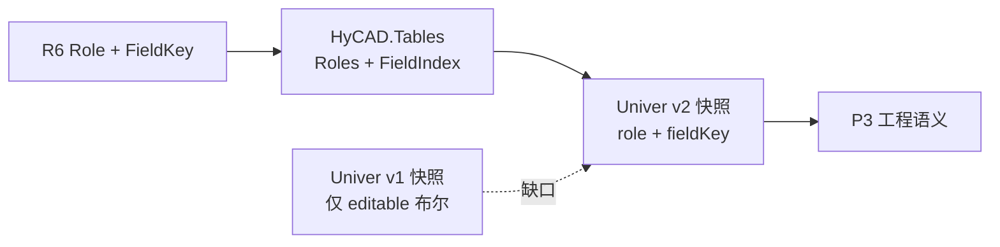
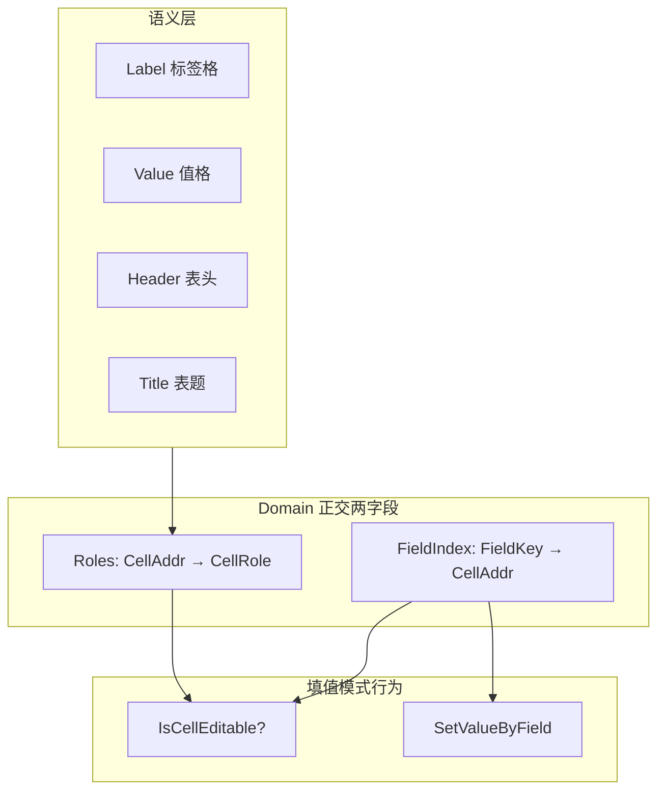
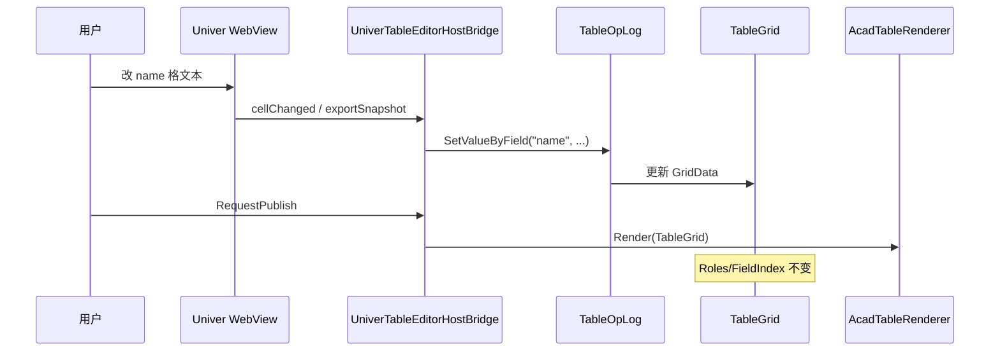

# R6 · 单元格 Role 与 FieldKey 详解（new/a1）

> 文档编号：new/a1（new/001 的子文档，专述 **R6**）  
> 生成日期：2026-06-26  
> 上游总纲：[001 Univer 路线 — 原需求最优落地总纲](./001-Univer路线-原需求最优落地总纲-2026-06-26-163000.md)  
> 引用源：[002 双模式编辑](../002-统一表格Domain与双模式编辑-产品调研-2026-06-24-225625.md)、[005 §3.8/§4.4](../005-复杂表格Domain统一设计-2026-06-24-232335.md)、[015 §5.4–5.5](../015-表格面板设置-产品调研-2026-06-25-194246.md)、[008e §5](../008e-AC5-复杂版式竖排斜线角色详解-2026-06-25-170000.md)  
> 性质：**R6 执行规格 / 概念详解**——足够细到可单独开 Plan 编码 P3；不写方法体，但给出样表矩阵、不变量、Univer 映射与验收清单。  
> 用法：实现 P3（role/fieldKey + 结构/填值 Toggle）时以本文 + new/001 §5.6 为唯一真相。  
> **术语不熟？** 先读 [new/b1 术语白话详解](./b1-R6-术语白话详解-2026-06-26-173000.md)。  
> **Domain 整体逻辑？** 先读 [new/00 Domain 底层逻辑](./00-Domain底层逻辑大白话-2026-06-26-180000.md)。

---

## 0. R6 在 Univer 路线中的位置



**R6 一句话**：工程表格在 Domain 层为每个 **anchor 格**标注 `CellRole`（版式/编辑语义）与可选 `FieldKey`（稳定数据引用），支撑 **结构模式改版式、填值模式只改 Value**。

[new/001 §2.5](./001-Univer路线-原需求最优落地总纲-2026-06-26-163000.md) 已指出当前缺口：[`UniverGridSnapshot`](../../../src/HyCADTool/Features/Tables/Presentation/UniverGridSnapshot.cs) v1 仅映射 **文本 + merge + 行列 mm + `editable` 布尔**；Domain 里完整的 `Roles` / `FieldIndex` **未进入 Univer 桥**。v2 需补 `role`、`fieldKey` 字面量，并与 `setEditMode`（结构/填值 Toggle）联动。

**与 Excel 的本质差异**：Excel 没有「Label 锁死、Value 可填」的工程语义；HyCAD 用 **Role** 表达这种表单式表格，用 **FieldKey** 表达跨坐标、跨会话、跨 API 的稳定数据绑定。

---

## 1. 目标与完成定义（DoD）

### 1.1 一句话目标

**Domain `GridStructure.Roles` + `FieldIndex` 的语义在 Univer 编辑器中可辨、可保护：填值模式 Label/Header/Title/PhotoSlot 不可改；带 FieldKey 的 Value 格可通过 `SetValueByField` 稳定回写；Inspector 只读展示 Role/FieldKey。**

### 1.2 P3 Definition of Done（全部勾选才算 R6 完成）

- [ ] v2 快照每 anchor 格含 optional `role`、`fieldKey`（向后兼容 v1）
- [ ] `loadSnapshot` 按 Role 设置 Univer 格锁定 + 浅灰底纹（Label/Header/Title/PhotoSlot/Spacer）
- [ ] `setEditMode`：填值模式强化 Value/FieldKey 格可编辑；结构模式允许改 Role（FieldKey 仍走 VM 命令）
- [ ] Inspector（或 sidebar）显示当前选格 Role + FieldKey（只读或结构模式可改 Role）
- [ ] 人员样表 fixture：`(1,1)` `role=value`、`fieldKey=name`；`(1,0)` `role=label`、无 key
- [ ] 填值模式改 `name` 格 → `SetValueByField` / OpLog → 落图 round-trip 与 AC3 一致
- [ ] **不**从 Univer `exportSnapshot` 反推 Role/FieldKey（结构语义走 `SetRoleOp` / `SetFieldKeyOp`）
- [ ] `dotnet test src/HyCAD.Tables.Tests` 中 FieldKey/Role 相关用例仍全绿

---

## 2. 概念详解：CellRole（六种角色）

### 2.1 定义与存储

```csharp
// src/HyCAD.Tables/Structure/CellRole.cs
public enum CellRole
{
    Title,      // 表题
    Header,     // 表头 / 分区标题
    Label,      // 标签格（字段名）
    Value,      // 值格（用户填的数据）
    PhotoSlot,  // 照片占位
    Spacer      // 布局占位，无业务语义
}
```

- **存储**：`GridStructure.Roles` — 稀疏字典 `CellAddr → CellRole`（仅 anchor 格写入；未标注时无条目）。
- **默认语义**：无 Role 条目时，渲染与编辑行为按「普通格」处理（见 §4.2）。

### 2.2 六种 Role 对照表

| Role | 中文 | 典型文本 | 填值模式可编辑? | 渲染/样式（AC5） | 与 Excel 类比 |
|---|---|---|---|---|---|
| **Title** | 表题 | 「人员基本情况表」 | 否 | 字高 × 系数 + 强制居中 | 合并标题行 |
| **Header** | 表头/分区 | 「称谓」「姓名」；竖排「家庭主要成员…」 | 否 | 字高略增 / WidthFactor | 列标题 / 侧栏标题 |
| **Label** | 标签 | 「姓名」「性别」「籍贯」 | 否 | 默认样式 | 表单左侧说明文字 |
| **Value** | 值 | 「张三」「男」 | **是** | 默认样式 | 表单右侧输入区 |
| **PhotoSlot** | 照片位 | （空） | 否 | AC8 占位框，不画字 | 图片占位 |
| **Spacer** | 布局占位 | 空 | 否 | 不画字 | 空白装饰格 |

### 2.3 Label / Value / Header 三分法（FAQ）

这是 R6 最易混淆处；以下均以 [`TableSamples.BuildPersonnelTable()`](../../../src/HyCAD.Tables/Samples/TableSamples.cs) 为准。

| 辨析 | 说明 | 样表坐标 |
|---|---|---|
| **Label vs Value** | 同一行常见 `Label \| Value \| Label \| Value` 交替；**Role 决定填值模式锁哪边**，与 FieldKey 无关 | `(1,0)` Label「姓名」；`(1,1)` Value「张三」 |
| **Label vs Header** | Label = **字段名**（表单左列）；Header = **列名或分区标题**（表头行、竖排侧栏） | `(1,0)` Label；`(0,0)` 家庭成员表列头全是 Header |
| **Header vs Title** | Title = 整表顶行 merge 一格的表名；Header = 表内分区或列头 | `(0,0)` Title「人员基本情况表」；`(4,0)` Header + 竖排侧栏 |
| **Header + 竖排** | Role 与 `TextOrientation` **正交**；Header 可竖排 | `(4,0)` `Role=Header` + `VerticalStacked` |
| **Value 无 FieldKey** | 有 Role=Value 但无 key → 仍可在网格目视填值，但 API/面板无法 `SetValueByField` | `(1,3)`「男」：Value，无 FieldKey |

### 2.4 人员表 7×7 Role 分布示意

```text
行0  [ Title: 人员基本情况表 (merge 1×7)                    ]
行1  [ Label:姓名 | Value:name=张三 | Label:性别 | Value:男 | Label:出生 | Value:1990 | PhotoSlot×3 ]
行2  (同上 PhotoSlot 延续 merge)
行3  [ Label:籍贯 | Value:北京市 (merge 1×3) ... ]
行4  [ Header+竖排:家庭主要成员... (merge 3×1) | ... ]
行5  [ Label:学习和工作简历 | Value:简历内容 (merge 1×5) ]
行6  (简历区延续)
```

### 2.5 Html / CAD 角色样式对照（008e §5.2）

| CellRole | Html CSS 类 | CAD 叠加 |
|---|---|---|
| Title | `role-title` | 字高 × TitleTextHeightScale；强制 HAlign Center |
| Header | `role-header` | 字高 × HeaderTextHeightScale；WidthFactor |
| Label | `role-label` | MVP 与默认相同或略小 |
| Value | `role-value` | 默认 |
| PhotoSlot | `role-photoslot` | 跳过文字（AC8 画框） |

---

## 3. FieldKey 语义与不变量

### 3.1 定义与存储

- **FieldIndex**：`GridStructure.FieldIndex` — `string FieldKey → CellAddr`（**仅存 Anchor 地址**）。
- **SubCell.FieldKey**：斜线分割时，每个 `SubCell` 可独立带 key（如「学历」「学位」两子格）；与表级 FieldIndex 分开维护。
- **数据值**：仍在 `GridData.Cells[addr]`；FieldKey 是 **索引**，不是值本身。

### 3.2 FieldKey 解决什么问题

```text
Layer 1  状态（真相源）   TableGrid：CellAddr 主键 + FieldIndex 稳定引用
Layer 2  操作（变更记录）  OpLog：SetValueByField 只记 key，不记坐标
```

| 问题 | CellAddr  alone | + FieldKey |
|---|---|---|
| 插删行列后坐标变 | `(1,1)` 可能变成 `(2,1)` | `FieldIndex["name"]` 自动重映射到新地址 |
| 外部 API 填值 | 必须知道当前行列号 | `SetValueByField("name", "李四")` |
| 320px 填值面板 | 按地址列表 | 按 FieldKey 列绑定（AC11） |
| CAD 拾取回读 | 靠 XData JSON | FieldKey 数 / 列表摘要（AC7） |

### 3.3 不变量（005 §4.1）

| # | 规则 | 违反码 |
|---|---|---|
| 1 | FieldKey **全表唯一** | `DuplicateFieldKey` |
| 2 | FieldKey 只能绑在 **Anchor** 格（非 merge 从属 hidden 格） | `FieldKeyNotOnAnchor` |
| 3 | 一格至多一个 FieldKey（换 key = 先删旧再绑新） | API 层 `SetFieldKey` 维护 |
| 4 | `SetValueByField(key)` 时 key 必须存在于 FieldIndex | 运行时 `未找到 FieldKey` |

### 3.4 API 语义摘要

| 操作 | 行为 |
|---|---|
| `SetFieldKey(addr, key)` | 维护 FieldIndex；key 重复指向不同格 → 拒绝 |
| `SetFieldKey(addr, null)` | 移除该 anchor 上的绑定 |
| `SetValueByField(key, value)` | 经 FieldIndex 解析 addr → `SetValue` |
| `InsertRow/DeleteRow/...` | **同步重映射** FieldIndex 中所有 CellAddr |

### 3.5 典型命名约定

| 场景 | 示例 | 来源 |
|---|---|---|
| 单字段 | `name` | 人员表 `(1,1)` |
| 重复行模板 | `member0_name` … `member5_name` | 家庭成员表 col=1 |
| 斜线子格 | 各 SubCell 独立 key（可选） | `BuildDiagonalDemoTable` |

**Label 通常无 FieldKey**；只有需要 **程序/API/面板绑定** 的 Value 格才设 FieldKey。

### 3.6 AC9 / AC10 与 FieldKey

| 场景 | FieldKey 行为 |
|---|---|
| AC9 线框识别 V1 | **不推断** FieldKey；FieldIndex 为空 |
| AC10 编辑模式 Exit | **Backup Sidecar 全保留** FieldIndex；Inferred 网格合并时 key 不丢（008j） |

---

## 4. Role + FieldKey 组合与双模式编辑

### 4.1 正交关系



- **Role** 管：版式分类、渲染叠加、填值模式 **是否锁定**。
- **FieldKey** 管：**稳定指代**、API/面板绑定、`SetValueByField`。
- 二者 **独立**：可有 `Role=Value` 无 FieldKey；可有 FieldKey 无显式 Role（fallback 可编辑）。

### 4.2 填值模式可编辑判定

权威实现：[`TableFillGridAdapter.IsCellEditable`](../../../src/HyCADTool/Features/Tables/Presentation/TableFillGridAdapter.cs)

```text
IsCellEditable（TableFillGridAdapter，填值面板权威）:
  Roles[addr] == Value                              → 可编辑
  Roles[addr] in {Label, Header, Title, PhotoSlot, Spacer} → 不可编辑
  FieldIndex 中某 key 指向 addr                      → 可编辑（即使无 Role）
  否则                                               → 不可编辑

ExcelGridSnapshotBuilder 额外规则（ReoGrid/Univer v1 快照）:
  editable = IsCellEditable(addr) || !Roles.ContainsKey(addr)
  → 无 Role 条目时视为可编辑（家庭成员表 (row,0)「父亲」在 ReoGrid 可改、填值面板不可改）
```

P3 目标：Univer 与 320px 填值面板 **统一走 `IsCellEditable`**，不再沿用 Excel 快照的「无 Role 默认可编辑」fallback。

### 4.3 人员表 row=1 组合矩阵

| 地址 | 显示文本 | Role | FieldKey | 填值模式 | 说明 |
|---|---|---|---|---|---|
| (1,0) | 姓名 | Label | — | 锁定 | 字段名 |
| (1,1) | 张三 | Value | `name` | 可编辑 | **R6 典型绑定格** |
| (1,2) | 性别 | Label | — | 锁定 | |
| (1,3) | 男 | Value | — | 可编辑 | 有 Role 无 key |
| (1,4) | 出生年月 | Label | — | 锁定 | |
| (1,5) | 1990-01 | Value | — | 可编辑 | |
| (1,6) | — | PhotoSlot | — | 锁定 | merge 3×1 照片位 |

### 4.4 家庭成员表数据行

| 地址 | Role | FieldKey | 用途 |
|---|---|---|---|
| (0,0)–(0,4) | Header | — | 列标题行 |
| (row,0) row=1..6 | （无条目） | — | 称谓静态文本「父亲」 |
| (row,1) | （无条目） | `member{row-1}_name` | 成员姓名；`SetValueByField` 批量填 |

### 4.5 结构模式 vs 填值模式（015 §5.4）

| 设置/操作 | 结构模式 | 填值模式 |
|---|---|---|
| 改单元格 **文本**（Value 格） | 允许 | 允许 |
| 改 **Label/Header** 文本 | 允许 | **锁定** |
| 改 **Role** | 允许（015 Combo） | 允许 |
| 改 **FieldKey** | 只读/禁用 | Inspector / 填值面板可编辑 |
| Merge / 插删行列 | 允许 | 禁用（016） |

### 4.6 FieldKey 插行稳定性示意

```text
InsertRow 之前:  FieldIndex["name"] → (1, 1)
InsertRow 在第 0 行上方插入一行:
InsertRow 之后:  FieldIndex["name"] → (2, 1)   // Domain 自动重映射

OpLog 记录: SetValueByField("name", "李四")  // 仍有效，无需改坐标
```

---

## 5. Domain ↔ 快照 ↔ Univer 映射

### 5.1 v2 快照字段（new/001 §6.2）

每 anchor 格 optional 扩展：

| 字段 | 类型 | Domain 来源 |
|---|---|---|
| `role` | `title\|header\|label\|value\|photoSlot\|spacer` | `GridStructure.Roles[addr]` |
| `fieldKey` | `string?` | 反向查 `FieldIndex` 中 value==addr 的 key |

表级 FieldIndex 不重复整表导出——按 cell 携带 `fieldKey` 即可。

### 5.2 Univer 前端行为（P3 目标）

| Domain | v2 JSON | Univer 行为 |
|---|---|---|
| `Roles=Label/Header/Title/PhotoSlot/Spacer` | `role: "label"` 等 | `editable: false` + 锁定 + 浅灰底纹 |
| `Roles=Value` | `role: "value"` | `editable: true` |
| `FieldIndex["name"]→addr` | `fieldKey: "name"` | Inspector 展示；C# 回写仍走 FieldIndex |
| 填值 Toggle | `setEditMode: "fill"` | 强化 Value/有 key 格可编辑 |
| 结构 Toggle | `setEditMode: "structure"` | 允许改 Role；FieldKey 走 VM 命令 |

### 5.3 回写红线

| 允许 | 禁止 |
|---|---|
| 用户改 Value 格文本 → `cellChanged` → `SetValueOp` / `SetValueByField` | 从 Univer export **反推** Role/FieldKey |
| VM 命令 → `SetRoleOp` / `SetFieldKeyOp` | 依赖 Univer 内置 undo 作为真相源 |
| 落图前 `exportSnapshot` 全量文本/结构 | 把 Univer `editable` 布尔当 FieldKey 存储 |

### 5.4 数据流（填值 → 落图）



---

## 6. 与相邻需求边界

| 相邻 ID | 分工 |
|---|---|
| **R2 样式** | Role 叠加字高/对齐（AC5）；FieldKey **不影响**样式 |
| **R3 竖排** | `TextOrientation` 独立于 Role；Header 可竖排 |
| **R5 PhotoSlot** | `Role=PhotoSlot` 专用渲染（AC8）；与 FieldKey 无关 |
| **R7 纸张** | TableViewport 表级；与单格 Role 无关 |
| **R12 公式** | 公式格可有 `Role=Value` + FieldKey；落图写求值结果 |
| **R14 识别** | V1 **不推断** Role/FieldKey |

---

## 7. P3 实施清单（文件落点）

| # | 交付 | 路径 |
|---|---|---|
| W1 | v2 DTO 增 `role` / `fieldKey` | [`UniverGridSnapshot.cs`](../../../src/HyCADTool/Features/Tables/Presentation/UniverGridSnapshot.cs) |
| W2 | Mapper 从 Roles + FieldIndex 填充 | `UniverGridSnapshotMapper.FromTableGrid` |
| W3 | 前端 loadSnapshot 写锁定/底纹 | [`univer-bridge.ts`](../../../src/HyCADTool.UniverEditor/Web/src/univer-bridge.ts) |
| W4 | `setEditMode` 消息 | bridge + [`TableEditorViewModel`](../../../src/HyCADTool/Features/Tables/ViewModels/TableEditorViewModel.cs) |
| W5 | Inspector Role/FieldKey | VM 已有 `RoleOptions`；Univer sidebar 或 WPF 右栏 |
| W6 | personnel fixture v2 | [`personnel-snapshot.json`](../../../src/HyCADTool.UniverEditor/Web/public/fixtures/personnel-snapshot.json) |
| W7 | OpLog 命令 | 已有 `SetRoleOp` / `SetFieldKeyOp`（[`TableOperation.cs`](../../../src/HyCAD.Tables/Operations/TableOperation.cs)） |

### 7.1 建议实施顺序

```text
1. UniverGridSnapshot v2 字段 + Mapper（Roles/FieldIndex 反向查）
2. personnel fixture 与 ExportPersonnelUniverFixture 单测
3. univer-bridge loadSnapshot：role → editable + 底纹
4. setEditMode + 布局 Tab Toggle
5. Inspector 只读展示 fieldKey
6. C2→N38 smoke：填值模式 Label 不可改；改 name 后落图 round-trip
```

---

## 8. 变更记录与交叉引用

### 8.1 new 系列索引

| 文档 | 状态 |
|---|---|
| [new/00 Domain 大白话](./00-Domain底层逻辑大白话-2026-06-26-180000.md) | Domain 底层逻辑 |
| [new/01 Univer↔Domain](./01-Univer-UI与Domain对齐规格-2026-06-26-183000.md) | Facade 对齐 |
| [new/001](./001-Univer路线-原需求最优落地总纲-2026-06-26-163000.md) | 总纲 |
| **new/a1（本文）** | R6 概念详解 |
| [new/b1 术语白话](./b1-R6-术语白话详解-2026-06-26-173000.md) | R6 术语入门 |
| new/021 | 待三 Tab IA 定稿 |

### 8.2 源码权威落点

| 概念 | 路径 |
|---|---|
| CellRole 枚举 | [`CellRole.cs`](../../../src/HyCAD.Tables/Structure/CellRole.cs) |
| FieldIndex 存储 | [`GridStructure.cs`](../../../src/HyCAD.Tables/Structure/GridStructure.cs) |
| SetFieldKey / SetValueByField | [`GridEditor.cs`](../../../src/HyCAD.Tables/Operations/GridEditor.cs) |
| 不变量校验 | [`GridInvariants.cs`](../../../src/HyCAD.Tables/Operations/GridInvariants.cs) |
| 填值可编辑判定 | [`TableFillGridAdapter.cs`](../../../src/HyCADTool/Features/Tables/Presentation/TableFillGridAdapter.cs) |
| 黄金样表 | [`TableSamples.cs`](../../../src/HyCAD.Tables/Samples/TableSamples.cs) |
| Role 渲染叠加 | [`AcadTableRoleStyle.cs`](../../../src/HyCADTool/Features/Tables/Infrastructure/AutoCad/AcadTableRoleStyle.cs) |

### 8.3 变更记录

| 日期 | 说明 |
|---|---|
| 2026-06-26 | a1 初版：R6 Role/FieldKey 概念、样表矩阵、双模式规则、Univer v2 映射、P3 DoD |

---

## 9. 文档自检

```
- [x] Label / Value / Header 三分法有人员表坐标例证（§2.3、§4.3）
- [x] FieldKey 与 Role 正交关系讲清（§4.1）
- [x] 填值模式 editable 规则与 TableFillGridAdapter 一致（§4.2）
- [x] Univer v2 字段与 P3 DoD 对齐 new/001（§1.2、§5）
- [x] 不含实现代码；含 DoD 勾选框
- [x] AC9/AC10 FieldKey 边界（§3.6）
- [x] 家庭成员表 FieldKey 命名（§4.4）
```

---

> **下一步**：按 §7.1 开 Plan 编码 P3；或先读 [new/001 §5.6](./001-Univer路线-原需求最优落地总纲-2026-06-26-163000.md) 对照 v2 消息协议。

**版本**：1.0 | **落盘**：2026-06-26-170000
