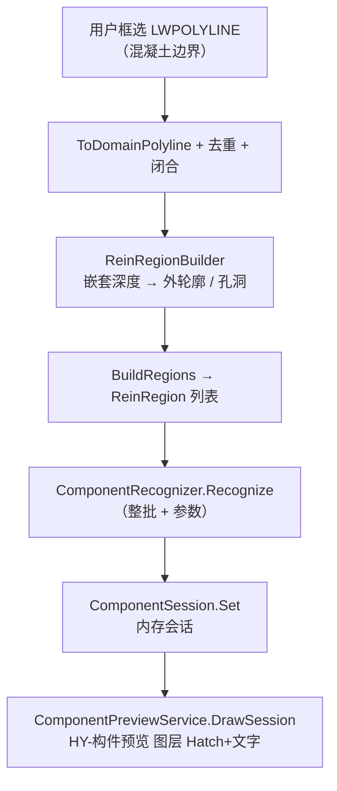

# gj 面板与构件识别 — 当前代码状况

> 更新：2026-06-12  
> 范围：`HyCADTool` 钢筋 Tab（`ReinToolPanel`）+ 构件确认（识别 / 切换 / 按构件配筋）  
> 关联旧文档：[`docs/refactor-plans/06-Reinforcement 模块重构报告.md`](../refactor-plans/06-Reinforcement%20模块重构报告.md)（历史迁移报告，不含构件识别）  
> 几何定稿：[011-gj命令几何运算原理](011-gj命令几何运算原理-2026-06-15-180000.md)

---

## 一、面板是什么

用户口中的 **「gj 面板」** 指 HyBlender 统一侧栏里 **「钢筋」分类 Tab** 下的 `ReinToolPanel`：

- 上半：钢筋直径/间距、锚固、保护层等 **gj / gb 等命令共用参数**（绑定 `SettingsPanelViewModel`，持久化 `%APPDATA%\HyCADTool\hy-settings.json`）
- 下半：**构件确认** Expander（识别预览 + 分区配筋参数 + 三个按钮）
- 最底：当前 Tab 注册的钢筋命令按钮网格（含 `gj` 绘制钢筋等）

面板 **不单独存在** PaletteSet，而是嵌入 [`HyBlenderPanel.xaml`](../../src/HyCADTool/Shell/BlenderPanel/HyBlenderPanel.xaml) 的 `IsReinMode` 分支。

---

## 二、UI 与数据绑定

### 2.1 视图

| 文件 | 说明 |
|------|------|
| [`ReinToolPanel.xaml`](../../src/HyCADTool/Features/Reinforcement/Views/ReinToolPanel.xaml) | 面板布局；本地 Style `ReinPanelPropertyRow` / `ReinPanelInputBox` |
| [`ReinToolPanel.xaml.cs`](../../src/HyCADTool/Features/Reinforcement/Views/ReinToolPanel.xaml.cs) | 空壳 code-behind |

Expander 分区：

| Expander | 绑定前缀 | 用途 |
|----------|----------|------|
| 钢筋直径 / 间距 | `ReinVm.RebarDiameter` / `RebarSpacing` | gj 主筋 |
| 钢筋参数 | `AnchorageLength`、`HookLength`、`ProtectionThickness`… | gj / 延伸 / 弯钩 |
| 尺寸参数 | `DimensionDistance*`、`MleaderDistance`… | 标注类命令 |
| **构件确认** | `Comp*` 前缀 + 三按钮 | 识别 / 切换 / 按构件配筋 |

### 2.2 ViewModel

所有字段与命令在 [`SettingsPanelViewModel.cs`](../../src/HyCADTool/Shell/Preferences/SettingsPanelViewModel.cs)：

- 面板绑定路径：`HyBlenderPanel` → `ReinVm` = `SettingsPanelViewModel.Current`
- 构件参数工厂：`CreateComponentParameters()` → [`ComponentParameters`](../../src/HyCADTool/Features/Reinforcement/Domain/Components/ComponentParameters.cs)
- 钢筋参数工厂：`CreateReinParameters()` → `ReinParameters`（gj 用）

面板按钮经 `SendCommand` → `PendingCommand` → `_HyExec` 在 AutoCAD 命令线程执行（避免 PaletteSet 线程问题）。

---

## 三、命令注册

[`commands.json`](../../src/ReCall/commands.json)（节选）：

| 键 | 类 | 面板/用途 |
|----|-----|-----------|
| `gj` | `DrawReinforcementCommand` | 绘制双线钢筋 |
| `N8` | `RecognizeComponentsCommand` | **识别构件** |
| `N9` | `SwitchComponentTypeCommand` | **切换类型** |
| `N10` | `GenerateByComponentsCommand` | **按构件配筋** |

面板三按钮对应 N8 / N9 / N10；C1 联调入口 [`TestCommand.cs`](../../src/HyCADTool/App/Test/TestCommand.cs) 当前指向 `RecognizeComponentsCommand`。

---

## 四、构件识别 — 端到端流程



### 4.1 选线与分组

[`RecognizeComponentsCommand.cs`](../../src/HyCADTool/Features/Reinforcement/RecognizeComponentsCommand.cs)：

1. 只接受 `LWPOLYLINE`
2. [`ReinRegionBuilder`](../../src/HyCADTool/Features/Reinforcement/Domain/ReinRegionBuilder.cs) 按 **嵌套深度** 分类：
   - 偶数深度 → 外轮廓（CCW）
   - 奇数深度 → 孔洞（CW）
3. 每个外轮廓 + **直接子孔洞** 构成一个 [`ReinRegion`](../../src/HyCADTool/Features/Reinforcement/Domain/ReinRegion.cs)（`Outer` + `Holes` + `AllRings`）

> **重要**：房间、设备坑等 **孔洞多段线的边** 参与墙/板识别（内侧边在孔洞上，不在外轮廓上）。

### 4.2 识别核心

[`ComponentRecognizer.cs`](../../src/HyCADTool/Features/Reinforcement/Domain/Components/ComponentRecognizer.cs) — 纯 Domain，无 AutoCAD 依赖。

对每个 `ReinRegion`：

1. **独立小轮廓**（`TryClassifyStandalone`）：整段 bbox 直接判型 → 不再做内部锚定  
   - 小 bbox → 梁  
   - 细高（宽 ≤ 墙厚上限，高 ≥ 2×宽）→ 墙  
   - 扁宽且贴全局底/顶 → 底板 / 楼板  

2. **大轮廓**（`RecognizeLargeRegion`）：锚定 + 延伸 + 裁剪  

3. 每个候选 **轴对齐带** 经 [`PolygonBoolean.IntersectRectWithRegion`](../../src/HyCAD.Geometry/Algorithms/PolygonBoolean.cs) 裁剪到 **外轮廓 − 孔洞**，保证不出界、允许重叠。

### 4.3 预览与会话

| 组件 | 文件 | 说明 |
|------|------|------|
| 预览绘制 | [`ComponentPreviewService.cs`](../../src/HyCADTool/Features/Reinforcement/Services/ComponentPreviewService.cs) | 图层 `HY-构件预览`；SOLID Hatch + 类型文字；按 Priority **升序**绘制（底板在下层） |
| XData | [`HyComponentXdata.cs`](../../src/HyCADTool/Shared/AutoCAD/Xdata/HyComponentXdata.cs) | RegApp `HY_COMPONENT`；存 SessionId / RegionId / Type |
| 内存会话 | [`ComponentSession.cs`](../../src/HyCADTool/Features/Reinforcement/Domain/Components/ComponentSession.cs) | 供 N9 / N10 读取；切换类型只改内存 + 图上实体 |

### 4.4 构件类型与颜色（ACI）

[`ComponentType.cs`](../../src/HyCADTool/Features/Reinforcement/Domain/Components/ComponentType.cs)：

| 类型 | 显示名 | ACI | Priority（预览层序） |
|------|--------|-----|---------------------|
| BottomSlab | 底板 | 5 蓝 | 1 |
| Slab | 楼板 | 4 青 | 2 |
| Wall | 墙体 | 3 绿 | 3 |
| Beam | 梁 | 2 黄 | 4 |
| MassConcrete | 大体积混凝土 | 1 红 | （不自动识别；可 N9 手动切换） |

---

## 五、识别算法详解（当前实现 — v3 割线扫描）

> 详细文档：[`002-底板识别逻辑-2026-06-12-143000.md`](./002-底板识别逻辑-2026-06-12-143000.md)（v3 竖直割线精确分区）

### 5.1 大轮廓分区（阶段 1）

[`RegionPartitioner.Partition`](../../src/HyCADTool/Features/Reinforcement/Domain/Components/RegionPartitioner.cs)：

- X 断点 = 全部环顶点 X + 10mm 细分；条带内梯形拼合
- 竖直割线交点 **j1 最高**；最下配对 = **底板**，其余 = **板**
- 并查集 + `UnionAll` → 守恒多边形（不多不少铺满混凝土）
- N8 预览：**仅板 / 底板两色**（墙塔区域暂归所在列配对标签）

### 5.2 独立小轮廓

[`TryClassifyStandalone`](../../src/HyCADTool/Features/Reinforcement/Domain/Components/ComponentRecognizer.cs) 仍按 bbox 判型：梁 / 墙 / 扁宽板。

### 5.3 阶段 2（未做）

边分类 `a/b/ca/cb` 已预备；墙/梁/大体积二次切分阈值见 002 文档第五节。

### ~~5.x 旧算法~~（已移除）

~~DetectSlabBands / DetectBottomSlabBands / DetectVerticalBands / 射线定厚~~

---

## 六、构件确认 — 面板参数

[`ComponentParameters`](../../src/HyCADTool/Features/Reinforcement/Domain/Components/ComponentParameters.cs) ← `CreateComponentParameters()`：

| 面板字段 | 域属性 | 默认 | 识别用途 |
|----------|--------|------|----------|
| 平行夹角阈值° | `ParallelAngleThresholdDeg` | 15 | 水平/竖直边判定 |
| 楼板厚≤mm | `SlabMaxThicknessMm` | 300 | 板厚上限 |
| 墙厚≤mm | `WallMaxThicknessMm` | 500 | 墙带宽度上限 |
| 底板厚≤mm | `BottomSlabMaxThicknessMm` | 700 | 底板厚上限 |
| 忽略底板高差 | `IgnoreBottomSlabHeightDiff` | true | 小台阶拉平开关 |
| 底板高差 mm | `BottomSlabHeightToleranceMm` | 150 | run 内厚度差阈值 |
| 梁宽≤mm | `BeamMaxWidthMm` | 800 | 梁宽上限 |
| 梁高≤mm | `BeamMaxHeightMm` | 1500 | 墙/梁分界高度 |
| **平行占比≥** | `ParallelLineRatioMin` | **0.6** | 异形轮廓过滤 |
| 锚固长度（钢筋参数区） | `AnchorageLengthMm` | 500 | 板端延伸、墙/梁向上延伸、柱合并容差 |
| 大体积≥mm | `MassConcreteMinSizeMm` | 1000 | **仅 N10 配筋用**，识别不自动产出 |
| 梁不配筋 | `BeamSkipReinforcement` | false | N10 跳过梁区 |
| 各类型直径/间距 | `SlabRebarDiameter`… | 14@200 | N10 分区标注 |

---

## 七、后续命令（识别之后）

### 7.1 切换类型 — N9

[`SwitchComponentTypeCommand.cs`](../../src/HyCADTool/Features/Reinforcement/SwitchComponentTypeCommand.cs)  
拾取预览 Hatch/文字 → `ComponentType.Next()` 循环（Slab→Wall→BottomSlab→MassConcrete→Beam→…）→ 同步同色同 RegionId 实体 + `ComponentSession`。

### 7.2 按构件配筋 — N10

[`GenerateByComponentsCommand.cs`](../../src/HyCADTool/Features/Reinforcement/GenerateByComponentsCommand.cs)  
依赖 `ComponentSession`；对 `ReinRegion.AllRings` 调用 [`ReinforcementUtils.GenerateAllWithComponents`](../../src/HyCADTool/Features/Reinforcement/Domain/ReinforcementUtils.cs)（按区域类型标注、梁可跳过、大体积构造筋、凸起附加筋等）。完成后 **清除预览与会话**。

> N10 逻辑 **未随识别 v3 重写**；识别预览与配筋语义仍在迭代对齐中。

---

## 八、分层文件清单（构件相关）

```
Features/Reinforcement/
├── Views/ReinToolPanel.xaml          # gj 面板 UI
├── RecognizeComponentsCommand.cs     # N8
├── SwitchComponentTypeCommand.cs     # N9
├── GenerateByComponentsCommand.cs    # N10
├── Domain/
│   ├── ReinRegion.cs
│   ├── ReinRegionBuilder.cs
│   ├── ReinforcementUtils.cs         # gj 生成 + GenerateAllWithComponents
│   └── Components/
│       ├── ComponentType.cs
│       ├── ComponentParameters.cs
│       ├── ComponentRegion.cs
│       ├── ComponentRecognizer.cs    # ★ 识别算法
│       ├── ComponentSession.cs
│       └── BumpDetector.cs           # N10 凸起
├── Services/ComponentPreviewService.cs
Shell/Preferences/SettingsPanelViewModel.cs   # 参数 + SendCommand
Shared/AutoCAD/Xdata/HyComponentXdata.cs

HyCAD.Geometry/Algorithms/
├── RectClipper.cs
└── PolygonBoolean.cs
```

---

## 九、联调与已知限制

### 联调

```
改代码 → VS 编译 → C2 → C1（TestCommand 指向 N8）
或面板：HyBlender → 钢筋 Tab → 构件确认 → 识别构件
```

### 已知限制（2026-06-12）

1. **识别仍在校准**：复杂截面（多孔洞、异形墩、阶梯轮廓）需调「平行占比≥」及厚度上限  
2. **大体积不自动识别**：中部设备墩等需 N9 手动标为 MassConcrete  
3. **孔洞语义**：嵌套在内部的闭合多段线一律当 **孔洞**（空腔），不会当墙轮廓；墙须由竖边对或独立小矩形识别  
4. **N10 与识别预览**：分区配筋依赖识别结果，重叠区域标注优先级以 `ComponentRecognizer.ClassifyPoint`（Priority 降序）为准  
5. **独立小墙矩形**：若与外轮廓 **嵌套关系** 被判为孔洞，则不会走 `TryClassifyStandalone`，只能靠大轮廓内竖边对识别  

---

## 十、算法演进备忘

| 阶段 | 做法 | 问题 |
|------|------|------|
| v0 | 外轮廓 O(n²) 平行边配对 + 质心去重 | 隔空假墙、不延伸、丢合法区 |
| v1 | 底/顶边锚定 + 整宽底板 + Clipper 裁剪 | 未收集孔洞边，墙/内板漏识别 |
| v2 | 全环边 + 逐顶面出板 + 锚固延伸 | 墙梁拆分、梁误判在混凝土上 |
| **v3（当前）** | 柱合并 + 平行占比 + 梁下为空 + 板接梁 + 墙到底 | 持续根据截面图校准 |

---

**维护**：识别规则变更时同步更新本文「第五节」与 [`ComponentRecognizer.cs`](../../src/HyCADTool/Features/Reinforcement/Domain/Components/ComponentRecognizer.cs) 顶部注释。
