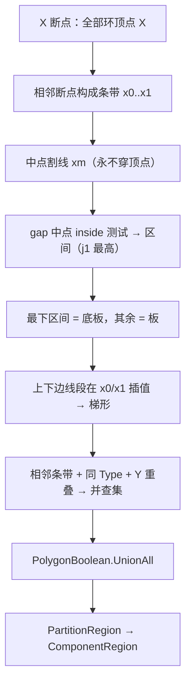

# 区域划分 — 竖直割线扫描分区（含墙 / 大体积，可重叠）

> 更新：2026-06-12（v3.1 阶段 2：全高列判墙/大体积）  
> 实现入口：[`RegionPartitioner.Partition`](../../src/HyCADTool/Features/Reinforcement/Domain/Components/RegionPartitioner.cs)  
> 调用：[`ComponentRecognizer.RecognizeLargeRegion`](../../src/HyCADTool/Features/Reinforcement/Domain/Components/ComponentRecognizer.cs)

---

## 一、目标

在 `ReinRegion`（外轮廓 − 孔洞）实心区域内做 **构件分区**：

- **覆盖**：分区并集覆盖全部混凝土区域；**区域可重叠**（墙/大体积叠在底板横带之上）
- **当前输出**：板（Slab）/ 底板（BottomSlab）/ 墙（Wall）/ 大体积（MassConcrete）
- **未做**：梁（与顶板相连的下凸判定）

---

## 二、交点编号与列分类（j1 最高）

竖直割线交点 **从上到下** 编号 `j1, j2…`（**j1 = 最高**）。gap 中点 inside 测试得到混凝土区间：

| 列形态 | 处理 |
|--------|------|
| **多区间列**（4/6+ 交点） | 最下区间 = **底板**，其余 = **板** |
| **单区间列**（2 交点全高） | 不直接归底板 —— 合并成「全高块」后判型（见下） |

### 全高块判型（阶段 2）

相邻单区间列合并成块（X 相接 + Y 重叠）：

| 条件 | 类型 |
|------|------|
| 块顶高出邻近底板顶 ≥ **1000mm** 且块宽 < **800mm** | **墙** |
| 块顶高出邻近底板顶 ≥ 1000mm 且块宽 ≥ 800mm | **大体积混凝土** |
| 高出 < 1000mm | 整块归 **底板**（局部凸起） |

**重叠规则**：

- 墙 / 大体积取 **整列全高**（从底板最底延伸到列顶 = 顶/底板最外侧）
- 同时为每个单区间列生成 **桥接底板 cell**（顶面 = 左右邻近底板顶较低值）→ 底板横带连续穿过墙列
- 预览按 Priority 升序绘制：底板(1) → 板(2) → 大体积(3) → 墙(4)，重叠处高优先级覆盖

---

## 三、算法流程



### 3.1 X 断点与割线

- 断点 = 全部环顶点 X（去重排序），条带宽 < 0.5mm 跳过
- 割线取 **条带中点** `xm = (x0+x1)/2` —— 永不穿过顶点，交点恒偶数（不再用 10mm 固定步长，从根上消除步长误差）

### 3.2 求交与区间（gj 切割线同思路）

- 仅取 `minX < xm < maxX` 的线段插值 Y（竖直边自动跳过），降序排列（j1 最高）
- 相邻交点构成 gap，**gap 中点 `IsValidRebarPoint` 测内外**；连续 inside gap 合并成混凝土区间 —— 不依赖奇偶配对，天然鲁棒
- 每区间记录上/下边所属 **线段引用**

### 3.3 区间标签

每条带（在自己的中点割线上）：**最下区间 = 底板**，其余 = 板。4 交点列上对自然为板。

### 3.4 梯形拼合

区间上/下边线段在条带左右边界 `x0 / x1` 处插值（线段必跨满整条带，因顶点只在断点上）：

```
(x0, topL) → (x1, topR) → (x1, botR) → (x0, botL)
```

相邻条带、相同 `Type`、**共享边界 Y 重叠 > 1mm** 的梯形经并查集合并（不按区间序号硬配对），`UnionAll` 出最终多边形。

---

## 四、边分类（阶段 2 预备）

[`ClassifyEdge`](../../src/HyCADTool/Features/Reinforcement/Domain/Components/RegionPartitioner.cs) — 与 X 轴夹角归一化到 `[0°, 90°]`：

| 夹角 | 类别 | 含义 |
|------|------|------|
| ≤ 5° | `HorizontalA` | 水平 a |
| ≥ 85° | `VerticalB` | 竖向 b |
| < 45° | `SlabCa` | 斜线归板 |
| ≥ 45° | `WallCb` | 斜线归墙 |

---

## 五、阈值（代码常量，用户口径）

| 常量 | 值 | 含义 |
|------|-----|------|
| `WallMaxWidthMm` | 800 | 全高块宽分界：< 800 墙，≥ 800 大体积 |
| `WallMinHeightAboveBottomMm` | 1000 | 墙/大体积须高出邻近底板顶 |
| 梁（未做） | 600 / 100 | 与顶板相连：宽 ≤600 梁（>600 大体积），低出板底 ≥100 |

---

## 六、面板参数

阶段 1 **不新增**面板项；预览仅板/底板两色。既有 `Comp*` 参数保留供阶段 2 与 N10 配筋。

---

## 七、验证（C2 → N8）

1. 细高竖条（2 交点列、宽 <800）→ **绿色墙体**，全高延伸到底
2. 宽大墩块（2 交点列、宽 ≥800）→ **红色大体积**
3. 底板蓝色横带 **连续穿过** 墙/大体积列（重叠，墙盖在上层）
4. 多区间列：上对板（青）、下对底板（蓝）
5. 矮凸起（高出底板 <1000）归底板

---

## 八、源码索引

| 文件 | 符号 |
|------|------|
| `RegionPartitioner.cs` | `Partition`、`ClassifyEdge`、`GetInsideIntervalsAt`、`EvaluateYOnSegment` |
| `ComponentRecognizer.cs` | `RecognizeLargeRegion` |
| `PolygonBoolean.cs` | `UnionAll` |
