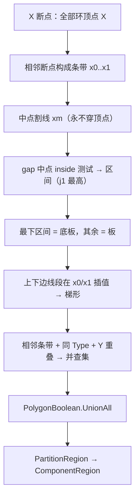

# 区域划分 — 竖直割线扫描精确分区（阶段 1）

> 更新：2026-06-12（v3 割线扫描）  
> 实现入口：[`RegionPartitioner.Partition`](../../src/HyCADTool/Features/Reinforcement/Domain/Components/RegionPartitioner.cs)  
> 调用：[`ComponentRecognizer.RecognizeLargeRegion`](../../src/HyCADTool/Features/Reinforcement/Domain/Components/ComponentRecognizer.cs)

---

## 一、目标

在 `ReinRegion`（外轮廓 − 孔洞）实心区域内做 **精确分区**：

- **守恒**：分区并集 = 原混凝土区域，不增加、不减少
- **阶段 1 输出**：仅 **板（Slab）** 与 **底板（BottomSlab）** 两类
- **阶段 2（未做）**：在分区结果上识别墙 / 梁 / 大体积

---

## 二、交点编号与配对（j1 最高）

竖直割线 `x = const` 与全部环求交，交点 **从上到下** 编号 `j1, j2, j3…`（**j1 = 最高**）：

| 交点数 | 配对与标签 |
|--------|------------|
| 2 | j1–j2 = **底板** |
| 4 | j1–j2 = 板，j3–j4 = **底板** |
| 6+ | j1–j2 = 板（顶），j(n−1)–jn = **底板**，中间各对 = 板 |
| 奇数（兜底） | 3 点去 j2；5 点去 j3 |

**统一规则**：每根割线 **最下面一对 = 底板**，其余对 = 板。

---

## 三、算法流程



### 3.1 X 断点与割线

- 断点 = 全部环顶点 X（去重排序），条带宽 < 0.5mm 跳过
- 割线取 **条带中点** `xm = (x0+x1)/2` —— 永不穿过顶点，交点恒偶数（不再用 10mm 固定步长，从根上消除步长误差）

### 3.2 求交与区间（gj 切割线同思路）

- 仅取 `minX < xm < maxX` 的线段插值 Y（竖直边自动跳过），降序排列（j1 最高）
- 相邻交点构成 gap，**gap 中点 `IsValidRebarPoint` 测内外**；连续 inside gap 合并成混凝土区间 —— 不依赖奇偶配对，天然鲁棒
- 每区间记录上/下边所属 **线段引用**

### 3.3 区间标签

每条带（在自己的中点割线上）：**最下区间 = 底板**，其余 = 板。4 交点列上对自然为板。

### 3.4 梯形拼合

区间上/下边线段在条带左右边界 `x0 / x1` 处插值（线段必跨满整条带，因顶点只在断点上）：

```
(x0, topL) → (x1, topR) → (x1, botR) → (x0, botL)
```

相邻条带、相同 `Type`、**共享边界 Y 重叠 > 1mm** 的梯形经并查集合并（不按区间序号硬配对），`UnionAll` 出最终多边形。

---

## 四、边分类（阶段 2 预备）

[`ClassifyEdge`](../../src/HyCADTool/Features/Reinforcement/Domain/Components/RegionPartitioner.cs) — 与 X 轴夹角归一化到 `[0°, 90°]`：

| 夹角 | 类别 | 含义 |
|------|------|------|
| ≤ 5° | `HorizontalA` | 水平 a |
| ≥ 85° | `VerticalB` | 竖向 b |
| < 45° | `SlabCa` | 斜线归板 |
| ≥ 45° | `WallCb` | 斜线归墙 |

---

## 五、阶段 2 阈值（本次未实现）

| 构件 | 条件 |
|------|------|
| 墙 | 与底板相连的 b，厚 < 800mm，高出底板 ≥ 1000mm |
| 大体积（墙侧） | b 厚 ≥ 800mm |
| 梁 | 与顶板相连的 b，宽 ≤ 600mm，低出板底 ≥ 100mm |
| 大体积（梁侧） | b 宽 > 600mm |

---

## 六、面板参数

阶段 1 **不新增**面板项；预览仅板/底板两色。既有 `Comp*` 参数保留供阶段 2 与 N10 配筋。

---

## 七、验证（C2 → N8）

1. 板 + 底板两色 **完全铺满** 截面，无空隙、无出界
2. 4 交点列：上对板、下对底板
3. 6+ 交点列：中间对为板
4. 孔洞列：孔内无填充，上下配对正确

---

## 八、源码索引

| 文件 | 符号 |
|------|------|
| `RegionPartitioner.cs` | `Partition`、`ClassifyEdge`、`GetInsideIntervalsAt`、`EvaluateYOnSegment` |
| `ComponentRecognizer.cs` | `RecognizeLargeRegion` |
| `PolygonBoolean.cs` | `UnionAll` |
