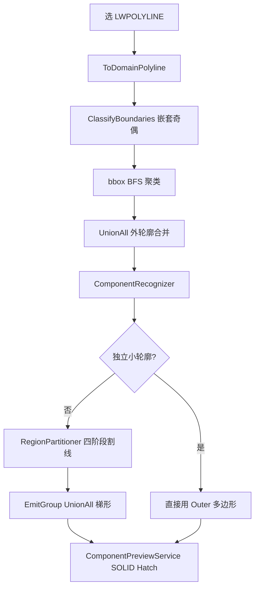

# N8 构件识别几何逻辑与超界风险分析

> 日期：2026-06-13  
> 命令：`N8` → `RecognizeComponentsCommand`（识别截面构件并着色预览）  
> 范围：**只描述现状几何链路与超界风险，不含修复实现**  
> 关联文档：[001-gj面板与构件识别现状](001-gj面板与构件识别现状-2026-06-12-004500.md)、[002-底板识别逻辑](002-底板识别逻辑-2026-06-12-143000.md)、[003-构件识别几何判读逻辑](003-构件识别几何判读逻辑-2026-06-12-120000.md)

---

## 1. 命令入口与数据流总览

N8 从用户选择的 **LWPOLYLINE** 出发，经 Domain 几何处理得到 `ComponentRegion` 多边形，再在 `HY-构件预览` 图层绘制边界 + SOLID Hatch。



### 源码索引

| 阶段 | 文件 | 关键符号 |
|------|------|----------|
| 入口 | `src/HyCADTool/Features/Reinforcement/RecognizeComponentsCommand.cs` | `Execute` |
| CAD→Domain | `src/HyCADTool/Shared/AutoCAD/Converters/ReinforcementConverter.cs` | `ToDomainPolyline` |
| 区域构建 | `src/HyCADTool/Features/Reinforcement/Domain/ReinRegionBuilder.cs` | `ClassifyBoundaries`、`BuildGroupedRegions`、`BuildMergedRegions` |
| 聚类 | `src/HyCADTool/Features/Cluster/Domain/Services/ClusteringService.cs` | `ClusterByBoundsDistance` |
| bbox | `src/HyCAD.Geometry/BoundingBox.cs` | `IsWithinDistance`、`GapDistanceSquared` |
| 判型/分区 | `src/HyCADTool/Features/Reinforcement/Domain/Components/ComponentRecognizer.cs` | `Recognize`、`TryClassifyStandalone`、`RecognizeLargeRegion` |
| 割线分区 | `src/HyCADTool/Features/Reinforcement/Domain/Components/RegionPartitioner.cs` | `Partition`、`BuildCell`、`EmitGroup`、`SplitRaisedCellByWidth` |
| 预览 | `src/HyCADTool/Features/Reinforcement/Services/ComponentPreviewService.cs` | `DrawSession`、`CreateSolidHatch` |
| 布尔运算 | `src/HyCAD.Geometry/Algorithms/PolygonBoolean.cs` | `UnionAll`、`IntersectRectWithRegion` |

---

## 2. 阶段 A：输入几何 → ReinRegion

### 2.1 CAD 转换与强制闭合

`RecognizeComponentsCommand` 对每个选中实体：

1. `entity.ToDomainPolyline()` — 只复制顶点坐标，**bulge 恒为 0**，弧段退化为弦线。
2. `RemoveDuplicateVertices()` — 去除重复顶点。
3. **无条件** `boundary.IsClosed = true` — 未闭合多段线会被强行当闭合环处理。

### 2.2 嵌套分类（外轮廓 / 孔洞）

`ClassifyBoundaries`：

- `ComputeNestingDepth`：用该多段线**首顶点**做点包含，统计被其他多段线包含的次数。
- 偶数深度 → 外轮廓（强制 CCW）；奇数深度 → 孔洞（强制 CW）。
- 孔洞归属（`BuildMergedRegions` / `BuildGroupedRegions`）：孔洞**首顶点**落在哪个外轮廓内即归属该组。

有效混凝土区域 `ReinRegion`：

```
IsValidRebarPoint(p) = p 在外轮廓内 ∧ p 不在任一孔洞内
```

实现：`src/HyCADTool/Features/Reinforcement/Domain/ReinRegion.cs`

### 2.3 分组聚类与外轮廓合并

`BuildGroupedRegions(classified, RegionGroupDistanceMm)`：

1. 对所有外轮廓计算 axis-aligned bbox。
2. `ClusteringService.ClusterByBoundsDistance`（BFS）：bbox 间隙 ≤ 阈值的外轮廓归同一计算组。
3. 组内 `BuildMergedRegions`：所有外轮廓 `PolygonBoolean.UnionAll` 合并为一个外环；孔洞按包含关系挂接。

**几何含义**：聚类只决定「哪些外轮廓一起算、共享地面基准 `groundY`」，**不改变单条多段线顶点**。但若多外轮廓被 union，合并后外边界可能比任一原线更大（设计行为）。

### 2.4 线段收集

`CollectSegments(region)`：遍历 `region.AllRings`（外轮廓 + 全部孔洞），每条边拆成 `Line2D`。**孔洞边参与后续割线求交**（房间、设备坑内侧边在孔洞上）。

---

## 3. 阶段 B：独立小轮廓快路径（通常不超界）

`ComponentRecognizer.TryClassifyStandalone` 在 bbox 满足下列条件时，**直接输出 `region.Outer` 克隆**，不经条带近似：

| 条件 | 判型 |
|------|------|
| `w ≤ BeamMaxWidthMm` 且 `h ≤ BeamMaxHeightMm` 且 `max(w,h) ≥ 200mm` | 梁 |
| `w ≤ WallMaxThicknessMm` 且 `h ≥ 2w` 且 `h ≥ 200mm` | 墙 |
| `h ≤ flatLimit` 且 `w ≥ 2h` 且贴全局底/顶（±80mm） | 底板 / 楼板 |

**推论**：若仅小轮廓出现超界，应优先查阶段 A（输入闭合、嵌套、弧变弦线），而非 `RegionPartitioner`。

---

## 4. 阶段 C：大轮廓割线分区（超界主战场）

大轮廓走 `RegionPartitioner.Partition` 四阶段流水线。`grounded` 判定：区域最低 Y ≤ `groundY + BottomSlabMaxThicknessMm`；非落地列跳过基础切割，凸起进 `floatingCells`。

### 4.1 X 断点与条带

`CollectBreakpoints`：

- 断点 = **全部环顶点 X**（外轮廓 + 孔洞），`SortedSet` 去重排序。
- 相邻断点构成条带 `[x0, x1]`；宽 `< 0.5mm`（`MinStripWidthMm`）跳过。
- 割线 `xm = (x0 + x1) / 2` — **刻意不穿过顶点**。

**注意**：断点不含边交点 X，两顶点之间可形成**很宽条带**。

### 4.2 竖直割线与混凝土区间

`GetInsideIntervalsAt(region, segments, xm)`：

1. 对所有线段（含孔洞边），若 `xm` 严格在线段 X 范围内，求交点 Y。
2. Y 降序排列（j1 最高）；数值重合去重（`DedupeYToleranceMm = 0.01`）。
3. 相邻交点构成 gap；**gap 中点** `IsValidRebarPoint` 判 inside（不依赖奇偶配对）。
4. 连续 inside gap 合并为一个 `InsideInterval`，记录 `TopSeg` / `BotSeg`（在 `xm` 处命中的线段引用）。

阶段 0 对每个条带：

- 除最下区间外的每个区间 → `BuildCell` 生成 **Slab** cell。
- 最下区间记入 `stripBottoms`，供阶段 1 底板切割。

### 4.3 梯形 cell 构造（核心近似）

`BuildCell` / `TrapezoidCell.ToPolygon` 生成四边形：

```
(x0, TopL) → (x1, TopR) → (x1, BotR) → (x0, BotL) → 闭合
```

四角 Y 来自 `EvaluateYOnSegment(iv.TopSeg/BotSeg, x0/x1)`：

```csharp
// RegionPartitioner.cs — t 钳制在 [0,1]，不沿线段外推
double t = (x - x1) / (x2 - x1);
if (t < 0) t = 0;
else if (t > 1) t = 1;
return seg.StartPoint.Y + t * (seg.EndPoint.Y - seg.StartPoint.Y);
```

**三条关键几何假设**：

1. **条带内拓扑只在 `xm` 单点采样**决定，不随 X 变化。孔洞若宽于条带且 `xm` 落在孔洞外侧混凝土区，条带内看不到孔洞拓扑变化。
2. **四角 Y 复用 `xm` 处区间的 `TopSeg`/`BotSeg`**。当该线段在 `x0`/`x1` 处不覆盖真实边界时（`t` 被钳到端点），四角落在错误位置。
3. **顶/底边为直线弦**。真实轮廓在条带内凹入时，弦线在凹口上方凸出 → **典型超界形态**（用户截图中黄色预览边界「鼓出」白色原轮廓，多为直线段超出）。

ASCII 示意（凹边界 + 宽条带）：

```
真实轮廓:     梯形弦线:
  ___/\___       _________
 /        \     |         |  ← 弦线在凹口上方，面积超出
/          \    |_________|
```

### 4.4 四阶段流水线

| 阶段 | 输入 | 行为 | 输出类型 |
|------|------|------|----------|
| **0** | 全部条带 | `xm` 割线 → 板 cell + 最下区间信息 | `upperSlabCells`、`stripBottoms` |
| **1** | `stripBottoms` | 统一底板 cut（邻近桥接、高度上限）；`[cut,顶]` → `raisedCell`；矮凸起 → `shortBumps` / `protrusionPool`；非落地 → `floatingCells` | 底板 cell、凸起池 |
| **1 收尾** | `shortBumps` | `ProcessShortBottomBumps`：合并进底板或拆局部混凝土 | `BottomSlab` / `LocalConcrete` |
| **2** | `protrusionPool` | 矮块直接 `LocalConcrete`；其余 `SplitRaisedCellByWidth`（高度带 + 轮廓量宽） | `Wall` / `Slab`舌片 / `MassConcrete` |
| **3** | `upperSlabCells` + 板舌片 | `ProcessSlabGroups`：薄厚拆分；厚列下凸 → 梁 / 大体积；锚固裁剪板舌片 | `Slab` / `Beam` / `MassConcrete` |
| **4** | `massPool` 剩余 | `EmitMassAndLocal`：高 ≥ 局部阈值 → 大体积；贴大体积的局部升级 | `MassConcrete` / `LocalConcrete` |
| **收尾** | `bottomSlabCells` | `MergeCells` → `EmitGroup` | `BottomSlab` |

#### 阶段 1 底板 cut 要点

- `grounded` 时：`cut = Min(邻近底板顶, maxBot + BottomSlabMaxHeightMm)`，且 `cut ≥ maxBot`（下限夹紧，防深坑邻列拖低 cut）。
- `raisedCell`：`BotL/BotR = cut`（水平切口），`TopL/TopR` 来自轮廓顶。
- 凸起高 `< LocalConcreteMaxHeightMm` → `shortBumps`（可并入底板或拆局部）。

#### 阶段 2 `SplitRaisedCellByWidth` 要点

按 `yBreaks`（全部区间上下 Y）剖分高度带，每带中点 `ym` 调用 `MeasureContourWidthAt`：

- 水平割线 `y = ym` 与全部线段求交 → X 排序 → gap 中点 inside 测试 → 找包含列中点 `xmCol` 的混凝土宽度。
- `width ≤ WallMaxThicknessMm` → 墙带（高 `< 500mm` 归大体积）。
- 否则：距邻近板缘 ≤ `AnchorageLengthMm` → 板带；否则 → 大体积带。
- **墙带延伸**：顶向上 `+ anchorageMm`（不出列顶）；底向下视夹层高度延伸到底或 `− anchorageMm`。
- **锚固舌片** `TryAddAnchorTongue` → `CreateFlatBandCell`：纯轴对齐矩形（`TopL=TopR`、`BotL=BotR`），向邻板延伸 `anchorageMm`。

#### 阶段 3 `ProcessSlabGroups` 要点

- 组内按 `ThicknessMm` 与 `SlabMaxThicknessMm` 分薄/厚。
- 厚列下凸：`baseline = thin.Max(MinBot)`，下凸部分进 `lowerPieces`；宽 `> BeamMaxWidthMm` 或触大体积 → 大体积，否则 → 梁。
- 大体积邻薄列时：`ClipCellX` 裁剪板舌片（锚固长度范围内保留板带）。

### 4.5 cell 合并与输出

`MergeCells`（并查集）：

- 条件：相邻条带（`StripIndex` 差 1~7）、**同 `CellKind`**、共享边界 Y 重叠 `> 1mm`（`MergeOverlapMm`）。
- `EmitGroup`：`UnionAll(各 cell.ToPolygon())` → `PartitionRegion`。

```csharp
// EmitGroup — 无 ReinRegion 裁剪
var polys = group.Select(c => c.ToPolygon()).ToList();
foreach (var poly in PolygonBoolean.UnionAll(polys))
    result.Add(new PartitionRegion { Type = type, Polygon = poly, ... });
```

`RecognizeLargeRegion` 将 `PartitionRegion.Polygon` **原样**包装为 `ComponentRegion`，**无二次裁剪**。

### 4.6 文档与实现差异（重点）

| 来源 | 描述 |
|------|------|
| [001 §4.2](001-gj面板与构件识别现状-2026-06-12-004500.md) | 每个候选轴对齐带应经 `PolygonBoolean.IntersectRectWithRegion` 裁剪到 **外轮廓 − 孔洞** |
| **实际代码** | `IntersectRectWithRegion` 仅在 `PolygonBoolean.cs` 定义；`RegionPartitioner` **零调用**；`RecognizeLargeRegion` **零裁剪** |

`IntersectRectWithRegion` 已实现（Clipper2：`rect ∩ outer − holes`），但 N8 管线未接入。

---

## 5. 阶段 D：预览 Hatch

`ComponentPreviewService.DrawSession`：

1. 按 `Priority` 升序绘制（底板 1 → 板 2 → 大体积 3 → 局部 4 → 墙 5 → 梁 6）。
2. `region.Polygon.ToAcadPolyline()` 作边界多段线（图层 `HY-构件预览`）。
3. `CreateSolidHatch`：PreDefined `SOLID`，`Associative = true`，`AppendLoop(Outermost)`。
4. **不再对原 LWPOLYLINE 做裁剪或贴合**。

预览色（ACI）：板=4 青、墙=3 绿、底板=5 蓝、大体积=1 红、梁=2 黄、局部=6 洋红。

**结论**：图上着色区域 **完全等于** 分区器输出的多边形；任何近似误差直接可见为「填充/边界超出原轮廓」。

---

## 6. 面板参数 → 算法常量映射

| 面板属性 (`SettingsPanelViewModel`) | `ComponentParameters` 字段 | 默认值 (mm) | 传入位置 / 用途 |
|-------------------------------------|---------------------------|-------------|-----------------|
| `CompGroupClusterDistance` | `RegionGroupDistanceMm` | 1500 | `BuildGroupedRegions` bbox 聚类间隙 |
| `CompBottomSlabMaxThickness` | `BottomSlabMaxThicknessMm` | 1500 | 底板 cut 高度上限、`grounded` 判定 |
| `CompWallMaxThickness` | `WallMaxThicknessMm` | 500 | 独立墙判型、`SplitRaisedCellByWidth` 墙宽上限 |
| `CompSlabMaxThickness` | `SlabMaxThicknessMm` | 300 | 板薄厚分界、`floatingCells` 薄列证据 |
| `CompLocalConcreteMaxHeight` | `LocalConcreteMaxHeightMm` | 1000 | 矮凸起 / 局部混凝土高差阈值 |
| `CompBeamMaxWidth` | `BeamMaxWidthMm` | 800 | 独立梁判型、下凸宽梁分界 |
| `CompBeamMaxHeight` | `BeamMaxHeightMm` | 1500 | 独立小轮廓梁高度上限 |
| `CompMergeBumpsIntoBottomSlab` | `MergeBumpsIntoBottomSlab` | true | 矮凸起并入底板 vs 拆局部混凝土 |
| `AnchorageLength` | `AnchorageLengthMm` | 500 | 墙/板锚固延伸、舌片宽度 |
| `CompMassMinSize` | `MassConcreteMinSizeMm` | 1000 | N10 配筋用，N8 分区不直接读 |

`RegionPartitioner` 内部硬编码（无面板项）：

| 常量 | 值 | 含义 |
|------|-----|------|
| `MinStripWidthMm` | 0.5 | 最小条带宽 |
| `MinIntervalHeightMm` | 1.0 | 最小区间高 |
| `MergeOverlapMm` | 1.0 | cell 合并 Y 重叠阈值 |
| `DedupeYToleranceMm` | 0.01 | 交点 Y 去重 |
| `WallMinHeightMm` | 500 | 墙带最小高度 |
| `HorizontalAngleDeg` / `VerticalAngleDeg` | 5 / 85 | 边分类（梁预备） |
| `AnchorYToleranceMm`（Recognizer） | 80 | 贴底/贴顶判定 |

---

## 7. 超界风险矩阵

| 风险 | 机制 | 典型表现 | 相关代码 | 现有裁剪 |
|------|------|----------|----------|----------|
| **高** | 缺少 `∩ (Outer − Holes)` 最终裁剪 | 任何近似误差直接进入 Hatch | `EmitGroup`、`RecognizeLargeRegion` | 无 |
| **高** | 条带单点 `xm` 拓扑 + 梯形弦线 | 凹口/台阶/复杂截面处直线鼓出 | `BuildCell`、`EvaluateYOnSegment` | 无 |
| **高** | 宽条带跨孔洞（`xm` 在孔洞外） | 填充穿过孔洞区域 | `GetInsideIntervalsAt`、`CollectBreakpoints` | 无 |
| **中** | 锚固舌片 `CreateFlatBandCell` | 局部轴对齐矩形超出列/斜边 | `TryAddAnchorTongue`、`SplitRaisedCellByWidth` | 无 |
| **中** | 墙带顶/底 `± anchorageMm` 延伸 | 矩形墙块角点超出轮廓 | `SplitRaisedCellByWidth` L1107–1119 | 无 |
| **中** | 组内多外轮廓 `UnionAll` | 合并后外边界大于任一原线 | `BuildMergedRegions` | 无（设计行为） |
| **低** | 强制闭合 / 弧变弦线 | 开口线闭合后面积膨胀；弧边界偏差 | `RecognizeComponentsCommand`、`ToDomainPolyline` | 无 |
| **低** | 嵌套/孔洞用首顶点 | 孔洞漏判 → 孔洞当混凝土 | `ComputeNestingDepth`、hole 归属 | 无 |
| **排除** | 凸包 / bbox Expand | — | N8 管线未使用 | — |

### 用户截图场景判读

复杂水平截面（多竖向区块、台阶、细线段）出现黄色预览边界超出白色原轮廓时，优先怀疑：

1. **梯形弦线超界**（§4.3）：超出段为直线，位于凹口或宽条带区域。
2. **缺最终裁剪**（§4.6）：误差未被 Clipper 截断。
3. 若超出为**规整矩形块**：查墙锚固延伸（§4.4 阶段 2）或舌片（`CreateFlatBandCell`）。

---

## 8. CAD 自检步骤

1. **边界形态对比**：打开 `HY-构件预览` 层，对比预览边界 polyline 与原始 LWPOLYLINE。
   - 超出处为**直线弦** → §4.3 条带近似。
   - 超出处为**整块矩形** → §4.4 舌片/墙延伸 或 §4.6 缺裁剪。
2. **排除错误合并**：面板缩小 `CompGroupClusterDistance`（如 0 或很小），重跑 N8，观察超界是否消失。
3. **孔洞场景**：检查孔洞 X 范围是否落在宽条带 `[x0,x1]` 内，且 `xm` 是否落在孔洞外侧混凝土区。
4. **路径分流**：若轮廓 bbox 很小且被判为独立构件，预览应贴合原线；若仍超界 → 查 §2 输入/嵌套。
5. **面积粗判**（需手算或后续工具）：分区结果面积之和 vs 有效混凝土面积；前者明显偏大即确认 overshoot 来自分区而非 Hatch 引擎。

---

## 9. 可选修复方向索引（不实施，仅供选型）

| 策略 | 思路 | 优点 | 代价 |
|------|------|------|------|
| **A. 出口裁剪** | `RecognizeLargeRegion` 对每个 `PartitionRegion.Polygon` 做 `subject ∩ Outer − Holes`（需 `PolygonBoolean` 公开返回全部片段的 API） | 改动集中；保底不出界 | 不修正条带近似形状；可能产生多片段 |
| **B. 源头修正** | `BuildCell` 在 `x0`/`x1` 分别竖直割线求真实上下边 Y，而非复用 `xm` 的 `TopSeg`/`BotSeg` | 减少弦线误差 | 改动 `BuildCell` 及阶段 1 同类逻辑 |
| **C. 条带加密** | 断点加入边交点 X 或限制最大条带宽度 | 窄条带降低凹口弦线误差 | 条带数增加、性能与合并复杂度上升 |
| **D. 按文档补裁剪** | 每个 cell 或 `EmitGroup` 前对轴对齐 bbox 调 `IntersectRectWithRegion` | 与 001 文档一致 | 对非轴对齐梯形仅 bbox 裁剪，需配合 A 才完备 |

---

## 10. 与 003 文档的分工

| 文档 | 侧重 |
|------|------|
| [003-构件识别几何判读逻辑](003-构件识别几何判读逻辑-2026-06-12-120000.md) | 受力动机、判型顺序、四阶段业务规则、版本变更记录 |
| **本文 004** | N8 全链路数据流、几何近似假设、**超界风险**、文档/实现差异、自检与修复选型 |

---

**版本**：1.0 | **日期**：2026-06-13
