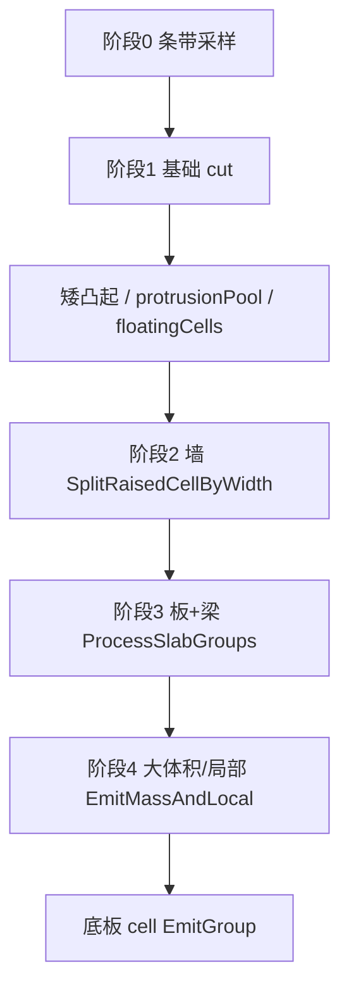

# N8 构件分区核心逻辑

> 日期：2026-06-13  
> 范围：**大轮廓构件分区**主干算法（`RegionPartitioner.Partition`）  
> 关联：[003-构件识别几何判读逻辑](003-构件识别几何判读逻辑-2026-06-12-120000.md)（完整判读规则与版本史）、[004-N8几何与超界风险](004-N8构件识别几何逻辑与超界风险-2026-06-13-160000.md)（全链路与超界）

---

## 1. 何时进入分区

```
N8 → BuildGroupedRegions → 每组 ComponentRecognizer.Recognize
  ├─ TryClassifyStandalone 命中 → 整段 Outer 直接判型，**不走分区**
  └─ 大轮廓 → RegionPartitioner.Partition → PartitionRegion[] → ComponentRegion
```

| 入口 | 文件 | 符号 |
|------|------|------|
| 识别调度 | `ComponentRecognizer.cs` | `RecognizeLargeRegion` |
| **分区核心** | `RegionPartitioner.cs` | `Partition` |
| 输出包装 | `ComponentRecognizer.cs` | `PartitionRegion` → `ComponentRegion` |

`Partition` 输入：单个 `ReinRegion`（外轮廓 − 孔洞）、面板阈值、`groundY`（计算组最低 Y）、`mergeBumpsIntoBottomSlab`。

---

## 2. 判定顺序（占有体积）

```
底板 → 墙 → 板/梁 → 大体积 / 局部混凝土
```

先判定的类型占有体积；墙锚固舌片可与底板/板/大体积**几何重叠**（预览 Priority 墙最高）。

---

## 3. 核心几何原语

### 3.1 条带（Strip）

- **X 断点** `CollectBreakpoints`：外轮廓 + 孔洞全部顶点 X，排序去重。
- 条带 `[x0, x1]` = 相邻断点；宽 `< 0.5mm` 跳过。
- **割线** `xm = (x0+x1)/2`：刻意不穿过顶点。

### 3.2 竖直区间 `GetInsideIntervalsAt`

在 `x = xm` 处：

1. 与全部线段（含孔洞边）求交 Y，降序（j1 最高）。
2. 相邻交点构成 gap；**gap 中点** `IsValidRebarPoint` 判 inside（不依赖奇偶）。
3. 连续 inside gap 合并为 `InsideInterval`，记录 `TopSeg` / `BotSeg`。

### 3.3 梯形 cell `TrapezoidCell`

条带内每个混凝土区间 → 轴对齐条带四边形：

```
(x0, TopL) → (x1, TopR) → (x1, BotR) → (x0, BotL)
```

四角 Y 由 `EvaluateYOnSegment(TopSeg/BotSeg, x0/x1)` 求得（`t` 钳制 `[0,1]`）。

`CellKind`：`Slab` | `BottomSlab` | `Raised`（上凸块）。

### 3.4 cell 合并 `MergeCells`

并查集：相邻条带 + **同 Kind** + 共享边界 Y 重叠 `> 1mm` → 合并为一组。

### 3.5 组输出 `EmitGroup`

```csharp
UnionAll(组内各 cell.ToPolygon()) → PartitionRegion { Type, Polygon, ThicknessMm }
```

**注意**：当前实现**未**对结果做 `∩ (Outer − Holes)` 裁剪（见 004 §4.6）。

---

## 4. 四阶段流水线（主干）



### 阶段 0：条带采样

对每个条带 `xm` 求区间：

| 区间位置 | 去向 |
|----------|------|
| 非最下区间 | `upperSlabCells`（板候选，`BuildCell`） |
| 最下区间 | `stripBottoms`（阶段 1 再 cut） |

### 阶段 1：基础统一切割

**地面门控** `grounded`：

```
grounded = (regionMinY ≤ groundY + BottomSlabMaxThicknessMm)
```

| grounded | 行为 |
|----------|------|
| true | 最下区间 cut 剖底板；`[cut,顶]` → 凸起分类 |
| false | `cut = 区间底`；整列 → `floatingCells`（非落地板系） |

**cut 公式**（grounded）：

```
cut = clamp( min(左邻底板顶, 右邻底板顶, 区间底+底板上限, 区间顶),  下限=maxBot )
```

- `[区间底, cut]` → **底板 cell**（`BottomSlab`）
- `[cut, 顶]` 凸起：
  - 高 `< LocalConcreteMaxHeightMm` 且在底板上 → **矮凸起** `shortBumps`
  - 否则 → **protrusionPool**（阶段 2 墙候选）

**矮凸起** `ProcessShortBottomBumps`（`MergeBumpsIntoBottomSlab`）：

- 勾选：并入底板顶，或 `OrigBot` 新建底板 cell
- 未勾选：run 求 `runMinTop`，底板顶夹紧，余量 → 局部混凝土

**protrusionPool 预分流**：块高 `< 1000mm` → 直接 **局部混凝土** `EmitGroup`；否则 → `wallCandidates`。

**floatingCells**（非落地）：组内有薄列 → 转 `Slab` 进阶段 3；全厚 → protrusionPool。

### 阶段 2：墙体 `SplitRaisedCellByWidth`

对每个 `wallCandidates` cell，按 Y 断点剖高度带；每带中点 `ym` 调用 `MeasureContourWidthAt`：

- 水平割线 `y=ym` 与轮廓求交 → 包含列中点的混凝土**实际宽度**
- 返回同高左右**板缘 X**（锚固判据）

| 条件 | 类型 |
|------|------|
| 宽 ≤ `WallMaxThicknessMm` 且 带高 ≥ 500mm | **墙带**（上下锚固延伸） |
| 宽 ≤ 墙厚 但 带高 < 500mm | 降级大体积 |
| 宽超限 且 板缘距列边 ≤ `AnchorageLengthMm` | **板带**（kind=2） |
| 其余 | **大体积带** |

**2-run 下邻判型**：板带 run 下邻为大体积 → 转大体积 + 锚固舌片；下邻为墙 → 保持板带。

墙带输出 → `wallCells` → `EmitGroup(Wall)`。

### 阶段 3：板 + 梁 `ProcessSlabGroups`

输入：`upperSlabCells` + 阶段 2 回流 `slabPieces`。

| 板组 | 处理 |
|------|------|
| 全列厚 > 板厚上限 | → `massPool` |
| 全列薄 | → `EmitGroup(Slab)` |
| 薄+厚混合 | 薄列 `MinBot` = **板基线**，厚列拆分 |

厚列拆分：

- 下段 `[底, 基线]`：宽 > 梁宽或贴大体积 → 大体积；否则 → **梁**
- 上段 `[基线, 顶]`：随下段归属；大体积邻薄列时 `ClipCellX` 生成 **板锚固舌**（≤ 锚固长）

### 阶段 4：大体积 / 局部 `EmitMassAndLocal`

- `massPool` 合并：高 ≥ 局部阈值 → **大体积**；否则 **局部混凝土**
- 局部贴大体积 → 迭代升级为大体积
- 最后 `bottomSlabCells` → `EmitGroup(BottomSlab)`

---

## 5. 关键子算法速查

| 符号 | 作用 |
|------|------|
| `CollectSegments` | 外轮廓 + 孔洞边 → `Line2D[]` |
| `GetInsideIntervalsAt` | 竖直割线 → 混凝土区间 |
| `BuildCell` | 区间 → 梯形 cell |
| `EvaluateYOnSegment` | 线段上求 Y（t∈[0,1]） |
| `MeasureContourWidthAt` | 水平割线量宽 + 板缘 X |
| `SplitRaisedCellByWidth` | 上凸块 → 墙/板/大体积带 |
| `CreateFlatBandCell` | 轴对齐矩形舌片（锚固） |
| `ClipCellX` | 梯形按 X 裁剪 |
| `ProcessSlabGroups` | 薄厚拆分 + 梁/大体积 |
| `MergeCells` | 条带间并查集合并 |
| `EmitGroup` | `UnionAll` → `PartitionRegion` |

---

## 6. 参数（面板 → Partition）

| 面板 / `ComponentParameters` | 默认 | 分区用途 |
|-------------------------------|------|----------|
| `CompBottomSlabMaxThickness` | 1500 | 底板 cut 上限、grounded 门控 |
| `CompWallMaxThickness` | 500 | 墙量宽上限 |
| `CompSlabMaxThickness` | 300 | 板薄厚分界 |
| `CompBeamMaxWidth` | 800 | 下凸梁宽上限 |
| `CompLocalConcreteMaxHeight` | 1000 | 矮凸起 / 局部高差 |
| `CompMergeBumpsIntoBottomSlab` | true | 矮凸起并入底板 |
| `AnchorageLength` | 500 | 墙/板锚固延伸 |
| `CompGroupClusterDistance` | 1500 | 分组（Partition 前，影响 `groundY`） |

硬编码：`WallMinHeightMm=500`，`MinStripWidthMm=0.5`，`MergeOverlapMm=1`。

---

## 7. 输出与预览

`Partition` → `List<PartitionRegion>` → `ComponentRecognizer` 包装为 `ComponentRegion` → `ComponentPreviewService` SOLID Hatch。

预览 Priority（升序绘制，后画覆盖）：底板 1 → 板 2 → 大体积 3 → 局部 4 → 墙 5 → 梁 6。

---

## 8. 源码索引

| 文件 | 行号锚点（约） |
|------|----------------|
| `RegionPartitioner.cs` | `Partition` L156；阶段 0 L195；阶段 1 L228；阶段 2 L408；阶段 3 L423；阶段 4 L436 |
| `RegionPartitioner.cs` | `GetInsideIntervalsAt` L1465；`SplitRaisedCellByWidth` L989；`ProcessSlabGroups` L648 |
| `RegionPartitioner.cs` | `MergeCells` L905；`EmitGroup` L962 |
| `ComponentRecognizer.cs` | `RecognizeLargeRegion` L114 |

---

**版本**：1.0 | **日期**：2026-06-13
