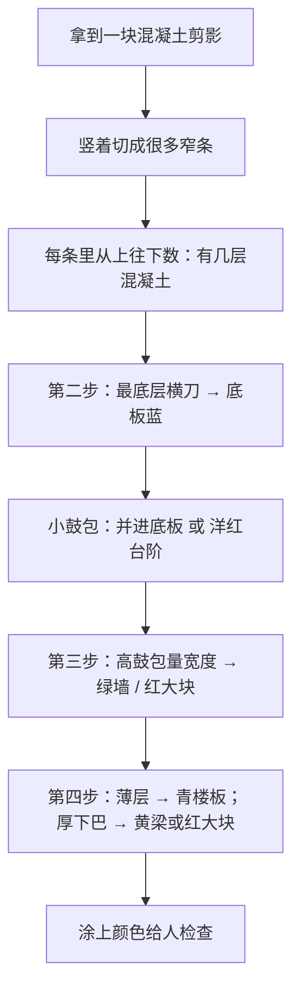

# N8 构件分区几何逻辑（大白话版 005v1）

> 日期：2026-06-13  
> 读者：想快速「看懂形状怎么被切开、贴上标签」，不必懂程序  
> 技术版：[005-N8构件分区核心逻辑](005-N8构件分区核心逻辑-2026-06-13-180000.md)

---

## 1. 我们在干什么？

想象你拿到一块**混凝土截面的剪影**（像剪纸一样的一个封闭外形，里面可能还有洞，比如门洞、坑）。

电脑要做的事：**把这块剪影拆成几块**，分别贴上牌子：

| 牌子颜色（预览） | 是什么 |
|------------------|--------|
| 蓝色 | 底板 — 最底下、贴着「地面」的那一大层 |
| 青色 | 楼板 — 比较薄的水平层 |
| 绿色 | 墙 — 又细又高的竖条 |
| 黄色 | 梁 — 从楼板往下鼓出来、但不太宽的一坨 |
| 红色 | 大体积混凝土 — 又宽又高的实心大块 |
| 洋红 | 局部混凝土 — 矮矮的小台阶、小鼓包 |

---

## 2. 两种情形：小块直接认，大块要「切蛋糕」

**情形 A — 整块很小、形状简单**  
比如一根细柱子、一条窄墙、一块扁平板：看一眼外框大小就够了，**不用切**，整块贴一个牌子。

**情形 B — 整块又大又复杂**  
像厂房截面、地下室截面：要按下面四步走，**像切蛋糕一样竖着切、横着分层**，再贴牌子。

---

## 3. 怎么「切」？—— 先竖着切成很多窄条

把剪影想象成从正面看的一幅画：

1. 找出外形上所有**拐角在左右方向的位置**，在这些位置竖着划线，把整幅画切成一条一条**竖条**（像切面包片，不过切的是竖片）。
2. 每一竖条里，在中间画一条**竖线**（不画在拐角上，画在两条竖线正中间），从上往下看这条竖线穿过剪影的哪些地方。
3. 竖线每穿过剪影一次，就得到一段**「里面有混凝土」的竖向区间**，从上到下编号：最上面是第 1 段，往下是第 2、3 段……
4. 每一段在左右两条竖线之间，用**上下边线连成一个四边形小条**（上边可能斜、下边可能斜，所以小条有时是梯形）。

很多相邻的小条，如果**上下对齐、又是同一种东西**，会粘成一大片。

> **孔洞**：门洞、坑的边也算外形的一部分。竖线穿过时，孔洞会让「里面有混凝土」的段变少或断开，所以填充不会涂进洞里。

---

## 4. 贴牌子的顺序（谁先谁后）

不能乱贴，要按盖房子的习惯来：

```
先认底板 → 再认墙 → 再认楼板/梁 → 最后剩下的大块
```

**谁先认出，谁就占住那块地方。**  
只有墙在伸进邻居混凝土时，允许和底板、楼板、大块**重叠一小段**（像钢筋要伸进旁边那块里一样），预览时墙画在最上面。

---

## 5. 四步走（大块的主故事）

### 第一步：竖条里先数清楚有几层

- 每个竖条里，**最下面那一段**先留着，第二步专门处理（可能是底板）。
- **上面的段**先当成「可能是楼板」记在小本子上。

### 第二步：从最底下「横着切一刀」—— 分出底板

问两个问题：

**① 这块剪影的底，是不是挨着「整组里最低的地面」？**

- **挨着地面**（落地）：可以在最下面横切，切出**底板**。
- **悬在半空**（比如上面一层的柱子、挂在别处的块）：不切底板，整竖条先当「悬空块」另行处理。

**② 落地时，横刀切在哪里？**

横刀不能乱切，要同时看：

- 这一条自己的底在哪；
- 底板最高能有多厚（面板里「底板上限」，默认大约 1.5 米）；
- 左边、右边邻居的底板顶是不是更低（要连成一条连续的蓝色横带）。

横刀以下 → **底板**（蓝色）。  
横刀以上 → 都是「鼓起来的部分」，继续往下分。

**鼓起来的小矮包**（高度不到大约 1 米）：

- 面板勾选「小凸起并进底板」→ 并进底板，底板顶抬高一点，还是蓝色一整片。
- 不勾选 → 矮包单独贴「局部混凝土」（洋红小台阶）。

**鼓得比较高**（超过大约 1 米）→ 交给第三步看是墙还是大块。

### 第三步：看鼓起来的竖条是「细墙」还是「粗墩」

把每个较高的竖向鼓包，再**横着切成很多薄层**，每一薄层问：

> 在这一层的高度，用水平线量一下，剪影里**实际有多宽**？

| 量出来 | 怎么说 |
|--------|--------|
| 比较窄（大约 ≤ 50 厘米）且这一层够高 | **墙**（绿色竖条） |
| 比较窄但层太矮 | 不算墙，当大块 |
| 很宽，但旁边紧贴着楼板，距离在「锚固长度」内（默认约 50 厘米） | 这一层算**楼板伸过来的舌头** |
| 很宽，旁边也不是楼板 | **大体积混凝土**（红色） |

墙在上下方向会**多伸出去一小段**（锚固），伸进旁边的混凝土里，但不跑出自己这一竖条的范围。

### 第四步：处理楼板，以及楼板下面挂着的「下巴」

第一步记在本子上的「可能是楼板」，和第三步里判成楼板舌头的部分合在一起：

| 情况 | 怎么说 |
|------|--------|
| 整条都很薄（大约 ≤ 30 厘米） | 整片 **楼板**（青色） |
| 整条都很厚 | 整片 **大体积**（红色） |
| 上面薄、下面挂着厚厚一坨 | 上面薄层 = 楼板；下面厚坨再看：|

下面厚坨如果：

- **不太宽**（大约 ≤ 80 厘米）→ **梁**（黄色，挂在楼板下面的梁肚）；
- **很宽**，或紧挨着红色大块 → **大体积**；楼板只从旁边伸进一小段舌头（重叠，方便以后配筋）。

### 收尾：剩下的红色、洋红，和最后的蓝色

- 还没贴牌子的红色候选 → 够高就是大体积，矮一点就是局部混凝土；
- 小局部如果紧贴着大体积，会**升级**成大体积的一部分；
- 第二步切好的底板，最后统一涂上蓝色。

---

## 6. 几个容易问的问题

**为什么竖条有时涂色会「鼓出」真轮廓？**  
每一竖条只在中间量一次、上下用直线连起来。轮廓如果中间凹进去，直线会像弦一样**架在凹口上面**，涂色就会比真外形多出一点。技术细节见 [004](004-N8构件识别几何逻辑与超界风险-2026-06-13-160000.md)。

**为什么要先分组再分区？**  
好几行基础排在一起时，每一行有自己的「地面」。先把离得不远的外轮廓划为一组（默认大约 1.5 米以内算邻居），每组单独从自己的最低点开始认底板，这样上面一行不会误把下面一行当地面。

**孔洞怎么算？**  
洞里的边也算外形。竖线穿过时，洞会让「里面有混凝土」断开，所以门洞、坑不会被涂上混凝土色。

---

## 7. 一张图串起来



---

## 8. 和面板数字的对应（只记意思）

| 面板里写的 | 大白话 |
|------------|--------|
| 底板上限 ~1500 | 底板最高能切多厚 |
| 墙厚上限 ~500 | 多窄算墙 |
| 板厚上限 ~300 | 多薄算楼板 |
| 梁宽上限 ~800 | 楼板下挂的坨多宽还算梁 |
| 局部高差 ~1000 | 多矮的鼓包算小台阶 |
| 锚固长度 ~500 | 墙或楼板伸进邻居多远 |
| 分组距离 ~1500 | 多近的外轮廓算同一行、同一地面 |
| 小凸起并进底板（勾选） | 矮鼓包并进蓝色底板 |

---

## 9. 文档分工

| 文档 | 写给谁 |
|------|--------|
| **005v1（本文）** | 想听懂几何故事的人 |
| [005 技术版](005-N8构件分区核心逻辑-2026-06-13-180000.md) | 要对着程序查的人 |
| [003](003-构件识别几何判读逻辑-2026-06-12-120000.md) | 要完整规则与历史变更的人 |
| [004](004-N8构件识别几何逻辑与超界风险-2026-06-13-160000.md) | 要查涂色为何出界的人 |

---

**版本**：005v1 | **日期**：2026-06-13
