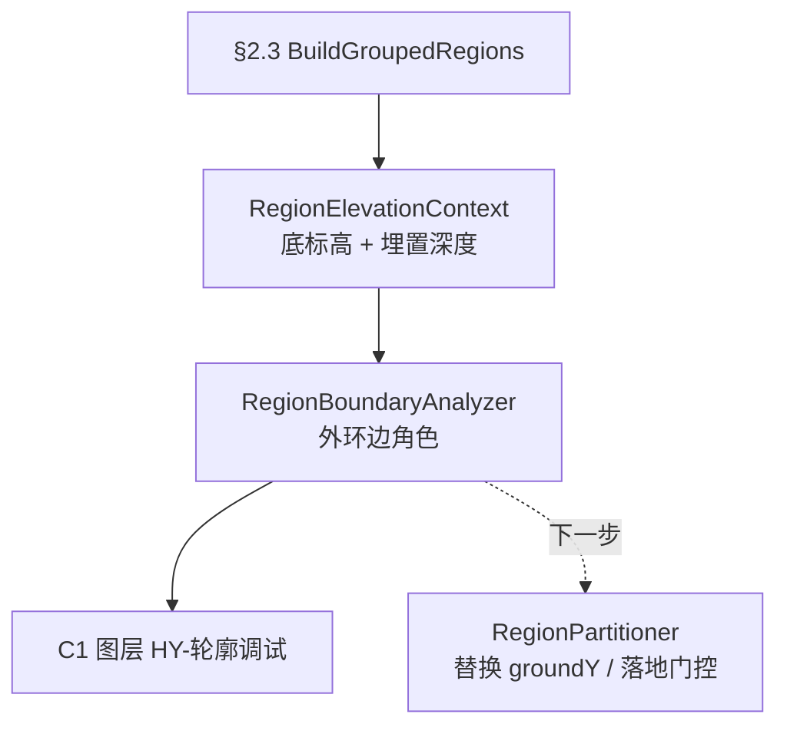

# 阶段 B：轮廓线与土气分界（C1 里程碑）

> 日期：2026-06-13  
> 命令：C1 → `DebugRegionBoundaryCommand`（`TestCommand` 联调入口）  
> 范围：**Domain 分析 + 面板参数 + C1 可视化**；**不改** `RegionPartitioner` / N8 正式识别  
> 关联：[004-N8构件识别几何逻辑与超界风险](004-N8构件识别几何逻辑与超界风险-2026-06-13-160000.md) §3、[005-N8构件分区核心逻辑](005-N8构件分区核心逻辑-2026-06-13-180000.md)

---

## 1. 大白话：混凝土外侧是什么？

想象基础截面立在图纸上，**Y 轴向上**：

```
        空气 ↑
    ─────────────  顶板接触边（绿）
    │  混凝土  │
    │          │   侧面：土气分界以上 → 空气（青）
    │          │   侧面：土气分界以下 → 土壤（橙）
    ─────────────  土气分界 Y = 底标高 + 埋置深度（黄虚线）
    │          │
    ─────────────  基础底面标高（白虚线，用户必填）
        土壤 ↓
```

| 边角色 | 判定要点 | 外侧环境 |
|--------|----------|----------|
| 下部轮廓 | 近水平，Y ≈ 基础底面（容差 80mm） | 下方 = **土壤** |
| 侧面-土 | 竖向/陡边，边中点 Y ≤ 土气分界 | **土壤** |
| 侧面-气 | 竖向/陡边，边中点 Y > 土气分界 | **空气** |
| 顶板接触 | 近水平，位于区域上部外缘（距 maxY ≤ 80mm） | 上方 = **空气** |
| 其它 | 斜向台阶、内过渡等 | 暂不标土气 |

**本步只分析 `region.Outer` 外环**；孔洞边不标土气（后续可扩展）。

---

## 2. 与 004 §3 的关系

[004](004-N8构件识别几何逻辑与超界风险-2026-06-13-160000.md) §3 描述的是 **旧链路**：分区器隐式用组内 `MinY` 作 `groundY`，再四阶段割线。

**阶段 B 新定义**（在分区**之前**插入）：



| 项目 | 旧（004 §3） | 新（006 阶段 B） |
|------|-------------|------------------|
| 地面基准 | 组 MinY 隐式推导 | 用户填 **基础底面标高** |
| 土/气分界 | 无显式概念 | **埋置深度** → `SoilAirY` |
| 外轮廓语义 | 直接进入 Partition | 先标边角色再分区 |
| N8 正式命令 | 仍走旧逻辑 | **本里程碑未改** |

---

## 3. 面板参数

| 参数 | 字段 | 说明 |
|------|------|------|
| 基础底面标高 mm | `CompFoundationBottomElevation` | **必填**，模型 Y；未填时 C1 中止 |
| 埋置深度 mm | `CompEmbedmentDepth` | 从底面**向上**；默认 0 |
| 区域分组距离 mm | `CompGroupClusterDistance` | 同 §2.3，默认 1500 |

计算：`SoilAirBoundaryY = FoundationBottomElevationMm + EmbedmentDepthMm`

持久化：`SettingsPanelViewModel` JSON 字段 `CompFoundationBottomElevation`（可空）、`CompEmbedmentDepth`。

---

## 4. 源码索引

| 模块 | 文件 |
|------|------|
| 标高上下文 / 边角色枚举 | `Domain/Components/RegionBoundaryProfile.cs` |
| 外环分析 | `Domain/Components/RegionBoundaryAnalyzer.cs` |
| C1 命令 | `DebugRegionBoundaryCommand.cs` |
| 可视化 | `Services/BoundaryProfilePreviewService.cs`（图层 `HY-轮廓调试`） |
| 面板 | `ReinToolPanel.xaml`、`SettingsPanelViewModel.cs`、`ComponentParameters.cs` |
| 联调入口 | `App/Test/TestCommand.cs` |

边方向分类复用 `RegionPartitioner.ClassifyEdge`：水平 ≤5°、竖向 ≥85°。

---

## 5. C1 验证步骤

1. `dotnet build src\HyCADTool\HyCADTool.csproj -c Debug`（0 error）
2. 打开统一面板 →「构件识别」区填写 **基础底面标高**、**埋置深度**
3. AutoCAD：**C2 → C1**，框选混凝土边界多段线
4. 命令行检查：各组 `SoilAirY`、每区边数量（下部/侧土/侧气/顶板/其它）
5. 图层 `HY-轮廓调试` 目视：
   - 棕 = 下部土
   - 橙 = 侧土
   - 青 = 侧气
   - 绿虚 = 顶板气
   - 白虚 = 底标高
   - 黄虚 = 土气分界
   - 组色填充 = 混凝土有效区

未填底标高时命令行提示并中止，**不** fallback 到 MinY。

---

## 6. 下一步（通过后）

1. 将 `RegionElevationContext` 接入 `RegionPartitioner.Partition` 的 `groundY` 与落地门控，替换隐式组 `MinY`
2. 边角色参与墙/梁/底板外侧环境判断（与 [005](005-N8构件分区核心逻辑-2026-06-13-180000.md) 四阶段对齐）
3. C1 通过后切换 `RecognizeComponentsCommand` / `ComponentRecognizer` 消费新上下文
4. 视需要更新 004 §3 全文（本步仅交叉引用，未改 004）

**刻意未改**：`RegionPartitioner.cs`、`RecognizeComponentsCommand.cs`、`ComponentRecognizer.cs`。
