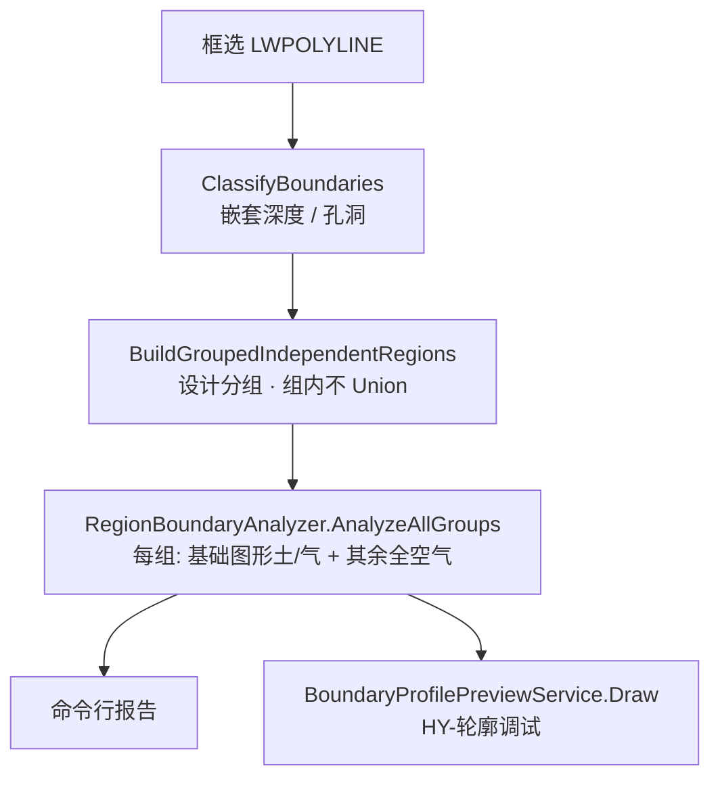

# 阶段 B · C1 土气分界联调（交付记录）

> 日期：2026-06-14  
> 命令：C1 → `DebugRegionBoundaryCommand`（`TestCommand.Run` 联调入口）  
> 范围：**独立图形分组 + 割线土/气 Domain 分析 + 图层可视化**  
> **不改** `RegionPartitioner` / N8 正式识别  
> 前置：[006-阶段B轮廓与土气分界](006-阶段B轮廓与土气分界-2026-06-13-200000.md)（初版方案，算法已演进，以本文为准）

---

## 1. C1 目标

在 §2.3 分组之后，对每个**设计分组（计算组）**内的每个**独立图形**（外框 + 孔洞，组内 **不 Union**），识别外轮廓与外侧介质的接触关系（土壤 / 空气），并用调试图层可视化，供后续接入 `RegionPartitioner` 前人工核对。

---

## 2. 几何规则（定稿）

### 2.1 分组与独立图形

| 概念 | 规则 |
|------|------|
| 设计分组 | bbox 间隙聚类（`BuildGroupedIndependentRegions`，同 §2.3 距离，默认 1500mm） |
| 独立图形 | 组内每条偶数深度外轮廓 + 其直接子孔洞，**不合并** |
| 孔洞 | 仅灰描边，不参与土/气分类 |

### 2.2 每组各自的 ymin 与割线

每个设计分组**独立**计算：

```
组 ymin   = 组内全部独立图形外框的最低 Y（图形坐标 mm，自动）
cutY      = 组 ymin + 埋置深度(m) × 1000
```

- **埋置深度**：面板输入，单位 **m**，内部 ×1000 换算为 mm。  
- **基础底面标高**：面板输入，**仅命令行上报**，不参与割线几何。  
- 多组时：**每组各有一条割线**（各自 cutY）。

### 2.3 组内基础图形与土/气

| 图形 | 判定 | 外轮廓接触 |
|------|------|------------|
| **基础图形** | 组内 ymin 最低；同高（1mm 容差）取 bbox **面积最大** | 按割线做土/气切分 |
| **其余独立图形** | 组内非 ymin 最低者 | 外轮廓 **100% 空气** |

### 2.4 基础图形：割线 + CCW 弧段分类

1. 水平割线 `y = cutY` 与**最外闭环**求交，取 **X 最小 / 最大** 两交点（左 / 右）。  
2. 沿外环 **CCW** 参数化：  
   - **左交点 → 右交点 CCW 弧** → **土壤（Soil）**  
   - **其余弧段** → **空气（Air）**  
3. 与割线相交的边段按几何切分为多段后再分类。  
4. 交点不足 2 个时：整圈暂标为土壤（fallback）。

> 与 006 初版「按边方向 + 底标高 SoilAirY」不同；C1 已改为 **组 ymin + 埋深割线 + 闭环弧段** 方案。

### 2.5 落地组标注

`IsPrimarySoilGroup`：全局 **组 ymin 最低** 的设计分组，**仅命令行标注**，不影响各组土/气计算（每组均独立切分）。

---

## 3. 可视化（图层 `HY-轮廓调试`）

| 图元 | 颜色 ACI | 说明 |
|------|----------|------|
| 土壤接触段 | **3 绿** | 仅基础图形 CCW 弧（埋土 / 基础色） |
| 空气接触段 | **30 橙** | 基础图形其余弧 + **组内其余独立图形整圈** |
| 孔洞 | 8 灰 | 闭合描边 |
| 割线 | 2 黄虚 | 每组 `cutY`，标注 `G# 割线 Y=…` |

线宽：接触边 50mm，割线 25mm。绘制前自动打开图层（解冻、开灯）。

---

## 4. 面板参数

| 面板标签 | ViewModel 字段 | 用途 |
|----------|----------------|------|
| 基础底面标高 | `CompFoundationBottomElevation` | 上报（m），不参与几何 |
| 埋置深度(m) | `CompEmbedmentDepth` | 割线：`cutY = 组ymin + 值×1000` |
| 区域分组距离 | `CompGroupClusterDistance` | 设计分组聚类距离 mm |

持久化：`SettingsPanelViewModel` JSON；C1 前 `CommitFocusedTextBoxValue` + `SaveSettings`（ReCall 先 LoadSettings 再 Commit，避免埋深被旧 JSON 覆盖）。

---

## 5. 处理流水线



---

## 6. 源码索引

| 模块 | 路径 |
|------|------|
| 边角色 / 标高上下文 / 分析结果 | `src/HyCADTool/Features/Reinforcement/Domain/Components/RegionBoundaryProfile.cs` |
| 分组内基础图形 + CCW 弧分类 | `src/HyCADTool/Features/Reinforcement/Domain/Components/RegionBoundaryAnalyzer.cs` |
| 独立图形分组 | `src/HyCADTool/Features/Reinforcement/Domain/ReinRegionBuilder.cs` → `BuildGroupedIndependentRegions` |
| C1 命令 | `src/HyCADTool/Features/Reinforcement/DebugRegionBoundaryCommand.cs` |
| 预览 | `src/HyCADTool/Features/Reinforcement/Services/BoundaryProfilePreviewService.cs` |
| 面板 | `ReinToolPanel.xaml`、`SettingsPanelViewModel.cs`、`ComponentParameters.cs` |
| 联调 | `src/HyCADTool/App/Test/TestCommand.cs` → `DebugRegionBoundaryCommand` |

---

## 7. 验证步骤

1. `dotnet build src\HyCADTool\HyCADTool.csproj -c Debug`（0 error）  
2. 面板：埋置深度 = 3（m），基础底面标高按需填写  
3. AutoCAD：**C2 → C1**，框选截面混凝土边界  
4. 命令行核对示例：

   ```
   计算组=N  独立图形=M  落地组=G#
   G#(落地/组)  组ymin=xxxx mm  基础图形=R#  cutY=xxxx mm (=ymin+3.00m×1000)
   G#-R#(基础)  土=xx  气=xx
   G#-R#(全空气)  土=0  气=xx
   ```

5. 图面 `HY-轮廓调试`：  
   - 每组基础图形：割线以下 / CCW 弧 = **绿**，露出部分 = **橙**  
   - 组内小框 / 上部独立块：**整圈橙**  
   - 每组 **黄虚割线** 在 `组ymin + 3000mm` 处  

---

## 8. 联调中已修复问题

| 现象 | 原因 | 处理 |
|------|------|------|
| 埋深 3m 不生效 | ReCall 顺序 + JSON 覆盖面板值 | LoadSettings → Commit；埋深 PropertyChanged 自动 Save |
| 3 被当 3mm | 未 ×1000 | `RegionElevationContext.DrawingUnitsPerMeter = 1000` |
| 仅落地组有割线 | 早期仅 primary 组切分 | 改为**每组**独立 cutY + 基础图形切分 |
| 组内小框整圈绿 | 误把「全空气」画成绿 | 空气改 **橙**；非基础图形整圈橙 |
| 基础图形土/气反色 | CCW 弧角色赋反 | 左→右 CCW 弧 = **土壤（绿）** |

---

## 9. 刻意未改 / 下一步

**未改**：`RegionPartitioner.cs`、`RecognizeComponentsCommand.cs`、`ComponentRecognizer.cs`。

**下一步（阶段 B 后续）**：

1. 将 `GroupBoundaryProfile` / 边角色接入 `RegionPartitioner.Partition`（替换隐式 `groundY`）  
2. N8 正式识别消费新上下文  
3. 视需要修订 [004](004-N8构件识别几何逻辑与超界风险-2026-06-13-160000.md) §3 与 006 过时段落  

---

## 10. 与 006 的差异摘要

| 项目 | 006 初稿 | 007 C1 定稿 |
|------|----------|-------------|
| 地面基准 | 用户填基础底面标高参与几何 | **组 ymin 自动**；底标高仅上报 |
| 土气分界 | 底标高 + 埋深 → SoilAirY | **cutY = 组ymin + 埋深(m)×1000** |
| 分类方式 | 边方向 + 边中点 Y | **割线与外环两交点 + CCW 弧** |
| 组内图形 | Union 后单区域 | **独立图形不 Union** |
| 非基础图形 | 未细化 | **外轮廓全空气（橙）** |
| 多组 | 单 cutY 思路 | **每组各自 cutY + 基础图形** |
