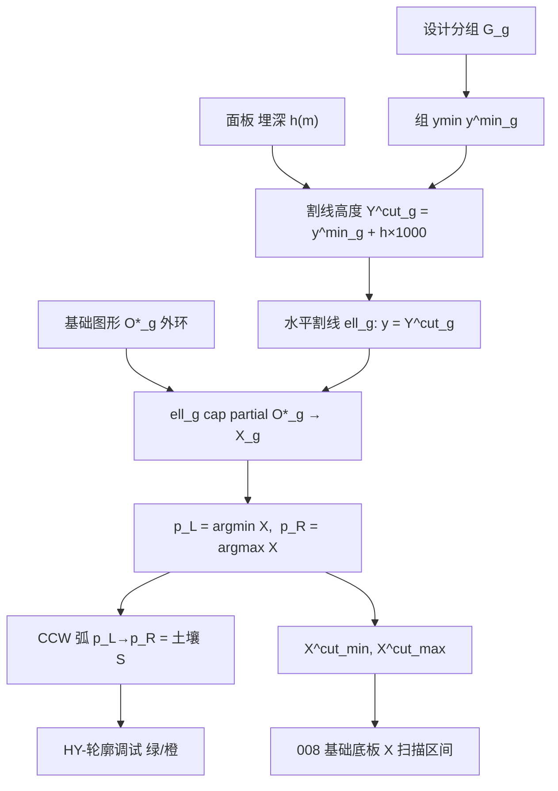

# 009 · 割线形成逻辑

> 日期：2026-06-15  
> 范围：**水平割线 $\ell_g$ 的高度、与基础图形外环求交、左/右土气点、CCW 土壤弧**  
> 符号：见 [000-土气分界符号词典](000-土气分界符号词典-数学约定-2026-06-14-190000.md) §4–§6  
> 实现：[RegionBoundaryAnalyzer.cs](../../src/HyCADTool/Features/Reinforcement/Domain/Components/RegionBoundaryAnalyzer.cs)  
> 联调：[007-阶段B-C1土气分界](007-阶段B-C1土气分界-2026-06-14-120000.md)  
> 下游：[008-基础底板分区](008-基础底板分区-C1-2026-06-14-200000.md)（用 $X^{cut}_{min/max}$ 限扫描区间）

---

## 1. 割线在流程中的位置

割线 **不是** 全局一条，而是**每个设计分组 $G_g$ 各有一条** $\ell_g$。它只作用于该组的**基础图形** $O^\*_g$ 外环，用于：

1. 把外轮廓边分为 **土壤 $\mathrm{S}$（绿）** 与 **空气 $\mathrm{A}$（橙）**
2. 产出 **左/右土气交点** $p_L,p_R$，及其 X 坐标 $X^{cut}_{min},X^{cut}_{max}$（供基础底板分区限宽）

---

## 2. 前置：谁参与、谁不参与

| 对象 | 是否参与割线几何 | 说明 |
|------|------------------|------|
| 设计分组 $G_g$ | 是 | 每组独立一条 $\ell_g$ |
| 组内全部独立图形 | 仅用于算 $y^{\min}_g$ | 取组内所有外框最低 Y |
| **基础图形** $O^\*_g$ | **是** | 组内 $y_{\min}$ 最低；同高取 bbox 面积最大 |
| 组内其余独立图形 | 否（整圈标 $\mathrm{A}$） | 不跑割线求交 |
| 孔洞 $\mathbb{H}$ | 否 | 仅灰描边 |
| 基础底面标高 $e_0$ | **否** | 面板输入，**仅命令行上报** |
| 埋置深度 $h$ | **是** | 面板 m → ×1000 得 mm |

**基础图形选取**（每组一个）：

\[
r^\*_g=\arg\min_r y_{\min}(O_{g,r}),\quad
|y_{\min}(O_{g,r_1})-y_{\min}(O_{g,r_2})|\le\varepsilon\Rightarrow
\text{取}\ \arg\max A(O_{g,r})
\]

$\varepsilon=10^{-3}$ mm（`FoundationGraphicTolerance`）。

---

## 3. 割线高度 $Y^{cut}_g$

**公式**（000 §4）：

\[
Y^{cut}_g = y^{\min}_g + h\kappa,\qquad
y^{\min}_g=\min_r y_{\min}(O_{g,r}),\quad
\kappa=1000\ \text{mm/m}
\]

| 符号 | 代码 |
|------|------|
| $h$ | `CompEmbedmentDepth` |
| $y^{\min}_g$ | `GroupBoundaryProfile.GroupMinY` |
| $Y^{cut}_g$ | `GroupBoundaryProfile.CutY` / `RegionElevationContext.CutY` |

**规则**：
- $h<0$ 时按 $0$ 处理
- 坐标系 = 图形 mm（1:1），**不是** $e_0$ 设计标高系

---

## 4. 割线与外环求交 $\mathbb{X}_g$

对基础图形外环 $\partial O^\*_g$，水平线 $y=Y^{cut}_g$ 与每条边 $e_i=(P_0,P_1)$ 求交：

| 边情形 | 交点 |
|--------|------|
| 两端点均在割线上 | 记录 $P_0,P_1$ 两个交点 |
| 一端点在割线上 | 记录该端点 |
| 跨越割线（$y_0$ 与 $y_1$ 异号） | $t=(Y^{cut}_g-y_0)/(y_1-y_0)$，$x=x_0+t(x_1-x_0)$ |

容差：`YTolerance = 1e-6` mm。

**去重**：按外环 CCW 弧长参数 $s$ 排序，相邻 $|s_i-s_{i-1}|\le 10^{-3}$ 合并为同一点（`DeduplicateHits`）。

**左/右土气点**（用于 CCW 分类与 X 区间）：

\[
p_L=\arg\min_{p\in\mathbb{X}_g} x(p),\qquad
p_R=\arg\max_{p\in\mathbb{X}_g} x(p)
\]

同 X 时按弧长参数 $s$ 破 tie（`OrderBy X` / `OrderByDescending X` + `ThenBy Position`）。

| 输出 | 代码 |
|------|------|
| 交点集 | `CollectCutHits` → `ContourHit` |
| $X^{cut}_{min}$ | `CutIntersectionMinX` |
| $X^{cut}_{max}$ | `CutIntersectionMaxX` |

---

## 5. CCW 弧段 → 土/气角色 $\rho(s)$

外环周长 $L$，交点对应弧长 $s_L,s_R$（`leftHit.Position`, `rightHit.Position`）。

**土壤弧** = 从 $p_L$ 沿 **CCW** 走到 $p_R$ 的弧段 $\widehat{s_L\to s_R}$：

\[
\rho(s)=
\begin{cases}
\mathrm{S}, & s\in\widehat{s_L\to s_R}\\[4pt]
\mathrm{A}, & \text{其余}
\end{cases}
\]

`IsOnCcwArc` 处理 $s_L>s_R$（弧跨越 $0/L$ 接缝）的 wrap-around。

**边 → 角色**：
1. 若边与 $\ell_g$ 相交，先 `SplitSegmentGeometry` 切成上下片段
2. 取片段中点弧长 $s_m$，查 $\rho(s_m)$
3. 写入 `ClassifiedBoundaryEdge`（`Role = Soil | Air`）

**Fallback**：$|\mathbb{X}_g|<2$ 或 $L\le\varepsilon$ → **整圈标 $\mathrm{S}$**（土壤）。

---

## 6. 与割线相关的边切分规则

`SplitSegmentGeometry(seg, cutY)` 对单条边：

| 情形 | 处理 |
|------|------|
| 整边在割线上方或下方 | 不切，整段保留 |
| 整边在割线上 | 不切，整段保留 |
| 一端点在割线上 | 不切，整段保留 |
| 跨越割线 | 在交点处拆成 lower / upper 两段 |

分类时按**片段**而非原始整边赋 $\rho$。

---

## 7. 组内非基础图形

组内 $r\ne r^\*_g$ 的独立图形：**不**与 $\ell_g$ 求交，外轮廓每条边直接 `Role = Air`（整圈橙）。

---

## 8. 可视化与命令行

| 图元 | 图层 | 颜色 |
|------|------|------|
| $\ell_g$ | `HY-轮廓调试` | 黄虚 ACI 2 |
| $\mathrm{S}$ 段 | 同上 | 绿 ACI 3 |
| $\mathrm{A}$ 段 | 同上 | 橙 ACI 30 |

割线标注：`G#g 割线 Y=…`（`BoundaryProfilePreviewService` / `BasePartitionPreviewService` 均绘制）。

**落地组** $g^\*=\arg\min_g y^{\min}_g$：命令行打「落地」标签，`IsPrimarySoilGroup` **不改变**各组割线计算。

---

## 9. 割线产物的下游用法（008）

| 割线产物 | 008 用途 |
|----------|----------|
| $Y^{cut}_g$ | 上下文；土壤弧已编码土/气，底板不再用 $y\le Y^{cut}$ 门控 |
| $\mathrm{S}$ 边集合 | **底板底边** = 非竖直 Soil 段（CCW 弧 $p_L\to p_R$） |
| $[X^{cut}_{min},X^{cut}_{max}]$ | 竖切断点 X 区间上限（土壤弧端点 ∪ 顶点，再 clip） |

若 $X^{cut}_{min/max}$ 为 NaN（无有效交点），008 回退用全 bbox 断点。

---

## 10. 源码索引

| 步骤 | 方法 | 文件 |
|------|------|------|
| 分组 + 组 ymin | `AnalyzeGroup` | `RegionBoundaryAnalyzer.cs` |
| $Y^{cut}_g$ | `RegionElevationContext.CutY` | `RegionBoundaryProfile.cs` |
| 选 $O^\*_g$ | `FindFoundationGraphicIndex` | `RegionBoundaryAnalyzer.cs` |
| 求交 + 左右点 | `CollectCutHits`, `GetCutLineIntersectionXs` | 同上 |
| CCW 分类 | `ClassifyOuterByContourArc`, `IsOnCcwArc` | 同上 |
| 预览 | `BoundaryProfilePreviewService.Draw` | `Services/BoundaryProfilePreviewService.cs` |
| C1 命令 | `DebugRegionBoundaryCommand` | `DebugRegionBoundaryCommand.cs` |

---

## 11. 验证

1. `dotnet build src\HyCADTool\HyCADTool.csproj -c Debug`
2. `TestCommand` 指向 `DebugRegionBoundaryCommand`（或单独 C1 土气命令）
3. **C2 → C1** 框选截面
4. 核对：每组一条黄虚割线；基础图形绿弧 = $p_L\to p_R$ CCW；其余图形全橙；命令行 cutY 与面板埋深一致

---

## 12. 常见误区

| 误区 | 正解 |
|------|------|
| 用 $e_0$ 算割线 | 割线只用 $y^{\min}_g+h\kappa$ |
| 全局一条割线 | **每组**各算 $\ell_g$ |
| 组内 Union 后再切 | 必须对 $O^\*_g$ **独立外环**求交 |
| 绿/橙反了 | CCW 弧 $p_L\to p_R$ = **土壤**（绿） |
| 左/右交点 = bbox 左右 | 是 $\ell_g\cap\partial O^\*_g$ 的 min/max **X** |

---

## 13. 下游

Y 向竖切、交点序与基础厚度 $H$ → [010-Y向割线与基础厚度](010-Y向割线与基础厚度-2026-06-15-140000.md)（$p_L,p_R,X^{cut}_{min/max}$ 本文已定，010 只引用）。

---

**版本**：1.0 | **日期**：2026-06-15
