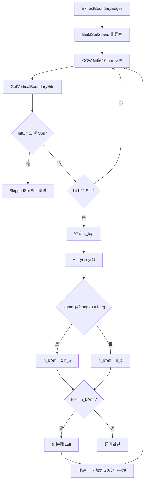

# 010 · Y 向割线与基础厚度

> 日期：2026-06-15（v1.4 修订：步长入面板 + 人工顶边 g-e 三型分类）  
> 范围：**沿土壤 $\mathcal{S}_g$ 弧步进竖切 → 第 1/2 交点门控 → 厚度 $H_i$ / $t_i$ → 底板拼图 cell（含人工顶边分类）**  
> 前置（已定稿，本文只引用）：[009-割线形成逻辑](009-割线形成逻辑-2026-06-15-120000.md)（$\ell_g$、$p_L,p_R$、$X^{cut}_{min/max}$）  
> 符号：[000-土气分界符号词典](000-土气分界符号词典-数学约定-2026-06-14-190000.md) §12–§13  
> 实现：[GroupBasePartitioner.cs](../../src/HyCADTool/Features/Reinforcement/Domain/Components/GroupBasePartitioner.cs)、[StripGeometry.cs](../../src/HyCADTool/Features/Reinforcement/Domain/Components/StripGeometry.cs)  
> 联调：`DebugBasePartitionCommand`（C1）

---

## 1. 与 009 的分工

| 阶段 | 方向 | 文档 | 产出 |
|------|------|------|------|
| 土气分界 | **水平** $y=Y^{cut}_g$ | **009** | $\ell_g$、$p_L,p_R$、$X^{cut}_{min/max}$、土壤 CCW 弧 $\widehat{p_L\to p_R}$（绿 $\mathrm{S}$） |
| 基础厚度 | **竖直** $x=x_m$，**沿 $\mathcal{S}_g$ 步进** | **010（本文）** | 交点 $y_{(1)},y_{(2)}$、$H_i$、底板拼图 cell、人工顶边分类 |

**核心约定（v1.4）**：沿外环 CCW 的 $\mathcal{S}_g$ **非竖直**段，以面板 **割线步长 mm**（默认 10）步进竖切；自下第 1/2 交点**皆 Soil 则跳过**；第 2 交点**非 Soil** 时锁定上边 $L_{\mathrm{top}}$ 并按上下边端点谁先到达切分拼图；超厚步进期间累计最高混凝土顶 $y_{\max}$，首块人工水平顶边 $L_{ge}$ 按长度分类墙/大体积/一般混凝土。

---

## 2. 输入符号（来自 009，已定）

| 符号 | 含义 | 代码 |
|------|------|------|
| $O^\*_g$ | 组内基础图形外框（含孔洞环） | `ReinRegion` |
| $p_L,p_R$ | $\ell_g\cap\partial O^\*_g$ 最左 / 最右交点 | 009 输出 |
| $X^{cut}_{min}=x(p_L)$ | 竖切 X 域左端 | `CutIntersectionMinX` |
| $X^{cut}_{max}=x(p_R)$ | 竖切 X 域右端 | `CutIntersectionMaxX` |
| $\mathcal{E}_g$ | 基础图形外环**全部分类边**（S + A） | `boundaryEdges` / `ExtractBoundaryEdges` |
| $\mathcal{S}_g$ | 外环 $\rho=\mathrm{S}$ 边段（绿弧 CCW） | `Role==Soil` 子集 |
| $h_b$ | 面板「底板厚≤mm」 | `CompBottomSlabMaxThickness` |

---

## 3. Y 向割线符号

| 符号 | 含义 | 代码 |
|------|------|------|
| $\Delta_{\mathrm{march}}$ | 步进间距（面板「割线步长 mm」，默认 10） | `CompBottomSlabMarchStep` / `BasePartitionOptions.MarchStepMm` |
| $\sigma_{down}\subset\mathcal{S}_g$ | 下边土壤弧非竖直段（$\|Δx\|>1$ mm） | `BuildSoilSpans` |
| $L_{\mathrm{top}}$ | 上边 = 竖切第 2 交点所在边（非 Soil） | `BoundaryHit` / `lockedTopSeg` |
| $L_{ge}$ | 人工水平顶边（原图不存在，首块向左延伸） | `BaseSlabCell.IsTopSynthetic` |
| $y_{\max}$ | 超厚步进期间混凝土最高顶 Y | 行进相 `maxTopY` |
| $\mathbb{H}(x)$ | 竖切 $x$ 在 $\mathcal{E}_g$ 上的命中点（Y 升序去重） | `GetVerticalBoundaryHits` |
| $\tau_i=[x_0,x_1]$ | 拼图块左右竖边界 | `BaseSlabCell.X0/X1` |
| $y_{\mathrm{soil}}(x)$ | 土壤弧在 $x$ 处 Y（多 $\sigma$ 重叠取最低 Y） | `TryGetSoilBottomY` |

### 3.1 S 弧步进探测（v1.4）

按 `SegmentIndex` **CCW** 遍历 $\sigma_{down}$：

1. **竖直**土壤段（$\|Δx\|\le 1$ mm）→ **忽略**，不竖切  
2. 在非竖直段上 $x \leftarrow x_{\min}(\sigma)$，每步 $x\leftarrow x+\Delta_{\mathrm{march}}$ 直至 $x_{\max}(\sigma)$  
3. 在 $x$ 处求 $\mathbb{H}(x)$，取最下两点 $\mathrm{hit}_0,\mathrm{hit}_1$  
4. **皆 Soil** → `SkippedSoilSoil`，**不出拼图**，继续步进  
5. **超厚**（$H_i > h_b^{\mathrm{eff}}$）→ 累计 $y_{\max}=\max(y_{\max}, y_{(2)})$，继续步进  
6. **hit_0 为 Soil 且 hit_1 非 Soil 且 $H_i\le h_b^{\mathrm{eff}}$** → 锁定 $L_{\mathrm{top}}$，`TriggeredNonSoilTop`  
7. 若步进期间曾超厚（$y_{\max}$ 有效）→ **首块** $[x_0,x_{\mathrm{trigger}}]$ 人工顶 $L_{ge}$：$\mathrm{TopL}=\mathrm{TopR}=y_{\max}$，`IsTopSynthetic=true`  
8. 后续块右界 = $\min\bigl(x(E_{top}),x(E_{soil})\bigr)$；上边先结束 → 继续步进探测新 $L_{\mathrm{top}}$  

**人工顶边 $L_{ge}$ 分类**（仅首块，`SyntheticTopLengthMm = x_1-x_0`）：

| 条件 | 类型 | 预览色 |
|------|------|--------|
| $L_{ge} < h_w$（墙厚≤mm） | 墙 `Wall` | 绿 |
| $L_{ge} > L_{\mathrm{mass}}$（大体积≥mm） | 大体积 `MassConcrete` | 红 |
| 其余 | 一般混凝土 `BottomSlab` | 蓝 |

纯 SoilSoil 步进（无超厚、无 $y_{\max}$）→ **不出发人工首块**，首块直接用 $L_{\mathrm{top}}$ 真实顶。

### 3.2 扫描域

\[
x\in[X^{cut}_{min},X^{cut}_{max}],\quad
x\in\bigcup_{\sigma_{down}} [x_{\min},x_{\max}]
\]

竖切命中仅在边段 **X 开区间内部**求交（不含端点）。

### 3.3 与 $O^\*_g$ 的分工

| 几何量 | 来源 |
|--------|------|
| 命中判定 Role | **全环** $\mathcal{E}_g$（须含 Air 边以识别第 2 交点非 S） |
| 第 1 交点 $y_{(1)}$ | 最下命中且 `Role==Soil` |
| 第 2 交点 $y_{(2)}$ | 自下第 2 命中（非 Soil 时触发拼图） |
| 拼图下边 | $\sigma_{down}$ / $y_{\mathrm{soil}}$ |
| 拼图上边 | $L_{\mathrm{top}}$ 在 $x_0,x_1$ 的 Y |

---

## 4. 主流程（`PartitionFoundationGraphic`）

1. 取 $\mathcal{E}_g$ → `ExtractBoundaryEdges`；过滤 $\mathcal{S}_g$ → `BuildSoilSpans`  
2. `BuildCellsBySoilMarching`：10mm 步进 + Soil-Soil 跳过 + NonSoil 触发拼图  
3. 触发时 $H=y_{(2)}-y_{(1)}$；按 §5 判 $h_b^{\mathrm{eff}}$ → 出 cell 或超厚跳过  
4. 相邻 cell UnionFind 合并 → 蓝色预览多边形  



---

## 5. 交点序（自下向上）

### 5.1 第 1 交点 — 基础底面

\[
y_{(1)} = \mathbb{H}(x)[0].y \quad (\mathrm{Role}=\mathrm{Soil})
\]

### 5.2 第 2 交点 — 触发上边

\[
y_{(2)} = \mathbb{H}(x)[1].y
\]

- `Role != Soil` 时触发 $L_{\mathrm{top}}$ 拼图逻辑  
- 两交点皆 Soil → 不处理（如图 2-3、4-5 的 ab 段）  

### 5.3 图示

```
        y ↑
          |     墙/上部结构
          |  ─── y(2) = L_top      ← 第2交点（非 S 触发）
          |  ███ 底板拼图块
          |  ─── y(1) = y_soil(x)  ← 第1交点（S_g）
          +──────────────────→ x
               x_trigger
     |←── tau_i ──→|
  x0              x1
  首块右界=触发 x；后续=min(上边端点,下边端点)
```

---

## 6. 厚度与门控

### 6.1 候选厚度

\[
H_i = y_{(2)} - y_{(1)}
\]

| 符号 | 代码 |
|------|------|
| $H_i$ | `CandidateHeightMm` |
| $t_i$ | `ThicknessMm`（出 cell 时 $t_i=H_i$） |

### 6.2 有效上限 $h_b^{\mathrm{eff}}$

按触发点所在土壤段 $\sigma$ 判斜：

\[
\angle(\sigma,x)=\arctan\frac{|Δy|}{|Δx|},\qquad
h_b^{\mathrm{eff}}=
\begin{cases}
2h_b & \angle(\sigma,x)\ge 1° \quad(\texttt{IsSoilSloped})\\
h_b & \text{水平土壤}
\end{cases}
\]

### 6.3 判定链

\[
H_i > h_b^{\mathrm{eff}} \Rightarrow \texttt{SkippedTooThick}
\]
\[
H_i \le h_b^{\mathrm{eff}},\ H_i\ge 1\text{mm} \Rightarrow \text{出底板拼图 cell}
\]

### 6.4 拼图 cell 四边

| 边 | 公式 |
|----|------|
| 下边左/右 | $y_{\mathrm{soil}}(x_0),\;y_{\mathrm{soil}}(x_1)$ |
| 上边左/右（真实顶） | $L_{\mathrm{top}}$ 在 $x_0,x_1$ 的 Y |
| 上边左/右（人工顶 $L_{ge}$） | $\mathrm{TopL}=\mathrm{TopR}=y_{\max}$（水平） |

---

## 7. 面板参数与命令读取

| 面板项 | 符号 | 读取路径 |
|--------|------|----------|
| 底板厚≤mm | $h_b$ | `SettingsPanelViewModel.CompBottomSlabMaxThickness` |
| 割线步长 mm | $\Delta_{\mathrm{march}}$ | `CompBottomSlabMarchStep` → `BasePartitionOptions.MarchStepMm` |
| 墙厚≤mm | $h_w$ | `CompWallMaxThickness` → `WallMaxMm` |
| 大体积≥mm | $L_{\mathrm{mass}}$ | `CompMassMinSize` → `MassMinMm` |

C1 命令行诊断字段：

- `SkippedSoilSoil` — 第 1/2 交点皆 S  
- `TriggeredNonSoilTop` — 第 2 交点非 S 触发  
- `ProbeTag` — `SoilSoil跳过` / `TopSeg触发` / `超厚跳过` / `人工顶边` / `底板`  
- `型` — `Wall` / `MassConcrete` / `BottomSlab`（人工顶边块）  
- `人工边` — `SyntheticTopLengthMm`（mm）  

---

## 8. 不处理的情形（当前 C1）

| 情形 | 处理 |
|------|------|
| $\mathcal{S}_g$ **竖直**段 | 不建 $\sigma_{down}$，步进跳过 |
| 第 1/2 交点**皆 Soil** | `SkippedSoilSoil`，不出拼图 |
| $H_i > h_b^{\mathrm{eff}}$ | 超厚跳过，累计 $y_{\max}$ |
| $h_b < 1$ mm | 回退默认 1500 mm |
| 纯 SoilSoil 无 $y_{\max}$ | 不出发人工首块，首块用真实 $L_{\mathrm{top}}$ |
| $L_{ge}$ 人工水平顶边 | 按 $L_{ge}$ 与 $h_w$、$L_{\mathrm{mass}}$ 分类墙/大体积/一般混凝土 |

---

## 9. 源码索引

| 步骤 | 方法 | 文件 |
|------|------|------|
| 全环分类边 | `ExtractBoundaryEdges` | `GroupBasePartitioner.cs` |
| 非竖直 $\sigma$ | `BuildSoilSpans` | 同上 |
| 竖切命中 | `GetVerticalBoundaryHits`, `BoundaryHit` | 同上 |
| S 弧步进拼图 | `BuildCellsBySoilMarching` | 同上 |
| 土壤底 Y | `TryGetSoilBottomY` | 同上 |
| 判斜 | `IsSoilSloped` | 同上 |
| 分区主流程 | `PartitionFoundationGraphic` | 同上 |
| C1 命令 | `DebugBasePartitionCommand` | `Features/Reinforcement/` |

---

## 10. 验证

1. **C2 → C1** 复测  
2. 2-3 段：第 1/2 交点皆 S → 无蓝 cell，`S-S跳过=True`  
3. 4-5 段：步进至第 2 交点非 S → 首块拼图，`TopSeg=True`  
4. 后续块：上下边端点谁先到达 → 条带切分与图示一致  
5. 斜土壤：`斜=True`，`上限=2·h_b`  
6. 人工顶边块：预览按型着色（绿墙/红大体积/蓝一般），命令行 `型=` / `人工边=`  

---

## 11. 与 008 / 009 关系

- **009**：水平土气割线 → $\mathcal{S}_g$  
- **010（本文 v1.4）**：S 弧步进探测 + 拼图生成 + 人工顶边 $L_{ge}$ 分类  
- **008**：C1 交付摘要，引用本文 §4–§6  

---

**版本**：1.4 | **日期**：2026-06-15
