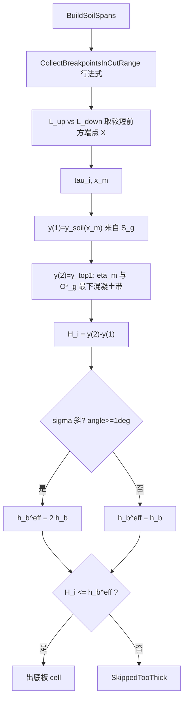

# 010 · Y 向割线与基础厚度

> 日期：2026-06-15（v1.2 修订：上下边共同控制行进式断点）  
> 范围：**沿土壤 $\mathcal{S}_g$ 弧铺设竖切 $\eta_m$ → 自下求交 → 厚度 $H_i$ / $t_i$ → 底板 cell**  
> 前置（已定稿，本文只引用）：[009-割线形成逻辑](009-割线形成逻辑-2026-06-15-120000.md)（$\ell_g$、$p_L,p_R$、$X^{cut}_{min/max}$）  
> 符号：[000-土气分界符号词典](000-土气分界符号词典-数学约定-2026-06-14-190000.md) §12–§13  
> 实现：[GroupBasePartitioner.cs](../../src/HyCADTool/Features/Reinforcement/Domain/Components/GroupBasePartitioner.cs)、[StripGeometry.cs](../../src/HyCADTool/Features/Reinforcement/Domain/Components/StripGeometry.cs)  
> 联调：`DebugBasePartitionCommand`（C1）

---

## 1. 与 009 的分工

| 阶段 | 方向 | 文档 | 产出 |
|------|------|------|------|
| 土气分界 | **水平** $y=Y^{cut}_g$ | **009** | $\ell_g$、$p_L,p_R$、$X^{cut}_{min/max}$、土壤 CCW 弧 $\widehat{p_L\to p_R}$（绿 $\mathrm{S}$） |
| 基础厚度 | **竖直** $x=x_m$，**沿 $\mathcal{S}_g$ 铺设** | **010（本文）** | 交点 $y_{(1)},y_{(2)}$、$H_i$、底板 cell |

**核心约定**：Y 向割线断点 $\mathbb{B}$ 由**上下两侧边共同控制**的行进式离散生成（非固定步长、非仅 $\mathcal{S}_g$ 端点并集）。  
第 1 交点仍仅来自 $\mathcal{S}_g$；第 2 交点 TopSeg 同时参与**步长**判定。

---

## 2. 输入符号（来自 009，已定）

| 符号 | 含义 | 代码 |
|------|------|------|
| $O^\*_g$ | 组内基础图形外框（含孔洞环） | `ReinRegion` |
| $p_L,p_R$ | $\ell_g\cap\partial O^\*_g$ 最左 / 最右交点 | 009 输出 |
| $X^{cut}_{min}=x(p_L)$ | 竖切 X 域左端 | `CutIntersectionMinX` |
| $X^{cut}_{max}=x(p_R)$ | 竖切 X 域右端 | `CutIntersectionMaxX` |
| $\mathcal{S}_g$ | 基础图形外环 $\rho=\mathrm{S}$ 边段（绿弧 CCW $p_L\to p_R$） | `Role==Soil` 的 `Edges` |
| $h_b$ | 面板「底板厚≤mm」 | `CompBottomSlabMaxThickness` |

---

## 3. Y 向割线符号

| 符号 | 含义 | 代码 |
|------|------|------|
| $\sigma_{down}\subset\mathcal{S}_g$ | 下边土壤弧非竖直段（$\|Δx\|>1$ mm） | `BuildSoilSpans` / `TryGetSoilBottomY` |
| $\sigma_{up}$ | 上边 = 竖切第 2 交点 `TopSeg` | `TryGetTopSegAt` |
| $\mathbb{B}$ | 行进式 X 断点，clip $[X^{cut}_{min},X^{cut}_{max}]$ | `CollectBreakpointsInCutRange` |
| $\tau_i=[x_0,x_1]$ | 相邻断点间第 $i$ 条竖切条带 | `breakpoints[i]..[i+1]` |
| $x_m=(x_0+x_1)/2$ | 条带中线采样 X | `BaseStripDiagnostic.Xm` |
| $\eta_m$ | 竖直线 $x=x_m$：底在 $\sigma_{down}$，向上与 $O^\*_g$ 求顶 | `GetInsideIntervalsAt` |
| $y_{\mathrm{soil}}(x)$ | 土壤弧在 $x$ 处 Y（多 $\sigma$ 重叠取最低 Y） | `TryGetSoilBottomY` |

### 3.1 行进式断点（上下边共同控制）

自 $x=X^{cut}_{min}$ 沿 **+X** 行进至 $X^{cut}_{max}$。每步在探针 $x+\varepsilon$ 处：

1. **下边** $P_{down}$ 落在 $\sigma_{down}$（土壤弧）；**上边** $P_{up}$ 落在 $\sigma_{up}$（最下混凝土带 `TopSeg`，= 第 2 交点边）  
2. 各边取 **前方端点** $E$：边段两端点中 $x(E)>x_{probe}$ 者（+X 行进 / 外环 CCW 在底边上的等价）  
3. 真实斜边长度：$L_{down}=\|P_{down}E_{down}\|$，$L_{up}=\|P_{up}E_{up}\|$（**非** X 投影）  
4. 下一断点：$x_{next}=x(E_{up})$ 若 $L_{up}<L_{down}$，否则 $x(E_{down})$  
5. $x\leftarrow x_{next}$，直至 $x\ge X^{cut}_{max}$  

**无固定步长**；条带宽度 $\Delta x_i=x_{i+1}-x_i$ 由上下边谁先拐弯决定。  
最小条带：`MinStripWidthMm=0.5`；无 TopSeg 时退化为仅下边推进。

### 3.2 扫描域

\[
x_m\in[x_0,x_1]\subset[X^{cut}_{min},X^{cut}_{max}],\quad
x_m\in\bigcup_{\sigma_{down}} [x_{\min},x_{\max}]
\]

每条 $\tau_i$ 内 $\sigma_{down}$、$\sigma_{up}$ 均为**单段直线**，cell 四边不跨拐点。

### 3.3 与 $O^\*_g$ 的分工

| 几何量 | 来源 |
|--------|------|
| 断点 $\mathbb{B}$ | **下边** $\sigma_{down}$ + **上边** $\sigma_{up}$ 行进比较 |
| 第 1 交点 $y_{(1)}$ | **仅** $\mathcal{S}_g$（$y_{\mathrm{soil}}$） |
| 第 2 交点 $y_{(2)}$ | $\eta_m$ 与 **$O^\*_g$ 全环**求最下带 `TopSeg` |

---

## 4. 主流程（`PartitionFoundationGraphic`）

1. 取 $\mathcal{S}_g$ → `BuildSoilSpans`  
2. **行进式**建 $\mathbb{B}$（上下边 $L_{up}$ vs $L_{down}$）→ $\tau_i$  
3. 对每条 $\tau_i$，取 $x_m=(x_0+x_1)/2$  
4. $y_{(1)}=y_{\mathrm{soil}}(x_m)$；失败 → 跳过列  
5. $\eta_m$ 与 $O^\*_g$ 求混凝土区间，取**最下一带**顶 → $y_{(2)}=y_{\top1}(x_m)$  
6. $H_i=y_{(2)}-y_{(1)}$；按 §5 判 $h_b^{\mathrm{eff}}$ → 出 cell 或超厚跳过  
7. 相邻 cell UnionFind 合并 → 蓝色预览多边形  



---

## 5. 交点序（自下向上）

### 5.1 第 1 交点 — 基础底面

\[
y_{(1)} = y_{\mathrm{soil}}(x_m)
\]

- **唯一**取自土壤绿弧 $\mathcal{S}_g$  
- **不用** `BotSeg`、$Y^{cut}_g$ 或 $O^\*_g$ 底边替代  

### 5.2 第 2 交点 — 最下混凝土带顶面

\[
y_{(2)} = y_{\top1}(x_m)
\]

- $\eta_m$ 与 $O^\*_g$ 各环边求交 → 有效域内合并区间 → 取最下一带 `TopSeg`  
- 条带左右端 $x_0,x_1$ 分别求 `TopSeg` 上 Y，保留阶梯/斜面  

### 5.3 图示

```
        y ↑
          |     墙/上部结构
          |  ─── y(2) = TopSeg     ← 第2交点（O*_g 竖切）
          |  ███ 底板候选带
          |  ─── y(1) = y_soil(x)  ← 第1交点（S_g 弧）
          +──────────────────→ x
               x_m   eta_m
     |←── tau_i ──→|
  x0              x1
  断点由上下边行进比较生成
```

---

## 6. 厚度与门控

### 6.1 候选厚度

\[
H_i = y_{(2)}(x_m) - y_{(1)}(x_m)
\]

| 符号 | 代码 |
|------|------|
| $H_i$ | `CandidateHeightMm` |
| $t_i$ | `ThicknessMm`（出 cell 时 $t_i=H_i$） |

### 6.2 有效上限 $h_b^{\mathrm{eff}}$

按**条带中线所在土壤段** $\sigma$（`soilSegMid`）判斜：

\[
\angle(\sigma,x)=\arctan\frac{|Δy|}{|Δx|},\qquad
h_b^{\mathrm{eff}}=
\begin{cases}
2h_b & \angle(\sigma,x)\ge 1° \quad(\texttt{IsSoilSloped})\\
h_b & \text{水平土壤}
\end{cases}
\]

代码常量：`SoilSlopeAngleThresholdDeg = 1.0`；竖直段已在 `BuildSoilSpans` 排除。

### 6.3 判定链

\[
H_i > h_b^{\mathrm{eff}} \Rightarrow \texttt{SkippedTooThick}\text{（整列跳过，不拉通邻接）}
\]
\[
H_i \le h_b^{\mathrm{eff}},\ H_i\ge 1\text{mm} \Rightarrow \text{出底板 cell}
\]

### 6.4 底板 cell 四边

| 边 | 公式 |
|----|------|
| 下边左/右 | $y_{\mathrm{soil}}(x_0),\;y_{\mathrm{soil}}(x_1)$ |
| 上边左/右 | `TopSeg` 在 $x_0,x_1$ 的 Y |

---

## 7. 面板参数与命令读取

| 面板项 | 符号 | 读取路径 |
|--------|------|----------|
| 底板厚≤mm | $h_b$ | `SettingsPanelViewModel.CompBottomSlabMaxThickness` |
| 埋深(m) | $h$ | 仅 009 算 $\ell_g$；010 不直接使用 |

C1 执行前：

1. `CommitFocusedTextBoxValue()` — 面板 TextBox → VM（`PropertyChanged` 绑定 + 焦点兜底）  
2. `DebugBasePartitionCommand` 读 `vm.CompBottomSlabMaxThickness` 作为 `bottomSlabMaxMm`  
3. 命令前**不重载** `hy-settings.json`（避免磁盘默认值覆盖面板当前值）  

命令行输出示例：

```
底板上限=1000mm
τ0 ... H=800  t=800  斜=False  上限=1000  超厚跳过=False  (底板)
τ1 ... H=1200  斜=True   上限=2000  超厚跳过=False  (底板)
```

诊断字段：`IsSloped`、`EffectiveMaxHeightMm`（= $h_b^{\mathrm{eff}}$）。

---

## 8. 不处理的情形（当前 C1）

| 情形 | 处理 |
|------|------|
| $\mathcal{S}_g$ **竖直**段 | 不建 $\sigma_{down}$ → 行进跳过 / 列无 $y_{\mathrm{soil}}$ |
| 无 TopSeg | 断点仅用下边 $E_{down}$ 推进 |
| 土-土自相交 | 暂靠竖直段过滤 |
| $H_i > h_b^{\mathrm{eff}}$ | 超厚跳过，不邻接拉通 |
| $X^{cut}_{min/max}$ 无效 | 断点回退为全 $\mathcal{S}_g$ 段端点 |
| $h_b < 1$ mm | 代码回退默认 1500 mm（异常参数保护） |

---

## 9. 源码索引

| 步骤 | 方法 | 文件 |
|------|------|------|
| 取 $\mathcal{S}_g$ | `ExtractSoilEdges` | `GroupBasePartitioner.cs` |
| 非竖直 $\sigma$ | `BuildSoilSpans` | 同上 |
| 土壤底 Y + 段 | `TryGetSoilBottomY(..., out soilSeg)` | 同上 |
| 判斜 | `IsSoilSloped` | 同上 |
| X 断点（行进式） | `CollectBreakpointsInCutRange`, `TryGetForwardEndpoint`, `TryGetTopSegAt` | 同上 |
| 竖切求顶 | `GetInsideIntervalsAt` | `StripGeometry.cs` |
| 分区主流程 | `PartitionFoundationGraphic` | `GroupBasePartitioner.cs` |
| C1 命令 | `DebugBasePartitionCommand` | `Features/Reinforcement/` |
| 预览 | `BasePartitionPreviewService` | `Services/` |

---

## 10. 验证

1. 009 土气 C1：绿弧 $p_L\to p_R$ 正确  
2. 010 基础分区：**C2 → C1**  
3. 面板「底板厚≤mm」= 1000 → 命令行 `底板上限=1000mm`，非斜列 `上限=1000`  
4. 斜土壤段：`斜=True`，`上限=2·h_b`  
5. 图面：阶梯/斜顶筏板条带随**上边拐点**增多；蓝 cell 上下边不跨拐点  

---

## 11. 与 008 / 009 关系

- **009**：水平土气割线 → $\mathcal{S}_g$  
- **010（本文）**：上下边共同控制行进式竖切 + 厚度定稿  
- **008**：C1 交付摘要，引用本文 §4–§6  

---

**版本**：1.2 | **日期**：2026-06-15
