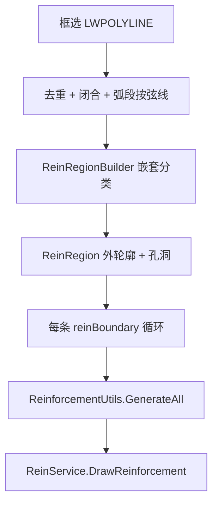

# 011 · gj 命令几何运算原理

> 日期：2026-06-15  
> 范围：**`gj`（绘制双线钢筋）** 从框选混凝土边界到线筋 / 点筋 / 标注的**平台无关几何链**  
> 命令：`DrawReinforcementCommand`（[commands.json](../../src/ReCall/commands.json) 键 `gj`）  
> 核心算法：[ReinforcementUtils.GenerateAll](../../src/HyCADTool/Features/Reinforcement/Domain/ReinforcementUtils.cs)  
> 面板参数：[001-gj面板与构件识别现状](001-gj面板与构件识别现状-2026-06-12-004500.md)  
> 关联：构件分区 / 按构件配筋见 **N8–N10**（本文 **不含** 构件识别）

---

## 1. 命令职责

| 项目 | 说明 |
|------|------|
| 输入 | 用户框选一条或多条闭合 `LWPOLYLINE`（混凝土边界） |
| 输出 | 线钢筋（双线宽 Polyline）、减少点筋（实心圆）、多重引线标注 |
| 区域 | 外轮廓 + **直接子孔洞** 各配一套筋（孔洞边界也走同样几何链） |
| 坐标 | 模型空间 **1:1 mm**；部分面板参数需 × `Scale`（见 §3） |

---

## 2. 符号与有效域

| 符号 | 含义 | 代码 |
|------|------|------|
| $B$ | 单条配筋边界（外轮廓或孔洞环） | `Polyline2D boundary` |
| $\mathcal{R}$ | 配筋有效域 = 外环内且不在孔洞内 | `ReinRegion` |
| $\partial\mathcal{R}$ | 有效域边界集（外环 + 各孔洞环） | `AllRings` |
| $p\in\mathcal{R}$ | 有效混凝土内点 | `IsValidRebarPoint(p)` |
| $c_s$ | 面板保护层厚度（缩放值） | `ProtectionThickness` |
| $c$ | 实际保护层 $=c_s\cdot\kappa$ | `protectionThickness` |
| $\kappa$ | 出图比例 `Scale` | `ReinParameters.Scale` |
| $L_a$ | 锚固长度 mm（**不** × Scale） | `AnchorageLength` |
| $L_h$ | 弯钩长度 $=HookLength\cdot\kappa$ | `hookLength` |
| $s$ | 点筋间距 mm（**不** × Scale） | `DotSeparation` |
| $d_{\mathrm{dot}}$ | 点筋偏移 $=DotReinOffset\cdot\kappa$ | `dotReinOffset` |

**有效域判定**（射线 / 弯钩 / 裁剪共用）：

\[
p\in\mathcal{R}\ \Leftrightarrow\ p\in\mathrm{Outer}\ \land\ \forall h\in\mathrm{Holes},\ p\notin h
\]

---

## 3. 面板参数与 Scale

| 面板项 | 字段 | 几何用途 | × Scale |
|--------|------|----------|---------|
| 比例 | `Scale` | $\kappa$ | — |
| 钢筋直径 / 间距 | `RebarDiameter`, `RebarSpacing` | 标注文字 | 间距否 |
| 锚固长度 | `AnchorageLength` | 直线 / 弯折锚固 | **否** |
| 点钢筋间距 | `DotSeparation` | 点筋布点 | **否** |
| 弯折最小长度 | `BendingLineMinLength` | 锚固弯折段下限 | **否** |
| 锚固连接长度 | `AnchorageJoinLength` | 相邻线筋合并 | **否** |
| 弯钩长度 | `HookLength` | 端部弯钩 | **是** |
| 保护层厚度 | `ProtectionThickness` | 线筋 / 射线内缩 | **是** |
| 点钢偏移 | `DotReinOffset` | 点筋中心线 | **是** |
| 线筋宽度 | `PolylineWidth` | 出图 ConstantWidth | **是** |
| 引线距离 | `MleaderDistance` | 标注偏移 | **是** |

工厂：`SettingsPanelViewModel.CreateReinParameters()` → `ReinParameters`。

---

## 4. 区域构建（`ReinRegionBuilder`）

1. **嵌套深度** $d(P)$：边界 $P$ 被其它选中环包含的次数  
2. **偶数深度** → 外轮廓（强制 CCW）；**奇数深度** → 孔洞（强制 CW）  
3. 每个外轮廓 + 其**直接**子孔洞 → 一个 `ReinRegion`  
4. **配筋边界列表** = $\{\mathrm{Outer}\}\cup\{\text{直接孔洞}\}$ — 外边界与孔洞边各调用一次 `GenerateAll`

含 bulge 弧段：读入后按**弦线**近似（命令行提示）。

---

## 5. 主流程（`GenerateAll`）

对每条边界 $B$：

| 步 | 几何操作 | 产出 |
|----|----------|------|
| ① | 内缩偏移 $-c$ | 线筋中心线候选环 $B_c$ |
| ② | 删短边、按转角拆段 | 子筋段数组 $\{S_j\}$ |
| ③ | 条件合并近邻平行段 | 拉通后的 $\{S_j'\}$ |
| ④ | 两端锚固延伸 | 带锚固折点的折线 |
| ⑤ | 端部弯钩 | `FinalReinforcements` |
| ⑥ | 裁剪至 $\mathcal{R}$ | 防止锚固 / 弯钩出界 |
| ⑦ | 再内缩 $-d_{\mathrm{dot}}$ | 点筋中心线 $B_d$ |
| ⑧ | 沿 $B_d$ 各边布点 + 减点 + 标注 | 点筋、MLeader |

---

## 6. ① 保护层内缩（线筋轨迹）

\[
B_c = \mathrm{Offset}(B,\,-c)
\]

- 实现：`IPolygonOffsetService.Offset`（AutoCAD `GetOffsetCurves`，取**面积最大**偏移结果）  
- 外轮廓 CCW、孔洞 CW：负距离使筋线进入**混凝土一侧**  
- 失败或顶点 $<3$ → 该边界跳过  

后处理：`RemoveShortSegments(1mm)`。

---

## 7. ② 转角拆段（`SplitByAngleThreshold`）

在 $B_c$ 每个顶点计算**转角** $\theta_i$（`GetVertexTurnAngles`）：

- 默认阈值 $\theta_{\mathrm{th}}=\pi$  
- **$\theta_i\ge\pi$**（ reflex / 凹角）处**断开**，得到若干**开放**折线 $S_j$  
- 若首顶点 $\theta_0<\pi$，末段与首段**合并**（闭合环上连续筋）  

过滤：顶点 $\ge2$ 且总长度 $>1$ mm。

**含义**：矩形整圈在四角断开 → 四条独立线筋；凸多边形整圈不断 → 一条闭合逻辑上的分段环。

---

## 8. ③ 相邻线筋合并（`ConnectByCondition`）

对平行且端点接近的两段 $S_a,S_b$：

- 末段 $S_a$ 与首段 $S_b$ 方向平行  
- 横向错距率 $\rho = d_\perp / d_\parallel < 1/6$  
- 端点距离 $d < L_{\mathrm{join}}$（`AnchorageJoinLength`）  

则合并为一条折线（可形成闭合）。

---

## 9. ④ 锚固延伸

对每段子筋 $S$，取首段 $\vec{s}_0$、末段 $\vec{s}_1$。

### 9.1 弯折方向（`GetBendDirection`）

若起点、终点沿各自延伸方向射线击中 $\partial\mathcal{R}$ 的**同一条边段**，则弯折方向为两击中点连线方向；否则无优选方向（直线锚固）。

### 9.2 单端延伸（`ExtendEnding`）

从端点 $P$ 沿单位方向 $\hat{u}$ 发射射线，求与 $\partial\mathcal{R}$ 的**最近正向交点** $Q$：

\[
|PQ'| = \max\bigl(0,\ |PQ| - 2c\bigr)
\]

即射线有效长度在边界处再内缩 **$2c$**（双侧保护层裕量）。

- 若 $|PQ'| \ge L_a$：**直线锚固** $P' = P + L_a\hat{u}$  
- 若 $|PQ'| < L_a$：**弯折锚固**  
  - 先走到 $Q'$，再沿弯折方向 $\hat{b}$ 走剩余长度  
  - 弯折段长度 $\ge BendingLineMinLength$（不足则取可用长度）  
  - 标记 `isBending=true`  

起点用首段**反向**延伸；终点用末段正向、弯折方向取反。

---

## 10. ⑤ 弯钩（`AddHooks`）

在锚固后的端点，沿最后一段方向旋转：

| 端 | 无弯折锚固 | 有弯折锚固 |
|----|------------|------------|
| 起点 | $\hat{u}$ 转 **225°**（$5\pi/4$） | `ChooseHookDirection` 选指向 $\mathcal{R}$ 内侧 |
| 终点 | $\hat{u}$ 转 **135°**（$3\pi/4$） | 同上 |

钩长：$L_h = HookLength \cdot \kappa$。

**内侧判定**（`ChooseHookDirection`）：  
优先 `IsValidRebarPoint` 测试钩尖；否则比较两候选方向到边界的射线距离，取**更远**一侧（指向混凝土内部）。

---

## 11. ⑥ 区域裁剪（`ClampReinforcementsToRegion`）

自两端向内：若端点 $p\notin\mathcal{R}$，沿端部边方向回退，在 $\partial\mathcal{R}$ 内缩 $2c$ 处或二分搜索最近有效点；仍无效则删顶点。

---

## 12. ⑦⑧ 点筋与标注

### 12.1 点筋中心线

\[
B_d = \mathrm{Offset}(B,\,-d_{\mathrm{dot}})
\]

### 12.2 全量布点（`GenerateDotPositions`）

对 $B_d$ 每条边段 $\overline{AB}$，长度 $L$：

- 有效布点长度 $L' = L - 2d_0$（`DotStartDistance`，默认 0）  
- 在 $[d_0,\,L-d_0]$ 内按间距 $s$ **均匀**取参数（余数对称分配）  
- 含起点、终点  

### 12.3 减少点筋（出图用）

`GenerateReducedDotPositions`：短边取端点；中等边取中点；长边取中点附近 $\pm s/2$ 两点 — 供 `ReinService` 画实心圆。

### 12.4 标注（`CalculateLabelData`）

沿 $B_d$ 各边用减点规则取锚点，段中点作引线位置；相邻标注中点距 $< s/2$ 则跳过。  
内容：`\U+E532{d}@{spacing}`（面板直径、间距）。

---

## 13. 出图（`ReinService.DrawReinforcement`）

| 图层语义 | 实体 | 宽度 / 大小 |
|----------|------|-------------|
| 线钢筋 | `FinalReinforcements` → Polyline | `PolylineWidth × Scale` |
| 点钢筋 | `ReduceDotReinPoints` → 实心圆 | `ReinforcementDiameter × Scale` |
| 引线 | `MLeaders` | `MleaderDistance × Scale` |

---

## 14. 射线求交（共用原语）

`TryGetNearestForwardIntersection(origin, direction, AllRings)`：

- 对 $\partial\mathcal{R}$ 每条环求正向最近交点  
- 锚固、弯钩、裁剪均复用  

实现：`ILineIntersectionService`（平台封装）。

---

## 15. 源码索引

| 阶段 | 类 / 方法 |
|------|-----------|
| 命令入口 | `DrawReinforcementCommand.Execute` |
| 区域 | `ReinRegionBuilder.ClassifyBoundaries` / `BuildRegions` |
| 几何主链 | `ReinforcementUtils.GenerateAll` |
| 拆段 / 合并 | `Polyline2D.SplitByAngleThreshold` / `ConnectByCondition` |
| 偏移 | `AutoCadPolygonOffsetService.Offset` |
| 出图 | `ReinService.DrawReinforcement` |

---

## 16. 与相关命令

| 命令 | 关系 |
|------|------|
| `gg` | 交互 Jig 画单条偏移线 + 弯钩；**不**走 `GenerateAll` 全链 |
| `N10` | `GenerateAllWithComponents`：在本文基础上叠加构件分区、梁跳过、大体积构造筋等 |
| 009–010 | 土气 / 底板分区；与 **gj 独立** |

---

## 17. 验证

1. 面板设保护层、锚固、间距 → **C2 → gj**（或 C1 若 TestCommand 指向 gj）  
2. 选矩形外轮廓：四角断开 → 4 根线筋 + 点筋沿内偏移闭合线  
3. 外轮廓 + 孔洞同选：孔洞边界单独出一套筋  
4. 凹角多边形：reflex 顶点处线筋断开  

---

**版本**：1.0 | **日期**：2026-06-15
