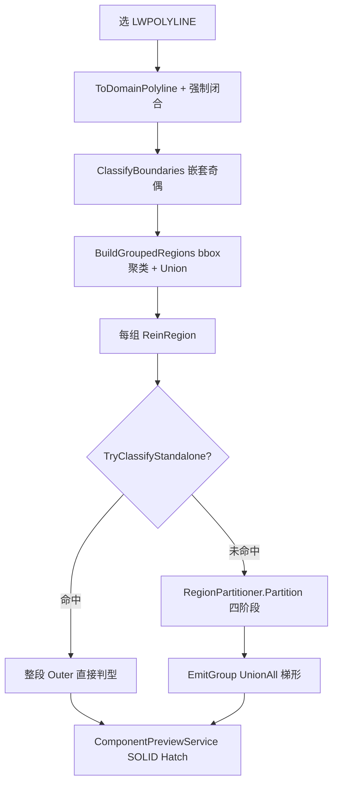
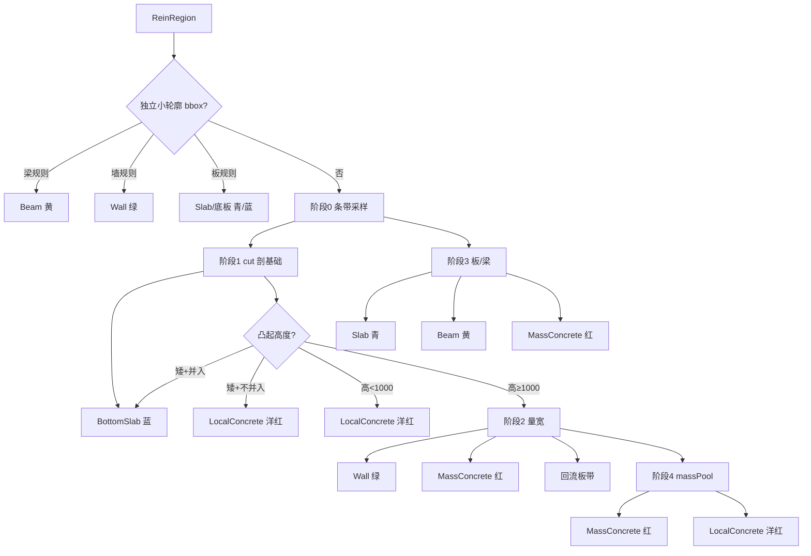

# 013 · N8 构件分类过程详解

> 日期：2026-06-15  
> 命令：`N8` → `RecognizeComponentsCommand.Execute`  
> 范围：**从选线到预览着色**的完整分类链路，含独立快路径与 `RegionPartitioner` 四阶段分区  
> 关联：[004-N8几何与超界](004-N8构件识别几何逻辑与超界风险-2026-06-13-160000.md)、[005-N8分区核心](005-N8构件分区核心逻辑-2026-06-13-180000.md)、[003-判读逻辑](003-构件识别几何判读逻辑-2026-06-12-120000.md)、[001-面板参数](001-gj面板与构件识别现状-2026-06-12-004500.md)

---

## 1. 总览

N8 把用户选中的闭合 LWPOLYLINE 截面，自动分成 6 类构件并着色预览：

| 类型 | 中文 | 预览色 (ACI) | 典型几何特征 |
|------|------|-------------|-------------|
| `BottomSlab` | 底板 | 5 蓝 | 贴全局最低 Y、厚度 ≤ 底板上限 |
| `Slab` | 楼板 | 4 青 | 水平薄层、厚度 ≤ 楼板上限 |
| `Wall` | 墙体 | 3 绿 | 竖向窄条、宽度 ≤ 墙厚上限 |
| `Beam` | 梁 | 2 黄 | 板下凸、窄于梁宽上限 |
| `MassConcrete` | 大体积混凝土 | 1 红 | 厚块、宽超限、非墙带 |
| `LocalConcrete` | 局部混凝土 | 6 洋红 | 矮凸起、贴大体积的薄块 |

**判定顺序（占有体积）**：底板 → 墙 → 板/梁 → 大体积/局部。先判定的类型先切走体积；墙锚固舌片可与底板/板/大体积几何重叠，预览时墙 Priority 最高后画覆盖。



---

## 2. 阶段 A：输入 → ReinRegion

### 2.1 CAD 转换

`RecognizeComponentsCommand` 对每个选中实体：

1. `ToDomainPolyline()` — 顶点坐标复制，**bulge 恒为 0**（弧段变弦线）。
2. `RemoveDuplicateVertices()` — 去重顶点。
3. **无条件** `IsClosed = true` — 未闭合线也被当闭合环。

### 2.2 嵌套分类 `ClassifyBoundaries`

- 用每条多段线**首顶点**做点包含，统计被其他线包含次数 → **嵌套深度**。
- **偶数深度** → 外轮廓（强制 CCW）；**奇数深度** → 孔洞（强制 CW）。
- 孔洞归属：孔洞首顶点落在哪个外轮廓内即挂到该组。

有效混凝土域：

```
IsValidRebarPoint(p) = p ∈ Outer ∧ p ∉ 任一 Hole
```

实现：`ReinRegion.cs`。

### 2.3 分组与合并 `BuildGroupedRegions`

1. 所有外轮廓算 axis-aligned bbox。
2. `ClusteringService.ClusterByBoundsDistance`（BFS）：bbox 间隙 ≤ `RegionGroupDistanceMm`（默认 1500mm）→ 同一**计算组**。
3. 组内 `BuildMergedRegions`：外轮廓 `PolygonBoolean.UnionAll` 合成一个外环；孔洞按包含挂接。

**几何含义**：聚类只决定「哪些外轮廓一起算、共享 `groundY`（组内最低 Y）」，不改变单条多段线顶点；Union 后外边界可能比任一原线更大。

### 2.4 线段收集

`CollectSegments(region)`：外轮廓 + 全部孔洞边 → `Line2D[]`。**孔洞边参与割线求交**（房间、设备坑内侧）。

---

## 3. 阶段 B：独立小轮廓快路径

`ComponentRecognizer.TryClassifyStandalone` — bbox 满足下列规则时，**直接用 `region.Outer` 克隆**，不经条带近似：

| 顺序 | 条件（w=宽, h=高, 单位 mm） | 判型 |
|------|---------------------------|------|
| 1 | `w ≤ BeamMaxWidthMm` 且 `h ≤ BeamMaxHeightMm` 且 `max(w,h) ≥ 200` | **梁** |
| 2 | `w ≤ WallMaxThicknessMm` 且 `h ≥ 2w` 且 `h ≥ 200` | **墙** |
| 3 | `h ≤ flatLimit` 且 `w ≥ 2h` 且 `w ≥ 200` 且贴全局底/顶（±80mm） | **底板**（贴底）或 **楼板**（不贴底） |

其中 `flatLimit = max(SlabMaxThicknessMm, BottomSlabMaxThicknessMm)`；贴底判定 `outerBbox.MinY ≤ globalBbox.MinY + 80`。

**特点**：输出多边形 = 输入外轮廓精确克隆，**通常不超界**。大截面基础图一般走不到此路径。

---

## 4. 阶段 C：大轮廓四阶段分区

大轮廓进入 `RegionPartitioner.Partition`。输入：单个 `ReinRegion`、面板阈值、`groundY`（计算组最低 Y）、`mergeBumpsIntoBottomSlab`。

N8 默认 `UseVerticalEdgeWalls = false`，阶段 2 走 **`SplitRaisedCellByWidth`（逐带水平量宽）**，不走竖边成对路径。

### 4.0 核心几何原语

#### X 断点与条带

- **断点** = 外轮廓 + 孔洞**全部顶点 X**，排序去重。
- 条带 `[x_i, x_{i+1}]`；宽 `< 0.5mm` 跳过。
- **割线** `x_m = (x_i + x_{i+1}) / 2` — 刻意不穿过顶点。

#### 竖直区间 `GetInsideIntervalsAt`

在 `x = x_m` 处：

1. 与全部线段求交 Y，降序（最高交点 j1）。
2. 相邻交点构成 gap；**gap 中点**做 `IsValidRebarPoint`（不依赖奇偶配对）。
3. 连续 inside gap 合并为 `InsideInterval`，记录 `TopSeg` / `BotSeg`。

#### 梯形 cell `TrapezoidCell`

条带内每个混凝土区间 → 四边形：

```
(x0, TopL) → (x1, TopR) → (x1, BotR) → (x0, BotL)
```

四角 Y 由 `EvaluateYOnSegment(TopSeg/BotSeg, x0/x1)` 线性插值（t 钳制 [0,1]）。

`CellKind`：`Slab` | `BottomSlab` | `Raised`（cut 以上的上凸块）。

#### 合并与输出

- **`MergeCells`**：并查集 — 相邻条带 + 同 Kind + 共享边界 Y 重叠 > 1mm → 合并。
- **`EmitGroup`**：`UnionAll(组内 cell.ToPolygon())` → `PartitionRegion { Type, Polygon, ThicknessMm }`。
- **注意**：N8 **未**对结果做 `∩ (Outer − Holes)` 出口裁剪（见 004 §4.6），梯形弦线近似可能导致 Hatch 略超原轮廓。

---

### 4.1 阶段 0：条带采样

对每个条带 `x_m` 求 `InsideInterval[]`：

| 区间位置 | 去向 |
|----------|------|
| 非最下区间（k < count−1） | `upperSlabCells`（板候选，`BuildCell`） |
| 最下区间 | `stripBottoms`（阶段 1 再 cut 剖基础） |

---

### 4.2 阶段 1：基础统一切割

#### 地面门控 `grounded`

```
grounded = (regionMinY ≤ groundY + BottomSlabMaxThicknessMm)
```

| grounded | 行为 |
|----------|------|
| **true**（落地） | 最下区间按 cut 剖底板；`[cut, 顶]` → 凸起分类 |
| **false**（非落地） | `cut = 区间底`；整列 → `floatingCells` |

#### cut 公式（grounded）

```
refTop = min(左邻底板顶, 右邻底板顶)   // 缺邻则用 maxBot + 底板上限
cut    = clamp( min(refTop, maxBot + BottomSlabMaxThicknessMm, maxTop),  下限=maxBot )
```

- `[区间底, cut]` 且 `cut − maxBot ≥ 1mm` → **底板 cell**（`BottomSlab`）
- `[cut, 顶]` 且高度 ≥ 1mm → **上凸块** `raisedCell`

#### 上凸块分流

| 条件 | 去向 |
|------|------|
| 非 grounded | `floatingCells` |
| 高 `< LocalConcreteMaxHeightMm` 且在底板上（或勾选并入底板） | **矮凸起** `shortBumps` |
| 否则 | **protrusionPool**（阶段 2 墙/大体积候选） |

#### 矮凸起 `ProcessShortBottomBumps`

| `MergeBumpsIntoBottomSlab` | 行为 |
|---------------------------|------|
| **true**（默认） | 并入已有底板顶，或 `OrigBot` 新建底板 cell |
| **false** | run 求 `runMinTop`，底板顶夹紧；超出部分 → **局部混凝土** `EmitGroup` |

#### protrusionPool 预分流（阶段 1 收尾）

```
块高 = Max(MaxTop) − Min(MinBot)
```

| 块高 | 去向 |
|------|------|
| `< LocalConcreteMaxHeightMm`（默认 1000mm） | 直接 **局部混凝土** |
| `≥ 1000mm` | **wallCandidates**（阶段 2） |

#### floatingCells（非落地列）

| 组内特征 | 去向 |
|----------|------|
| 任一 cell 厚度 ≤ 板厚上限 | 转 `Slab`，进阶段 3 |
| 全厚列 | protrusionPool |

---

### 4.3 阶段 2：墙体 `SplitRaisedCellByWidth`

对每个 `wallCandidates` cell（上凸整块），按 Y 断点剖成高度带；每带中点 `y_m` 调用 **`MeasureContourWidthAt`**：

1. 水平线 `y = y_m` 与轮廓全部线段求交 X。
2. gap 中点 inside 测试，找**包含列中心 `x_m` 的连续混凝土区段** → 实际宽度 `width`。
3. 同高 `Slab` cell 记录左右**板缘 X**（锚固判据）。

#### 高度带判型

| 条件 | kind | 最终类型 |
|------|------|----------|
| `width ≤ WallMaxThicknessMm` 且 带高 ≥ **500mm**（硬编码 `WallMinHeightMm`） | 0 墙带 | **墙**（上下锚固延伸） |
| `width ≤ WallMaxThicknessMm` 但 带高 < 500mm | 0→降级 | **大体积** |
| `width > WallMaxThicknessMm` 且 板缘距列边 ≤ `AnchorageLengthMm` | 2 板带 | **板**（回流阶段 3） |
| 其余 | 1 大体积带 | **大体积** |

#### 墙带锚固延伸

- **向上**：顶延伸到 `runTop + AnchorageLengthMm`（不出列顶）。
- **向下**：若墙带底与列底之间夹层 < 1000mm（局部/薄底板）→ 延伸到列底 `OrigBot`；否则只深入 `AnchorageLengthMm`。

#### 2-run 下邻判型

连续板带 run 若**下邻为大体积** → 整 run 转大体积 + 标记锚固舌片（薄板伸入大体积）。

墙带 → `wallCells` → `MergeCells` → `EmitGroup(Wall)`。

> **与面板「平行夹角阈值°」的关系**：N8 默认路径**不读** `ParallelAngleThresholdDeg`。墙判型靠**水平割线量宽**，不是轮廓边角度。`ClassifyEdge`（硬编码水平 ≤5°、竖向 ≥85°）目前仅作边方向枚举预备，未参与 `SplitRaisedCellByWidth` 主链。面板 `ParallelLineRatioMin` 同理，仅 `UseVerticalEdgeWalls=true` 时生效（N12 实验路径，当前 N12 已重置为 N8 基线）。

---

### 4.4 阶段 3：板 + 梁 `ProcessSlabGroups`

输入：`upperSlabCells`（阶段 0）+ 阶段 2 回流 `slabPieces`。

对每个 `MergeCells` 组，按列厚度拆 **thin**（≤ 板厚上限）与 **thick**（> 板厚上限）：

| 组特征 | 处理 |
|--------|------|
| 全 thick、无 thin | → `massPool`（大体积） |
| 全 thin | → `EmitGroup(Slab)` |
| thin + thick 混合 | 薄列 `MinBot` 定**板基线 baseline**；厚列拆分 |

#### 厚列拆分

厚列在 baseline 处切成下段 `[底, baseline]` 与上段 `[baseline, 顶]`：

| 下段 | 判型 |
|------|------|
| 宽 > `BeamMaxWidthMm` 或贴 `massPool` | **大体积**；上段随大体积；薄列侧生成 **板锚固舌**（≤ 锚固长） |
| 否则 | **梁**；上段归 **板** |

---

### 4.5 阶段 4：大体积 / 局部 `EmitMassAndLocal`

对 `massPool` 合并组：

| 块高 | 初判 |
|------|------|
| `≥ LocalConcreteMaxHeightMm` | **大体积混凝土** |
| `< 1000mm` | **局部混凝土** |

**升级规则**：局部块若与任一大体积块水平/垂直接触 → 迭代升级为大体积。

最后 `bottomSlabCells` → `EmitGroup(BottomSlab)`。

---

## 5. 分类决策树（速查）



---

## 6. 面板参数 → 分类用途

| 面板字段 | `ComponentParameters` | 默认 | 影响阶段 |
|----------|----------------------|------|----------|
| 平行夹角阈值° | `ParallelAngleThresholdDeg` | 15 | **N8 默认未接入**；预留 / N12 实验竖边路径 |
| 平行占比≥ | `ParallelLineRatioMin` | 0.6 | **N8 默认未接入** |
| 楼板厚≤mm | `SlabMaxThicknessMm` | 300 | 阶段 0/3 薄厚分界 |
| 墙厚≤mm | `WallMaxThicknessMm` | 500 | 独立快路径 + 阶段 2 量宽 |
| 底板厚≤mm | `BottomSlabMaxThicknessMm` | 1500 | grounded 门控 + cut 上限 |
| 局部凸起并入底板 | `MergeBumpsIntoBottomSlab` | true | 矮凸起并入/拆分 |
| 大体积≥mm | `MassConcreteMinSizeMm` | 1000 | 文档别名；代码用 `LocalConcreteMaxHeightMm` |
| 局部高差上限 | `LocalConcreteMaxHeightMm` | 1000 | 矮凸起 / protrusion 预分流 / 大体积分界 |
| 梁宽≤mm | `BeamMaxWidthMm` | 800 | 独立快路径 + 阶段 3 梁宽 |
| 梁高≤mm | `BeamMaxHeightMm` | 1500 | 独立快路径 |
| 锚固长度 | `AnchorageLengthMm` | 500 | 墙/板锚固舌延伸 |
| 分组距离 | `RegionGroupDistanceMm` | 1500 | 计算组聚类 → `groundY` |

**硬编码常量**（`RegionPartitioner.cs`）：`WallMinHeightMm=500`、`MinStripWidthMm=0.5`、`MergeOverlapMm=1`、`HorizontalAngleDeg=5`、`VerticalAngleDeg=85`。

---

## 7. 输出与预览

`Partition` → `List<PartitionRegion>` → `ComponentRecognizer` 包装 `ComponentRegion` → `ComponentPreviewService.DrawSession`：

- 图层：`HY-构件预览`
- 填充：SOLID Hatch + 类型文字标注
- **Priority**（升序绘制，后画覆盖）：底板 1 → 板 2 → 大体积 3 → 局部 4 → **墙 5** → 梁 6

`ClassifyPoint` 按 Priority 降序查包含关系 — 重叠区墙优先。

---

## 8. 典型误判与排查

| 现象 | 可能原因 | 查哪里 |
|------|----------|--------|
| 竖肢判红（大体积） | 阶段 2 量宽时上下与大块连通，水平宽度 ≫ 墙厚；或墙带高 < 500mm 被降级 | `SplitRaisedCellByWidth` + `MeasureContourWidthAt` |
| 贴边伪墙（绿条） | 宽块边缘浅凹口量宽 ≤ 墙厚 | 同上 |
| Hatch 超出原轮廓 | 梯形弦线 + 无出口裁剪 | 004 §4.6；`EmitGroup` 无 `IntersectPolygonWithRegionAll` |
| 底板偏厚/偏薄 | cut 受邻列底板顶桥接影响 | 阶段 1 `FindNeighborBottomTops` |
| 矮台变洋红/并蓝 | `MergeBumpsIntoBottomSlab` 开关 | `ProcessShortBottomBumps` |
| 小构件类型不对 | 走独立快路径 bbox 规则 | `TryClassifyStandalone` |

---

## 9. 源码索引

| 模块 | 文件 | 关键符号 |
|------|------|----------|
| 命令入口 | `RecognizeComponentsCommand.cs` | `Execute` |
| 区域构建 | `ReinRegionBuilder.cs` | `ClassifyBoundaries`、`BuildGroupedRegions` |
| 识别调度 | `ComponentRecognizer.cs` | `Recognize`、`TryClassifyStandalone`、`RecognizeLargeRegion` |
| 分区核心 | `RegionPartitioner.cs` | `Partition` |
| 阶段 0 | `RegionPartitioner.cs` ~L202 | 条带采样 |
| 阶段 1 | `RegionPartitioner.cs` ~L235 | cut、shortBumps、protrusionPool |
| 阶段 2 | `RegionPartitioner.cs` ~L415 | `SplitRaisedCellByWidth` |
| 阶段 3 | `RegionPartitioner.cs` ~L671 | `ProcessSlabGroups` |
| 阶段 4 | `RegionPartitioner.cs` ~L859 | `EmitMassAndLocal` |
| 量宽 | `RegionPartitioner.cs` | `MeasureContourWidthAt` |
| 区间 | `RegionPartitioner.cs` | `GetInsideIntervalsAt` |
| 类型/颜色 | `ComponentType.cs` | `DisplayName`、`ColorIndex` |
| 预览 | `ComponentPreviewService.cs` | `DrawSession` |

---

## 10. 与 N12 的关系（2026-06-15 现状）

`RecognizeComponentsSoilCommand`（N12）**当前已复制 N8 基线**，与 N8 走同一套 `ComponentRecognizer.Recognize(group, parameters)`，无额外选项。后续可在 N12 上独立叠加土气 cutY、出口裁剪、竖边判墙等，而不影响 N8。

---

**版本**：1.0 | **日期**：2026-06-15
