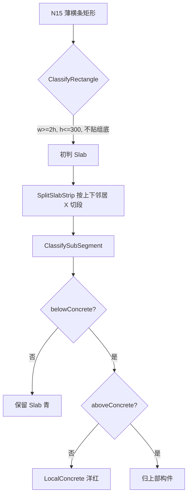

# 014 · N16 基础上方混凝土块如何判为局部混凝土

> 日期：2026-06-16  
> 命令：`N16` → `MeshComponentDivideCommand`  
> 源码：[MeshComponentClassifier.cs](../../src/HyCADTool/Features/Reinforcement/Domain/Components/MeshComponentClassifier.cs)  
> 关联：[013-N8分类过程详解](013-N8分类过程详解-2026-06-15-210000.md)、[002-底板识别逻辑](002-底板识别逻辑-2026-06-12-143000.md)

---

## 1. 场景（你截图中的箭头）

截面底部有一条**蓝色底板**（`BottomSlab`）。其上方贴着若干**薄横条**（洋红，`LocalConcrete`），上方为空气/空腔（黑底）。

这类块**不是**底板本身（底边不在组最低 Y），初判往往先被当成**楼板**（横条 + 厚度 ≤ 楼板上限），随后在 **Slab 精修** 阶段被改写成局部混凝土。

---

## 2. N16 判型两阶段


| 阶段 | 方法 | 作用 |
|------|------|------|
| 1 | `ClassifyRectangle` | 按长宽比 + 厚度 + 是否贴组底 → 墙/梁/底板/楼板/大体积/局部 |
| 2 | `RefineSlabRegions` → `SplitSlabStrip` | **只对初判为 `Slab` 的横条**再探测上下混凝土，改写类型 |

基础上方的薄横条通常走路径：**初判 Slab → 精修 → LocalConcrete**。

---

## 3. 阶段 1：为何初判是「楼板」

`ClassifyRectangle` 对横条（`w ≥ 2h`）：

```
if (atBottom && h <= BottomSlabMaxThicknessMm) → BottomSlab   // 贴组底才是底板
if (h <= SlabMaxThicknessMm)                      → Slab          // 否则先当楼板
```

- `atBottom`：`yBot ≤ groupMinY + 80mm`（`AnchorYToleranceMm`）
- 箭头处横条**坐在蓝色底板上**，其 `yBot` 高于组最低 Y → **`atBottom = false`**
- 若厚度 ≤ `SlabMaxThicknessMm`（默认 300mm）→ **初判 `Slab`（青）**

它不会被初判为底板；也不会因尺寸直接进局部（横条一般满足 `w ≥ 2h` 且够长）。

---

## 4. 阶段 2：如何改成「局部混凝土」

仅 `snapshotTypes[i] == Slab` 的矩形进入 `SplitSlabStrip`。

### 4.1 按邻居 X 切段

收集**上方邻居**（`nMinY ≈ strip 顶`）与**下方邻居**（`nMaxY ≈ strip 底`）的 X 端点作断点，把整条横条切成若干子段，使每段下方/上方支撑情况一致。

### 4.2 子段判型 `ClassifySubSegment`

在子段中点 `midX` 探测：

| 探测 | 含义 | 实现 |
|------|------|------|
| `belowConcrete` | 下方有混凝土 | `HasLowerNeighborAt`（下方贴着非 Slab 网格件，如蓝色底板）**或** `IsConcrete(midX, sMinY - 1mm)` |
| `aboveConcrete` | 上方有混凝土 | `FindUpperNeighborTypeAt` **或** `IsConcrete(midX, sMaxY + 1mm)` |

**现行规则（2026-06-16）：**

```
if (!belowConcrete)           → Slab          // 下空 = 楼板
if (aboveConcrete)            → 归正上方构件   // 上下皆实，内部段
return LocalConcrete          // 下有实、上空 = 局部混凝土
```

### 4.3 箭头场景代入

```
         [ 空气 / 空腔 ]     aboveConcrete = false
    ┌─────────────────────┐
    │  薄横条（待精修）    │
    └─────────────────────┘
    ┌─────────────────────┐
    │  蓝色底板 BottomSlab │  HasLowerNeighborAt → belowConcrete = true
    └─────────────────────┘
```

→ `belowConcrete = true`，`aboveConcrete = false`  
→ **`LocalConcrete`（洋红）**

这正是「**局部混凝土：下部有混凝土、上部为空**」与「**楼板：上下皆空**」的区分。

---

## 5. 判型对照表

| 上方 | 下方 | 精修结果 | 预览色 |
|------|------|----------|--------|
| 空 | 空 | **楼板** `Slab` | 青 |
| 空 | 有（如底板/柱顶） | **局部混凝土** `LocalConcrete` | 洋红 |
| 有 | 空 | **楼板** `Slab` | 青 |
| 有 | 有 | **归正上方构件**（大体积/梁/墙…） | 随上部 |

基础上方、下方贴底板的薄横条 → 第 2 行。

---

## 6. 与底板、楼板的边界

| 类型 | 几何特征 | N16 如何得到 |
|------|----------|--------------|
| **底板** `BottomSlab` | 贴计算组最低 Y，横条且厚 ≤ 底板上限 | 阶段 1 直接判，**不经过** Slab 精修 |
| **楼板** `Slab` | 上下皆空（空腔或轮廓外） | 阶段 1 初判 Slab + 阶段 2 `!belowConcrete` 保留 |
| **局部混凝土** `LocalConcrete` | 下有实、上空；或初判兜底 | 阶段 2「下实上空」；或阶段 1 尺寸/形状不符任何规则时的兜底 |

---

## 7. 为何 `HasLowerNeighborAt` 能认出底板

下方邻居判定：

- 遍历同组网格矩形（初判快照 `snapshotTypes`）
- 跳过自身与初判 `Slab`
- 邻居顶边 `nMaxY` 与横条底边 `sMinY` 相差 ≤ 1mm（`EdgeToleranceMm`）
- 且 `midX` 落在邻居 X 范围内

蓝色底板初判为 `BottomSlab`（非 Slab），其顶面与上方薄横条底边共线 → **下方有邻居** → `belowConcrete = true`。

若仅依赖 `IsConcrete` 点探测：探针在 `(midX, sMinY - 1mm)` 仍落在 `ReinRegion` 有效混凝土内（紧贴底板上方 1mm 仍在轮廓里），也会得到 `belowConcrete = true`，结果一致。

---

## 8. 全流程（单条基础上方横条）



---

## 9. 手动纠正

预览图层 `HY-构件预览` 上选中构件，命令 **N9** 可循环切换类型并改色；XData 绑定会话，适合个别误判修正。

---

## 10. 关键常量（面板 / 代码）

| 名称 | 默认 | 位置 |
|------|------|------|
| `SlabMaxThicknessMm` | 300 mm | 横条初判楼板厚度上限 |
| `BottomSlabMaxThicknessMm` | 1500 mm | 贴组底横条判底板 |
| `AnchorYToleranceMm` | 80 mm | 是否「贴组底」 |
| `EdgeToleranceMm` | 1 mm | 上下邻居共边容差 |
| `ProbeOffsetMm` | 1 mm | 上下混凝土点探测偏移 |

---

## 11. 源码锚点

| 逻辑 | 文件 | 符号 |
|------|------|------|
| 入口 | `MeshComponentClassifier.cs` | `Classify` |
| 初判 | 同上 | `ClassifyRectangle` L88 |
| Slab 精修 | 同上 | `RefineSlabRegions` L125 |
| 切段 | 同上 | `SplitSlabStrip` L149 |
| 子段规则 | 同上 | `ClassifySubSegment` L215 |
| 下邻居 | 同上 | `HasLowerNeighborAt` L252 |
| 上邻居 | 同上 | `FindUpperNeighborTypeAt` L280 |
| 有效域探测 | `ReinRegion.cs` | `IsValidRebarPoint` |

---

**版本**：1.0 | **日期**：2026-06-16
