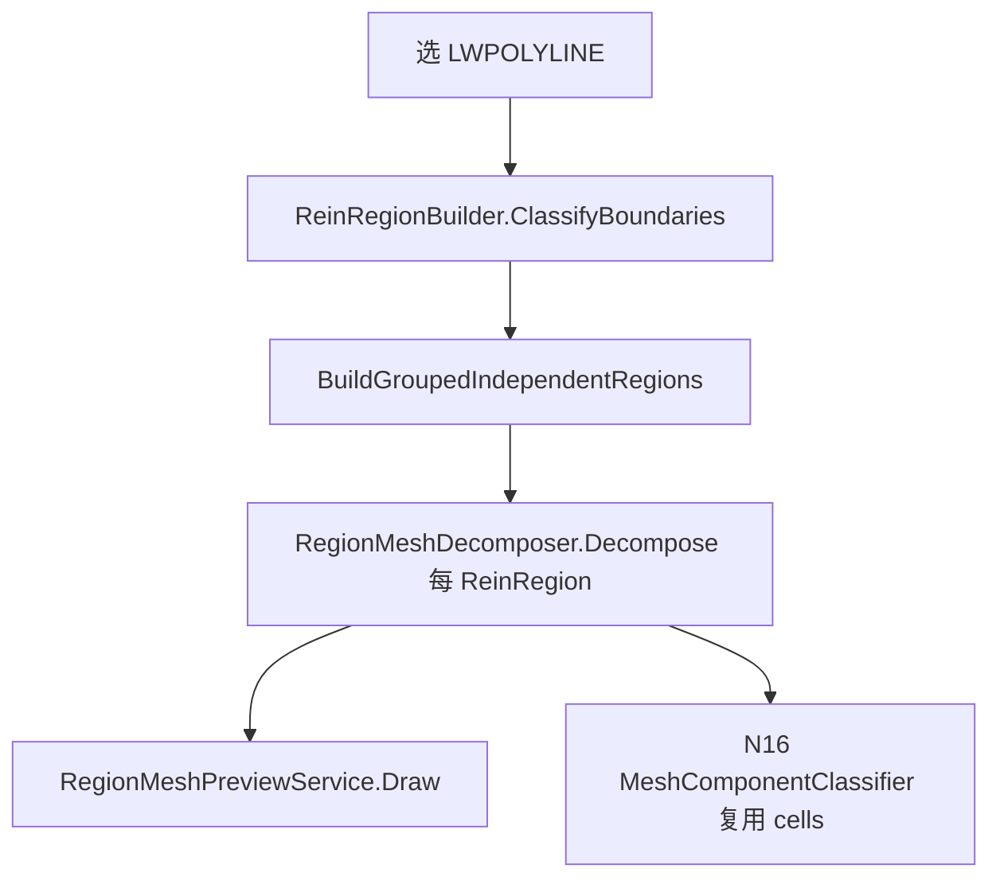

# 015 · N15 区域网格化几何逻辑

> 日期：2026-06-18  
> 命令：`N15` → `MeshConcreteRegionCommand`  
> 核心 Domain：[RegionMeshDecomposer.cs](../../src/HyCADTool/Features/Reinforcement/Domain/Components/RegionMeshDecomposer.cs)、[StripGeometry.cs](../../src/HyCADTool/Features/Reinforcement/Domain/Components/StripGeometry.cs)  
> 关联：[014-N16基础上方局部混凝土判读](014-N16基础上方局部混凝土判读-2026-06-16-173000.md)、[013-N8分类过程详解](013-N8分类过程详解-2026-06-15-210000.md)

---

## 0. N15 在 gj 链路中的位置

| 项 | 内容 |
|---|---|
| 命令 | `N15` → [MeshConcreteRegionCommand.cs](../../src/HyCADTool/Features/Reinforcement/MeshConcreteRegionCommand.cs) |
| 输入 | 用户选中的闭合 `LWPOLYLINE`（混凝土截面边界） |
| 输出 | `List<MeshCell>`（矩形 + 三角形），绘制到图层 `HY-网格预览` |
| 性质 | **纯几何分解**，不判构件类型、不按 cutY 切基础、不配筋 |
| 下游 | `N16` 复用同一套 `ReinRegionBuilder` + `RegionMeshDecomposer.Decompose`，再交给 `MeshComponentClassifier`（见 014） |

坐标约定：模型空间 **1:1 mm**；本文 Y 向上为正，竖切沿 **X 方向**扫过区域。

---

## 1. 端到端流程



**命令入口** `MeshConcreteRegionCommand.Execute` 步骤：

1. 读取面板参数 `RegionGroupDistanceMm`（默认 1500mm，面板「区域分组距离」）
2. 选线 → 转 `Polyline2D`，去重顶点，强制闭合
3. `ClassifyBoundaries` → `BuildGroupedIndependentRegions`
4. 对每个 `ReinRegion` 调用 `RegionMeshDecomposer.Decompose`
5. `RegionMeshPreviewService.Draw` 着色预览；命令行输出每组/合计 竖/横/方/三角 数量与总面积

N15 实际使用的用户参数只有 **`RegionGroupDistanceMm`**；其余厚度/梁宽等参数属于 N8/N16，N15 不读取。

---

## 2. 预处理：边界 → ReinRegion 组

源码：[ReinRegionBuilder.cs](../../src/HyCADTool/Features/Reinforcement/Domain/ReinRegionBuilder.cs)

### 2.1 嵌套分类 `ClassifyBoundaries`

对每条闭合多段线：

- 计算 **嵌套深度** `NestingDepth`（被几条更大边界包含）
- 奇数深度 → **孔洞** `IsHole = true`；偶数深度 → **外轮廓**
-  winding：外轮廓 **逆时针 CCW**，孔洞 **顺时针 CW**

### 2.2 独立分组 `BuildGroupedIndependentRegions`

N15 使用 **独立分组、不 Union** 路径（与 N8 识别用的 `BuildGroupedRegions` 不同）：

| 路径 | 方法 | 组内多外轮廓 |
|------|------|-------------|
| N15 / N16 | `BuildGroupedIndependentRegions` | **保留独立** `ReinRegion`，不合并 |
| N8 识别 | `BuildGroupedRegions` | **Union** 相交外轮廓为单一区域 |

分组规则：

1. 取所有外轮廓的 bbox，间隙 ≤ `groupDistanceMm` → 同一计算组 `G#`
2. 组内每条外轮廓 + **直接子孔洞** → 一个 `ReinRegion(outer, holes)`
3. 孔洞归属：孔洞首顶点落在哪个外轮廓内，即属该外轮廓

### 2.3 有效混凝土点 `ReinRegion.IsValidRebarPoint`

```text
点 p 有效 ⟺ p 在外轮廓内 且 p 不在任一孔洞内
```

后续 **斜边内外探测**、**竖切区间判内** 均依赖此函数。  
源码：[ReinRegion.cs](../../src/HyCADTool/Features/Reinforcement/Domain/ReinRegion.cs)

---

## 3. 核心算法总览：RegionMeshDecomposer 三阶段

入口：`RegionMeshDecomposer.Decompose(ReinRegion region)`  
源码 L33–57

| 阶段 | 方法 | 产出 |
|------|------|------|
| A 斜边夹平 | `BuildClampedRegion` | 正交化 `ReinRegion` + 边界三角形 |
| B 竖切条带 | `CollectTrapezoidPieces` → `SplitTrapezoidIntoParts` | `RectPiece` + 楔形/对角三角形 |
| C 格网合并 | `SplitRectPiecesByGlobalYs` → H 合并 → V 合并 | 最少矩形 `MeshCell` |


设计目标：**最少矩形**覆盖区域；无法矩形化的部分用 **三角形** 补齐（斜边、楔形、对角分割）。

---

## 4. 阶段 A：斜边夹平（每条斜边最多 1 个三角形）

### 4.1 动机

阶段 B 的竖切假设轮廓边 **轴对齐**（水平或竖直）。  
原始截面若有 45° 台阶、斜向切角，须先把斜边 **台阶化（clamp）** 为正交折线，同时把切掉的楔形登记为三角形单元。

外轮廓与每个孔洞环 **独立** 调用 `BuildClampedRing`。

### 4.2 逐边处理 `BuildClampedRing`

对环上每条边 `p0 → p1`：

```text
dx = p1.X - p0.X,  dy = p1.Y - p0.Y

若 |dx| ≤ AxisAlignToleranceMm 或 |dy| ≤ AxisAlignToleranceMm
    → 轴对齐，原样保留
否则
    → TryClampSlope(p0, p1) 夹平并产出三角形
```

### 4.3 斜边夹平 `TryClampSlope`

1. **法向探测**：边中点 `mid`，单位法向 `(nx, ny) = (-dy, -dx) / len`  
   在 `mid ± InteriorProbeEpsMm * n` 两侧各测一次 `IsValidRebarPoint`
2. **确定混凝土侧**：仅一侧在区域内 → 取该侧；两侧同内/同外 → **放弃夹平**
3. **选 clamp 高度**：
   - 混凝土在斜边 **上方**（`interiorNy > 0`）→ `clampY = max(p0.Y, p1.Y)`（夹到高端）
   - 混凝土在 **下方** → `clampY = min(p0.Y, p1.Y)`（夹到低端）
4. **台阶角点**：距 `clampY` 较远的端点 `moved` → `cornerPt = (moved.X, clampY)`
5. **三角形**：顶点 `(p0, p1, cornerPt)`，原斜边为三角形斜边

### 4.4 ASCII 示意（混凝土在斜边上方，夹到高端）

```text
        p1 ●─────────● 原轮廓
           │╲  混凝土 │
           │ ╲ 在上方 │
           │  ╲       │
  corner ●─┘   ╲      │
               ╲     │
        p0 ●────╲────┘
                 ╲
                  ╲  ← 切出的三角形（黄）
                   ╲
```

夹平后轮廓在 `cornerPt` 处多一个顶点，形成水平/竖直台阶；三角形面积 < `MinIntervalHeightMm`（1mm）时丢弃。

---

## 5. 阶段 B：竖切条带 → 梯形 → 矩形/三角

依赖 [StripGeometry.cs](../../src/HyCADTool/Features/Reinforcement/Domain/Components/StripGeometry.cs)（自 N8 `RegionPartitioner` 条带竖切原语移植）。

### 5.1 X 断点 `CollectBreakpoints`

收集 `ReinRegion.AllRings`（外轮廓 + 孔洞）全部顶点 X 坐标，去重排序 → `[x0, x1, …, xn]`。

相邻 `[xi, xi+1]` 若宽度 < `MinStripWidthMm`（0.5mm）则跳过。

### 5.2 条带扫描 `CollectTrapezoidPieces`

对每个条带 `[x0, x1]`，取中点 `xm = (x0 + x1) / 2`：

**竖线与边界求交** `GetInsideIntervalsAt`：

1. 所有环的线段与 `x = xm` 求交，得交点 Y 及对应边 `Line2D Seg`
2. 按 Y **降序**排列，去重（相邻 Y 差 ≤ 0.01mm）
3. 相邻交点对 `(top, bottom)`：中点 `(xm, (top+bottom)/2)` 若 `IsValidRebarPoint` → 形成一个 **混凝土竖向区间**  
   记录 `TopSeg`（上边界段）、`BotSeg`（下边界段）

**活动梯形追踪**（扫条带时 X 从左到右）：

- 新区间与上一格 **同一对** `(TopSeg, BotSeg)` 且 X 连续（`|candidate.X1 - x0| ≤ MergeToleranceMm`）  
  → 延伸当前 `TrapezoidPiece` 的 `X1`、`TopR`、`BotR`
- 否则 → 关闭旧梯形入列表，开新梯形 `{X0=x0, X1=x1, TopL, TopR, BotL, BotR}`

条带扫完后，仍 **active** 的梯形一并收集。

### 5.3 梯形拆分 `SplitTrapezoidIntoParts`

对每个梯形条带，在条带左右端计算顶/底 Y：

```text
TopL, TopR = 顶边在 x0, x1 处的 Y
BotL, BotR = 底边在 x0, x1 处的 Y

yt = min(TopL, TopR)    // 顶边「安全」水平线（矩形上界）
yb = max(BotL, BotR)    // 底边「安全」水平线（矩形下界）
topSloped = |TopL - TopR| ≥ 0.01
botSloped = |BotL - BotR| ≥ 0.01
```

**分支 1 — 有安全矩形带**（`yt - yb ≥ MinIntervalHeightMm`）：

- 加入矩形 `[x0,x1] × [yb, yt]`
- 若 `topSloped` → 顶楔形三角（顶边斜率左右不等）
- 若 `botSloped` → 底楔形三角

**分支 2 — 无安全带且顶底皆平**：薄片丢弃。

**分支 3 — 无安全带但有斜边**：`AddTrapezoidDiagonalTriangles` 沿对角拆成 1~2 个三角形，**不再**叠加楔形三角（避免重叠）。

> 阶段 A 已夹平大部分斜边；阶段 B 的楔形/对角三角主要处理 **条带内顶底仍略有斜率** 的残留情况。

---

## 6. 阶段 C：Y 断点切格 + 矩形合并

### 6.1 全局 Y 切格 `SplitRectPiecesByGlobalYs`

收集阶段 B 所有矩形的 `YBot`、`YTop`，合并为有序 Y 轴 `[y0, y1, …, ym]`。  
每个矩形按 Y 轴 **切分为不重叠的薄层格**（同一 X 范围内、Y 对齐），便于后续合并。

### 6.2 横向合并 `MergeRectanglesHorizontally`（优先）

按 `(YBot, YTop)` 分组；组内按 `X0` 排序：

```text
若 下一矩形.X0 - 当前.X1 ≤ MergeToleranceMm
   且 YBot/YTop 一致
   → 合并 X 范围，runX1 = max(runX1, cur.X1)
```

**横向优先** 的意图：梁/板条带尽量 **满宽贯通**，减少竖向碎条。

### 6.3 竖向合并 `MergeRectanglesVertically`

按 `(X0, X1)` 分组；组内按 `YBot` 排序：

```text
若 下一矩形.YBot - 当前.YTop ≤ MergeToleranceMm
   且 X0/X1 一致
   → 合并 Y 范围，yTop = max(yTop, cur.YTop)
```

### 6.4 矩形方向 `ClassifyRectangleOrientation`

对每个最终矩形，设 `w = x1-x0`，`h = yTop-yBot`：

```text
ratio = max(w,h) / min(w,h)

若 ratio < AspectRatioThreshold (1.5)  → Square（近方形）
否则 h > w  → Vertical（竖向条）
否则        → Horizontal（横向条）
```

三角形 `Orientation = None`。

---

## 7. 输出与预览

### 7.1 数据结构 `MeshCell`

源码：[MeshCell.cs](../../src/HyCADTool/Features/Reinforcement/Domain/Components/MeshCell.cs)

| 字段 | 含义 |
|------|------|
| `Kind` | `Rectangle` / `Triangle` |
| `Orientation` | `Vertical` / `Horizontal` / `Square` / `None` |
| `Polygon` | `Polygon2D` 闭合多边形 |
| `AreaMm2` | 面积（mm²） |

### 7.2 预览着色 `RegionMeshPreviewService`

源码：[RegionMeshPreviewService.cs](../../src/HyCADTool/Features/Reinforcement/Services/RegionMeshPreviewService.cs)  
图层名：`HY-网格预览`

| 颜色 | ACI | 条件 |
|------|-----|------|
| 青 | 4 | 竖向矩形 `Vertical` |
| 绿 | 3 | 横向矩形 `Horizontal` |
| 洋红 | 6 | 近方形 `Square` |
| 黄 | 2 | 三角形 `Triangle` |

每次 `Draw`：**先清空**同图层旧实体，再画闭合多段线 + `SOLID` 填充。  
命令行提示：`青=竖向  绿=横向  洋红=近方形  黄=三角形`。

### 7.3 命令行统计示例

```text
── N15 区域网格化 ──
  G#0  区域=3  竖=12  横=8  方=2  三角=4
  合计  竖=12  横=8  方=2  三角=4  单元=26  面积=1234567mm²
  预览实体=52  图层「HY-网格预览」
```

---

## 8. 关键常量、边界与 N16 衔接

### 8.1 常量表

| 常量 | 值 | 所在类 | 作用 |
|------|-----|--------|------|
| `AxisAlignToleranceMm` | 0.5 | RegionMeshDecomposer | 判定边是否轴对齐 |
| `InteriorProbeEpsMm` | 0.5 | RegionMeshDecomposer | 斜边法向内外探测距离 |
| `MergeToleranceMm` | 1.0 | RegionMeshDecomposer | 梯形延伸 / 矩形 H·V 合并间隙 |
| `AspectRatioThreshold` | 1.5 | RegionMeshDecomposer | 方/条方向分界 |
| `YToleranceMm` | 0.01 | RegionMeshDecomposer | Y 坐标比较容差 |
| `MinStripWidthMm` | 0.5 | StripGeometry | 最窄竖条带 |
| `MinIntervalHeightMm` | 1.0 | StripGeometry | 最小有效区间高度 / 三角面积下限 |
| `DedupeYToleranceMm` | 0.01 | StripGeometry | 竖切交点 Y 去重 |

### 8.2 已知局限

- **纯 2D 截面**：无 Z 向、无变截面扫掠；坐标即 mm。
- **不 Union 分组**：相距 ≤ 分组距离的多外轮廓同组但 **各自独立分解**，组间不共享断点。
- **斜边兜底**：夹平后条带内仍可能有顶/底微斜 → 楔形或对角三角，三角数量可能略多。
- **与 N8 分区差异**：N8 沿 cutY 做基础/土气分界；N15 **不按 cutY**，全区域一次分解。

### 8.3 N16 衔接


N16 在相同 `ReinRegion` 组上调用 `Decompose` 得到 `MeshCell`，再经：

1. `ClassifyRectangle` — 按尺寸 + 组底位置初判墙/梁/底板/楼板/大体积/局部
2. `RefineRegions` — 对 Slab/Mass/Local 做 **X 向截断** + 上下邻居上下文精修

判型逻辑详见 [014](014-N16基础上方局部混凝土判读-2026-06-16-173000.md)。  
**N15 的输出质量直接影响 N16**：条带过碎 → 邻居探测噪声大；合并不足 → 构件边界锯齿。

---

## 附录 A · 与 N8 条带几何的关系

`StripGeometry` 注释写明：**自 N8 RegionPartitioner 移植**，供基础底板分区与 N15 网格化共用。

| 原语 | N8 用途 | N15 用途 |
|------|---------|----------|
| `CollectSegments` | 割线步进、条带边界 | 竖切求交 |
| `CollectBreakpoints` | X 向条带划分 | 同左 |
| `GetInsideIntervalsAt` | 割线高度 / 台阶识别 | 梯形条带顶底 |
| `EvaluateYOnSegment` | 边上 Y 插值 | 梯形 TopR/BotR |

N15 在条带之上增加了 **斜边夹平** 与 **H→V 矩形合并**，是 N8 条带思想的 **全区域矩形化扩展**。

---

## 附录 B · 源码索引

| 文件 | 职责 |
|------|------|
| [MeshConcreteRegionCommand.cs](../../src/HyCADTool/Features/Reinforcement/MeshConcreteRegionCommand.cs) | N15 命令入口 |
| [ReinRegionBuilder.cs](../../src/HyCADTool/Features/Reinforcement/Domain/ReinRegionBuilder.cs) | 边界分类与分组 |
| [ReinRegion.cs](../../src/HyCADTool/Features/Reinforcement/Domain/ReinRegion.cs) | 外轮廓 + 孔洞，有效点判定 |
| [RegionMeshDecomposer.cs](../../src/HyCADTool/Features/Reinforcement/Domain/Components/RegionMeshDecomposer.cs) | 三阶段分解 |
| [StripGeometry.cs](../../src/HyCADTool/Features/Reinforcement/Domain/Components/StripGeometry.cs) | 竖切条带原语 |
| [MeshCell.cs](../../src/HyCADTool/Features/Reinforcement/Domain/Components/MeshCell.cs) | 网格单元模型 |
| [RegionMeshPreviewService.cs](../../src/HyCADTool/Features/Reinforcement/Services/RegionMeshPreviewService.cs) | 预览绘制 |
| [MeshComponentDivideCommand.cs](../../src/HyCADTool/Features/Reinforcement/MeshComponentDivideCommand.cs) | N16 下游命令 |
