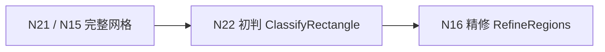
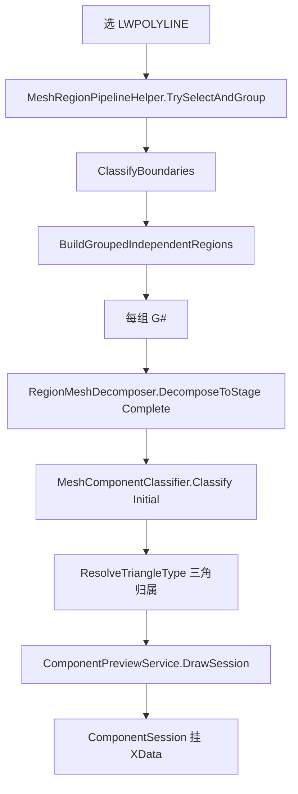
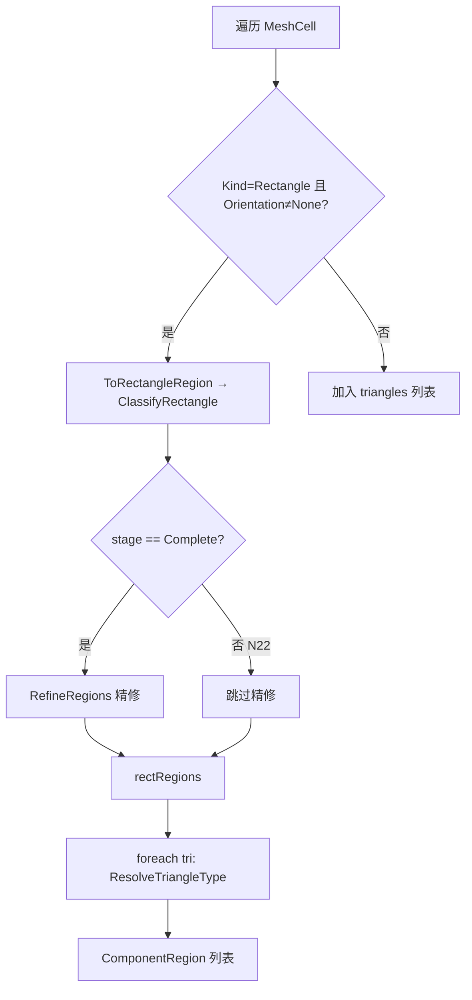
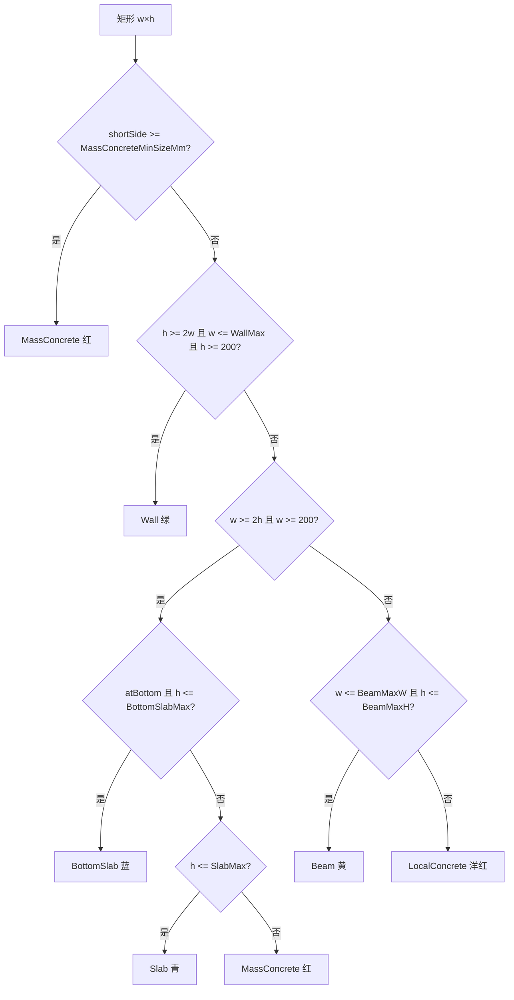

# 016 · N22 网格构件初判逻辑

> 日期：2026-06-18  
> 命令：`N22` → `MeshComponentDivideCommand.ExecuteInitialClassify`  
> 核心 Domain：[MeshComponentClassifier.cs](../../src/HyCADTool/Features/Reinforcement/Domain/Components/MeshComponentClassifier.cs)（`MeshClassifyStage.Initial`）  
> 关联：[015-N15区域网格化几何逻辑](015-N15区域网格化几何逻辑-2026-06-18-084500.md)、[014-N16基础上方局部混凝土判读](014-N16基础上方局部混凝土判读-2026-06-16-173000.md)

---

## 0. N22 在分步测试链路中的位置

N22 是 **N16 判型的第一阶段独立命令**，用于在 AutoCAD 中逐步观察「几何网格 → 构件类型」的第一跳结果。



| 项 | 内容 |
|---|---|
| 命令 | `N22` → [MeshComponentDivideCommand.cs](../../src/HyCADTool/Features/Reinforcement/MeshComponentDivideCommand.cs) `ExecuteInitialClassify` |
| 输入 | 用户选中的闭合 `LWPOLYLINE`（混凝土截面边界） |
| 上游几何 | 与 N16 相同：`DecomposeToStage(..., Complete)`，输出 **等同 N15/N21** 的 `MeshCell` 列表 |
| 判型范围 | **仅** `ClassifyRectangle` 初判 + 三角形邻接归属；**不执行** `RefineRegions` |
| 输出 | `List<ComponentRegion>`，绘制到图层 `HY-构件预览` |
| 下游 | **N16** 在同一网格上执行 `MeshClassifyStage.Complete`，补全 Slab/Mass/Local 精修 |

**与 N16 的唯一 Domain 差异**：`MeshComponentClassifier.Classify(..., MeshClassifyStage.Initial)` 跳过 `RefineRegions`。

---

## 1. 端到端流程



### 1.1 命令入口步骤

源码：`MeshComponentDivideCommand.RunClassify(..., MeshClassifyStage.Initial, ...)`

1. **读面板**：`SettingsPanelViewModel.CreateComponentParameters()`，持久化设置；使用 `RegionGroupDistanceMm` 及全部构件厚度/梁宽参数（与 N16 相同）。
2. **选线**：过滤 `LWPOLYLINE` → `Polyline2D`，去重顶点，强制闭合。
3. **预处理**：`ReinRegionBuilder.ClassifyBoundaries` → `BuildGroupedIndependentRegions`（独立分组、不 Union，与 N15/N16 一致）。
4. **每组**：
   - 计算 `groupMinY`（组内所有外轮廓顶点最小 Y）
   - 对每个 `ReinRegion` 调用 `RegionMeshDecomposer.DecomposeToStage(region, Complete)` 汇总 `MeshCell`
   - `MeshComponentClassifier.Classify(cells, group, groupMinY, parameters, Initial)`
5. **预览**：新建 `ComponentSession`，`ComponentPreviewService.DrawSession` 着色 + 类型标注；命令行输出各组/合计类型计数。
6. **提示**：`局部混凝土需 N16 精修后显现；下一步执行 N16`。

### 1.2 与 N16 共享的基础设施

| 模块 | 文件 | N22 用途 |
|------|------|----------|
| 选线/分组 | [MeshRegionPipelineHelper.cs](../../src/HyCADTool/Features/Reinforcement/MeshRegionPipelineHelper.cs) | 与 N17–N21、N16 共用 |
| 网格几何 | [RegionMeshDecomposer.cs](../../src/HyCADTool/Features/Reinforcement/Domain/Components/RegionMeshDecomposer.cs) | 始终取 `Complete` 阶段 |
| 构件预览 | [ComponentPreviewService.cs](../../src/HyCADTool/Features/Reinforcement/Services/ComponentPreviewService.cs) | 图层 `HY-构件预览` |
| 会话 | `ComponentSession` | N9 切换类型依赖同一会话 XData |

---

## 2. MeshClassifyStage：Initial 与 Complete

```csharp
public enum MeshClassifyStage { Initial, Complete }
```

`Classify` 入口（L26–66）逻辑分支：



| 阶段 | 枚举值 | 命令 | 执行内容 |
|------|--------|------|----------|
| 初判 | `Initial` | **N22** | `ClassifyRectangle` + 三角归属 |
| 完整 | `Complete` | **N16** | 初判 → `RefineRegions` → 三角归属 |

**跳过的精修**（N22 不执行）：

- `RefineRegions`：对初判为 `Slab` / `MassConcrete` / `LocalConcrete` 的矩形做 X 向切段
- `SplitStrip`：按上下邻居 X 断点切子段
- `ClassifySegment`：子段中点探测上下混凝土，改写为 `LocalConcrete` 等

详见 [014](014-N16基础上方局部混凝土判读-2026-06-16-173000.md) 阶段 2；N22 只到该文档阶段 1。

---

## 3. 输入单元过滤规则

`Classify` 遍历 `MeshCell` 时（L40–49）：

| 条件 | 处理 |
|------|------|
| `Kind == Rectangle` 且 `Orientation != None` | 进入初判 `ToRectangleRegion` |
| `Kind == Triangle` | 暂存，精修/跳过后统一 `ResolveTriangleType` |
| `Orientation == None` 的矩形 | **忽略**（N17 梯形预览专用，非 N15 产出） |
| 无效多边形（顶点 < 3） | 跳过 |

N22 的输入来自 `Complete` 分解，正常截面只含带方向分类的矩形 + 三角形，不会出现 `Orientation=None` 矩形。

---

## 4. 核心：ClassifyRectangle 决策树

对每个矩形网格单元，取 bbox 得 `w = maxX-minX`，`h = maxY-minY`，`yBot = minY`，再判定：

```text
shortSide = min(w, h)
atBottom  = (yBot <= groupMinY + AnchorYToleranceMm)    // 默认 +80mm
```

**判定顺序严格自上而下**（先匹配先返回）：



### 4.1 各分支含义

| 优先级 | 条件（默认参数） | 类型 | 预览色 ACI |
|--------|------------------|------|------------|
| 1 | 短边 ≥ 1000mm | 大体积 `MassConcrete` | 1 红 |
| 2 | 竖条：`h≥2w`，`w≤500`，`h≥200` | 墙 `Wall` | 3 绿 |
| 3a | 横条：`w≥2h`，`w≥200`，贴组底且 `h≤1500` | 底板 `BottomSlab` | 5 蓝 |
| 3b | 横条：`w≥2h`，`w≥200`，`h≤300` | 楼板 `Slab` | 4 青 |
| 3c | 横条：`w≥2h`，`w≥200`，`h>300` 且不贴组底 | 大体积 `MassConcrete` | 1 红 |
| 4 | `w≤800` 且 `h≤1500`（非上述横竖条） | 梁 `Beam` | 2 黄 |
| 5 | 其余 | 局部 `LocalConcrete` | 6 洋红 |

### 4.2 「贴组底」判定

```text
groupMinY = 本计算组 G# 内所有外轮廓顶点的最小 Y
atBottom  = (yBot <= groupMinY + 80mm)
```

- 只有 **整组最低** 附近的横条才可能初判为 `BottomSlab`。
- 坐在蓝色底板上方的薄横条：`yBot > groupMinY + 80` → **`atBottom = false`** → 若 `h ≤ 300` 则初判 **`Slab`（青）**，**不是** `LocalConcrete`。

这是 N22 与 N16 预览差异的 **主要来源**（见 §6）。

### 4.3 ComponentRegion 字段

`ToRectangleRegion` 产出：

| 字段 | 赋值 |
|------|------|
| `Type` | `ClassifyRectangle` 结果 |
| `Polygon` | 网格单元多边形副本 |
| `ThicknessMm` | `min(w, h)` |
| `Priority` | 绘制叠序（底板上层优先等，见 `PriorityOf`） |

---

## 5. 三角形归属：ResolveTriangleType

N22 **仍执行** 三角形类型解析（与 N16 相同，L59–63）。

算法（L408–455）：

1. 若无相邻矩形 → `LocalConcrete`
2. 找 bbox **共边相邻** 的矩形中 **面积最大** 者 → 继承其 `Type`
3. 若无共边相邻 → 取质心 **最近** 矩形类型
4. 仍无 → `LocalConcrete`

共边判定 `AreBoundsAdjacent`：左右或上下边相距 ≤ `EdgeToleranceMm`（1mm）且投影重叠。

**含义**：斜边夹平、楔形、对角分割产生的黄色三角，在 N22 中 **跟随邻近最大矩形构件着色**，不会因初判单独成类。

---

## 6. N22 能判什么、不能判什么

### 6.1 N22 可稳定给出的类型

| 类型 | N22 典型场景 |
|------|--------------|
| `BottomSlab` | 贴组底的厚/薄基础底板横条 |
| `Wall` | 竖向长条（高≥2×厚） |
| `Beam` | 小尺寸非横竖条矩形 |
| `MassConcrete` | 短边≥1000，或超厚横条 |
| `Slab` | 不贴组底、厚度≤300 的横向长条（**含「底板上方薄条」误判**） |
| `LocalConcrete` | 初判兜底：不满足墙/横条/梁尺寸规则的 **异形小矩形** |

### 6.2 N22 给不出、需 N16 精修的类型

| 场景 | N22 显示 | N16 精修后 | 原因 |
|------|----------|------------|------|
| 底板上方、上方空腔的薄横条 | **Slab 青** | **LocalConcrete 洋红** | 精修 `ClassifySegment` 探测「下实上空」 |
| 同一 Slab 横条跨不同上下文 | 整条 Slab | X 向切为多段不同类型 | `SplitStrip` 按邻居断点切段 |
| 初判 MassConcrete 的上下文细分 | 整块 Mass | 可能拆为 Slab/Local/归上部 | `RefineRegions` 也处理 Mass/Local 初判 |

**关键结论**：N22 命令行已提示 `局部混凝土需 N16 精修后显现`——**「下实上空」型局部混凝土不是初判规则，而是精修规则**（014 §4）。

### 6.3 对照示例（基础上方薄横条）

```text
         [ 空气 / 空腔 ]
    ┌─────────────────────┐
    │  薄横条 h≤300       │  N22: Slab（w≥2h, !atBottom, h≤SlabMax）
    └─────────────────────┘
    ┌─────────────────────┐
    │  BottomSlab 底板    │  N22: BottomSlab（atBottom）
    └─────────────────────┘
```

N16 精修该薄横条：`belowConcrete=true`（邻居底板），`aboveConcrete=false` → `LocalConcrete`。

---

## 7. N22 不读取的几何阶段

N22 **不关心** N17–N21 分步几何命令的中间产物；它始终消费 **Complete** 网格。

| 命令 | 与 N22 关系 |
|------|-------------|
| N17–N21 | 调试分解过程；N22 输入等价 N21/N15 |
| N23–N24 | 合并顺序对比；**不影响** N22（N22 仍用 Complete 横→竖路径，与 N15 一致） |

若需对比「网格差异 → 判型差异」，应先用不同几何命令生成网格，再 **改代码或临时命令** 传入对应 `MeshCell`；当前 N22 固定 `Complete`。

---

## 8. 面板参数（N22 实际参与判型）

来自 `ComponentParameters`（面板 → `CreateComponentParameters()`）：

| 参数 | 默认 mm | 影响初判分支 |
|------|---------|--------------|
| `RegionGroupDistanceMm` | 1500 | 分组边界，间接影响 `groupMinY` 与 `atBottom` |
| `MassConcreteMinSizeMm` | 1000 | 优先级 1 大体积 |
| `WallMaxThicknessMm` | 500 | 竖条墙厚上限 |
| `BottomSlabMaxThicknessMm` | 1500 | 贴组底横条判底板 |
| `SlabMaxThicknessMm` | 300 | 横条判楼板厚度上限 |
| `BeamMaxWidthMm` | 800 | 梁宽上限 |
| `BeamMaxHeightMm` | 1500 | 梁高上限 |

**N22 不使用的参数**（仅 N16 精修）：

| 参数 | 默认 | 用途 |
|------|------|------|
| `LocalBumpMaxHeightMm` | 200 | `ClassifySegment` 下实上空 → Local |
| `LocalConcreteMaxHeightMm` | 1000 | N8 等其他链路 |

代码内常量（非面板）：

| 常量 | 值 | 作用 |
|------|-----|------|
| `AnchorYToleranceMm` | 80 | 贴组底容差 |
| `MinSegmentLengthMm` | 200 | 横/竖条最小长度 |
| `EdgeToleranceMm` | 1 | 三角邻接、精修共边（N22 三角用） |
| `ProbeOffsetMm` | 1 | 精修点探测（N22 不用） |

---

## 9. 预览与命令行输出

### 9.1 着色

| 类型 | ACI | 说明 |
|------|-----|------|
| Slab | 4 青 | N22 中「疑似楼板」含待精修薄条 |
| Wall | 3 绿 | |
| BottomSlab | 5 蓝 | |
| MassConcrete | 1 红 | |
| Beam | 2 黄 | |
| LocalConcrete | 6 洋红 | 多为初判兜底，**非**精修局部 |

### 9.2 命令行示例

```text
── N22 网格构件初判 ──
  G#0  区域=2  单元=18  构件=18  楼板=5  墙=2  底板=1  大体积=0  梁=0  局部=0
  合计  构件=18  楼板=5  墙=2  底板=1  大体积=0  梁=0  局部=0
  青=楼板  绿=墙体  蓝=底板  红=大体积  黄=梁  洋红=局部  N9可切换类型
  局部混凝土需 N16 精修后显现；下一步执行 N16
  预览实体=36  图层「HY-构件预览」
```

执行 N16 后，同一截面 `局部` 计数可能上升、`楼板` 下降。

---

## 10. 建议测试顺序

同一组 `LWPOLYLINE`，在 **C2 热重载** 后：

```text
N21（或 N15）→ 确认网格
N22           → 记录初判类型计数与着色
N16           → 对比精修后局部/楼板变化
N9（可选）    → 点击预览块手动改型
```

**关注差异点**：

- N22→N16：`Slab` 减少、`LocalConcrete` 增加（基础上方薄条）
- 三角：两命令颜色应一致（均走 `ResolveTriangleType`）
- 底板/墙/梁：多数场景 N22 与 N16 **一致**（精修不处理这些初判类型）

---

## 11. 源码索引

| 逻辑 | 文件 | 符号 |
|------|------|------|
| N22 入口 | `MeshComponentDivideCommand.cs` | `ExecuteInitialClassify` |
| 共享 Run | 同上 | `RunClassify(..., Initial, ...)` |
| 选线分组 | `MeshRegionPipelineHelper.cs` | `TrySelectAndGroup` |
| 判型阶段枚举 | `MeshComponentClassifier.cs` | `MeshClassifyStage` |
| Classify 分支 | 同上 | `Classify` L26 |
| 初判 | 同上 | `ClassifyRectangle` L99 |
| 精修（N22 跳过） | 同上 | `RefineRegions` L136 |
| 切段（N22 跳过） | 同上 | `SplitStrip` L164 |
| 子段规则（N22 跳过） | 同上 | `ClassifySegment` L241 |
| 三角归属 | 同上 | `ResolveTriangleType` L408 |
| 类型着色 | `ComponentType.cs` | `ColorIndex` |
| 命令注册 | `src/ReCall/commands.json` | `"N22"` → `ExecuteInitialClassify` |

---

## 12. 与 014 文档的对应关系

| 014 章节 | N22 覆盖 | N16 补充 |
|----------|----------|----------|
| §2 阶段 1 ClassifyRectangle | **是** | — |
| §2 阶段 2 RefineSlabRegions | **否** | **是**（代码中为 `RefineRegions`/`SplitStrip`） |
| §3 初判为何是楼板 | **是** | — |
| §4 如何改局部混凝土 | **否** | **是** |
| §5 上下方对照表 | 仅初判列部分成立 | 精修列 |

---

**版本**：1.0 | **日期**：2026-06-18
