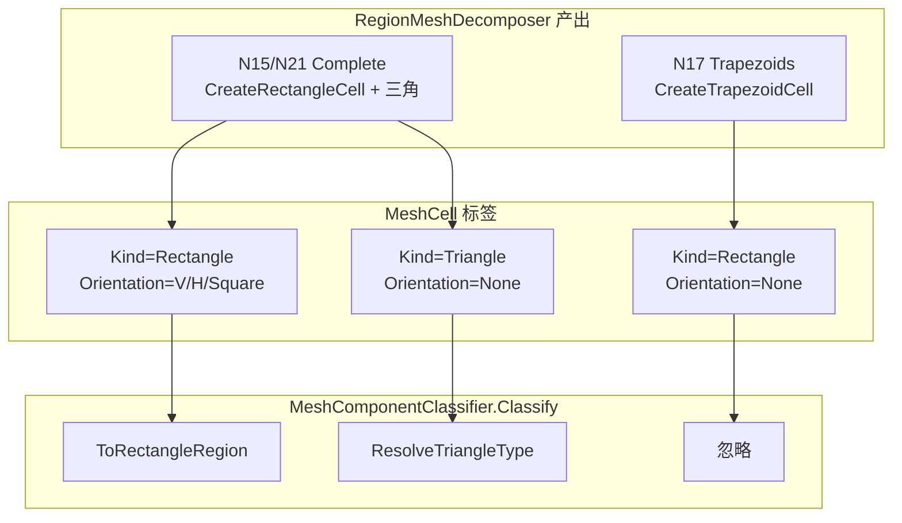
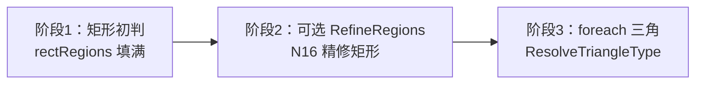

# 017 · 学习：Classify 如何分拣 MeshCell（Kind / Orientation 三条规则）

> 日期：2026-06-18  
> 主题：`MeshComponentClassifier.Classify` 入口对 `MeshCell` 的三路分拣  
> 源码：[MeshComponentClassifier.cs](../../src/HyCADTool/Features/Reinforcement/Domain/Components/MeshComponentClassifier.cs) L40–49、[MeshCell.cs](../../src/HyCADTool/Features/Reinforcement/Domain/Components/MeshCell.cs)  
> 关联：[016-N22网格构件初判逻辑](016-N22网格构件初判逻辑-2026-06-18-120000.md) §3、[015-N15区域网格化几何逻辑](015-N15区域网格化几何逻辑-2026-06-18-084500.md)

---

## 0. 你要搞懂的一句话

**N22 / N16 判型之前，先把「网格单元」分成三堆：能按长宽初判的矩形、要晚一点处理的三角形、以及根本不参与判型的梯形占位块。**

对应 016 中的表格：

| 条件 | 处理 |
|------|------|
| `Kind == Rectangle` 且 `Orientation != None` | 进入初判 `ToRectangleRegion` |
| `Kind == Triangle` | 暂存，精修/跳过后统一 `ResolveTriangleType` |
| `Orientation == None` 的矩形 | **忽略**（N17 梯形预览专用，非 N15 产出） |

下面按「为何需要 → 数据从哪来 → 代码怎么走 → 例子与误区」展开。

---

## 1. 对象定位：MeshCell 是什么

`MeshCell`（网格单元，Mesh Cell）是 **N15 几何分解** 与 **N16 构件判型** 之间的中间数据结构：

```csharp
public sealed class MeshCell
{
    public MeshCellKind Kind { get; set; }           // 形状：Rectangle / Triangle
    public MeshCellOrientation Orientation { get; set; }  // 条带方向：None / Vertical / Horizontal / Square
    public Polygon2D Polygon { get; set; }
    public double AreaMm2 { get; set; }
}
```

### 1.1 为何同时有 Kind 和 Orientation

| 字段 | 回答的问题 | 谁写入 |
|------|------------|--------|
| **Kind** | 这是矩形还是三角形？ | `RegionMeshDecomposer` 各阶段 |
| **Orientation** | 若是 **轴对齐矩形**，它是竖条/横条/近方形？ | 仅 `CreateRectangleCell`（Complete 路径） |

**设计意图**：

- **Kind** = 拓扑形状（3 顶点 vs 4 顶点轴对齐框）
- **Orientation** = 几何 **预览/统计** 标签（N15 青/绿/洋红），兼作判型入口的 **门卫**：「只有带方向标签的矩形才配进 `ClassifyRectangle`」

> **大白话**：Kind 像「这是块豆腐还是块三角奶酪」；Orientation 像「豆腐是竖着切还是横着切」。没有方向标签的「长方形豆腐」（梯形）只给 N17 看图，不给 N22 判构件。  
> **结构类比（板元）**：Kind 是单元类型（板元/墙元）；Orientation 是板元局部坐标里 **主受力方向** 是否已对齐——未对齐的单元不进板面内配筋规则。

### 1.2 最小定义（Classify 视角）

记单元 \(c\)，定义两个谓词：

\[
\text{RectReady}(c) \equiv (c.\text{Kind}=\text{Rectangle}) \land (c.\text{Orientation}\neq\text{None})
\]

\[
\text{Tri}(c) \equiv (c.\text{Kind}=\text{Triangle})
\]

\[
\text{TrapPlaceholder}(c) \equiv (c.\text{Kind}=\text{Rectangle}) \land (c.\text{Orientation}=\text{None})
\]

**符号说明**：

- \(c\)：单个 `MeshCell` 实例
- \(\text{RectReady}\)：可进入 `ToRectangleRegion` / `ClassifyRectangle` 的矩形
- \(\text{Tri}\)：三角形，走 `ResolveTriangleType`
- \(\text{TrapPlaceholder}\)：梯形占位矩形，Classify **静默丢弃**

> **大白话**：三条规则就是在问——「能判吗？」「是三角吗？」「还是只是调试用的梯形假矩形？」

---

## 2. 历史脉络：三类单元从哪条命令来



| 来源阶段 | 工厂方法 | Kind | Orientation | 进入 Classify |
|----------|----------|------|-------------|---------------|
| N17 `Trapezoids` | `CreateTrapezoidCell` | Rectangle | **None** | **忽略** |
| N15 `Complete` | `CreateRectangleCell` | Rectangle | Vertical / Horizontal / Square | **初判** |
| 各阶段三角 | `CreateTriangleCell` / `AddTriangle` | Triangle | None（默认） | **暂存 → 归属** |

**为何 N17 用 Rectangle + None，而不是新 Kind？**

- 复用 `MeshCell` 与 `RegionMeshPreviewService`（白色 = `Orientation==None` 的矩形）
- **故意** 与 N15 产出区分：`Orientation!=None` 成为「可判型矩形」的门禁，无需再加 `Trapezoid` 枚举

> **大白话**：梯形在图纸上画成四边形，代码里也用「矩形壳子」装，但 **不贴方向标签**，判型程序就知道「这不是 N15 的成品」。  
> **结构类比（框架）**：N17 是 **施工放样** 的中间模板；N15 是 **验收后的板墙尺寸表**——构件计算只吃后者。

---

## 3. 源码：Classify 分拣循环

```csharp
foreach (var cell in cells)
{
    if (cell?.Polygon == null || cell.Polygon.VertexCount < 3)
        continue;

    if (cell.Kind == MeshCellKind.Rectangle && cell.Orientation != MeshCellOrientation.None)
        rectRegions.Add(ToRectangleRegion(cell, groupMinY, parameters));
    else if (cell.Kind == MeshCellKind.Triangle)
        triangles.Add(cell);
}
// … 精修 rectRegions（N16）…
foreach (var tri in triangles)
{
    var type = ResolveTriangleType(tri, rectRegions);
    result.Add(ToTriangleRegion(tri, type));
}
```

### 3.1 真值表（Kind × Orientation）

| Kind | Orientation | 分支 | 结果 |
|------|-------------|------|------|
| Rectangle | Vertical / Horizontal / Square | 第 1 个 `if` | `ToRectangleRegion` → `ClassifyRectangle` |
| Triangle | None（三角固定） | `else if` | 加入 `triangles`，稍后 `ResolveTriangleType` |
| Rectangle | **None** | **都不进** | **静默忽略** |
| 任意 | 任意 | 顶点 < 3 | `continue` 跳过 |

**注意**：三角形 **也** 常带 `Orientation=None`，但 **`Kind==Triangle` 先被第 2 分支捕获**，不会与梯形占位混淆。

> **大白话**：判型先看「是不是三角」，再看「是不是贴了标签的矩形」；贴了矩形外形但没标签的，直接当没看见。  
> **结构类比（节点传力）**：矩形初判是 **主路径**；三角是 **次路径挂接**；梯形占位是 **未纳入模型的临时支撑**，不参与内力分配。

---

## 4. 规则 1：`RectReady` → `ToRectangleRegion`

### 4.1 做什么

`ToRectangleRegion` 取 bbox 得宽 \(w\)、高 \(h\)、底标高 \(y_{bot}\)，调用 `ClassifyRectangle` → 墙/板/底板/梁/大体积/局部。

### 4.2 为何要求 `Orientation != None`

| 原因 | 说明 |
|------|------|
| **几何前提** | `ClassifyRectangle` 假设 **轴对齐矩形**，用 \(w,h\) 长宽比；梯形 4 顶点 **非正交**，bbox 的 \(w,h\) 失真 |
| **管线边界** | N15 Complete 必调 `ClassifyRectangleOrientation`；有方向标签 ⇔ 来自 Complete 合并后的 **正交格** |
| **调试隔离** | N17 梯形若误入判型，会把 bbox 当板条，统计与着色全乱 |

**Orientation 与构件类型的关系**：

- Orientation（Vertical/Horizontal/Square）≠ ComponentType（Slab/Wall/…）
- 前者是 **几何条带方向**（N15 预览色）
- 后者是 **结构角色**（N16 预览色）
- 但两者都依赖 **正交矩形** 的 \(w,h\)

> **大白话**：只有「横平竖直、贴好标签的格子」才能用「长边/短边」猜它是墙还是板。斜着的梯形格子只能看形状，不能猜工种。  
> **结构类比（墙元/板元）**：墙元配筋用 **墙厚 × 墙高**；若把斜四边形的包围盒当墙厚，会高估/低估，规则直接不让进。

### 4.3 例子

Complete 产出横条：\(w=3000\text{ mm}, h=250\text{ mm}\) → `Orientation=Horizontal` → 初判可能为 `Slab`。

---

## 5. 规则 2：三角形暂存 → `ResolveTriangleType`

### 5.1 为何不能立刻 `ToRectangleRegion`

三角形没有唯一的「墙厚/板厚」语义：

- 夹平三角（阶段 A）
- 顶/底楔形三角（阶段 B）
- 对角分割三角

**不能用** `ClassifyRectangle(w,h,...)` 规则表。

### 5.2 为何等矩形处理完再归属

`ResolveTriangleType` 需要 **已判型的矩形邻居**：

1. 找 bbox **共边相邻** 的最大矩形 → 继承其 `ComponentType`
2. 否则取质心最近矩形类型
3. 都没有 → `LocalConcrete`



**两阶段原因**：

- 三角类型 **依赖** 邻居矩形类型（斜边通常属于某块板或墙的切角）
- 若矩形尚未精修（N16），三角仍按 **初判邻居** 归属——N22 与 N16 三角色可能随邻居精修而变

> **大白话**：小三角自己说不清是墙还是板，要看它贴在谁旁边——等大块都分好队，再给小三角发同款工牌。  
> **结构类比（节点）**：三角单元像 **梁柱节点区** 的应力集中补丁，归属到相邻 **板元/墙元** 的配筋分区，不单独用长宽比定类。

### 5.3 例子

底板与上方薄条之间的 **楔形三角**：共边最大邻居可能是 `BottomSlab` 或 `Slab` → 三角跟着变色。

---

## 6. 规则 3：`Orientation==None` 的矩形 → 忽略

### 6.1 谁会产生这种单元

**仅** `DecomposeToStage(..., Trapezoids)`（N17）：

```csharp
// CreateTrapezoidCell — 4 顶点梯形，非轴对齐
return new MeshCell
{
    Kind = MeshCellKind.Rectangle,
    Orientation = MeshCellOrientation.None,
    Polygon = poly,  // (X0,BotL)-(X1,BotR)-(X1,TopR)-(X0,TopL)
    ...
};
```

N15/N21 Complete **从不** 产出 `Rectangle + None`（`CreateRectangleCell` 必设 V/H/Square）。

### 6.2 为何是「忽略」而不是报错

| 考量 | 说明 |
|------|------|
| N22/N16 输入固定 Complete | 正常链路 **不会出现** 梯形占位 |
| N17 与 N22 独立命令 | 用户若先 N17 再 N22，列表里混有梯形 **不应崩溃** |
| 最小侵入 | 不新增 Kind，用 Orientation 作 **水印** 区分 |

### 6.3 若误把 N17 结果送进 N22 会怎样

- 白色梯形：**不出现在** `HY-构件预览`（被丢弃）
- 黄色夹平三角：**会出现**（`Kind==Triangle`）
- 命令行构件数 **少于** N17 网格单元数

> **大白话**：N17 的梯形是「中间草稿」，N22 只认「定稿网格」。草稿塞进来会被自动扔掉，不会报警。  
> **结构类比**：梯形条带像 **模板未拆** 的测量皮尺读数；构件验算要用 **已合并的板墙净跨**，模板数据不进计算书。

### 6.4 常见误区

| 误区 | 正解 |
|------|------|
| 「Orientation=None 的矩形会被当成三角」 | **错**。三角靠 `Kind==Triangle`；None 矩形 **两分支都不进** |
| 「N15 也有白色块所以是 None 矩形」 | N15 白色只出现在 **N17**；N15 用 V/H/Square 配色 |
| 「忽略 = 程序 bug」 | **有意设计**；Complete 路径不应产生此类单元 |
| 「给梯形也跑 ClassifyRectangle 更完整」 | bbox 失真，且破坏 N17/N15 边界 |

> **大白话（误区）**：不是程序漏算了，是 **故意不算半成品**；就像混凝土没浇完就不做强度验算。

---

## 7. 完整例子：同一截面三条路径

假设一组 `MeshCell` 来自 **误混** N17 + N21（教学用）：

| # | 来源 | Kind | Orientation | Classify 结果 |
|---|------|------|-------------|---------------|
| 1 | N17 梯形 | Rectangle | None | **丢弃** |
| 2 | N21 横条 | Rectangle | Horizontal | → `Slab` 初判 |
| 3 | N21 竖条 | Rectangle | Vertical | → `Wall` 初判 |
| 4 | N21 夹平三角 | Triangle | None | → 继承 #2 或 #3 类型 |
| 5 | N17 夹平三角 | Triangle | None | → 同上（与 #1 无关） |

**输出构件数** = 2（矩形）+ 1（三角）= **3**，不是 5。

---

## 8. 与 N15 预览色的衔接

[RegionMeshPreviewService](../../src/HyCADTool/Features/Reinforcement/Services/RegionMeshPreviewService.cs) `PickColor`：

| 单元 | 网格预览色 |
|------|------------|
| Triangle | 黄 |
| Rectangle + None | **白**（N17 梯形） |
| Vertical / Horizontal / Square | 青 / 绿 / 洋红 |

**构件预览**（N22/N16）**没有**白色——被忽略的单元 **根本不会画** 到 `HY-构件预览`。

---

## 9. 自测清单

读完后应能回答：

1. 为什么 `Kind` 和 `Orientation` 要分开存？  
2. 为什么三角不能和矩形一起在第一次循环里判完？  
3. N17 梯形为何用 `Rectangle+None` 而不是 `Kind=Trapezoid`？  
4. N22 输入应用哪条 Decompose 阶段？为何不会触发规则 3？  
5. 若构件数比 N21 单元数少，可能少了哪类单元？

**参考答案要点**：① 形状 vs 条带标签；② 邻居归属；③ 复用预览、门禁 Complete；④ `Complete` 无 None 矩形；⑤ 仅当混入了 N17 梯形占位被丢弃，或顶点无效被 skip。

---

## 10. 源码锚点

| 逻辑 | 文件 | 符号 |
|------|------|------|
| 分拣循环 | `MeshComponentClassifier.cs` | `Classify` L40–49 |
| 矩形初判 | 同上 | `ToRectangleRegion` L68 |
| 三角归属 | 同上 | `ResolveTriangleType` L408 |
| 单元模型 | `MeshCell.cs` | `MeshCellKind` / `MeshCellOrientation` |
| 梯形占位 | `RegionMeshDecomposer.cs` | `CreateTrapezoidCell` |
| 可判矩形 | 同上 | `CreateRectangleCell` + `ClassifyRectangleOrientation` |
| 网格配色 | `RegionMeshPreviewService.cs` | `PickColor` |

---

**版本**：1.0 | **日期**：2026-06-18 | **类型**：学习笔记（016 §3 展开）
