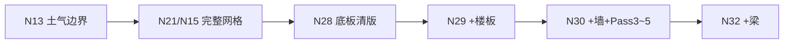
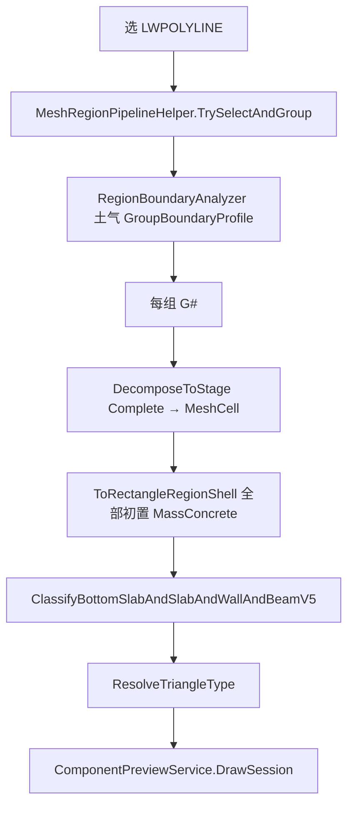
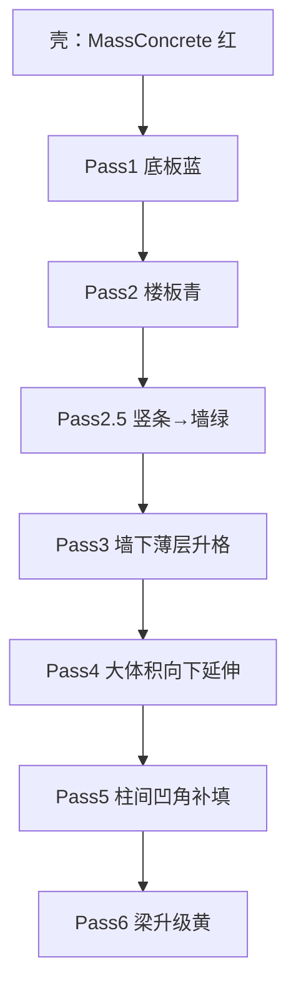
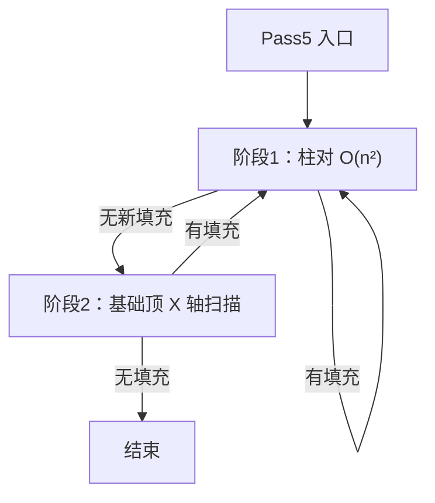

# 018 · N32 网格底板+楼板+墙+梁判型逻辑（V5）

> 日期：2026-06-21  
> 命令：`N32` → `MeshComponentDivideCommand.ExecuteBottomSlabAndSlabAndWallAndBeamClassifyV5`  
> 核心 Domain：[MeshComponentClassifier.cs](../../src/HyCADTool/Features/Reinforcement/Domain/Components/MeshComponentClassifier.cs)（`MeshClassifyStage.BottomSlabAndSlabAndWallAndBeamV5`）  
> 关联：[015-N15区域网格化](015-N15区域网格化几何逻辑-2026-06-18-084500.md)、[016-N22初判](016-N22网格构件初判逻辑-2026-06-18-120000.md)、[009-割线形成逻辑](009-割线形成逻辑-2026-06-15-120000.md)

---

## 0. N32 在网格流水线中的位置

N32 是钢筋网格判型链路的 **当前推荐终点**：在 N30（底板+楼板+墙+延伸+凹角补填）基础上，增加 **梁判型**。



| 项 | 内容 |
|---|---|
| 命令 | `N32` → [MeshComponentDivideCommand.cs](../../src/HyCADTool/Features/Reinforcement/MeshComponentDivideCommand.cs) |
| 枚举 | `MeshClassifyStage.BottomSlabAndSlabAndWallAndBeamV5` |
| 上游网格 | `RegionMeshDecomposer.DecomposeToStage(..., Complete)`，与 N15/N21 相同 |
| 土气依赖 | `useBoundaryProfile: true` → `RegionBoundaryAnalyzer.AnalyzeAllGroups` |
| 输出 | `List<ComponentRegion>` → 图层 `HY-构件预览` |
| C1 联调 | [TestCommand.cs](../../src/HyCADTool/App/Test/TestCommand.cs) 默认指向 N32 |

**与 N30 的唯一增量**：全部 N30 逻辑执行完毕后，对仍为 `MassConcrete` 的单元执行 `ClassifyBeamsFromMass`（梁升级）。

---

## 1. 端到端流程



### 1.1 命令入口（RunClassify）

1. 读面板 `SettingsPanelViewModel.CreateComponentParameters()`。
2. 选闭合 `LWPOLYLINE`，分组距离 `RegionGroupDistanceMm`。
3. **N32 特有**：提交面板后取 `CompFoundationBottomElevation`、`CompEmbedmentDepth`，生成每组 `GroupBoundaryProfile`（N13 割线 + 土/气边角色）。
4. 每组：`groupMinY` + 完整网格分解 + `Classify(..., BottomSlabAndSlabAndWallAndBeamV5, boundaryProfile)`。
5. 预览着色 + 命令行类型计数。

### 1.2 与 N22/N16 的本质差异

| 对比项 | N22 初判 | N16 精修 | **N32 V5** |
|--------|----------|----------|------------|
| 矩形初值 | `ClassifyRectangle` 尺寸树 | 同左 | **全部 `MassConcrete` 壳** |
| 底板/楼板 | 贴组底 + 尺寸 | `RefineRegions` 上下探针 | **土/气边界探针** |
| 墙/梁 | 尺寸树直接给出 | 邻居切段 | **竖条规则 + 邻接升级** |
| 几何后处理 | 无 | X 向切段 | **Pass3~5 延伸/补填** |

N32 **不执行** `RefineRegions` / `ClassifySegment`（N16 局部混凝土精修路径）；局部混凝土仅在 Pass5 缺口内作为可吸收残留出现。

---

## 2. V5 判型总览：六段流水线

`ClassifyBottomSlabAndSlabAndWallAndBeamV5` 调用链：

```text
ClassifyBottomSlabAndSlabAndWallV4
  ├─ ClassifyBottomSlabAndSlabV3      // Pass1~2：底板 + 楼板
  ├─ 竖条升格 Wall                     // Pass2.5
  ├─ ExtendWallsThroughThinMassAboveFoundation   // Pass3
  ├─ ExtendMassConcreteThroughThinGapAboveFoundation  // Pass4
  └─ FillReentrantNotchesBetweenColumns          // Pass5
ClassifyBeamsFromMass                            // Pass6（N32 专有）
```



### 2.1 预览色

| 类型 | 色 | ACI |
|------|-----|-----|
| `BottomSlab` 底板 | 蓝 | 5 |
| `Slab` 楼板 | 青 | 4 |
| `Wall` 墙 | 绿 | 3 |
| `MassConcrete` 大体积 | 红 | 1 |
| `Beam` 梁 | 黄 | 2 |
| `LocalConcrete` 局部 | 洋红 | 6 |

---

## 3. 输入：壳化与过滤

与 N22 相同，`Classify` 入口过滤：

| MeshCell 条件 | 处理 |
|---------------|------|
| `Rectangle` 且 `Orientation ≠ None` | `ToRectangleRegionShell` → 类型 **MassConcrete** |
| `Triangle` | 暂存，全部 Pass 完成后 `ResolveTriangleType` |
| `Orientation == None` | 忽略 |
| 顶点 < 3 | 跳过 |

**壳化含义**：N32 不用 `ClassifyRectangle` 尺寸树做初判，所有矩形先统一为红，再按 **位置 + 土气接触 + 条带形状** 逐级覆盖。

---

## 4. Pass1：底板判型（继承 N28）

函数：`ClassifyBottomSlabV2`（经 `ClassifyBottomSlabAndSlabV3` 调用）

对每个矩形单元 $(w,h)$，bbox 底边 $y_{bot}$：

```text
横条  := IsHorizontalStrip(w,h)   // w ≥ k·h 且 w ≥ 200mm，k 默认 2
```

**底板条件（全部满足 → `BottomSlab` 蓝）**：

1. 横条  
2. $h \le \texttt{BottomSlabMaxThicknessMm}$（默认 1500mm）  
3. `BottomContactsSoil(minX, maxX, yBot, regions, boundaryProfile)` — 底边与 **N13 土边** 或外探土接触  

不满足 → 保持 `MassConcrete`。

> N28「清版」相对 N27：不再要求「贴组底 `groupMinY`」，仅看下侧土接触。

---

## 5. Pass2：楼板判型（N29 增量）

在 Pass1 之后，对仍为 `MassConcrete` 的单元：

**楼板条件（全部满足 → `Slab` 青）**：

1. 横条  
2. $h \le \texttt{SlabMaxThicknessMm}$（默认 300mm）  
3. 下列之一成立：  
   - `IsSlabSandwichCandidate` — 上下气段在 X 向重叠（三明治候选）  
   - `IsThinAirToAirBand` — 薄气-气混凝土带（凹角把楼板切成上下两片时，单片顶/底不全气，但整带仍重叠）

底板优先级高于楼板：已标蓝的单元不再进入 Pass2。

---

## 6. Pass2.5：墙判型（N30 增量）

对仍为 `MassConcrete` 的单元：

**墙条件（全部满足 → `Wall` 绿）**：

```text
IsVerticalStrip(w,h):
  h ≥ k·w
  w ≤ WallMaxThicknessMm   // 默认 500
  h ≥ MinSegmentLengthMm   // 200
```

仅改类型，不合并几何。

---

## 7. Pass3：墙下薄 Mass 升格（`ExtendWallsThroughThinMassAboveFoundation`）

**目标**：上部已有 `Wall`，其正下方隔一层薄 `MassConcrete`（$h \le \texttt{LocalBumpMaxHeightMm}$）且贴 `BottomSlab` 时，将投影范围内的薄层升格为 `Wall`，使墙 **延伸到基础顶**。

### 7.1 触发条件

| 条件 | 说明 |
|------|------|
| 当前单元类型 | `MassConcrete` |
| 层高 | $h \le \texttt{LocalBumpMaxHeightMm} + 1\text{mm}$ |
| 贴底板 | `HasBottomSlabDirectlyBelow` — 正下方存在 `BottomSlab` 且顶边与 mass 底边重合 |
| 上部有墙 | `TryPromoteMassUnderWallProjections` 成功 |

### 7.2 X 向投影打断

`CollectWallProjectionBreakpoints` 收集：薄 mass 左右边界 + 所有「距 mass 顶 ≤ 局部高」且 X 重叠的 `Wall` 边。

对每个 X 子段 $[x_a, x_b]$：

```text
underWall     = 子段中点在墙 X 投影下
onFoundation  = 子段底边贴 BottomSlab
→ underWall ∧ onFoundation ? Wall : MassConcrete
```

- 整段升格：原地改 `Type = Wall`  
- 部分升格：`CreateRectRegion` 拆成多段，替换原单元  

**迭代**：`while (changed)` 直到无新升格。

---

## 8. Pass4：大体积向下延伸（`ExtendMassConcreteThroughThinGapAboveFoundation`）

**目标**：消除大体积与底板之间的 **薄隔层/空腔**（$h \le \texttt{LocalBumpMaxHeightMm}$），使柱/墙/大块 Mass 向下连到 `BottomSlab` 顶。

### 8.1 分支 A：大块向下延伸

条件：$h > \texttt{LocalBumpMaxHeightMm}$ 且 `TryExtendMassDownToFoundation` 成功。

按 `BottomSlab` X 重叠断点切子段；对每个子段：

```text
TryMeasureThinGapToFoundation:
  找子段下方最高 BottomSlab 顶 y_f
  空腔深度 = mass底 - y_f
  0 < 空腔深度 ≤ LocalBumpMaxHeightMm
  空腔内仅含可吸收薄 MassConcrete（单层 h ≤ 局部高）
→ 该子段 polygon 底边下延至 y_f，吸收空腔内单元
```

### 8.2 分支 B：薄层向上合并

条件：$h \le \texttt{LocalBumpMaxHeightMm}$、贴底板、上方存在大块 Mass（`TryFindLargeMassAbove`）。

→ 删除薄层，上方大块底边下延至薄层底。

### 8.3 与 N32 修复相关

Pass4 **不再**要求「大块底不贴底板」才延伸（已移除 `!HasBottomSlabDirectlyBelow` 守卫），贴底板的大块也可经空腔向下延伸。

---

## 9. Pass5：柱间凹角补填（`FillReentrantNotchesBetweenColumns`）

**目标**：Pass3/Pass4 合并后，**底板顶与柱/墙之间**仍可能残留黑色未着色带（大体积与基础中间区段的合并剩余）。Pass5 合成矩形 `MassConcrete` 填充。

### 9.1 两阶段扫描



1. **柱对配对**：所有 `MassConcrete | Wall` 且 X 方向相邻（$a_{max} \le b_{min}$）的对。  
2. **X 轴扫描**：收集各 `BottomSlab` 顶标高 $y_f$，在该高度上取所有触基础柱/墙的 X 断点，对相邻断点间空隙尝试补填（覆盖角部、非严格柱对）。

### 9.2 补填前置条件（`TryFillNotchAtGap`）

| 检查 | 约束 |
|------|------|
| 缺口宽度 | $\texttt{EdgeToleranceMm} < \Delta x \le \texttt{BeamMaxWidthMm}$（默认 ≤800mm） |
| 基础顶 | `TryGetFoundationTopY` — 缺口 midX 处 `BottomSlab` 顶 $y_f$ |
| 凹角高度 | $0 < \texttt{notchTopY} - y_f \le \texttt{LocalBumpMaxHeightMm} + 1\text{mm}$ |
| 未已填 | 不存在 Mass 矩形已覆盖 $[gapX0,gapX1]×[y_f,notchTopY]$ |
| 缺口内容 | 盒内仅含可吸收类型，否则放弃 |

**可吸收类型**（`IsAbsorbableNotchGapType`）：`MassConcrete`、`Wall`、`LocalConcrete`。  
**拒绝**：`BottomSlab`、`Slab`、`Beam`（防误填结构板/梁）。

### 9.3 凹角顶 $Y$ 三源取最小（`TryResolveNotchTopY`）

对同一缺口，收集三个候选 `notchTopY`，取 **最小值**（最保守，只填基础顶薄层）：

```text
① TryComputePocketTopFromAdjacentTierHeight
   在 [gapX0 - 左柱宽, gapX1 + 右柱宽] 内
   找 nMinY ≈ y_f 的 Mass/Wall 单元
   → notchTopY = y_f + min(单元层高)

② TryComputePocketTopY
   跨缺口或覆盖 midX、且 nMinY > y_f 的 Mass/Wall 最低底边
   （lintel 底）

③ TryComputePocketTopFromOutline
   在 gapX0+1mm、gapX1-1mm、midX 三处向上步进（步长 5mm）
   首个 IsValidRebarPoint 命中 Y
   取各探针最低值
```

**设计意图**：

- 竖向长孔洞 midX 常为气/孔，单探针易失败或命中过高 lintel → ① 用邻格行高兜底。  
- 三源取 min 避免 lintel 底把 pocket 顶抬过高导致 `notchH > 200` 放弃。

### 9.4 补填产物

```text
fillRegion = CreateRectRegion(gapX0, gapX1, y_f, notchTopY, MassConcrete)
```

移除缺口盒内可吸收残留单元，追加 `fillRegion`。

---

## 10. Pass6：梁判型（N32 专有 `ClassifyBeamsFromMass`）

在 **Pass5 完成后** 对 `snapshotTypes[i] == MassConcrete` 的单元（快照于 V4 结束时的类型索引）：

**梁条件（全部满足 → `Beam` 黄）**：

| # | 条件 |
|---|------|
| 1 | $w \le \texttt{BeamMaxWidthMm}$（800）且 $h \le \texttt{BeamMaxHeightMm}$（1500） |
| 2 | **非**横条、**非**竖条 |
| 3 | 上邻类型（顶边 midX）= `Slab` |
| 4 | 底边 midX `ContactsAirAt(..., isAbove: false)` — 下侧气接触 |

> 梁判型在凹角补填 **之后**，避免补填块被误升为梁。

---

## 11. 三角形归属

Pass1~6 仅处理矩形。三角形在 `Classify` 末尾统一 `ResolveTriangleType`：

1. bbox 共边相邻矩形中 **面积最大** 者 → 继承类型（墙继承时校验 `IsVerticalStrip`）  
2. 无共边 → 质心最近矩形  
3. 仍无 → `LocalConcrete`

---

## 12. 面板参数（N32 实际参与）

| 参数 | 默认 | 用途 |
|------|------|------|
| `BottomSlabMaxThicknessMm` | 1500 | Pass1 底板高度上限 |
| `SlabMaxThicknessMm` | 300 | Pass2 楼板高度上限 |
| `WallMaxThicknessMm` | 500 | Pass2.5 竖条墙厚上限 |
| `StripMinAspectRatio` | 2 | 横/竖条 $k$ |
| `LocalBumpMaxHeightMm` | 200 | Pass3~5 薄层/凹角高度上限 |
| `BeamMaxWidthMm` | 800 | Pass6 梁宽；Pass5 缺口宽度上限 |
| `BeamMaxHeightMm` | 1500 | Pass6 梁高 |
| `CompFoundationBottomElevation` | -8.1m | 土气割线 |
| `CompEmbedmentDepth` | 3.0m | 土气割线 |
| `RegionGroupDistanceMm` | 1500 | 分组 |

常量（代码内）：`EdgeToleranceMm=1`、`ProbeOffsetMm=1`、`MinSegmentLengthMm=200`。

---

## 13. 命令行输出解读

```
[N32] 网格底板+楼板+墙+梁判型V5
  土气边界：埋深=3.00m  基础底标=-8.10m
  G#0  区域=1  单元=842  构件=842  青=12 绿=48 蓝=6 红=760 黄=8 洋红=8
  合计  构件=842  ...
  青=楼板  绿=墙体  蓝=底板  红=大体积  黄=梁  洋红=局部  N9可切换类型
  N30底板+楼板+墙+延伸+凹角补填；w≤800 h≤1500 非横竖条、上板下气→黄梁；余者红
```

- **Pass5 成功**：`红`（Mass）计数相对 N30 略增（合成 fillRegion）。  
- **黑色空隙**：该处 `TryFillNotchAtGap` 未通过 — 查缺口宽、notchH、盒内是否有 Slab/Beam。

---

## 14. 阶段命令对照

| 命令 | 阶段枚举 | 相对前一版增量 |
|------|----------|----------------|
| N28 | `BottomSlabOnlyV2` | 仅底板（土接触） |
| N29 | `BottomSlabAndSlabV3` | +楼板（气接触） |
| N30 | `BottomSlabAndSlabAndWallV4` | +墙 + Pass3~5 |
| **N32** | `BottomSlabAndSlabAndWallAndBeamV5` | +Pass6 梁 |

N31（`ExecuteReflexPartition`）为独立有限弦剖分试验，**不并入** N32 链路。

---

## 15. 常见几何现象与判读

| 图面现象 | 可能原因 | 相关 Pass |
|----------|----------|-----------|
| 底板顶柱间黑色细缝 | 合并残留未补填 | Pass5 — 查三源 notchTopY |
| 墙未连到蓝底板 | 薄层未升格 | Pass3 |
| 大块 Mass 底悬空 | 空腔过厚 (>200) 或含不可吸收类型 | Pass4 |
| 应判梁仍为红 | 上邻非 Slab 或下气未命中 | Pass6 |
| 竖条仍为红 | 不满足 `IsVerticalStrip`（w 过宽等） | Pass2.5 |

---

## 16. 建议测试顺序

```text
N13 土气 → N21 网格 → N28 仅底板 → N29 +楼板 → N30 +墙
  → 对比 Pass3/4 延伸效果 → N32 全量（含梁+凹角）
```

C1 联调：`C2` 热重载 → `C1` 或命令行 `N32`。

---

## 17. 源码索引

| 模块 | 文件 |
|------|------|
| 命令入口 | [MeshComponentDivideCommand.cs](../../src/HyCADTool/Features/Reinforcement/MeshComponentDivideCommand.cs) |
| V5 判型 + Pass1~6 | [MeshComponentClassifier.cs](../../src/HyCADTool/Features/Reinforcement/Domain/Components/MeshComponentClassifier.cs) |
| 土/气/条带探针 | [BoundaryContactProbe.cs](../../src/HyCADTool/Features/Reinforcement/Domain/Components/BoundaryContactProbe.cs) |
| 参数 | [ComponentParameters.cs](../../src/HyCADTool/Features/Reinforcement/Domain/Components/ComponentParameters.cs) |
| 网格分解 | [RegionMeshDecomposer.cs](../../src/HyCADTool/Features/Reinforcement/Domain/Components/RegionMeshDecomposer.cs) |
| 预览 | [ComponentPreviewService.cs](../../src/HyCADTool/Features/Reinforcement/Services/ComponentPreviewService.cs) |
| 命令注册 | [commands.json](../../src/ReCall/commands.json) `N32` |

### 17.1 关键函数速查

| Pass | 函数 |
|------|------|
| 入口 V5 | `ClassifyBottomSlabAndSlabAndWallAndBeamV5` |
| 1~2 | `ClassifyBottomSlabAndSlabV3` → `ClassifyBottomSlabV2` |
| 2.5 | `ClassifyBottomSlabAndSlabAndWallV4` 内竖条循环 |
| 3 | `ExtendWallsThroughThinMassAboveFoundation` |
| 4 | `ExtendMassConcreteThroughThinGapAboveFoundation` |
| 5 | `FillReentrantNotchesBetweenColumns` → `TryFillNotchAtGap` → `TryResolveNotchTopY` |
| 6 | `ClassifyBeamsFromMass` |

---

## 18. 与 016/014 文档关系

- **016 N22**：尺寸树初判；N32 **不用**该路径，改用壳化 + 土气 Pass。  
- **014 N16**：`RefineRegions` 局部混凝土精修；N32 **不执行**，局部仅作 Pass5 可吸收残留。  
- **015 N15**：网格几何上游；N32 与 N22/N16 共用同一 `Complete` 分解。
