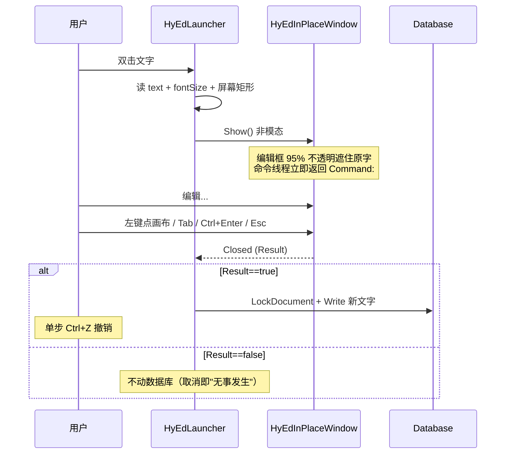

# HYED-说明

## 作用

- **hyed**：在**绘图区原位置**覆盖一层**透明 WPF 窗口**（仅边框 + 文本框），替代 AutoCAD 双击触发的 `TEXTEDIT` / `MTEDIT` / `DDEDIT` 等，绕开 **IPE + TTF 扫描**。
- **双击**：由 `HyEdDoubleClickInterceptor` 在插件初始化时安装；否决原生命令后通过 **WPF Dispatcher.BeginInvoke** 直接调起编辑器（**不**走 `SendStringToExecute`——否则要等下一次 idle 才出现）。
- **遮挡原字**：编辑框背景 `#F2000000`（95% 不透明深色）完全遮住原文字；**不**修改 `entity.Visible`（AutoCAD .NET 托管层不公开 `StartUndoMark`，多次 Commit 会污染 Undo 栈；原生 IPE 也是渲染层 ghost，不动数据库）。

## UI（原位透明编辑层）

| 项目 | 说明 |
|------|------|
| 窗口 | `WindowStyle=None`、`AllowsTransparency=True`、`Background=Transparent`、`Topmost=True`、无边框、不进任务栏 |
| 模态 | **非模态** `Show()` —— 命令线程立即返回，AutoCAD 回到 `Command:`；写回放 `Closed` 回调，用 `doc.LockDocument()` 拿独占锁 |
| 可视 | 1px 高对比黄边 + 近黑底（`#F2000000`，遮住底图）+ 白字 `TextBox`；字体固定 `Microsoft YaHei UI`（不读图形文字样式、不调 `InplaceTextEditor`） |
| 字号 | `FontSize` 由 `HyEdScreenLocator` 按"屏幕行高 × 0.85"估算（clamp 到 [10, 200] DIP），与原文字目测一致 |
| 单行 | `DBText`：`AcceptsReturn=False`，**Enter** 提交 |
| 多行 | 其余类型：**Ctrl+Enter** 提交；**Enter** 仅换行 |
| 其它提交 | **Tab**、窗口失焦（`Deactivated`：在 AutoCAD 绘图区按下**左键**即触发，与原生 IPE 行为一致） |
| 取消 | **Esc** |

## 定位机制（精确化）

**关键陷阱（已修复）**：`ClientToScreen` 必须用**绘图视图 HWND**，不能用 `doc.Window.Handle` —— 后者把"文件标签栏 + 视图导航条 + 命令行 dock"厚度算进了客户区原点，会导致编辑框 Y 向偏低 ~40 DIP（约 2 行字高）。`HyEdDrawingViewHwnd.Resolve` 提供三层兜底：

1. P/Invoke `AcadGetCurrentDwgView()`（accore.dll C++ mangled name）
2. EntryPointNotFoundException → `EnumChildWindows(doc.Window.Handle, ...)` 取面积最大子窗
3. 仍取不到 → 退回 `doc.Window.Handle`（保留旧行为）

## 编辑流程

**取消编辑（Esc）路径不动数据库**：Undo 栈完全干净，与原生 IPE 取消行为一致。

## 总开关与偏移系数

HY 首选项面板「界面 / 出图比例」横条最右侧：

- ✓ **双击编辑文字(hyed)**：对应 `SettingsPanelViewModel.EnableHyEdDoubleClick`（持久化）。关闭后双击放行 AutoCAD 原生命令；命令行直接输 `hyed` 不受开关影响。
- **上移×N**：对应 `HyEdAboveOffsetFactor`，**默认 0**（原位重叠 + 隐藏原字，与原生 IPE 行为对齐）。改成 `1.2` / `2` 让编辑框上浮"一行 / 两行"，适合不想让编辑框遮住原文字位置时使用。

## 覆盖实体

| 类型 | 读写字段 |
|------|----------|
| MText | `Contents`（保留 `\P`、`{\C;n;}` 等控制串） |
| DBText | `TextString` |
| MLeader | 仅 `ContentType == MTextContent` 且 `MText != null`：`MText.Contents`，写回时 `UpgradeOpen` 后赋值并 `ml.MText = mt` |
| Dimension | `DimensionText`（空串清除替代，回到测量显示） |

## 命令注册

- **commands.json**：`hyed`、`_HYED_INTERNAL`、占位符 **N6**（同上实现）。
- **ReCall `CommandFacade` / Production `ProductionCommandFacade`**：`[CommandMethod("hyed")]`、`[CommandMethod("_HYED_INTERNAL")]` → `Invoke`。
- Refactored 业务类**不写** `[CommandMethod]`（热重载约束）。
- 双击拦截路径**不**经过 `_HYED_INTERNAL`，而是 Dispatcher.BeginInvoke 直接调 `HyEdLauncher.LaunchEditor`（绕开 idle 等待）。命令行 `hyed` 入口仍走 `HyEdCommand.Execute` → `LaunchEditor`，与双击行为一致。

## 转正 / 重装 ReCall

新增或修改 `CommandFacade` 中的 `[CommandMethod]` 后，需在**关闭 AutoCAD** 状态下重新编译并 **NETLOAD ReCall.dll**（与项目既有约定一致）。日常只改 `HyCADTool.dll` + `commands.json` 可走 **C2**。

## 限制（当前版本）

- 编辑期间不跟随平移/缩放/改视口；失焦即提交。
- 字体一律 `Microsoft YaHei UI`，不读图形 `TextStyleTableRecord`（避免触发 TTF/SHX 字体扫描——这是 hyed 提速的核心收益）。
- 不支持块属性 `AttributeReference`、表格单元格等。
- 若某版 AutoCAD 双击触发的全局命令名不在拦截白名单内，可仅在命令行使用 **hyed**，或在 `HyEdDoubleClickInterceptor.NativeTextEditCommands` 中追加。
- 视图旋转 / 实体旋转的文字仍按 GeometricExtents 轴对齐 bbox 投影，编辑框"水平包住"原字但不贴合旋转角度（与原生 IPE 退化一致）。

## 扩展点

- 视图：`HyEdInPlaceWindow` / `HyEdDialogViewModel`。
- 屏幕矩形 + FontSize：`HyEdScreenLocator.TryLocate`。
- 绘图视图 HWND：`HyEdDrawingViewHwnd.Resolve`。
- 写回：`HyEdTextAccessor.Write` 或 `HyEdLauncher.WriteByKind`。
- 支持类型：`HyEdEntityProbe` + `HyEdTextAccessor.TryRead`。

## 卸载

- `PluginInitializer.Terminate` → `HyEdDoubleClickInterceptor.Uninstall()`，避免 **C2** 重复订阅。
